# Building Production Small Language Models — A Ground-Up Curriculum

> A task-by-task, notebook-by-notebook plan that takes you from *“I’ve never built one”* to *shipping a real, domain-specific SLM system to production* — building a support assistant together, then a second SLM on your own. We prototype on free compute and rent a GPU only for the few real training runs.

---

## 0. Read this first

### What this curriculum is

A complete, self-paced course. You will **build two real products**, not toys, and along the way you will construct a transformer from scratch so nothing is a black box. Every module gives you: **theory → a diagram → code → a deliverable → a checkpoint** so you can verify you actually understand it before moving on.

You told me you prefer to work **one module at a time**. This document is the *map*. We execute it together module by module — when you’re ready for a module, say so and I’ll produce the full notebook (complete code, line-by-line explanation, and the diagrams) for that module.

### About your book

The book you uploaded (*Small Language Models*) is a genuinely good fit for **most** of this journey — it is strong on the parts that matter for production: fine-tuning, LoRA, RAG, quantization, ONNX, profiling, serving, and on-device deployment. That is exactly the “adapt an existing small model and ship it” path, which is what 95% of real SLM work looks like.

The one thing it does **not** cover is **building a transformer from scratch** (pretraining your own tiny model). I’ve added that as Phase 1 because you said you want to understand *every minute detail from the ground up* — and there is no substitute for having written attention, the training loop, and a tokenizer yourself once. After Phase 1, the book becomes your primary companion reading; I map every chapter to a module in the appendix.

> **Honest framing of “build your own SLM”.** That phrase means three different things, and a competent practitioner does all three:
> 1. **Pretrain from scratch** — define architecture + tokenizer, train on a corpus. Educational and done once (Phase 1). Rarely the right *production* choice.
> 2. **Adapt a pretrained small base** — fine-tune / LoRA / distill / quantize. This is the production path (Phases 2–5).
> 3. **Build the system around the model** — RAG, serving, agents, monitoring (Phases 4, 6, 7).
>
> By the end you’ll be fluent in all three and will know *which one to reach for*.

### Your compute strategy (free for dev, paid for real runs)

You're willing to spend on GPU, which is the right call — but the smart pattern is **not** to rent a big GPU for the whole course. You **prototype on free tiers and rent paid GPU only for the handful of real training runs**, so you pay for minutes, not months. Free tiers: Google Colab (T4, 16 GB) and Kaggle (T4×2 or P100, 16 GB; ~30 GPU-hrs/week).

**What fits where:**

| Task | Free tier (T4/P100, 16 GB) | What paid compute buys you |
|---|---|---|
| Train nano-GPT from scratch (10–30M) | ✅ easily | Faster iteration; a bigger nano-GPT |
| Fine-tune an encoder (MiniLM/DistilBERT, 22–66M) | ✅ easily | Negligible benefit — stay free |
| QLoRA a 1–3B decoder | ✅ | Finish in 1–2 hrs instead of 6–10 |
| **Full** fine-tune a 1–3B decoder | ⚠️ tight | ✅ on 1×A100 40/80 GB |
| QLoRA/LoRA a **7–8B** decoder | ❌ | ✅ on 1×A100 (the "should I go bigger?" experiment) |
| Quantize / ONNX / serve / RAG index | ✅ (CPU + 1 GPU) | Faster, but free is fine |

**Where to rent (pay-per-hour, no commitment):** RunPod, Vast.ai, Lambda, or Colab Pro/Pro+ for convenience. Rough ranks: an L4/A10 ≈ a few cents to ~$0.50/hr; a single A100 ≈ ~$1–2/hr on community marketplaces. **Most paid runs in this course are 1–3 hours**, so the whole course's paid compute is realistically in the low tens of dollars — *if* you debug on free tier first.

> 💡 **The one rule that saves the most money:** never debug on a paid GPU. Get the run working end-to-end on a tiny subset on free Colab (does it train for 50 steps without erroring and does loss go down?), *then* launch the full run on a rented A100. We'll bake this "smoke-test first" habit into every training module.

**Spend money on:** full fine-tunes, the 7–8B "is bigger actually better for us?" comparison, and long training runs you've already smoke-tested. **Don't spend on:** the encoder modules, anything you can do on CPU (data prep, tokenizers, ONNX-CPU, RAG indexing, FastAPI), or debugging.

### Conventions used in every module

- **🎯 Goal** — one sentence on why the module exists.
- **📓 Notebook(s)** — the concrete artifact(s) you produce.
- **📐 Diagram** — the mental model.
- **🧠 Theory** — what you must understand.
- **💻 Code** — the key snippet(s); full code comes when we build the module.
- **📦 Deliverable** — what you save/commit.
- **✅ Checkpoint** — the question you must be able to answer.

### Tooling baseline (install once)

`torch`, `transformers`, `datasets`, `tokenizers`, `accelerate`, `peft`, `bitsandbytes`, `trl`, `evaluate`, `sentence-transformers`, `faiss-cpu` (or `chromadb`), `onnx`, `onnxruntime`, `optimum`, `outlines` (constrained decoding), `vllm`, `fastapi`, `uvicorn`, plus `wandb` (free) for experiment tracking and `huggingface_hub` for checkpoints.

---

## The two products we build

We build **one coherent product** that happens to need **two different kinds of SLM** — which is perfect, because it teaches you both encoder (BERT-style) and decoder (GPT-style) models on a single real problem.

### 🛠️ Capstone product — **“DeskMate”: a domain-specific support assistant**

Domain: **customer / product support** (the use case you chose). DeskMate handles incoming support tickets the way a real support desk does — triage, look up the answer, draft a grounded reply. Crucially, **you don't need your own data to start**: we use real public support datasets plus synthetic data we generate ourselves (full plan in *The data plan* below and in Phase 2). DeskMate does three jobs:

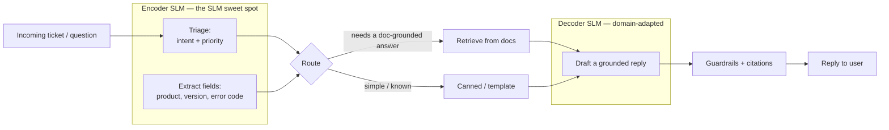

- **Encoder SLM** (Phase 2): classifies intent + priority and extracts structured fields. This is the **production sweet spot** for small models — fast, cheap, runs on CPU, beats giant models on cost/latency for narrow tasks.
- **Decoder SLM** (Phase 3): a 1–3B model, QLoRA-tuned on your domain, that drafts grounded replies.
- **RAG** (Phase 4) grounds the decoder in real documentation so it doesn’t hallucinate.
- **Optimize + serve + agentify** (Phases 5–7) turns it into a deployed system.

### 🔬 Learning artifact — **“nano-SLM” from scratch**

In Phase 1 you build a small GPT from scratch and train it on your domain text (e.g. to generate synthetic support tickets you can later use for augmentation). It is not the production model — it exists so that every transformer concept you use later is something *you have implemented by hand*.

### 🎓 Graduation project — a brand-new SLM, built by you, end to end

After DeskMate ships, **Phase 9** has you take a *completely separate* domain and build an SLM end-to-end largely on your own, with me acting as reviewer rather than driver. This is the real test that the course worked: can you repeat the whole pipeline — data, model, optimization, deployment — without hand-holding? Candidate domains are listed in Phase 9.

---

## The data plan (you have none — here's how we get it)

You don't have training data, and that's completely fine; in real SLM work, **manufacturing the right dataset is half the job**, so we treat it as a first-class skill, not a prerequisite. We use a three-source strategy:

**1. Download real public datasets** (our backbone — free, real, already labeled):

| Dataset (Hugging Face ID) | What it gives DeskMate | Size / labels | License |
|---|---|---|---|
| `PolyAI/banking77` | Encoder **triage** training (fine-grained intent classification) | 13,083 queries, 77 intents | CC-BY-4.0 |
| `bitext/Bitext-customer-support-llm-chatbot-training-dataset` | Both **triage** (category+intent) *and* decoder **SFT** (instruction→response pairs); has entity placeholders for **extraction** practice | ~27 intents / 10 categories, ~1k examples each (~3.5M tokens) | CDLA-Sharing-1.0 |
| `clinc150` (multi-domain intents incl. out-of-scope) | Teaches **out-of-scope / "I don't know" routing** | 150 intents + OOS | CC-BY-3.0 |
| *Customer Support on Twitter* (Kaggle) | Real, messy, multi-turn support conversations for realism | ~3M tweets | Kaggle terms |

> The Bitext set is the single best fit: its `instruction / category / intent / response` columns feed your **encoder** (classification) *and* your **decoder** (reply generation) from one download. We anchor on `PolyAI/banking77` + Bitext and treat the others as optional realism/robustness boosters.

**2. Generate synthetic data** (to fill gaps the public sets don't cover — your specific products, version strings, error codes, and the structured-extraction labels). This is its own module (Phase 2.2). We use a strong "teacher" model (a hosted API model, or a larger open model you run on a rented GPU) to generate labeled tickets, extraction targets, and a synthetic docs corpus for RAG — then we quality-filter and dedupe rigorously.

**3. Build a small human-checked "gold" set** (a few hundred examples you verify by hand) that we *never* train on — it's the honest yardstick every model is measured against.

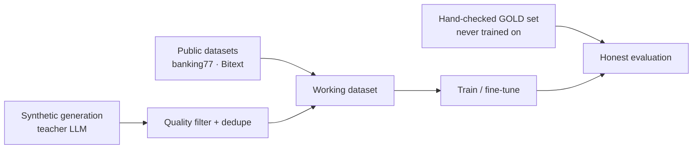

---

## Curriculum at a glance

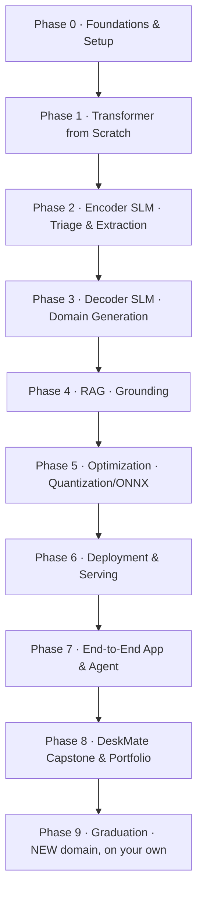

Roughly **9 phases / ~52 modules** (including new additions). A realistic pace is one module every 1–3 evenings. Phases 0–8 build **DeskMate** together; Phase 9 is your solo build in a new domain.

---

# Phase 0 — Foundations & Setup

### Module 0.1 — What an SLM is, and when small wins

**🎯 Goal** Build the judgment to know when an SLM is the right tool *before* you write any code.

**🧠 Theory**
- What “small” means (rough bands: <100M encoder, 100M–3B decoder “small”, vs 7B+ “large”). Why the boundary is about *deployability* (single GPU / CPU / device), not a hard number.
- The four reasons small beats large in production: **cost**, **latency**, **privacy/on-prem**, and **control/specialization**. A fine-tuned 1B model often beats a general 70B model *on its narrow task*.
- The flip side: generalist LLM risks — cost, data leakage, hallucination, vendor lock-in, no domain grounding. (Your book’s §1.5–1.6.)
- The decision framework: narrow + high-volume + latency/cost/privacy-sensitive → SLM. Open-ended reasoning over rare queries → maybe a large model or hybrid.

**📐 Diagram**

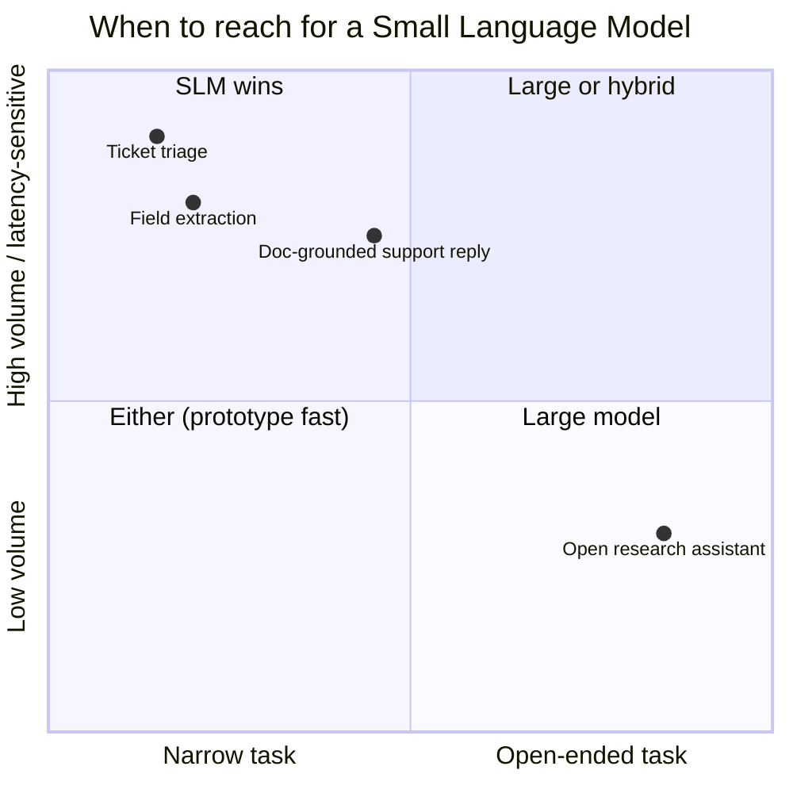

**📦 Deliverable** A one-page written decision memo: *“Why DeskMate should be built from SLMs,”* including which component is encoder vs decoder and why.
**✅ Checkpoint** Give three production scenarios; for each, argue SLM vs LLM in 2 sentences.
**📖 Book** Chapter 1.

---

### Module 0.2 — Environment, repo, and surviving free-tier compute

**🎯 Goal** A reproducible workspace so you never lose work to a disconnected runtime.

**🧠 Theory / practice**
- Colab vs Kaggle: GPU types, session limits, how to checkpoint to Google Drive / HF Hub so a disconnect costs you nothing.
- Repo layout (`data/ notebooks/ src/ models/ eval/ serve/`), pinning versions, seeding for reproducibility.
- Experiment tracking with Weights & Biases (free): logging loss, configs, and artifacts.
- GPU hygiene: `nvidia-smi`, clearing cache, gradient accumulation, mixed precision — the levers that make a 16 GB card behave like more.

**💻 Code (the “never lose a checkpoint” pattern)**
```python
from huggingface_hub import login; login()        # token in Colab secrets
# after each epoch:
trainer.save_model("models/ckpt")                  # local
model.push_to_hub("you/deskmate-encoder")          # durable, survives disconnects
```

**📦 Deliverable** A working repo skeleton + a “hello GPU” notebook that logs to W&B and saves a checkpoint to the Hub.
**✅ Checkpoint** Your runtime dies mid-training. Can you resume with zero loss of progress?

---

### Module 0.3 — The Transformer, truly from the ground up

**🎯 Goal** A precise mental model of every component you’ll later implement and fine-tune.

**🧠 Theory** Walk the full forward pass conceptually: tokens → embeddings (+positional) → **N decoder blocks** (each = attention + MLP, wrapped in residual + normalization) → final norm → projection to vocabulary → softmax. The core insight of attention: each token builds a query and looks up keys/values from other tokens to decide *what to pay attention to*.

**📐 Diagram — one decoder block**

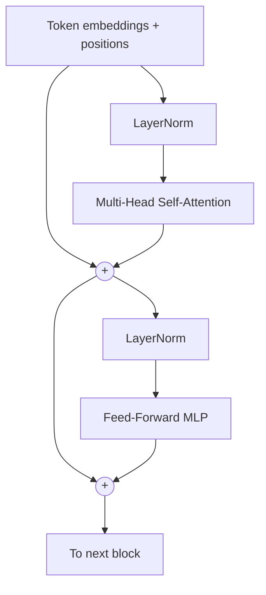

**📐 Diagram — encoder vs decoder (why DeskMate needs both)**

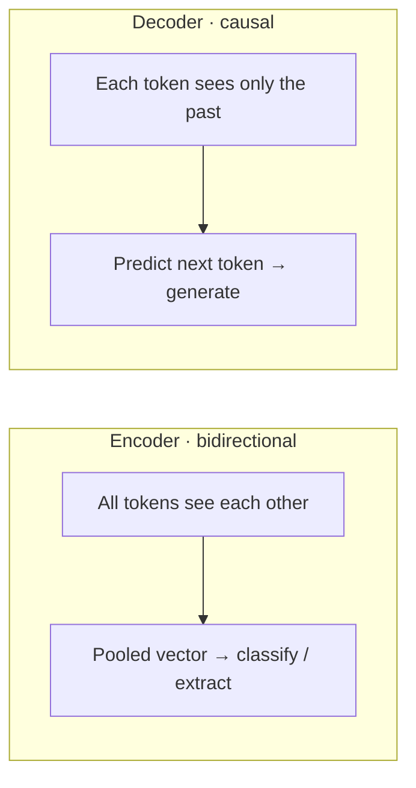

**📦 Deliverable** Annotated diagrams in your own words; a glossary of: token, embedding, attention head, residual stream, logits, context length.
**✅ Checkpoint** Explain why a decoder uses a *causal mask* but an encoder doesn’t.
**📖 Book** §1.2.

---

### Module 0.4 — Tokenization deep dive

**🎯 Goal** Understand the layer everyone skips and then debugs in anger later.

**🧠 Theory** Character vs word vs **subword** (BPE, WordPiece, SentencePiece/Unigram). Why subword exists (vocabulary size vs unknown-word handling). Special tokens, chat templates, and why *the tokenizer must match the model*. How tokenization affects cost (you pay per token) and context budget.

**💻 Code (train a BPE tokenizer on your domain)**
```python
from tokenizers import ByteLevelBPETokenizer
tok = ByteLevelBPETokenizer()
tok.train(files=["data/domain_corpus.txt"], vocab_size=8000,
          special_tokens=["<pad>","<bos>","<eos>","<unk>"])
tok.save_model("models/tokenizer")
```

**📦 Deliverable** A trained domain tokenizer + a notebook comparing token counts of your text under GPT-2’s tokenizer vs yours.
**✅ Checkpoint** Why can the same sentence cost very different token counts across models?

---

# Phase 1 — Build a Transformer from Scratch

> You build a small GPT by hand. Small enough to train on free Colab, complete enough that attention, the training loop, and sampling are never mysterious again. (This phase is *not* in your book — it’s the from-scratch foundation you asked for.)

### Module 1.1 — Data, batching, and the training loop (bigram baseline)

**🎯 Goal** The skeleton every training run shares, with the simplest possible model.
**🧠 Theory** Turning text into a tensor of token IDs; the train/val split; sampling random `(context, target)` batches; the cross-entropy loss for next-token prediction; the optimization loop (forward → loss → backward → step); estimating loss without leaking gradients.
**💻 Code (the loop you’ll reuse everywhere)**
```python
for step in range(max_steps):
    xb, yb = get_batch("train")        # (B, T) ids and (B, T) shifted targets
    logits = model(xb)                 # (B, T, vocab)
    loss = F.cross_entropy(logits.view(-1, V), yb.view(-1))
    opt.zero_grad(set_to_none=True); loss.backward(); opt.step()
```
**📦 Deliverable** A trained bigram model + a loss curve. **✅ Checkpoint** What exactly is the model predicting at each position, and what is the loss measuring?

### Module 1.2 — Self-attention, by hand

**🎯 Goal** Implement the single most important operation in modern AI.
**🧠 Theory** Queries/keys/values; the scaled dot-product `softmax(QKᵀ/√d)·V`; the causal mask; why we scale by √d.
**💻 Code (single head)**
```python
q, k, v = self.q(x), self.k(x), self.v(x)              # (B,T,h)
att = (q @ k.transpose(-2,-1)) * h**-0.5               # (B,T,T)
att = att.masked_fill(tril==0, float('-inf')).softmax(-1)
out = att @ v                                          # (B,T,h)
```
**📐 Diagram**
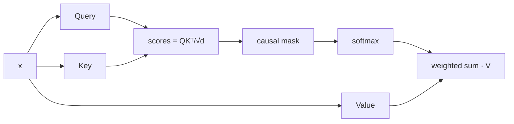
**📦 Deliverable** A working `Head` module + a heatmap of one attention matrix. **✅ Checkpoint** Remove the mask — what breaks, and why?

### Module 1.3 — Multi-head attention, MLP, and the block

**🎯 Goal** Assemble a full transformer block.
**🧠 Theory** Why multiple heads (parallel “relationship channels”); the position-wise MLP; residual connections (gradient highways); LayerNorm (pre-norm vs post-norm); dropout.
**📦 Deliverable** A `Block` you stack N times. **✅ Checkpoint** What do residual connections buy you as depth grows?

### Module 1.4 — Assemble nano-SLM, train, and generate

**🎯 Goal** A complete, trainable GPT producing domain text.
**🧠 Theory** Token + positional embeddings; tying it together; **autoregressive generation** (sampling with temperature / top-k); evaluating samples.
**💻 Code (generation)**
```python
for _ in range(max_new):
    logits = model(idx[:, -block_size:])[:, -1, :] / temperature
    probs = logits.softmax(-1)
    idx = torch.cat([idx, torch.multinomial(probs, 1)], dim=1)
```
**📦 Deliverable** Your nano-SLM generating domain-flavored text + saved weights. **✅ Checkpoint** Explain the full path from a prompt string to the next generated token.

### Module 1.5 — Why we stop here: scaling, and the case for pretrained bases

**🎯 Goal** Know what changes with scale and why production uses pretrained models.
**🧠 Theory** Scaling-law intuition (params × data × compute); what emerges with size; why pretraining a *capable* model from scratch is infeasible on free tier — so we **stand on pretrained shoulders** from Phase 2 on. This is the bridge into the book’s world.
**✅ Checkpoint** Given a fixed compute budget, would you train bigger or train longer on more data — and why is that the wrong question without data?

### Module 1.6 — Modern architecture variants: what changed since GPT-2

**🎯 Goal** Understand the architectural decisions in modern small base models so Phase 3’s base-model selection is informed, not guesswork.

**🧠 Theory** Your nano-GPT uses learned absolute positional embeddings, post-norm LayerNorm, vanilla multi-head attention, and GELU. Modern SLMs changed almost all of these:
- **RoPE (Rotary Position Embedding)** — replaces absolute positions with rotations applied to Q/K at each head. Generalises to longer contexts than learned positions; used in Llama, Qwen, Phi.
- **Pre-norm vs post-norm** — modern models apply LayerNorm *before* attention/MLP (pre-norm), which improves training stability at depth.
- **SwiGLU activation** — replaces GELU in the MLP with a gated variant; slightly fewer parameters for the same quality, used in Llama/Qwen.
- **Grouped Query Attention (GQA) / Multi-Query Attention (MQA)** — instead of one K/V head per Q head, GQA shares K/V across groups of Q heads. Slashes KV-cache memory at inference — critical for serving throughput.
- **Flash Attention** — a hardware-aware exact attention kernel that avoids materialising the full (T×T) attention matrix in HBM; same mathematical result, 2–4× faster, far lower memory. Standard in all modern training and serving.

**📐 Diagram**
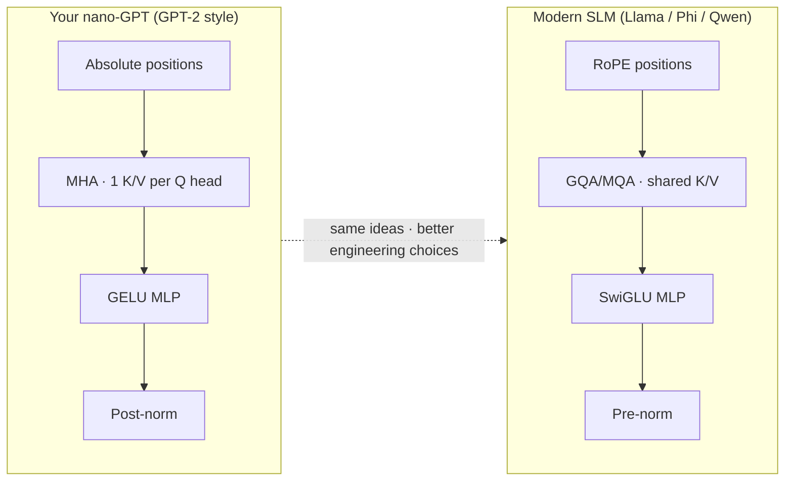

**📦 Deliverable** An annotated side-by-side comparison table: your nano-GPT vs the model card of your Phase 3 candidate (to be confirmed in Module 3.1). **✅ Checkpoint** Why does GQA reduce KV-cache memory, and why does that matter more for serving than for training?

### Module 1.7 — Bridge: nano-GPT → pretrained bases; what DAPT is

**🎯 Goal** Close the conceptual gap between "train from scratch" and "fine-tune a pretrained model," and introduce domain-adaptive pretraining as the technique between them.

**🧠 Theory**
- **Why pretrained bases win:** A model trained on trillions of tokens has already learned grammar, world knowledge, and reasoning. Fine-tuning steers that; pretraining from scratch builds it from nothing. For any domain task, fine-tuning a pretrained base is almost always cheaper and better.
- **Domain-Adaptive Pretraining (DAPT):** Continued pretraining of a pretrained base on a large domain corpus *before* task fine-tuning. It shifts the model’s language statistics toward your domain (medical, legal, support-ticket English) without changing its architecture. BioMedLM, LegalBERT, and FinBERT all used this pattern.
- **When DAPT is worth it:** When your domain has distinctive vocabulary/style *and* you have >50 M domain tokens *and* SFT alone leaves quality on the table. For DeskMate, SFT directly is usually sufficient — but you should know the option and how to measure whether it helps. We decide in Module 3.1a.

**📦 Deliverable** A one-page decision note: "Should DeskMate’s decoder undergo DAPT before SFT?" with the criteria and your conclusion (revisited after Module 3.0 establishes the baseline). **✅ Checkpoint** DAPT and SFT both train on domain text — what is fundamentally different about their objectives and the data they require?

---

# Phase 2 — The Encoder SLM: Triage & Extraction

> The production sweet spot. Small, fast, CPU-friendly models that *classify* and *extract*. This is DeskMate’s front door.

### Module 2.1 — Problem framing, label schema & data acquisition

**🎯 Goal** Turn “triage tickets” into a concrete labeled problem *and* get real data on disk — without owning any yourself.
**🧠 Theory** Defining the label schema (intent taxonomy, priority levels, an explicit **out-of-scope** class); annotation guidelines; class imbalance; train/val/test splitting **without leakage** (don’t let near-duplicate tickets straddle splits); how much data you actually need. Then the acquisition plan: load `PolyAI/banking77` (13k queries / 77 intents) and the `bitext/Bitext-customer-support-llm-chatbot-training-dataset` (intent+category+response, ~27 intents) from the Hub, reconcile their label spaces into DeskMate’s schema, and carve out a held-out **gold set** you’ll never train on.
**💻 Code**
```python
from datasets import load_dataset
bank = load_dataset("PolyAI/banking77")                         # triage intents
supp = load_dataset("bitext/Bitext-customer-support-llm-chatbot-training-dataset")
# map both into DeskMate's unified {text, intent, category, priority} schema
```
**📦 Deliverable** A unified, deduped, leak-free dataset on the Hub + a datasheet + the frozen gold set. **✅ Checkpoint** Name two leakage traps in support data and how you avoided them; justify your out-of-scope class.

### Module 2.2 — Synthetic data generation (filling the gaps)

**🎯 Goal** Manufacture the labeled data the public sets *don’t* give you — your specific products, version strings, error codes, priority labels, and the per-token spans your extractor needs — plus a synthetic docs corpus for RAG later. This is a core production skill, not a workaround.

> **Teacher LLM cost note:** Generating ~5,000 examples at ~300 tokens each via an API model (e.g. Claude Haiku or GPT-4o-mini) costs roughly $0.50–$2.00 total — well within budget. **Free-tier fallback:** run a 7–8B model locally via Ollama (CPU or free Colab GPU) as the teacher; quality is slightly lower but cost is zero. We’ll implement both paths so you can choose.

**🧠 Theory** Using a strong **teacher model** (a hosted API model, or a larger open model on a rented GPU) to generate labeled examples; **prompt design for diversity** (seed lists, personas, controlled attributes) so you don’t get 1,000 near-identical tickets; generating *structured* outputs (JSON with fields + character spans) so labels come for free; **quality control** — schema validation, dedup (embedding-based near-dup removal), toxicity/PII filtering, and a human spot-check; the **model-collapse trap** (training only on synthetic data degrades quality) and how mixing real + synthetic avoids it.
**💻 Code (shape of the generator)**
```python
PROMPT = """Generate a realistic support ticket as JSON with keys:
text, intent (one of {intents}), priority (low|med|high),
fields: {{product, version, error_code}} with character spans.
Make it sound like persona: {persona}. Scenario seed: {seed}."""
# call teacher model → validate JSON against schema → dedupe → keep
```
**📐 Diagram**
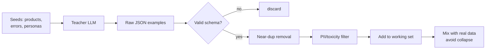
**📦 Deliverable** A synthetic-data generator script + a few thousand validated, deduped labeled examples (with extraction spans) merged into the working set. **✅ Checkpoint** How do you keep synthetic data diverse, and why is a real-data anchor essential?
**📖 Book** §2.1 (data preparation).

### Module 2.3 — Data prep for encoder fine-tuning

**🎯 Goal** Get text into the exact tensors an encoder expects.
**🧠 Theory** Tokenization with the model’s own tokenizer; truncation/padding; attention masks; `DataCollator`; label encoding for classification vs token-level labels for extraction.
**📦 Deliverable** A `datasets` pipeline that yields batched, tokenized examples. **✅ Checkpoint** What does the attention mask do for padded sequences?
**📖 Book** §2.1 (BERT fine-tuning data prep).

### Module 2.4 — Fine-tune an encoder for intent + priority

**🎯 Goal** A working classifier you can call in milliseconds (runs on CPU — no paid GPU needed here).
**🧠 Theory** `AutoModelForSequenceClassification` on DistilBERT/MiniLM; the `Trainer`; learning rate, warmup, epochs; freezing vs full fine-tune at this size (full is fine — it’s tiny).
**💻 Code**
```python
from transformers import AutoModelForSequenceClassification, TrainingArguments, Trainer
model = AutoModelForSequenceClassification.from_pretrained(
    "microsoft/MiniLM-L12-H384-uncased", num_labels=NUM_INTENTS)
Trainer(model, TrainingArguments("out", per_device_train_batch_size=32,
        num_train_epochs=3, eval_strategy="epoch"),
        train_dataset=ds["train"], eval_dataset=ds["val"]).train()
```
**📦 Deliverable** A trained intent+priority classifier. **✅ Checkpoint** Your val accuracy is high but production accuracy is low — list three likely causes.

### Module 2.5 — Token classification for field extraction (NER)

**🎯 Goal** Pull structured fields (product, version, error code) out of free text — using the spans your synthetic generator produced.
**🧠 Theory** `AutoModelForTokenClassification`; BIO tagging; aligning labels to subword tokens (the classic off-by-one bug); decoding spans back to strings.
**📦 Deliverable** An extractor that returns a JSON of fields per ticket. **✅ Checkpoint** Why does subword tokenization complicate token-level labels, and how do you align them?

### Module 2.6 — Domain-specific evaluation

**🎯 Goal** Measure the thing that matters, not just accuracy — on your hand-checked gold set.
**🧠 Theory** Precision/recall/F1, per-class metrics, confusion matrices, **calibration** (are the probabilities trustworthy enough to route on?), threshold tuning, and structured **error analysis** to find systematic failure modes.
**📦 Deliverable** An evaluation report with a confusion matrix and the top-10 error patterns. **✅ Checkpoint** When is macro-F1 the right metric over accuracy?
**📖 Book** §3.4 (domain-specific evaluation).

### Module 2.7 — Distillation: shrink it further (optional)

**🎯 Goal** A smaller/faster student model with near-teacher quality.
**🧠 Theory** Teacher→student knowledge distillation; soft labels; when distillation is worth it (latency/cost at scale).
**📦 Deliverable** A distilled classifier benchmarked against the teacher on quality + latency. **✅ Checkpoint** What does the student learn from soft labels that hard labels don’t teach?

---

# Phase 3 — The Decoder SLM: Domain-Adapted Generation

> Now the generative half of DeskMate: a 1–3B model adapted to your domain. We smoke-test on free Colab, then run the real fine-tune on a rented GPU. SFT data comes from the Bitext `instruction→response` pairs plus the synthetic replies you generate in Module 3.2.

### Module 3.0 — Prompting baselines: zero- and few-shot before you fine-tune

**🎯 Goal** Establish what the base model can already do — this is the bar your fine-tune must beat, and it prevents you from fine-tuning something a well-crafted prompt would solve for free.

**🧠 Theory** Before writing a single training example, call your candidate base model with zero-shot and few-shot prompts on your gold set. Measure quality (intent accuracy, reply faithfulness) and cost/latency. This gives you three things: (1) a concrete baseline to compare against; (2) evidence that fine-tuning is actually needed; (3) prompt patterns to reuse in your SFT format. Many production teams discover that a well-prompted base model is good enough — and those that fine-tune anyway now have a rigorous reason to do so.

**💻 Code (few-shot baseline)**
```python
FEW_SHOT = """You are a support assistant. Classify the intent of the ticket.
Intents: billing_issue, technical_error, account_access, shipping, other

Ticket: "I can't log into my account since yesterday"
Intent: account_access

Ticket: {text}
Intent:"""
# call base model for each gold example → collect predictions → compute accuracy/F1
```

**📦 Deliverable** A scored baseline report: zero-shot vs few-shot accuracy/F1 on ~100 gold examples, with latency and per-token cost. **✅ Checkpoint** Your few-shot baseline hits 72% accuracy. How do you decide whether fine-tuning is worth the effort to reach 88%?
**📖 Book** §2.1 (when to fine-tune vs prompt).

### Module 3.1 — Choosing a base model

**🎯 Goal** Pick the right small base and understand the trade space.
**🧠 Theory** The small-decoder landscape (e.g. Qwen, Llama, Phi, Gemma, SmolLM families — sizes ~0.5–3B); **licenses** (commercial use!); base vs instruct; context length; how to read a model card; tokenizer compatibility.
**📦 Deliverable** A short comparison table of 3 candidate bases with a recommendation for DeskMate. **✅ Checkpoint** Why might you pick a *base* model over an *instruct* model for fine-tuning?

### Module 3.1a — Domain-Adaptive Pretraining (DAPT) — optional

**🎯 Goal** Optionally shift the base model's language statistics toward your domain before SFT — and learn to measure whether it actually helps.

**🧠 Theory** DAPT = continued pretraining (standard next-token prediction, no labels) on a large domain corpus. You reuse the SFT trainer but with **no loss masking** — every token is a target. Key decisions: how many domain tokens (50M–1B is typical), learning rate (much lower than original pretraining, e.g. 1e-5 vs 1e-3), and LoRA vs full weights. Measure: does perplexity on held-out domain text decrease? Does downstream SFT quality on the gold set improve? If neither moves, skip DAPT — SFT directly is fine for DeskMate.

**💻 Code (DAPT with LoRA on domain corpus)**
```python
from trl import SFTTrainer
from transformers import DataCollatorForLanguageModeling
# Dataset is raw domain text — no instruction/response split
# DataCollator with mlm=False treats all tokens as targets (standard CLM)
trainer = SFTTrainer(
    model=model, train_dataset=domain_corpus_ds,
    peft_config=lora_cfg,
    data_collator=DataCollatorForLanguageModeling(tokenizer, mlm=False),
    args=cfg
)
```

**📦 Deliverable** A DAPT checkpoint (or a reasoned decision to skip) + perplexity comparison on held-out domain text: base vs DAPT checkpoint. **✅ Checkpoint** If DAPT lowers perplexity on domain text but SFT quality on the gold set doesn't improve, what does that tell you?

### Module 3.2 — Data prep for instruction fine-tuning (SFT)

**🎯 Goal** Build training examples in the exact chat format the model expects.

> **Note on ordering:** The full RAG pipeline is built in Phase 4. For SFT data that references "retrieved doc snippets," we use a **simplified retrieval stub** here — keyword search or BM25 over a small synthetic docs corpus from Module 2.2 — and replace it with the proper RAG pipeline in Phase 4. This is intentional: SFT teaches the model *how to respond given context*; the quality of that context improves later.

**🧠 Theory** Instruction/response formatting; **chat templates**; prompt **loss masking** (train only on the response tokens, not the prompt); building DeskMate’s SFT set from the Bitext `instruction→response` pairs + synthetic grounded replies (reuse your Module 2.2 generator, now producing *answers* conditioned on retrieved doc snippets); data quality > data quantity.
**📦 Deliverable** A formatted SFT dataset (a few hundred to a few thousand high-quality pairs). **✅ Checkpoint** Why do we mask the prompt tokens from the loss?
**📖 Book** §2.1 (GPT fine-tuning data prep).

### Module 3.2a — Structured / constrained decoding for extraction

**🎯 Goal** Force the decoder to output valid, schema-conformant JSON — replacing brittle regex post-processing with a guaranteed-valid output.

**🧠 Theory** Standard decoding lets the model generate any token sequence. **Constrained decoding** uses an output schema (a JSON schema, a regex, or a CFG grammar) to mask invalid tokens at each decoding step, so the model *cannot* produce malformed output. Libraries like `outlines` implement this on top of any HuggingFace model. This is increasingly the production approach for structured extraction from decoders — more flexible than a fine-tuned NER head and works zero-shot with a strong model. The trade-off: slight decoding overhead (schema-checking per step) and the model must still understand the schema's *semantics* (field names, expected values).

**💻 Code (JSON-constrained generation with `outlines`)**
```python
import outlines
from pydantic import BaseModel

class TicketFields(BaseModel):
    product: str
    version: str
    error_code: str | None

model = outlines.models.transformers("your/deskmate-decoder")
generator = outlines.generate.json(model, TicketFields)
result = generator("Extract fields from: 'App v2.3 crashes with ERR_404'")
# result is always a valid TicketFields — malformed JSON is structurally impossible
```

**📦 Deliverable** A constrained-decoding extractor benchmarked against the NER head (Module 2.5) on the gold set: extraction F1, latency, and malformed-output rate (should be 0 for constrained decoding). **✅ Checkpoint** Constrained decoding guarantees a valid JSON structure. What does it *not* guarantee, and when would you still prefer a fine-tuned NER head?

### Module 3.3 — PEFT theory: LoRA & QLoRA

**🎯 Goal** Understand *why* you can fine-tune a billion-parameter model on a 16 GB card.
**🧠 Theory** Full fine-tuning vs parameter-efficient fine-tuning; **LoRA** (freeze the base, learn small low-rank update matrices A·B); rank `r`, `alpha`, target modules; **QLoRA** = LoRA on a 4-bit quantized base (the trick that fits free tier); memory math.
**📐 Diagram**
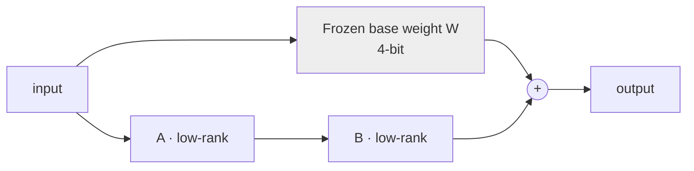
**✅ Checkpoint** Roughly what fraction of parameters does LoRA train, and why does that slash memory?
**📖 Book** §2.4 (LoRA).

### Module 3.4 — Run the QLoRA fine-tune (smoke-test free, then rent)

**🎯 Goal** A domain-adapted decoder, trained end-to-end. Debug on free Colab with a 200-example subset; launch the real run on a rented A100 (~1–2 hrs).
**🧠 Theory** `bitsandbytes` 4-bit loading; `peft` LoRA config; `trl`’s `SFTTrainer`; gradient accumulation + gradient checkpointing to fit memory; saving/merging adapters; the **smoke-test-first** discipline (does loss drop over 50 steps before you pay for the full run?).
**💻 Code**
```python
from peft import LoraConfig
from trl import SFTTrainer
from transformers import BitsAndBytesConfig, AutoModelForCausalLM
bnb = BitsAndBytesConfig(load_in_4bit=True, bnb_4bit_quant_type="nf4",
                         bnb_4bit_compute_dtype="bfloat16")
model = AutoModelForCausalLM.from_pretrained(BASE, quantization_config=bnb, device_map="auto")
peft_cfg = LoraConfig(r=16, lora_alpha=32, target_modules="all-linear",
                      lora_dropout=0.05, task_type="CAUSAL_LM")
SFTTrainer(model=model, train_dataset=sft_ds, peft_config=peft_cfg, args=cfg).train()
```
**📦 Deliverable** A QLoRA adapter for DeskMate + before/after sample outputs. **✅ Checkpoint** Which two memory-saving techniques let this fit in 16 GB, and what do they cost you?
**📖 Book** §2.3, Chapter 3 (end-to-end fine-tuning), Chapter 4 (inference).

### Module 3.5 — The "is bigger actually better?" experiment (paid GPU)

**🎯 Goal** Earn the right to call DeskMate an *SLM* by proving a small model is enough — with data, not vibes.
**🧠 Theory** Since you have budget: rent a single A100 and run two extra fine-tunes — a **full** fine-tune of your 1–3B base, and a **7–8B** QLoRA — then compare all three against your 1–3B QLoRA on the gold set across quality, latency, and $/1k-requests. This is exactly the *domain-specific-vs-generalist* trade-off your book frames in §1.6, made concrete with your own numbers. Usually the small model wins on cost/latency at acceptable quality — but now you'll *know*.
**📦 Deliverable** A 3-way comparison table (quality vs latency vs cost) and a one-paragraph decision with evidence. **✅ Checkpoint** At what quality gap would the bigger model become worth its cost for DeskMate?
**📖 Book** §1.6, §4.2.

### Module 3.6 — Evaluating generative output

**🎯 Goal** Trustworthy evaluation of free-form text.
**🧠 Theory** Task metrics (exact-match/F1 for structured answers); **LLM-as-judge** (and its pitfalls/bias); human spot-checks; a held-out **regression test set** so future changes can’t silently degrade quality; measuring hallucination.
**📦 Deliverable** An eval harness + a scorecard for the tuned vs base model. **✅ Checkpoint** Name two failure modes of LLM-as-judge and how you’d mitigate them.

### Module 3.7 — Preference tuning intro: DPO (advanced/optional)

**🎯 Goal** Nudge style/safety with preference pairs.
**🧠 Theory** Why SFT isn’t always enough; DPO from chosen/rejected pairs (a lighter alternative to RLHF). **📦 Deliverable** A small DPO pass on tone/format. **✅ Checkpoint** What kind of problem does preference tuning fix that more SFT data won’t?

---

# Phase 4 — Retrieval-Augmented Generation (Grounding)

> Stop the decoder from making things up: ground it in your real documentation.

### Module 4.1 — RAG vs fine-tuning (and why DeskMate uses both)

**🎯 Goal** The right mental model for *knowledge* (RAG) vs *behavior/format* (fine-tuning).
**🧠 Theory** Fine-tuning teaches *how to respond*; RAG supplies *current facts*. When to use which, and why combining them is the production default. **📦 Deliverable** A decision note for DeskMate. **✅ Checkpoint** Your docs change weekly — fine-tune or RAG? Why?
**📖 Book** §2.2, §2.5 (RAG or fine-tuning?).

### Module 4.2 — Chunking & embeddings

**🎯 Goal** Turn documents into searchable vectors.
**🧠 Theory** Chunking strategies (size/overlap, semantic vs fixed); embedding models (small sentence-transformers); the embedding space; why chunking quality dominates RAG quality.
**📐 Diagram**
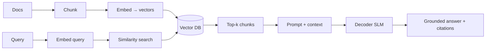
**📦 Deliverable** A chunked, embedded doc corpus in a vector DB (FAISS/Chroma). **✅ Checkpoint** How do chunk size and overlap trade off recall against noise?
**📖 Book** §2.1 (RAG data prep), §13.3 (vector database).

### Module 4.3 — Retrieval that actually works

**🎯 Goal** Good candidates, not just *some* candidates.
**🧠 Theory** Dense vs sparse (BM25) vs **hybrid** search; **rerankers**; metadata filtering (e.g. by product/version using the fields your encoder extracted!). **📦 Deliverable** A retriever with hybrid search + reranking, measured by hit-rate@k. **✅ Checkpoint** When does pure vector search fail and BM25 save you?

### Module 4.4 — Wire RAG to the decoder + evaluate grounding

**🎯 Goal** Grounded, cited answers.
**🧠 Theory** Prompt assembly (context + question + instructions); citation injection; RAG-specific eval — **faithfulness** (is the answer supported by retrieved context?) and **answer relevance**. **📦 Deliverable** End-to-end RAG answering with citations + a faithfulness scorecard. **✅ Checkpoint** Retrieval is perfect but answers still hallucinate — where do you look?

### Module 4.5 — GraphRAG (advanced/optional)

**🎯 Goal** Handle questions that need connecting facts across documents.
**🧠 Theory** Knowledge-graph-augmented retrieval; when it beats vanilla RAG; cost trade-offs. **📦 Deliverable** A small GraphRAG experiment vs baseline. **✅ Checkpoint** What query type does GraphRAG help with that top-k vector search can’t?
**📖 Book** §14.1 (GraphRAG), §14.2 (RAG + Agentic), §14.3 (memory).

---

# Phase 5 — Optimization for Production

> Make DeskMate small, fast, and cheap enough to actually deploy. This is where your book is especially strong.

### Module 5.1 — Precision formats

**🎯 Goal** Know what fp32/fp16/bf16/int8/int4 mean for memory, speed, and quality.
**🧠 Theory** Floating-point vs integer representation; the memory/quality/throughput trade-offs; what “quantization” fundamentally trades away.
**📐 Diagram**
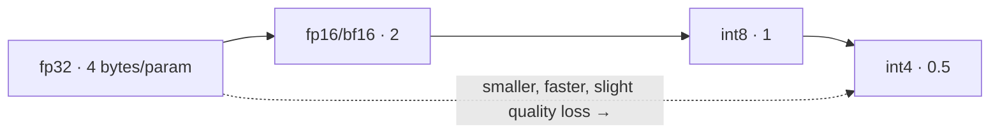
**✅ Checkpoint** Estimate the memory to load a 3B model in fp16 vs int4.
**📖 Book** §6.1.

### Module 5.2 — 8-bit quantization

**🎯 Goal** Halve memory with minimal quality loss.
**🧠 Theory** How int8 quantization works; **LLM.int8()** outlier handling; hands-on 8-bit loading. **📦 Deliverable** An 8-bit DeskMate decoder benchmarked vs fp16. **✅ Checkpoint** What problem do outlier features cause, and how does LLM.int8() handle it?
**📖 Book** §6.2.

### Module 5.3 — 4-bit quantization: GPTQ, AWQ, GGUF

**🎯 Goal** Get to int4 for the smallest footprint and CPU/edge deployment.
**🧠 Theory** Post-training quantization (GPTQ, AWQ) vs the 4-bit you used in QLoRA; **GGUF/llama.cpp** format for CPU & laptops; calibration data. **📦 Deliverable** A GPTQ/AWQ build + a GGUF export, each benchmarked. **✅ Checkpoint** GPTQ vs GGUF — when do you reach for each?
**📖 Book** §6.4, §6.3.

### Module 5.4 — ONNX export & runtime

**🎯 Goal** A portable, optimized graph that runs fast on CPU and GPU.
**🧠 Theory** What ONNX is (a portable computation graph); operators/types; ONNX Runtime + execution providers; **I/O binding** for GPU; ONNX for LLMs on CPU vs GPU. **📦 Deliverable** DeskMate’s encoder + decoder exported to ONNX, benchmarked vs PyTorch. **✅ Checkpoint** What does I/O binding remove from the hot path?
**📖 Book** Chapter 5 (all), §5.5–5.6.

### Module 5.5 — Profiling & graph optimization

**🎯 Goal** Find and fix the real bottleneck instead of guessing.
**🧠 Theory** Profiling ONNX models; turning raw profiling data into insights; graph-level optimizations (fusion, etc.). **📦 Deliverable** A profile-driven before/after latency improvement with a flame view. **✅ Checkpoint** What’s your single slowest op, and what did you do about it?
**📖 Book** Chapter 10 (all).

### Module 5.6 — Advanced quantization to understand (read-level)

**🎯 Goal** Know the frontier so you can evaluate claims.
**🧠 Theory** **SmoothQuant** (migrating quantization difficulty), **FlexGen** (offloading for big models on small hardware), **BitNet** (extreme low-bit). Conceptual + a small BitNet run if compute allows. **✅ Checkpoint** One sentence each on what SmoothQuant, FlexGen, and BitNet solve.
**📖 Book** Chapter 9 (all).

### Module 5.7 — Speculative decoding

**🎯 Goal** Cut decoder latency 2–3× without changing model weights or output distribution.

**🧠 Theory** Speculative decoding uses a small, fast **draft model** (e.g. a 100M–400M model of the same family) to propose N tokens ahead, then the large target model **verifies all N in a single parallel forward pass**. Accepted tokens are kept; the first rejected position is resampled from the target's distribution. Because the target verifies in parallel, you effectively get N tokens for the cost of ~1 forward pass — a major win when the draft model has high acceptance rate on your domain. Key metric: **acceptance rate α** (fraction of draft tokens accepted). α depends on how similar draft and target distributions are; a domain-tuned draft model typically achieves α ≥ 0.7.

**📐 Diagram**
```mermaid
sequenceDiagram
    participant D as Draft model (small, fast)
    participant T as Target model (large)
    D->>D: generate N draft tokens in N sequential steps
    D->>T: send (context + N draft tokens) in one batch
    T->>T: verify all N positions in one parallel forward pass
    T-->>D: accept/reject each position
    Note over T: accepted tokens kept; first rejected position resampled from target
```

**📦 Deliverable** DeskMate decoder with speculative decoding benchmarked vs standard decoding: tokens/sec, acceptance rate α, and output quality on the gold set (must be identical to non-speculative). **✅ Checkpoint** Why does correct speculative decoding produce outputs that are *statistically identical* to standard decoding from the target model?

### Module 5.8 — Model merging: SLERP and DARE-TIES (optional)

**🎯 Goal** Combine the strengths of two fine-tuned variants without additional training.

**🧠 Theory** Model merging interpolates the weights of two or more fine-tuned models into a single model. Key techniques:
- **SLERP (Spherical Linear Interpolation):** Interpolates between two weight vectors on the unit sphere rather than linearly — better preserves each model's learned subspace geometry.
- **DARE-TIES:** Before merging, prunes redundant delta weights (the difference between fine-tuned and base weights) to reduce interference between models, then resolves sign conflicts (TIES step).
- **Task vectors:** A fine-tune's "direction" in weight space; you can add/subtract task vectors to combine capabilities or remove undesired behaviours without extra training.

DeskMate use case: merge the SFT checkpoint (good domain accuracy) with the DPO-tuned variant (good tone/format) to get both properties in one model.

**📦 Deliverable** A merged DeskMate model (SFT + DPO) benchmarked vs each parent on the gold set: quality, tone ratings, and latency (merged model has identical latency to either parent). **✅ Checkpoint** What symptom tells you that weight interference is degrading the merged model, and what is your next step?

---

# Phase 6 — Deployment & Serving

> Put DeskMate behind an API, locally, and on-device.

### Module 6.1 — Inference economics: cost, batching, throughput

**🎯 Goal** Reason quantitatively about serving.
**🧠 Theory** Calculating inference cost; **batching**; throughput vs latency; estimating generation time; getting the most from one GPU; KV-cache intuition.
**📐 Diagram**
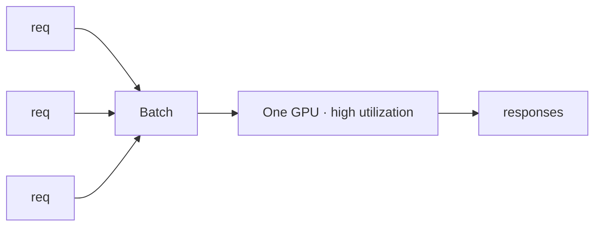
**✅ Checkpoint** Why does batching raise throughput but can hurt p99 latency?
**📖 Book** §4.2, §4.3 (GPU, batching, DeepSpeed).

### Module 6.2 — Serving with vLLM

**🎯 Goal** Production-grade throughput with continuous batching + paged attention.
**🧠 Theory** Offline vs online serving; why vLLM is fast; an OpenAI-compatible endpoint. **📦 Deliverable** DeskMate served via vLLM, load-tested. **✅ Checkpoint** What does paged attention do for memory?
**📖 Book** §11.1.

### Module 6.3 — A FastAPI service + benchmarking

**🎯 Goal** A real HTTP service wrapping the full pipeline.
**🧠 Theory** FastAPI endpoints; request/response schemas; benchmarking variants; picking and deploying the best performer. **📦 Deliverable** A `/triage` + `/answer` API with latency benchmarks. **✅ Checkpoint** Where do you put the encoder vs decoder vs retriever in the request path?
**📖 Book** §11.2.

### Module 6.4 — Local deployment: Ollama, LM Studio, llama.cpp

**🎯 Goal** Run DeskMate fully offline on a laptop (privacy use case).
**🧠 Theory** Importing your GGUF into Ollama; a custom Modelfile; privacy benefits; LM Studio + its Python SDK; Jan/Cortex alternatives. **📦 Deliverable** DeskMate running locally via Ollama from your own quantized model. **✅ Checkpoint** Why is local deployment a feature, not just a convenience, for some customers?
**📖 Book** Chapter 12 (all), §11.3.

### Module 6.5 — On-device / mobile (overview)

**🎯 Goal** Understand the edge-deployment path.
**🧠 Theory** MLC LLM; deploying to Android; constraints of mobile inference. **✅ Checkpoint** What changes when your “server” is a phone?
**📖 Book** §11.4.

---

# Phase 7 — The End-to-End Application & Agent

> Integrate everything into DeskMate as a coherent, observable system.

### Module 7.1 — System architecture & orchestration

**🎯 Goal** Assemble triage → route → retrieve → generate → guardrails as one service.
**🧠 Theory** Why LLMs alone aren’t enough; composing the encoder, retriever, and decoder; guardrails (input validation, output filtering, citation enforcement, refusal on low-confidence).
**📐 Diagram**
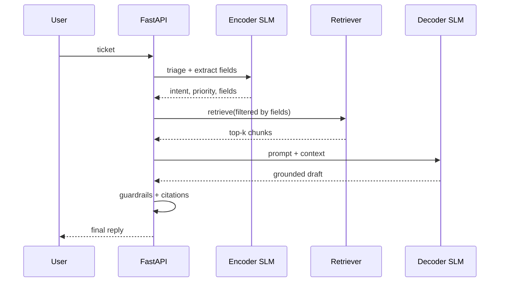
**📦 Deliverable** The integrated DeskMate service. **✅ Checkpoint** Where does a low-confidence triage short-circuit the pipeline?
**📖 Book** §13.1, §13.2.

### Module 7.2 — Make it an agent

**🎯 Goal** Let DeskMate take actions (look up an order, file a bug, escalate).
**🧠 Theory** Tools/function-calling; agent loops; when an agent helps vs adds fragility. **📦 Deliverable** DeskMate with 1–2 real tools. **✅ Checkpoint** What guardrail prevents an agent tool-call loop from running forever?
**📖 Book** §13.4, §14.2.

### Module 7.3 — Memory: short- and long-term

**🎯 Goal** Coherent multi-turn conversations.
**🧠 Theory** Conversation/short-term memory vs persistent/long-term memory; summarization to fit context. **📦 Deliverable** Multi-turn DeskMate with memory. **✅ Checkpoint** How do you keep a long conversation inside the context window?
**📖 Book** §14.3.

### Module 7.4 — Monitoring, eval-in-prod, and drift

**🎯 Goal** Keep it good after launch.
**🧠 Theory** Logging, online metrics, feedback capture, regression suites in CI, detecting data/quality drift, a retraining trigger. **📦 Deliverable** A monitoring + feedback loop design (and basic dashboards). **✅ Checkpoint** What signal tells you it’s time to retrain?

### Module 7.5 — Test-time compute (advanced)

**🎯 Goal** Squeeze more reasoning out of a small model at inference time.
**🧠 Theory** Test-time compute (sampling/verification/best-of-n); the OptiLLM inference proxy; embedding test-time compute into an SLM; building a small reasoning SLM. **📦 Deliverable** A DeskMate variant with test-time-compute on hard tickets, measured for the quality/latency trade. **✅ Checkpoint** When is paying more compute *per request* worth it?
**📖 Book** Chapter 15 (all).

### Module 7.6 — CI/CD for the model lifecycle

**🎯 Goal** Automate the path from "drift detected or new data arrives" to "improved model safely in production" — so DeskMate can improve itself without manual intervention.

**🧠 Theory** A deployed SLM is not a static artefact — it drifts as ticket language evolves. A production ML system needs:
- **Retrain trigger:** a signal (quality metric below threshold, data-drift score, or a calendar schedule) that kicks off a fine-tuning run.
- **Automated eval gate:** the new candidate model is promoted only if it beats the current prod model on the gold set by a defined margin (e.g. +1% macro-F1, no category regression > 2%).
- **Canary / shadow deployment:** route a small fraction of live traffic (5–10%) to the new model before full rollout; compare live metrics against the incumbent.
- **Rollback:** if prod metrics degrade after full rollout, automatically revert to the previous checkpoint.

**📐 Diagram**
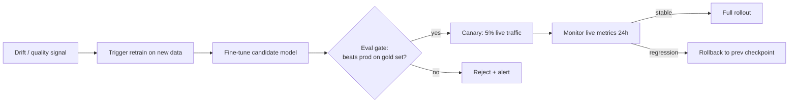

**📦 Deliverable** A CI/CD pipeline (GitHub Actions or equivalent) that: detects trigger → runs fine-tune → runs eval gate → promotes or rejects. Tested with a simulated new-data batch. **✅ Checkpoint** Your eval gate compares the new model only against the static gold set. What blind spot does this leave, and how does canary deployment address it?

---

# Phase 8 — DeskMate Capstone & Portfolio

**🎯 Goal** Ship DeskMate and tell the story.
- **Deliverables:** a deployed DeskMate demo (vLLM/FastAPI + local Ollama build), a **model card** and **datasheet** (documenting your public + synthetic data mix), an eval scorecard (encoder + decoder + RAG, all on the gold set), the bigger-vs-smaller comparison from Module 3.5, a quantization/latency report, and a written architecture doc with the diagrams from this curriculum.
- **Portfolio writeup:** the problem, why SLMs, how you sourced/generated data with no starting dataset, your two models, your optimizations, your deployment, and honest limitations.
- **✅ Checkpoint:** Could you now rebuild this for a *different* domain from scratch? Phase 9 is where you prove it.

---

# Phase 9 — Graduation Project: a new SLM, end to end, on your own

> A **completely separate** use case. You drive; I review. Same pipeline, new domain — this is how you prove the course worked and build a second portfolio piece.

### How Phase 9 runs

You pick a new domain, then walk the same arc (data → encoder and/or decoder → RAG if needed → optimize → deploy) **largely independently**. For each phase you produce the deliverable and I act as a code reviewer / rubber-duck — pointing at issues rather than writing it for you. We start lighter and pull back support as you go.

### Pick a domain (each is genuinely useful and free-tier-friendly to start)

| Candidate graduation project | Model type(s) | Data strategy | Book tie-in |
|---|---|---|---|
| **SQL/codegen assistant** — natural language → SQL or Python | Decoder (SFT) | Public code/SQL datasets + synthetic | Ch.7 |
| **Clinical/medical note structurer** — free text → structured fields | Encoder (NER) + RAG | Public clinical NER sets + synthetic | Ch.3, Ch.13 |
| **Legal-clause classifier + Q&A** — tag clauses, answer over contracts | Encoder + RAG | Public legal corpora + synthetic | Ch.2, Ch.14 |
| **Fintech dispute/transaction assistant** | Encoder (triage) + decoder | banking-style public data + synthetic | Ch.1, Ch.6 |
| **Scientific structure generation** (protein/molecule) | Specialized decoder | Domain datasets | Ch.8 |

### Phase 9 checklist (your rubric)

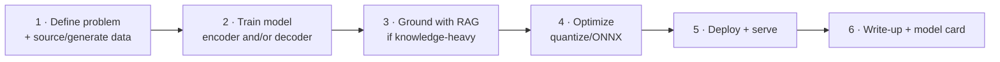

**✅ Final graduation checkpoint:** You shipped a working, evaluated, deployed SLM in a domain we never touched together — with a write-up explaining every choice. That's mastery.

---

# Appendix A — Notebook map

Phases 0–8 build **DeskMate**; Phase 9 is your independent build. *(opt) = optional module.*

| # | Notebook | Module | Output |
|---|---|---|---|
| 00 | env_setup_hello_gpu | 0.2 | repo + W&B + Hub checkpoint |
| 01 | tokenizer_train | 0.4 | domain BPE tokenizer |
| 02 | nano_bigram | 1.1 | training loop + loss curve |
| 03 | nano_attention | 1.2 | self-attention + heatmap |
| 04 | nano_gpt_block | 1.3 | Block module |
| 05 | nano_gpt_train | 1.4 | trained nano-SLM + generation |
| 06 | modern_arch_variants | 1.6 | nano-GPT vs modern SLM comparison table |
| 07 | bridge_dapt_intro | 1.7 | DAPT decision note |
| 08 | data_acquire_schema | 2.1 | unified public dataset + gold set |
| 09 | synthetic_data_gen | 2.2 | synthetic labeled + extraction data |
| 10 | encoder_dataprep | 2.3 | tokenized encoder pipeline |
| 11 | encoder_finetune | 2.4 | intent+priority classifier |
| 12 | field_extraction_ner | 2.5 | field extractor (NER head) |
| 13 | encoder_eval | 2.6 | eval report on gold set |
| 14 | (opt) distillation | 2.7 | distilled classifier |
| 15 | prompting_baseline | 3.0 | zero/few-shot baseline scorecard |
| 16 | base_model_selection | 3.1 | comparison table + recommendation |
| 17 | (opt) dapt_run | 3.1a | DAPT checkpoint + perplexity comparison |
| 18 | sft_dataset | 3.2 | formatted SFT dataset |
| 19 | constrained_decoding | 3.2a | JSON-constrained extractor benchmarked vs NER |
| 20 | lora_qlora_theory | 3.3 | annotated memory math |
| 21 | qlora_finetune | 3.4 | DeskMate QLoRA adapter (rented GPU) |
| 22 | bigger_vs_smaller | 3.5 | 3-way cost/quality/latency study |
| 23 | gen_eval_harness | 3.6 | generative scorecard |
| 24 | (opt) dpo_tuning | 3.7 | preference-tuned variant |
| 25 | rag_index | 4.2 | vector DB (FAISS/Chroma) |
| 26 | rag_retriever | 4.3 | hybrid + rerank retriever |
| 27 | rag_answer_eval | 4.4 | grounded answers + faithfulness scorecard |
| 28 | (opt) graphrag | 4.5 | GraphRAG experiment vs baseline |
| 29 | precision_formats | 5.1 | memory estimates notebook |
| 30 | quantize_8bit | 5.2 | 8-bit DeskMate benchmarked vs fp16 |
| 31 | quantize_4bit_gguf | 5.3 | GPTQ/AWQ + GGUF export benchmarked |
| 32 | onnx_export | 5.4 | encoder + decoder in ONNX |
| 33 | onnx_profile | 5.5 | flame view + latency improvement |
| 34 | advanced_quant | 5.6 | SmoothQuant/FlexGen/BitNet notes |
| 35 | speculative_decoding | 5.7 | speculative decoding benchmark |
| 36 | (opt) model_merging | 5.8 | merged SFT+DPO model benchmarked |
| 37 | serve_vllm_fastapi | 6.2–6.3 | served API + benchmarks |
| 38 | local_ollama | 6.4 | offline DeskMate via Ollama |
| 39 | deskmate_orchestrator | 7.1 | integrated DeskMate service |
| 40 | deskmate_agent_memory | 7.2–7.3 | agent + multi-turn memory |
| 41 | monitoring_drift | 7.4 | monitoring + feedback loop design |
| 42 | (opt) test_time_compute | 7.5 | test-time compute on hard tickets |
| 43 | cicd_model_lifecycle | 7.6 | CI/CD retrain → eval gate → promote pipeline |
| 44 | capstone_writeup | 8 | deployed demo + model card + portfolio |
| 45+ | graduation_project | 9 | your own end-to-end SLM in a new domain |

# Appendix B — Book chapter → module map

| Book | Modules |
|---|---|
| Ch.1 (intro, transformer, risks, domain vs generalist) | 0.1, 0.3, 3.5 |
| Ch.2 (data prep, RAG, fine-tuning, LoRA, RAG-vs-FT) | 2.2, 2.3, 3.2, 3.3, 3.4, 4.1, 4.2 |
| Ch.3 (end-to-end fine-tuning, domain eval) | 3.4, 2.6 |
| Ch.4 (inference, cost, GPU, batching, DeepSpeed) | 3.5, 6.1 |
| Ch.5 (ONNX) | 5.4 |
| Ch.6 (quantization 8-bit/4-bit/GPTQ/ggml) | 5.2, 5.3 |
| Ch.7 (Python code generation) | Phase 9 option |
| Ch.8 (protein structures) | Phase 9 option |
| Ch.9 (FlexGen, SmoothQuant, BitNet) | 5.6 |
| Ch.10 (profiling) | 5.5 |
| Ch.11 (vLLM, FastAPI, MLC, Android) | 6.2, 6.3, 6.5 |
| Ch.12 (Ollama, LM Studio, Jan, Cortex) | 6.4 |
| Ch.13 (end-to-end apps, vector DB, agents) | 4.2, 7.1, 7.2 |
| Ch.14 (GraphRAG, agentic RAG, memory) | 4.5, 7.2, 7.3 |
| Ch.15 (test-time compute) | 7.5 |

# Appendix C — Compute & cost cheatsheet

**Free vs paid:**
- **Free (Colab/Kaggle):** all of Phase 0–2, every smoke-test, encoder training, RAG indexing, ONNX-CPU, serving, the whole nano-GPT phase.
- **Paid (rent ~1–3 hrs at a time):** the real decoder QLoRA run (M3.4), the full fine-tune + 7–8B comparison (M3.5), and any long run you've already smoke-tested.
- **The money rule:** never debug on a paid GPU. Get it working on 200 examples free, then launch the full run rented. Whole-course paid spend is realistically low tens of dollars.

**When it breaks:**
- **OOM?** Lower batch size → add gradient accumulation → enable gradient checkpointing → shorten sequence length → drop to 4-bit.
- **Runtime disconnects?** Checkpoint every epoch to HF Hub; resume from there.
- **Slow?** Use bf16/fp16, enable `tf32`, increase batch (if memory allows), profile before optimizing.
- **Out of free GPU hours?** Alternate Colab/Kaggle; do all CPU work (data prep, synthetic generation via API, tokenizers, ONNX-CPU, RAG indexing, FastAPI) on non-GPU sessions.

# Appendix D — Datasets quick reference

| Hugging Face ID | Use | License note |
|---|---|---|
| `PolyAI/banking77` | Encoder triage (77 intents) | CC-BY-4.0 |
| `bitext/Bitext-customer-support-llm-chatbot-training-dataset` | Triage + decoder SFT | CDLA-Sharing-1.0 (attribution + share-alike) |
| `clinc150` | Out-of-scope routing | CC-BY-3.0 |
| *Customer Support on Twitter* (Kaggle) | Realism / robustness | Kaggle terms |

> Always check each dataset's license against your intended use before any commercial deployment — CDLA-Sharing, for instance, carries attribution and share-alike obligations.

---

## How we proceed

Tell me which to do next and I'll produce the full module — complete runnable notebook, every line explained, and the diagrams:

1. **Start at Module 0.1** (recommended — establishes the judgment everything else rests on), or
2. **Jump to Module 0.2** if you want hands-on environment setup immediately, or
3. **Jump to Module 2.1/2.2** if you'd rather get data on disk and start the synthetic-generation work right away.

We go one module at a time, you build the deliverable, pass the checkpoint, then we advance.
