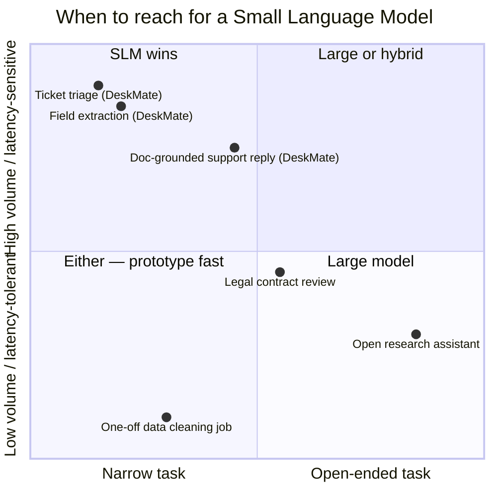
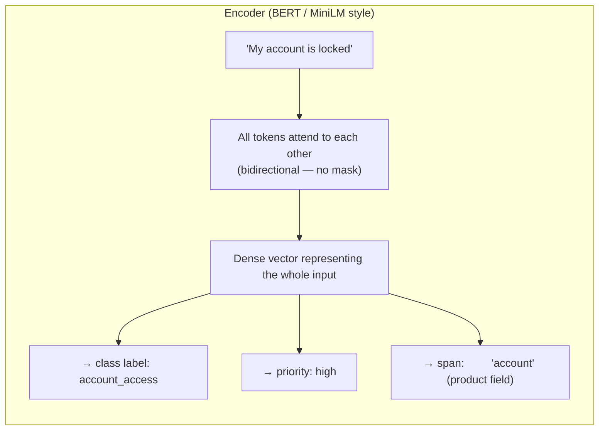
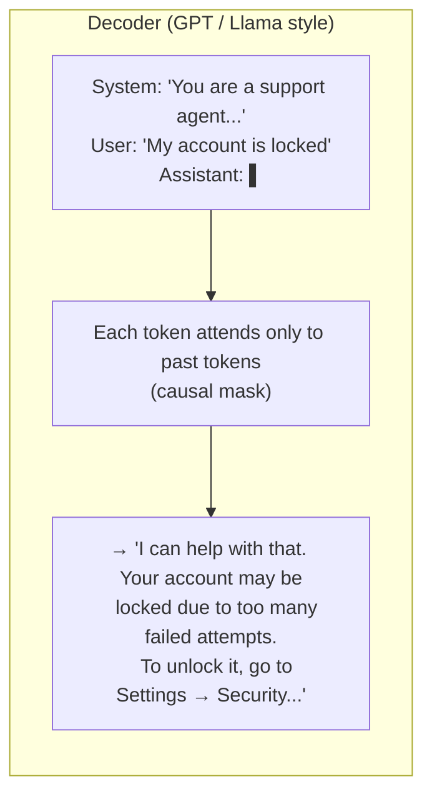
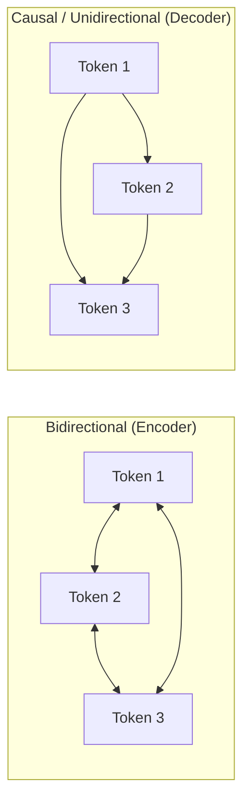
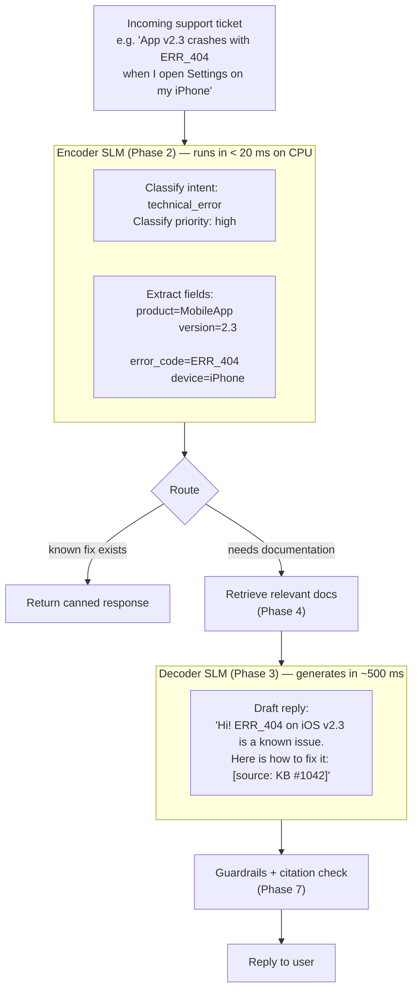

# Module 0.1 — What an SLM is, and When Small Wins

| | |
|---|---|
| **Phase** | 0 — Foundations & Setup |
| **Type** | Theory + Decision memo |
| **Compute** | None |
| **Deliverable** | `decision_memo.md` in this folder |
| **Estimated time** | 1 evening |

---

## Goal

Build the judgment to know *when* an SLM is the right tool **before** writing any code.
This judgment layer makes every downstream decision — encoder vs decoder, fine-tune vs RAG,
small vs large — coherent. Every module from here builds on it.

---

## 1. What Does "Small" Actually Mean?

"Small language model" has no hard boundary — it is defined by **deployability**, not by a
parameter count. The useful mental bands:

| Band | Parameters | Deployment target | Examples |
|---|---|---|---|
| Tiny encoder | < 100 M | CPU in a microservice, edge device | DistilBERT (66 M), MiniLM (22 M) |
| Small decoder | 100 M – 3 B | Single consumer GPU (8–16 GB VRAM), or CPU with int4 | Phi-3.5-mini (3.8 B), SmolLM2 (1.7 B), Qwen2.5-1.5B |
| Medium decoder | 3 B – 8 B | Single mid-range GPU (16–24 GB) | Llama-3.2-3B, Gemma-2-9B |
| Large | 8 B + | High-end single GPU or multi-GPU | Llama-3.1-8B, Qwen2.5-7B |
| Frontier | 70 B + | Server cluster or cloud API | GPT-4, Claude, Llama-3.1-70B |

The boundary shifts as hardware improves, but the **principle is stable**: a model is "small"
if a single engineer can deploy and run it on a single machine — or on-device — without
enterprise-scale infrastructure.

> **Key insight:** "Small" is not a quality judgment. A fine-tuned 1 B model on a narrow
> task regularly outperforms a general 70 B model on that same task — while running 50× cheaper
> and 20× faster. Size is about *operational requirements*, not capability on a narrow domain.

---

## 2. The Four Reasons Small Wins in Production

These are not theoretical benefits. They are the *actual* reasons production systems choose
SLMs over frontier models every day.

### 2.1 Cost

Large model API calls are priced per token. Support desks handle thousands to millions of
tickets per day. At scale, the economics are decisive:

```
Frontier model (GPT-4o input):   ~$2.50 / 1M tokens
Small model self-hosted (1 B):   ~$0.002 / 1M tokens  (GPU amortized)
──────────────────────────────────────────────────────
At 10 M tokens / day:
  Frontier API:   $25 / day  →  $9,125 / year
  Self-hosted:    $0.02 / day →  $7.30 / year     (1,250× cheaper)
```

This is why triage and classification — high-volume, narrow tasks — almost always use SLMs
in production.

### 2.2 Latency

A frontier model API call crosses a network, waits in a queue, and processes through a 100 B+
parameter model. A local small model is dramatically faster:

| | Frontier API (GPT-4o) | Self-hosted 3 B model |
|---|---|---|
| Classification latency | 300–800 ms | 5–20 ms |
| Generation (100 tokens) | 2–5 s | 200–500 ms |
| p99 latency | unpredictable | controllable |

For DeskMate's triage step (which must complete before routing), 5 ms vs 500 ms is the
difference between a responsive product and a broken one.

### 2.3 Privacy / On-Premises

Sending customer support tickets to a third-party API means customer data — names, account
numbers, error logs — leaves your infrastructure. Many customers and regulations (GDPR, HIPAA,
CCPA, SOC 2) prohibit this or require explicit consent. A self-hosted SLM:

- Never sends data off-premises
- Gives you full audit control
- Enables air-gapped deployments (government, healthcare, legal)

This is often the *non-negotiable* reason an enterprise chooses SLMs even when a frontier
model would be technically superior.

### 2.4 Control / Specialization

A general-purpose frontier model knows everything about everything — which is a liability for
a narrow task. It may:

- Use vocabulary your users don't recognise ("I suggest opening a Jira ticket") instead of
  your product's own terminology
- Hallucinate product details it was never trained on
- Refuse to answer in the format your downstream system expects
- Silently change behavior when the API provider updates the model

A fine-tuned SLM is **surgically adapted** to your domain. It speaks your product's language,
follows your output format, and never changes behavior without your explicit re-training.
You own the update cycle.

---

## 3. The Flip Side — When NOT to Use a Small Model

Being honest about SLM limits is as important as knowing its strengths.

| Scenario | Why SLM struggles | Better choice |
|---|---|---|
| Open-ended research or multi-step reasoning | SLMs lack capacity for long reasoning chains | Large model or hybrid |
| Rare queries with no training examples | Not enough signal to fine-tune on | Large model + RAG |
| Rapidly changing domain (docs update hourly) | Fine-tuning can't keep up | RAG over any model |
| Broad generalist assistant ("answer anything") | Narrow model can't cover breadth | Large model |
| Zero-data, day-one prototype | No labeled data yet | Prompt a large model first |

**The production default is a hybrid:** use an SLM for high-volume, well-defined tasks
(classification, extraction, structured generation) and route edge cases or complex queries
to a larger model. DeskMate will follow this pattern — SLMs handle ~95% of volume; an
escalation path exists for the rest.

---

## 4. The Decision Framework

When you receive a new task, ask two questions:

```
Q1: Is this task NARROW?
    (a well-defined output space; a domain you can curate training data for)

Q2: Is this task HIGH-VOLUME or latency / cost / privacy-sensitive?
```



| Quadrant | Decision |
|---|---|
| **Both narrow AND high-volume/sensitive** | SLM wins clearly |
| **Narrow but low-volume, latency-tolerant** | Either; use a large model if no training data yet, SLM once you do |
| **Open-ended** | Large model; breadth requirement exceeds what a narrow model can reliably cover |

---

## 5. Encoder vs Decoder — Why DeskMate Needs Both

This is the single most important architectural decision before any code is written.
Encoders and decoders are not interchangeable; they solve fundamentally different problems.

### What an encoder does

An encoder reads the *entire* input at once — every token can attend to every other token
(bidirectional attention). It produces a rich **representation** of the input, not new text.
Best for tasks where the answer is a *label*, a *score*, or a *span* derived from what is
already in the input.



**Use when:** you have input text and need to map it to a fixed output — a class, a set of
extracted fields, or a similarity score.

### What a decoder does

A decoder generates text **left to right** — each token can only attend to tokens before it
(causal / unidirectional attention). It produces **new text** by predicting the next token,
repeatedly, until it decides to stop. Best for tasks where the answer must be *generated*,
not derived from a fixed set of options.



**Use when:** you need to *produce* a response, draft text, summarise, or generate structured
content that cannot be enumerated in advance.

### The fundamental difference visualised



An encoder token knows its full context when building its representation. A decoder token
knows only its past — because at generation time, the future tokens do not yet exist.
This is not a limitation; it is what *enables* generation.

### How DeskMate maps to both



| DeskMate component | Model type | Reason |
|---|---|---|
| Intent classification | **Encoder** | Maps input → label. Runs on CPU in < 10 ms. |
| Priority scoring | **Encoder** | Same model, different classification head. |
| Field extraction (product, version, error code) | **Encoder** (NER head) | Maps input → token spans. No generation needed. |
| Draft reply generation | **Decoder** | Must *produce* novel text conditioned on retrieved context. Encoder physically cannot do this. |

The encoder handles everything *before* the response is written. The decoder writes the
response. They are not interchangeable — this is a structural constraint, not a preference.

---

## 6. Three-Minute Plain-English Summary

> "A small language model is an AI model small enough to run on one machine — or even a phone.
> We use them instead of giant cloud AI because they are 1,000× cheaper per call, respond in
> milliseconds, and never send customer data to a third party. The tradeoff: they only work
> well on specific, well-defined tasks.
>
> For DeskMate, we use two. A small classifier (encoder) reads a ticket and labels it —
> intent, priority, which product — in under 20 ms on CPU. A small generator (decoder) writes
> a grounded reply in about half a second, using retrieved documentation so it cannot
> hallucinate product details.
>
> The classifier is cheap, deterministic, and fast. The generator is the creative step,
> always anchored to real sources."

---

## 📦 Deliverable

Create `decision_memo.md` in this folder (`modules/phase_0/0.1_what_is_slm/`).
Write it in your own words — do not copy this file. The sections below are the required
structure; fill each one with your own reasoning.

```markdown
# Decision Memo — Why DeskMate Should Be Built from SLMs

## The problem
[Describe DeskMate's three jobs in one paragraph: triage, extraction, reply generation]

## Why SLMs are the right tool

### Cost
[State the cost argument for DeskMate's expected ticket volume]

### Latency
[Why triage in particular cannot tolerate 500 ms API round-trips]

### Privacy
[What customer data is in a support ticket and why it cannot leave the premises]

### Specialization / control
[Why a general model is a liability for a branded support product]

## Why a frontier LLM is the wrong default
[Argue the flip side — what specifically breaks if DeskMate uses GPT-4o API calls for everything]

## The two components and their model types

### Component 1 — Encoder SLM (triage + extraction)
- Task type: [classification / span extraction]
- Why encoder, not decoder: [your explanation]
- Latency target: < 20 ms
- Volume: every incoming ticket

### Component 2 — Decoder SLM (reply generation)
- Task type: [text generation conditioned on retrieved context]
- Why decoder, not encoder: [your explanation]
- Latency target: < 2 s for a full reply
- Volume: tickets that need a drafted reply (~60-80% after canned responses)

## Decision
[One paragraph: the chosen architecture and why it is the right call for DeskMate]
```

---

## ✅ Checkpoint Questions

Answer these yourself before marking this module done.
Answers are below — check them only after writing your own.

**Q1.** Your team proposes using GPT-4o for all of DeskMate (triage, extraction, and reply
generation) via API. Give three specific, *quantified* reasons to push back.

**Q2.** A startup says: *"We want to build a general-purpose AI assistant that can answer any
question about anything."* Is an SLM the right choice? What would you tell them?

**Q3.** DeskMate's extraction step (pulling product name, version, error code from a ticket)
could be done with either an encoder NER head or a decoder with constrained JSON output.
Both work. What are the two deciding factors for which to prefer in production at high volume?

---

<details>
<summary>Checkpoint answers — expand only after writing your own</summary>

**A1.** Three quantified reasons:
1. **Cost.** At 100 k tickets/day × ~500 tokens each = 50 M tokens/day.
   GPT-4o input is ~$2.50 / 1 M tokens → $125/day ($45 k/year).
   A self-hosted 3 B model costs roughly $0.10/day in GPU time. 1,250× savings.
2. **Latency.** GPT-4o API p50 is ~300–500 ms for classification.
   DeskMate's triage must complete synchronously before routing — a 500 ms triage step makes
   the whole system feel broken. A local encoder does the same job in < 10 ms.
3. **Privacy.** Support tickets contain account IDs, error messages with internal stack traces,
   and customer personal information. Sending these to OpenAI's servers likely violates your
   data processing agreement with customers and may conflict with GDPR / CCPA unless you have
   explicit consent and a signed Data Processing Agreement with the vendor.

**A2.** SLM is the wrong choice for a general-purpose assistant. "Answer any question about
anything" is open-ended by definition — not narrow, not predictably high-volume on a single
topic, and there is no single fine-tuning dataset that covers it. Recommend a large frontier
model or a RAG-augmented large model for now. Revisit SLMs later for any specific sub-task
that becomes high-volume and narrow (e.g., "route support tickets" or "classify feedback
sentiment").

**A3.** Two deciding factors for encoder NER vs decoder constrained generation for extraction:
1. **Latency.** An encoder NER head runs in ~5 ms on CPU. A decoder with constrained JSON
   generation takes 200–500 ms even with a fast small model. At ticket-triage volume, the
   extraction must happen at classifier speed — encoder wins.
2. **Structural reliability.** The encoder NER head can only output BIO tags over tokens that
   exist in the input — it cannot hallucinate a field value that was not in the text.
   A decoder, even with constrained decoding, can hallucinate field *values* (e.g., inventing
   a plausible version number not in the ticket). For extraction where correctness matters
   more than fluency, the encoder is structurally safer.

</details>

---

## What's Next

Once you have written `decision_memo.md` and can answer the three checkpoint questions,
mark Module 0.1 ✅ in [implementation_plan.md](../../../docs/implementation_plan.md)
and proceed to **Module 0.2 — Environment, repo, and surviving free-tier compute**.
