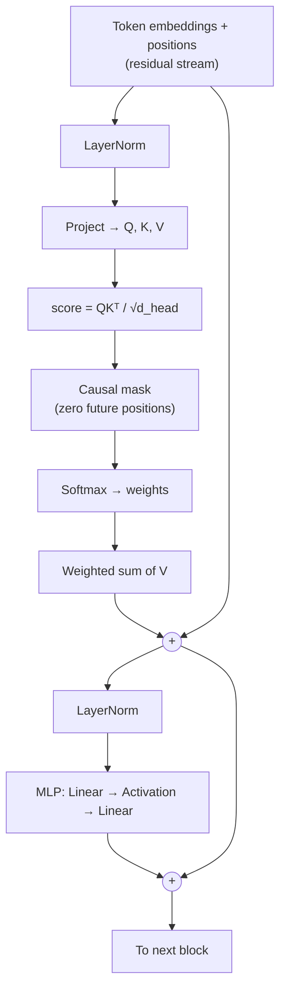
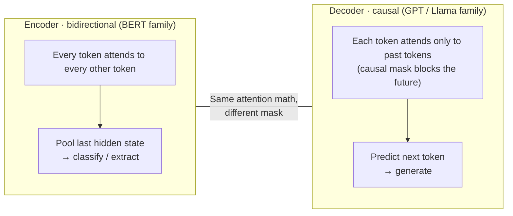

# Module 0.3 — The Transformer, Truly From the Ground Up

> **Preview pass.** This module builds the mental model. You will implement every piece of this in Phase 1. Read slowly — every term here has a corresponding function you'll write later.

---

## Learning Goal

By the end of this module you can:

1. Trace a single token through a full decoder forward pass and name every operation.
2. Explain the difference between encoder and decoder attention without looking at a diagram.
3. Define six vocabulary terms cold: token, embedding, attention head, residual stream, logits, context length.
4. Answer: *why does a decoder need a causal mask but an encoder doesn't?*

---

## The Big Picture: What a Transformer Does

A Transformer takes a sequence of tokens and either:

- **Encodes** them into rich vectors that capture meaning in context (encoder — BERT family), or
- **Predicts** what token comes next, one step at a time (decoder — GPT/Llama family).

DeskMate uses both:
- An **encoder SLM** reads a support ticket and extracts structured meaning (intent, priority).
- A **decoder SLM** generates the reply.

The machinery inside is the same; the difference is one masking decision.

---

## The Full Forward Pass (Decoder)

Walk through this left-to-right. We'll annotate each stage.

```
Raw text: "Fix the login bug"
    │
    ▼
┌─────────────────────────────┐
│  Step 1 · Tokenizer         │  "Fix" → 8505   "the" → 262   "login" → 11788   "bug" → 4036
│  text → integer IDs         │  Each word (or sub-word) becomes an integer from a fixed vocabulary.
└─────────────┬───────────────┘
              │
              ▼
┌─────────────────────────────┐
│  Step 2 · Token Embedding   │  ID 8505 → [0.12, -0.44, 0.87, ...]  (d_model floats, e.g. 512)
│  integers → dense vectors   │  A lookup table. Each ID maps to a learned row vector.
└─────────────┬───────────────┘
              │
              ▼
┌─────────────────────────────┐
│  Step 3 · Positional Signal │  Add (or rotate — RoPE) position info so the model knows
│  inject order               │  token 0 vs token 3. Without this, "dog bites man" = "man bites dog".
└─────────────┬───────────────┘
              │  Shape: [seq_len, d_model]  — this is the "residual stream"
              │
          ┌───┴────────────────────────────────────────────────────────┐
          │  Repeat N times (N = number of layers, e.g. 12 or 32)      │
          │                                                             │
          │  ┌──────────────────────────────────────────────────────┐  │
          │  │ Sub-layer A: Multi-Head Self-Attention               │  │
          │  │   1. LayerNorm(x)                                    │  │
          │  │   2. Project x → Q, K, V matrices                   │  │
          │  │   3. score(Q,K) = QKᵀ / √d_head   (scaled dot prod) │  │
          │  │   4. Causal mask: zero out future positions          │  │
          │  │   5. Softmax → attention weights                     │  │
          │  │   6. Weighted sum of V                               │  │
          │  │   7. x = x + output   (residual connection)         │  │
          │  └──────────────────────────────────────────────────────┘  │
          │                                                             │
          │  ┌──────────────────────────────────────────────────────┐  │
          │  │ Sub-layer B: Feed-Forward MLP                        │  │
          │  │   1. LayerNorm(x)                                    │  │
          │  │   2. Linear(x) → 4×d_model hidden                   │  │
          │  │   3. Activation (GELU or SwiGLU)                    │  │
          │  │   4. Linear back to d_model                          │  │
          │  │   5. x = x + output   (residual connection)         │  │
          │  └──────────────────────────────────────────────────────┘  │
          └───┬────────────────────────────────────────────────────────┘
              │
              ▼
┌─────────────────────────────┐
│  Final LayerNorm            │  Stabilise after last block.
└─────────────┬───────────────┘
              │
              ▼
┌─────────────────────────────┐
│  Linear projection          │  [seq_len, d_model] → [seq_len, vocab_size]
│  (the "language model head")│  One score per vocabulary word, per position. These are logits.
└─────────────┬───────────────┘
              │
              ▼
┌─────────────────────────────┐
│  Softmax                    │  Logits → probabilities. Sample or argmax → next token ID.
└─────────────────────────────┘
```

---

## Mermaid: One Decoder Block



The two `(+)` nodes are the **residual connections** — they add the block's output back to its input. This is why the stream is called "residual stream": the original signal flows straight through and each block *adds* a correction to it.

---

## Mermaid: Encoder vs Decoder



The entire difference between encoder and decoder attention is **one mask applied before the softmax**. The math — QKᵀ / √d — is identical.

---

## Glossary (6 Terms to Know Cold)

### Token
The atomic unit of text the model sees. Not a word — a subword piece from a fixed vocabulary (e.g., "running" might be ["run", "##ning"] in BERT). The tokenizer converts raw text into a list of integer IDs, each ID being a token.

### Embedding
A dense floating-point vector representation of a token (or a position, or a sentence). Before any context is processed, a token's embedding comes from a lookup table. After passing through all layers, the embedding at each position has been enriched with contextual meaning from neighbouring tokens. Shape: `[d_model]` per token, e.g. 512 or 768 floats.

### Attention Head
One parallel branch of the multi-head self-attention computation. Each head learns a different projection of Q, K, V — allowing the model to simultaneously attend to syntax, coreference, semantics, etc. Outputs from all heads are concatenated and projected back to `d_model`. If `d_model = 512` and `n_heads = 8`, each head operates in `d_head = 64` dimensions.

### Residual Stream
The sequence of vectors that flows straight from the input embedding through all N layers to the output. Each layer *adds* its output to the stream rather than replacing it. This prevents vanishing gradients and means each layer only needs to learn a *delta* — a small correction — rather than the full transformation from scratch. Think of it as the backbone that carries information, and each block writes corrections onto it.

### Logits
The raw unnormalized scores output by the language model head (the final linear projection), one score per vocabulary item per position. Before softmax, these are arbitrary real numbers. After softmax they become probabilities. The token with the highest logit (or a sampled draw from the distribution) becomes the predicted next token. Note: logits are also used in classifiers (encoder outputs projected to class labels).

### Context Length
The maximum number of tokens a model can attend to at once — its "working memory." If context length = 2048, the model can process at most 2048 tokens in one forward pass. Tokens beyond this limit are simply not visible. For DeskMate's support tickets this is usually fine; for very long conversations or documents it becomes a hard constraint. Context length is set during pretraining and cannot be extended without architectural changes or tricks like RoPE extension.

---

## Why Does a Decoder Need a Causal Mask?

During **training**, a decoder sees the full target sequence at once (teacher forcing). Without masking, position 3 could attend to position 5 — it would "cheat" by looking at the answer. The causal mask sets all upper-triangle attention scores to `-∞` before the softmax, making those weights collapse to zero. Position `i` can only attend to positions `0 … i`.

During **inference**, this mask is redundant because you only pass tokens up to the current step anyway. But the same code path runs.

An **encoder** has no generative objective — it is not predicting the next token. It reads a complete, known input and encodes meaning. It deliberately allows full bidirectional attention so every token can incorporate context from both directions, giving richer representations. Masking future tokens would throw away half the context for no benefit.

---

## Mental Model Check

Before moving to Module 0.4, try to answer these without notes:

1. A transformer decoder has 12 layers, `d_model = 768`, 12 heads, vocab size 50,257. After the language model head, what shape is the output tensor for a sequence of length 64?
   > Answer: `[64, 50257]` — one logit per vocab item, per position.

2. Why is the attention score divided by `√d_head`?
   > To prevent the dot product from growing large in magnitude as `d_head` grows, which would push the softmax into a saturated region with very peaked / near-one-hot distributions and very small gradients.

3. What is the purpose of the MLP sub-layer if attention already mixes information across tokens?
   > Attention mixes *which* tokens contribute. The MLP applies a non-linear transformation *within* each position independently — it's where the model stores and retrieves factual associations (key-value memories). Together: attention = routing, MLP = computation.

---

## Deliverable

Write — in your own words, without looking at this document — a glossary entry for each of the 6 terms above. Annotate the forward-pass diagram by writing one sentence next to each step explaining what problem it is solving. You do not need to write code yet; that happens in Phase 1.

---

## Checkpoint

> *Explain why a decoder uses a causal mask but an encoder doesn't.*

Strong answer covers: (1) decoders generate autoregressively so training must simulate that with masking; (2) encoders read complete input bidirectionally; (3) the underlying attention math is the same — it's purely a masking difference.

---

## What's Next

Module 0.4 — Tokenization deep dive. You'll train a BPE tokenizer on your own domain corpus and compare it to GPT-2's tokenizer. The goal: understand the invisible layer that shapes everything downstream.
