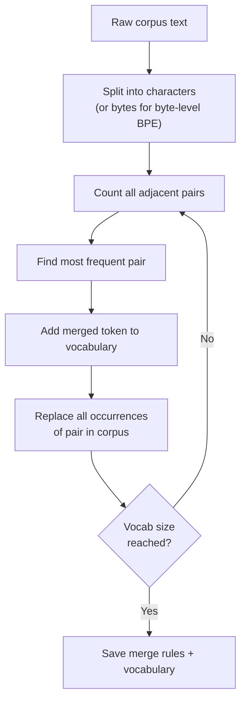
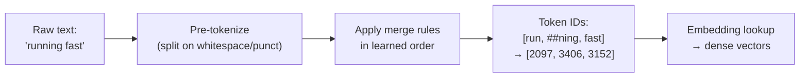

# Module 0.4 — Tokenization Deep Dive

> The layer everyone skips and then debugs in anger later. Every downstream decision — vocabulary size, context budget, cost per API call, unknown word handling, multilingual coverage — traces back to tokenization choices made before training began.

---

## Learning Goal

By the end of this module you can:

1. Explain the tradeoff between character, word, and subword tokenization.
2. Describe how BPE, WordPiece, and SentencePiece/Unigram differ in their merge strategy.
3. Explain why the tokenizer must match the model exactly.
4. Train a BPE tokenizer on a domain corpus and compare its token counts against GPT-2's tokenizer.
5. Answer: *why can the same sentence cost very different token counts across models?*

---

## Why Tokenization Matters More Than You Think

Tokenization is the bridge between raw text and the integer IDs the model operates on. It is learned (or designed) before model training and frozen. Every subsequent decision flows from it:

| Decision | Driven by tokenization |
|---|---|
| Vocabulary size `V` | Bigger vocab = fewer tokens, larger embedding table |
| Context budget | "2048 tokens" doesn't mean "2048 words" — it depends on the tokenizer |
| API cost | You pay per token, not per character |
| Unknown words | Rare words split into smaller pieces vs. become `<unk>` |
| Multilingual | BPE on Unicode bytes handles any script; word-level doesn't |
| Downstream accuracy | A model trained with one tokenizer is blind to text processed with another |

---

## Three Approaches: Character, Word, Subword

### Character-level

Split text into individual characters. `"Hello"` → `['H', 'e', 'l', 'l', 'o']`.

**Pro:** Vocabulary is tiny (≈100 symbols). No unknown words ever.  
**Con:** Sequences become very long. Every word must be composed from scratch. The model must spend representational capacity on spelling before it can think about meaning.

### Word-level

Split on whitespace and punctuation. `"running"` → `['running']`.

**Pro:** Each token maps to a meaningful unit; sequences are short.  
**Con:** Vocabulary explodes (100k+). Rare words, misspellings, and out-of-vocabulary items become `<unk>`, discarding information. "run", "runs", "running", "runner" are four unrelated IDs.

### Subword (the modern consensus)

Decompose words into frequent sub-pieces. `"running"` might become `['run', '##ning']` (BERT) or `['running']` if common enough (GPT-2 after training on large corpora). Rare words split into smaller pieces; common words stay whole.

**Pro:** Fixed, manageable vocabulary (8k–50k). No `<unk>`. Morphological relationships preserved (run → run + ##ning).  
**Con:** The split is arbitrary and corpus-dependent. "tokenization" in a general corpus splits differently than in a medical corpus.

---

## Subword Algorithms Compared

### Byte-Pair Encoding (BPE)

Used by GPT-2, GPT-3/4, LLaMA, Mistral, RoBERTa.

**Training procedure:**
1. Start with a vocabulary of individual characters (or UTF-8 bytes for Byte-level BPE).
2. Count all adjacent pairs in the corpus.
3. Merge the most frequent pair into a new token.
4. Repeat until vocabulary reaches the target size.

**Inference:** Greedily apply the learned merge rules in order.

**Key property:** Merges are deterministic; the same string always tokenizes the same way.

```
Corpus: "low lower lowest"
Initial: l o w   l o w e r   l o w e s t
Step 1: merge (l, o) → lo:  lo w  lo w e r  lo w e s t
Step 2: merge (lo, w) → low: low  low e r  low e s t
Step 3: merge (e, r) → er:  low  low er  low e s t
...
```

### WordPiece

Used by BERT, DistilBERT, MiniLM.

Like BPE but merges the pair that maximises the likelihood of the training corpus (rather than raw frequency). Subword tokens are prefixed with `##` when they are not the start of a word.

`"tokenization"` → `['token', '##ization']`

### SentencePiece / Unigram

Used by T5, mT5, XLNet, LLaMA (v1 used SentencePiece BPE).

**Unigram language model:** Start with a large vocabulary and iteratively *remove* tokens that reduce training loss the least, until the target size is reached. The result is a probabilistic model — the same string can tokenize differently (but at inference the most likely segmentation is used).

**SentencePiece** is the library (by Google) that implements both BPE and Unigram. It treats text as a raw character stream (no pre-tokenization on whitespace), making it language-agnostic. Spaces are represented as `▁`.

`"Hello world"` → `['▁Hello', '▁world']`

---

## Special Tokens

Every tokenizer reserves IDs for tokens that control model behaviour rather than representing text:

| Token | Meaning | Used in |
|---|---|---|
| `<pad>` / `[PAD]` | Pad sequences to equal length in a batch | Encoder and decoder |
| `<bos>` / `[CLS]` | Beginning of sequence | Decoder (generation start); Encoder (pooling anchor) |
| `<eos>` / `[SEP]` | End of sequence; separator | Decoder (stop signal); Encoder (segment boundary) |
| `<unk>` | Unknown token (rare in subword models) | Fallback for out-of-vocabulary |
| `<mask>` / `[MASK]` | Masked position during MLM training | BERT-style encoder pretraining |

**DeskMate note:** When fine-tuning a decoder for reply generation you must set `eos_token_id` correctly — the model generates until it produces this token. Using the wrong token ID means the model either stops too early or never stops.

---

## Chat Templates

Modern instruction-tuned decoders wrap user and assistant turns in a structured format so the model knows which text is the instruction and which is the completion. This format is part of the tokenizer configuration.

**Llama 3 example:**
```
<|begin_of_text|><|start_header_id|>system<|end_header_id|>
You are a helpful support agent.<|eot_id|>
<|start_header_id|>user<|end_header_id|>
I can't log in.<|eot_id|>
<|start_header_id|>assistant<|end_header_id|>
```

**Why this matters:** If you fine-tune without applying the chat template, or apply the wrong template at inference, the model produces garbage or refuses to follow instructions. The template is part of the model's learned behaviour, not just formatting.

HuggingFace tokenizers expose `tokenizer.apply_chat_template(messages)` to handle this automatically.

---

## The Tokenizer Must Match the Model

This is the single most common source of silent, hard-to-diagnose errors.

- A tokenizer trained on a general corpus maps `"dysarthria"` to 4–6 tokens; one trained on medical text might keep it whole.
- The model's embedding table has exactly `vocab_size` rows. If you swap tokenizers, token ID 5000 no longer refers to the same string.
- If you train on tokenizer A and infer with tokenizer B, every token is semantically misaligned. The model has no way to signal this — it will produce confident but meaningless output.

**Rule:** Always load the tokenizer from the same checkpoint as the model:
```python
from transformers import AutoTokenizer, AutoModel
tok = AutoTokenizer.from_pretrained("bert-base-uncased")
model = AutoModel.from_pretrained("bert-base-uncased")
```

---

## Token Count = Cost = Context Budget

The same sentence produces different token counts in different tokenizers because they made different merge decisions on different corpora.

```
"The patient presented with acute dysarthria and dysphagia."

GPT-2 tokenizer (general):   13 tokens
Clinical BPE (domain-tuned):  9 tokens
```

Domain tokenizers are more efficient on domain text because they learned that `"dysarthria"` is frequent enough to keep whole, while GPT-2's tokenizer (trained on WebText) splits it into pieces.

**Implications for DeskMate:**
- Shorter sequences → more tickets fit in context → cheaper RAG retrieval.
- A domain tokenizer for support-desk language would cut token counts by 10–20% on average.
- For now we use `bert-base-uncased` / `distilgpt2` tokenizers. If latency becomes a constraint, a domain tokenizer is a high-ROI improvement.

---

## Mermaid: BPE Training Loop



---

## Mermaid: Tokenization at Inference



---

## Notebook: What You'll Build (01_tokenization.ipynb)

The notebook has five steps:

1. **Install & setup** — `tokenizers` library, seed, detect runtime.
2. **Explore GPT-2's tokenizer** — encode sample support-desk sentences, visualise token boundaries, count tokens per sentence.
3. **Create a domain mini-corpus** — 100 synthetic support-desk sentences (no external data needed to run this on free Colab).
4. **Train a Byte-level BPE tokenizer** — vocab size 3000 (small so training is instant), save vocab + merges to `models/tokenizer/`.
5. **Compare: GPT-2 vs domain BPE** — table of token counts for 10 sentences; bar chart; average tokens per sentence; key observations.

---

## Deliverable

- `models/tokenizer/` — trained tokenizer (vocab.json + merges.txt).
- Notebook run end-to-end with comparison table and bar chart visible.

---

## Checkpoint

> *Why can the same sentence cost very different token counts across models?*

Strong answer: Each tokenizer runs BPE (or Unigram) merges learned from a **different corpus**. Tokens that are frequent in training get their own ID and count as 1 token. The same string may be a single token in one vocabulary and split into 4 pieces in another. Merge decisions diverge based on training corpus frequency distributions — a tokenizer trained on code is efficient for code but verbose for medical text, and vice versa.

---

## What's Next

Phase 1 begins. Module 1.1 — Data, batching, and the training loop. You'll take raw text, convert it to token IDs, write the batching logic, and implement the training loop around the simplest possible model (bigram). The tokenizer you trained here is the first input to that pipeline.
