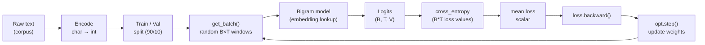
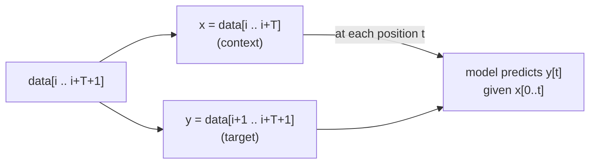

# Module 1.1 — Data, Batching, and the Training Loop (Bigram Baseline)

> The skeleton every training run shares. Learn it here on the simplest possible model so you never have to learn it again while also debugging a novel architecture.

---

## Learning Goal

By the end of this module you can:

1. Convert raw text into a tensor of token IDs ready for a language model.
2. Implement a train/validation split and explain why the order matters.
3. Write `get_batch` — random context/target pair sampling — and explain the shift-by-one convention.
4. Implement the cross-entropy loss for next-token prediction and connect it to perplexity.
5. Run the canonical `forward → loss → backward → step` optimization loop.
6. Estimate loss on a held-out set without leaking gradients.
7. Answer: *what exactly is the model predicting at each position, and what is the loss measuring?*

---

## The Data Pipeline

### Raw Text → Token IDs

Every language model operates on integers, not characters. The tokenizer converts raw text into a flat 1-D tensor of IDs.

```
raw text:  "Fix the bug"
token IDs: [8505, 262, 4936]   (GPT-2 tokenizer, for example)
```

For the bigram baseline we use **character-level tokenization** (no library needed): build a vocabulary of all unique characters in the corpus, assign each an integer, and encode the whole corpus as a 1-D LongTensor.

```python
chars = sorted(set(text))       # e.g. ['\n', ' ', '!', ..., 'z']
V = len(chars)                  # vocabulary size
stoi = {c: i for i, c in enumerate(chars)}
itos = {i: c for i, c in enumerate(chars)}
encode = lambda s: [stoi[c] for c in s]
decode = lambda ids: "".join(itos[i] for i in ids)

data = torch.tensor(encode(text), dtype=torch.long)
```

### Train / Validation Split

We split **by position in the corpus**, not by shuffling. Shuffling would leak future context into the training set.

```
data = [ ... 90% train ... | ... 10% val ... ]
                            ^
                        split point
```

```python
n = int(0.9 * len(data))
train_data = data[:n]
val_data   = data[n:]
```

### Context and Target: The Shift-by-One Convention

A language model learns: "given these tokens, predict the next one." For a context window of length `T`, a single training example is a pair:

```
x = data[i   : i+T]      # context  — tokens 0..T-1
y = data[i+1 : i+T+1]    # target   — tokens 1..T
```

Every position `t` in `x` predicts the corresponding position `t` in `y`. This means one sequence of length `T` yields `T` training signal pairs — very efficient.

```
x: [F, i, x, ' ', t, h, e]
y: [i, x, ' ', t, h, e, ' ']

At position 0: given [F]            → predict 'i'
At position 1: given [F, i]         → predict 'x'
At position 2: given [F, i, x]      → predict ' '
...
```

### Batching: `get_batch`

We sample `B` random starting positions in the corpus and stack the resulting sequences.

```python
def get_batch(split, B=32, T=64):
    data = train_data if split == "train" else val_data
    ix = torch.randint(len(data) - T, (B,))   # B random start indices
    x  = torch.stack([data[i   : i+T  ] for i in ix])  # (B, T)
    y  = torch.stack([data[i+1 : i+T+1] for i in ix])  # (B, T)
    return x.to(device), y.to(device)
```

Shape summary: `x` and `y` are both `(B, T)` LongTensors where `B` = batch size, `T` = context length.

---

## The Model: Bigram Language Model

The bigram model is the smallest possible language model: it ignores all history and predicts the next token from the current token alone using a single embedding (lookup) table.

```
logits = embedding_table[x]     # shape (B, T, V)
```

Each row of the table is a learned score vector over the vocabulary. No attention, no MLP, no positional signal — just a matrix.

Why start here? Because it isolates the training loop from the model. Once you trust the loop, Phase 1 modules replace this model with progressively richer architectures.

---

## The Loss: Cross-Entropy for Next-Token Prediction

### What the model predicts

At every position `t` in every batch element `b`, the model outputs a vector of `V` raw scores (logits) — one per vocabulary token. After softmax these become a probability distribution over what the next token might be.

### What the loss measures

Cross-entropy penalises the model for assigning low probability to the correct next token:

```
loss = -log P(correct_next_token)
```

If the model were random (uniform over V), loss = log(V). If perfect, loss = 0. We average over all `B × T` positions.

In code, PyTorch's `F.cross_entropy` takes unnormalized logits and integer targets — no manual softmax needed:

```python
# logits: (B, T, V)   targets: (B, T)
loss = F.cross_entropy(
    logits.view(-1, V),   # → (B*T, V)
    y.view(-1),           # → (B*T,)
)
```

### Perplexity

Perplexity = `exp(loss)`. A perplexity of `V` means the model is as uncertain as a random coin. Lower is better. For a character-level model on English text, well-trained models reach perplexity ≈ 2–4.

---

## The Training Loop

```python
for step in range(max_steps):
    # 1. Sample a batch
    xb, yb = get_batch("train")

    # 2. Forward pass
    logits = model(xb)           # (B, T, V)
    loss = F.cross_entropy(logits.view(-1, V), yb.view(-1))

    # 3. Backward pass
    opt.zero_grad(set_to_none=True)
    loss.backward()

    # 4. Parameter update
    opt.step()

    if step % eval_interval == 0:
        print(f"step {step:5d}  train loss {loss.item():.4f}")
```

**`zero_grad(set_to_none=True)`** — sets gradient buffers to `None` instead of zero. Avoids a memory write; marginally faster. Always do this.

**`loss.backward()`** — computes `∂loss/∂θ` for every learnable parameter via autograd.

**`opt.step()`** — nudges each parameter in the direction that decreases loss by `lr × gradient`.

---

## Estimating Loss Without Leaking Gradients

During evaluation we must not accumulate gradients — it wastes memory and time.

```python
@torch.no_grad()
def estimate_loss(eval_iters=100):
    model.eval()
    out = {}
    for split in ("train", "val"):
        losses = torch.zeros(eval_iters)
        for k in range(eval_iters):
            xb, yb = get_batch(split)
            logits = model(xb)
            losses[k] = F.cross_entropy(logits.view(-1, V), yb.view(-1))
        out[split] = losses.mean().item()
    model.train()
    return out
```

Key points:
- `@torch.no_grad()` disables gradient tracking for the entire function.
- `model.eval()` / `model.train()` toggles dropout and BatchNorm behaviour (not used yet, but habit matters).
- We average over `eval_iters` batches to reduce noise in the estimate.

---

## Mermaid: Full Data → Loss Flow



---

## Mermaid: The Shift-by-One Convention



---

## Notebook: What You'll Build (02_bigram.ipynb)

The notebook has six steps:

1. **Setup** — install, seed, detect runtime, set paths.
2. **Corpus** — download a small public domain text (Tiny Shakespeare via raw URL, ~1 MB), load and inspect.
3. **Character tokenizer** — build vocab, encode full corpus, split train/val.
4. **`get_batch`** — implement and test batch sampling, inspect shapes.
5. **Bigram model** — implement `BigramLM` (`nn.Embedding` table), implement `generate`.
6. **Training loop** — train for 5000 steps, plot loss curve, generate sample text before and after training.

---

## Deliverable

- Notebook run end-to-end with:
  - `train loss` and `val loss` converging (val loss should be lower than the initial random baseline).
  - A loss curve plot (step vs loss, train and val).
  - Generated text before training (random noise) and after training (recognisable character patterns).

---

## Checkpoint

> *What exactly is the model predicting at each position, and what is the loss measuring?*

Strong answer:
- At position `t`, the model sees `x[0..t]` (or in the bigram case, just `x[t]`) and predicts a probability distribution over all `V` vocabulary tokens for what comes next (i.e., `y[t] = x[t+1]`).
- Cross-entropy measures the negative log-probability assigned to the correct next token, averaged over all `B × T` positions. If the model is confident and correct, loss is low. If it is confident and wrong, loss is high.
- Minimising this loss = maximising the likelihood of the training data under the model.

---

## What's Next

Module 1.2 — Self-attention, by hand. You replace the bigram's "ignore all history" with a real attention mechanism: each token queries all past tokens, builds a weighted context vector, and uses that to predict the next token. The training loop from this module does not change — only the model does.
