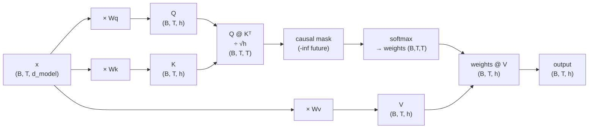

# Module 1.2 — Self-Attention, By Hand

> The single most important operation in modern AI. Implement it from the raw matrix multiply up — no `nn.MultiheadAttention`, no library wrapper. Once you've written every line yourself, attention is never a black box again.

---

## Learning Goal

By the end of this module you can:

1. Explain what queries, keys, and values are and why there are three separate projections.
2. Derive scaled dot-product attention from first principles.
3. Implement a causal `Head` module in PyTorch with no library helpers.
4. Visualise an attention matrix as a heatmap and interpret what it shows.
5. Answer: *remove the causal mask — what breaks, and why?*

---

## The Core Idea: Attention as Soft Lookup

A standard lookup table is hard: you give it a key, it returns exactly one value.  
Attention is a **soft lookup**: you give it a query, it measures similarity against all keys, and returns a *weighted blend* of all values.

```
Hard lookup  :  key == query  →  value
Soft lookup  :  similarity(query, keyᵢ) for all i  →  Σ weightᵢ · valueᵢ
```

Applied to sequences: each token gets to "look at" every other token, weighted by relevance. The result is a new representation for each token that incorporates context from the sequence.

---

## Queries, Keys, and Values

Given an input `x` of shape `(B, T, d_model)`, a single attention head projects each token into three separate spaces:

```
Q = x · Wq    (B, T, d_head)   — "what am I looking for?"
K = x · Wk    (B, T, d_head)   — "what do I contain?"
V = x · Wv    (B, T, d_head)   — "what do I offer if selected?"
```

`Wq`, `Wk`, `Wv` are learned linear projections (no bias needed). Each is `(d_model, d_head)`.

**Why three separate projections, not one?**  
Q and K live in a "comparison space" — they need to be comparable to each other via dot product. V lives in a "content space" — it is what gets mixed and passed forward. Separating them lets the model learn to *search* differently from how it *stores*. Tying Q=K=V would force the comparison criterion and the content to be identical, which is too restrictive.

---

## Scaled Dot-Product Attention

### Step 1 — Raw scores

```
scores = Q @ Kᵀ          # (B, T, T)
```

`scores[b, i, j]` = how much token `i` should attend to token `j` in batch item `b`. Higher score = more relevant.

### Step 2 — Scale

```
scores = scores * d_head**-0.5    # divide by √d_head
```

**Why scale?** The dot product grows with `d_head`. For large `d_head`, scores become large in magnitude, which pushes the softmax into a saturated regime where gradients nearly vanish. Dividing by `√d_head` keeps scores in a healthy range regardless of head dimension.

Intuition: if Q and K have unit-variance components, their dot product has variance `d_head`. Dividing by `√d_head` restores unit variance.

### Step 3 — Causal mask

For a decoder (language model), token `i` must not attend to any token `j > i` — that would be looking at the future during training, giving the model the answer it's supposed to predict.

```python
tril = torch.tril(torch.ones(T, T))   # lower-triangular matrix
scores = scores.masked_fill(tril == 0, float('-inf'))
```

Setting masked positions to `-inf` means `softmax(-inf) = 0` — those attention weights collapse to exactly zero.

After masking, `scores[b, i, :]` has valid values only for positions `0..i` and `-inf` for positions `i+1..T-1`.

### Step 4 — Softmax

```
weights = softmax(scores, dim=-1)     # (B, T, T)
```

Each row of `weights` sums to 1.0. `weights[b, i, j]` is the fraction of attention token `i` pays to token `j`.

### Step 5 — Weighted sum

```
out = weights @ V                     # (B, T, d_head)
```

Each output token is a weighted mixture of all value vectors, according to how relevant each source token was.

### Full formula (compact)

```
Attention(Q, K, V) = softmax( Q Kᵀ / √d_head  ⊙  causal_mask ) · V
```

---

## Mermaid: Single Attention Head



---

## PyTorch Implementation

```python
class Head(nn.Module):
    """Single causal self-attention head."""

    def __init__(self, d_model: int, d_head: int, block_size: int, dropout: float = 0.0):
        super().__init__()
        self.d_head = d_head
        self.q = nn.Linear(d_model, d_head, bias=False)
        self.k = nn.Linear(d_model, d_head, bias=False)
        self.v = nn.Linear(d_model, d_head, bias=False)
        self.drop = nn.Dropout(dropout)
        # Register as buffer so it moves to GPU with .to(device) but is not a parameter
        self.register_buffer("tril", torch.tril(torch.ones(block_size, block_size)))

    def forward(self, x):
        B, T, _ = x.shape
        q = self.q(x)                                      # (B, T, h)
        k = self.k(x)                                      # (B, T, h)
        v = self.v(x)                                      # (B, T, h)
        scores = q @ k.transpose(-2, -1) * self.d_head**-0.5   # (B, T, T)
        scores = scores.masked_fill(self.tril[:T, :T] == 0, float("-inf"))
        weights = scores.softmax(dim=-1)                   # (B, T, T)
        weights = self.drop(weights)
        return weights @ v                                 # (B, T, h)
```

Key details:
- `bias=False` on Q, K, V linear layers — convention; the bias would add a constant to all attention scores equally, so it has no effect after softmax.
- `register_buffer` — the causal mask is not a learnable parameter but must live on the same device as the model. `register_buffer` handles this automatically.
- `tril[:T, :T]` — slices the mask to the actual sequence length (which may be shorter than `block_size` at the start of generation).

---

## Reading the Attention Heatmap

The attention weight matrix `weights[0]` is a `(T, T)` array where `weights[i, j]` is how much position `i` attended to position `j`. Visualising it as a heatmap reveals what the model has learned:

```
Position   0   1   2   3   4   5   6   7
    0    [1.0  0   0   0   0   0   0   0 ]   ← can only see itself
    1    [0.4 0.6  0   0   0   0   0   0 ]
    2    [0.1 0.3 0.6  0   0   0   0   0 ]
    3    [0.2 0.1 0.3 0.4  0   0   0   0 ]
    ...
```

The lower-triangular structure is the causal mask in action. After training, bright spots along rows reveal which past tokens a given position finds most relevant — e.g. a token that closes a parenthesis attending strongly to the matching open parenthesis.

---

## What Breaks Without the Causal Mask?

**Mechanistically:** Without the mask, the softmax runs over all `T` positions including future ones. During training this means the model can see `y[t]` while computing `logits[t]` — it cheats, trivially copies the next token, and achieves near-zero training loss while learning nothing useful.

**At inference:** The model was trained with information from the future always present. At inference time the future tokens don't exist yet. The distribution the model learned is conditioned on information it can't have, so generated output is incoherent.

**Gradient perspective:** With access to the future, the model never needs to learn the statistical structure of language. Its parameters end up encoding "copy the future" rather than "predict the future from the past." The causal mask forces the model to learn genuine conditional probabilities.

---

## Notebook: What You'll Build (03_self_attention.ipynb)

The notebook has five steps:

1. **Setup** — install, seed, device, paths, load the Tiny Shakespeare corpus from Module 1.1.
2. **Attention mechanics, step by step** — implement each of the five steps in isolation, print shapes at every stage, build intuition before wrapping in a class.
3. **`Head` class** — full implementation with `register_buffer`, `dropout`, and variable-length support.
4. **Drop into the training loop** — replace `BigramLM`'s embedding-only forward pass with an embedding + one `Head`, train for 3000 steps, compare loss to the bigram baseline.
5. **Attention heatmap** — extract `weights` from the forward pass and plot a heatmap for a sample sequence; interpret which positions attend to which.

---

## Deliverable

- `Head` module implemented and verified (shape assertions pass).
- Notebook run end-to-end with:
  - Val loss lower than the bigram baseline.
  - Attention heatmap showing the causal lower-triangular structure.

---

## Checkpoint

> *Remove the causal mask — what breaks, and why?*

Strong answer covers three angles:
1. **Training:** the model sees future tokens, trivially learns to copy them, achieves near-zero loss, learns nothing about language.
2. **Inference:** conditioned on future context that doesn't exist, so output is incoherent.
3. **Gradient:** without the mask, gradients teach "use the future" rather than "model the past" — the learned distribution is useless at generation time.

---

## What's Next

Module 1.3 — Multi-head attention, MLP, and the Block. You stack `n_heads` attention heads in parallel (each specialising in different relationships), add a position-wise MLP for per-token computation, and wrap everything in residual connections and LayerNorm. The result is one stackable `Block` — the unit you'll repeat N times in Module 1.4 to build the full nano-SLM.
