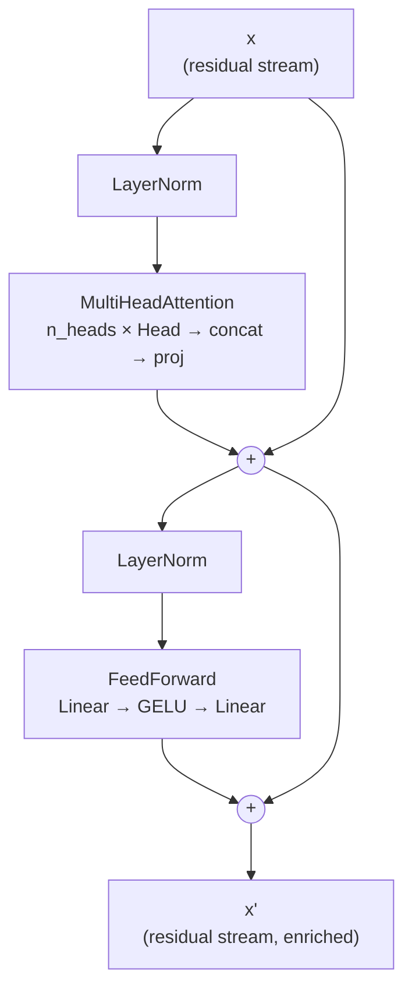
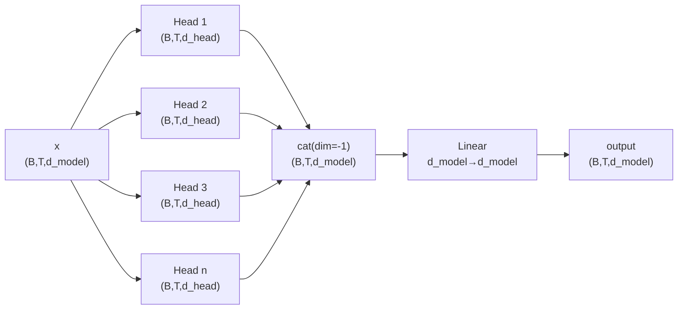

# Module 1.3 — Multi-Head Attention, MLP, and the Block

> A single attention head can only look for one kind of relationship at a time. Multiple heads in parallel each learn something different — syntax, coreference, positional proximity — and the MLP turns their combined signal into a non-linear transformation. Wrap both in residual connections and you have one stackable `Block`: the repeating unit of every transformer.

---

## Learning Goal

By the end of this module you can:

1. Explain why multiple heads outperform one wide head.
2. Implement `MultiHeadAttention` as `n_heads` parallel `Head` modules with output projection.
3. Implement the position-wise `FeedForward` MLP (expand → activate → contract).
4. Explain what residual connections buy you as depth grows.
5. Explain pre-norm vs post-norm and why pre-norm is preferred.
6. Assemble a single stackable `Block` that combines all of the above.
7. Answer: *what do residual connections buy you as depth grows?*

---

## Multi-Head Attention

### Why multiple heads?

A single attention head computes one set of Q, K, V projections and produces one weighted mixture of value vectors. It can represent one "relationship type" per layer.

Multiple heads run in parallel, each with its own learned `Wq`, `Wk`, `Wv`. They attend to different subspaces of the embedding simultaneously:

- Head 1 might learn: "attend to the grammatical subject"
- Head 2 might learn: "attend to the most recent verb"
- Head 3 might learn: "attend to the previous newline / sentence boundary"
- Head 4 might learn short-range positional proximity

None of this is programmed in — it emerges from gradient descent because different heads reduce loss via different signal types.

### Why not just one very wide head?

One head of dimension `d_model` with a single Q, K, V projection forces all relationships through one representational bottleneck. Empirically, `n_heads` narrower heads each of dimension `d_head = d_model // n_heads` consistently outperforms the single-wide-head alternative at the same parameter count. The parameter counts are identical — the difference is the inductive bias of parallel independent projections.

### Implementation

```
n_heads parallel Head modules → concatenate outputs → linear projection back to d_model
```

```python
class MultiHeadAttention(nn.Module):
    def __init__(self, d_model, n_heads, block_size, dropout=0.1):
        super().__init__()
        assert d_model % n_heads == 0
        d_head = d_model // n_heads
        self.heads = nn.ModuleList([
            Head(d_model, d_head, block_size, dropout) for _ in range(n_heads)
        ])
        self.proj  = nn.Linear(d_model, d_model)   # output projection
        self.drop  = nn.Dropout(dropout)

    def forward(self, x):
        # Each head: (B, T, d_head) — concatenate along last dim → (B, T, d_model)
        out = torch.cat([h(x) for h in self.heads], dim=-1)
        return self.drop(self.proj(out))
```

**The output projection** (`self.proj`) is a learned linear map from `d_model → d_model`. It mixes information across heads after concatenation. Without it, each head's output would remain independent — the projection is where they can interact.

---

## The Feed-Forward MLP

After attention mixes *which* tokens contribute to each position, the MLP applies a non-linear transformation *within* each position independently. It is the same MLP applied to every token in the sequence — "position-wise."

### Structure

```
x  →  Linear(d_model, 4*d_model)  →  GELU  →  Linear(4*d_model, d_model)
```

The `4×` expansion factor is a convention from the original transformer paper (Vaswani et al., 2017). It creates a bottleneck: compress to d_model → expand to 4×d_model → compress back. This gives the MLP capacity to store and retrieve factual associations.

**GELU vs ReLU:** GELU (Gaussian Error Linear Unit) is a smooth approximation of ReLU with non-zero gradients near 0, which empirically trains better for language models. Modern variants use SwiGLU (covered in Module 1.6).

```python
class FeedForward(nn.Module):
    def __init__(self, d_model, dropout=0.1):
        super().__init__()
        self.net = nn.Sequential(
            nn.Linear(d_model, 4 * d_model),
            nn.GELU(),
            nn.Linear(4 * d_model, d_model),
            nn.Dropout(dropout),
        )

    def forward(self, x):
        return self.net(x)
```

---

## Residual Connections

Every sub-layer (attention and MLP) is wrapped in a residual connection:

```
x = x + SubLayer(x)
```

The sub-layer adds a *correction* to the input rather than replacing it. This creates a direct gradient highway from the loss back to the earliest layers — gradients don't have to flow through N multiplicative transformations to reach layer 1.

### What residual connections buy you as depth grows

Without residuals, stacking N layers multiplies the Jacobians of each layer together. For N=12, a gradient shrinks or explodes exponentially. This is the *vanishing/exploding gradient* problem — the primary reason pre-residual deep networks were difficult to train.

With residuals, the gradient through layer `k` has a shortcut path:

```
∂loss/∂x_k  =  ∂loss/∂x_{k+1}  ×  (I + ∂SubLayer/∂x_k)
```

The identity term `I` ensures that even if `∂SubLayer/∂x_k` is tiny (vanishing) or huge (exploding), the gradient still has a magnitude-1 path back. This is why transformers can be stacked to depths of 12, 32, 80+ layers.

Empirically: without residuals, adding more layers hurts (the model can't learn to preserve information). With residuals, more layers almost always help (each layer adds a small correction; unhelpful layers learn near-zero corrections).

---

## LayerNorm: Pre-Norm vs Post-Norm

LayerNorm normalises each token's embedding vector to zero mean and unit variance, then applies learned scale and shift:

```python
ln = nn.LayerNorm(d_model)
# Normalises across the d_model dimension for each (b, t) position independently
```

### Post-norm (original "Attention is All You Need" paper)
```
x = LayerNorm(x + SubLayer(x))
```
LayerNorm is applied *after* the residual addition. This was the original formulation. It works but requires careful learning-rate warmup because the gradients near the output can be very large early in training.

### Pre-norm (modern default — what we use)
```
x = x + SubLayer(LayerNorm(x))
```
LayerNorm is applied *before* the sub-layer, to its input. The residual stream `x` flows through un-normalised. Pre-norm trains more stably without warmup, converges faster, and is the default in GPT-2 onwards and almost every modern SLM.

---

## The Full Block

```python
class Block(nn.Module):
    """One transformer block: pre-norm, multi-head attention + MLP, both with residuals."""

    def __init__(self, d_model, n_heads, block_size, dropout=0.1):
        super().__init__()
        self.ln1 = nn.LayerNorm(d_model)
        self.attn = MultiHeadAttention(d_model, n_heads, block_size, dropout)
        self.ln2 = nn.LayerNorm(d_model)
        self.ff   = FeedForward(d_model, dropout)

    def forward(self, x):
        x = x + self.attn(self.ln1(x))   # attention sub-layer with pre-norm + residual
        x = x + self.ff(self.ln2(x))     # MLP sub-layer with pre-norm + residual
        return x
```

Stack N of these and you have a transformer:

```python
blocks = nn.Sequential(*[Block(d_model, n_heads, block_size) for _ in range(n_layers)])
```

---

## Mermaid: One Block (Pre-Norm)



---

## Mermaid: Multi-Head Attention



---

## Parameter Count

For a single `Block` with `d_model=64`, `n_heads=4`, `d_head=16`:

| Component | Parameters |
|---|---|
| Q, K, V per head × 4 heads | `3 × (64×16) × 4 = 12,288` |
| Output projection | `64 × 64 = 4,096` |
| FeedForward (in + out) | `64×256 + 256×64 = 32,768` |
| LayerNorm × 2 | `2 × 2×64 = 256` |
| **Block total** | **≈ 49,408** |

With `n_layers=4` blocks: ≈197k parameters — small enough to train in minutes on free Colab.

---

## Notebook: What You'll Build (04_block.ipynb)

The notebook has four steps:

1. **Setup** — install, seed, device, load corpus, `get_batch` (same as previous modules).
2. **`MultiHeadAttention`** — implement, verify shape `(B, T, d_model)`, check that concatenated heads produce `d_model`-wide output.
3. **`FeedForward`** — implement, verify shape.
4. **`Block`** — combine MHA + FF with pre-norm and residuals; shape assertions; count parameters.
5. **Stack and train** — build `nn.Sequential` of 4 blocks, embed → blocks → final norm → LM head, train for 3000 steps, compare loss to Module 1.2 single-head baseline, generate sample text.

---

## Deliverable

- `MultiHeadAttention`, `FeedForward`, and `Block` classes with all shape assertions passing.
- Notebook run end-to-end with val loss below the Module 1.2 single-head baseline.
- Sample generated text visibly more coherent than Module 1.1's bigram output.

---

## Checkpoint

> *What do residual connections buy you as depth grows?*

Strong answer: Without residuals, stacking N layers multiplies Jacobians — gradients vanish or explode exponentially with depth. The residual `x = x + SubLayer(x)` adds an identity path: `∂loss/∂x_k = ∂loss/∂x_{k+1} × (I + ∂f/∂x_k)`. The `I` term ensures a magnitude-1 gradient highway exists no matter how deep the network is. Practically: residuals let you add depth without the model forgetting how to preserve information. Layers that aren't useful learn near-zero corrections and effectively become pass-throughs.

---

## What's Next

Module 1.4 — Assemble nano-SLM, train, and generate. You add proper token and positional embeddings, wire N blocks together into a full GPT-style model, implement temperature/top-k autoregressive generation, and run a full training session. The result is your first complete language model generating domain-flavoured text.
