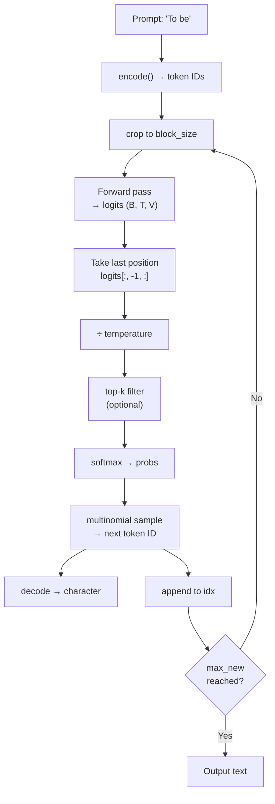

# Module 1.4 — Assemble nano-SLM, Train, and Generate

> All the pieces are built. This module wires them into a complete GPT-style language model, trains it properly with a tuned configuration, and implements the full autoregressive generation pipeline with temperature and top-k sampling. The result is your first working language model — something that can take a prompt and produce coherent text.

---

## Learning Goal

By the end of this module you can:

1. Assemble token embeddings, positional embeddings, N transformer blocks, final LayerNorm, and LM head into a complete model.
2. Explain the role of each component in the forward pass.
3. Implement autoregressive generation with temperature scaling and top-k filtering.
4. Interpret the effect of temperature and top-k on output diversity and coherence.
5. Answer: *explain the full path from a prompt string to the next generated token.*

---

## The Complete Architecture

```
Input IDs (B, T)
    │
    ├─ Token embedding table  (V, d_model)  → (B, T, d_model)
    ├─ Positional embedding   (T, d_model)  → (T, d_model)      ← learned, one per position
    └─ Sum → Dropout                         → (B, T, d_model)
         │
    ┌────┴────────────────────────────────────────┐
    │  Block 1  (MHA + FF + pre-norm + residuals) │
    │  Block 2                                    │  × n_layers
    │  ...                                        │
    │  Block N                                    │
    └────┬────────────────────────────────────────┘
         │
    LayerNorm (final)                              → (B, T, d_model)
         │
    Linear (d_model → V, no bias)                 → (B, T, V)
         │
    Logits — during training: cross-entropy loss
           — during inference: softmax → sample → next token ID
```

### Token Embedding

A learned lookup table `nn.Embedding(V, d_model)`. Row `i` is the vector representation of token ID `i`. These parameters absorb the model's "prior knowledge" of each token's meaning before any context is applied.

### Positional Embedding

A second learned lookup table `nn.Embedding(block_size, d_model)`. Row `t` encodes position `t`. The model adds this to the token embedding so that "the word 'bank' at position 5" is distinguishable from "the word 'bank' at position 50".

This is the **learned absolute positional encoding** used in GPT-2. Modern models replace it with RoPE (covered in Module 1.6) which generalises better to longer contexts.

### Why Sum, Not Concatenate?

Concatenating would double `d_model`, adding parameters. Summing keeps `d_model` constant and lets the model learn to disentangle token identity from position through the projection layers. Empirically, summing works as well as concatenating at this scale.

### Final LayerNorm

Applied after the last block, before the LM head. Stabilises the scale of the residual stream before the vocabulary projection. Without it, the LM head receives vectors of unpredictable magnitude, making learning unstable.

### LM Head (Language Model Head)

`nn.Linear(d_model, V, bias=False)` — projects the final hidden state at each position to a score over all `V` vocabulary tokens. These are the **logits**.

**Weight tying (optional but common):** the LM head's weight matrix can be tied to the transpose of the token embedding matrix. The argument: the token embedding learns "what does token X mean?" and the LM head scores "how likely is token X next?" — both should live in the same representation space. Tying reduces parameters by `V × d_model` (a significant saving when V is large). We tie weights here.

---

## Autoregressive Generation

At inference, the model generates one token at a time. Each new token is appended to the context and fed back as input for the next step.

```
prompt = "To be"
step 1: model([T, o, ' ', b, e]) → logits → sample → 'o'  → "To be o"
step 2: model([T, o, ' ', b, e, 'o']) → ... → "To be or"
step 3: ...
```

### Step-by-step

```python
for _ in range(max_new_tokens):
    # 1. Crop to block_size (model can't process longer sequences)
    idx_cond = idx[:, -block_size:]

    # 2. Forward pass — only the last position's logits matter
    logits = model(idx_cond)[:, -1, :]          # (B, V)

    # 3. Apply temperature
    logits = logits / temperature

    # 4. Optional top-k filter
    if top_k is not None:
        v, _ = torch.topk(logits, min(top_k, V))
        logits[logits < v[:, [-1]]] = float("-inf")

    # 5. Softmax → probability distribution
    probs = logits.softmax(dim=-1)

    # 6. Sample one token
    next_id = torch.multinomial(probs, num_samples=1)   # (B, 1)

    # 7. Append and repeat
    idx = torch.cat([idx, next_id], dim=1)
```

### Temperature

Temperature `τ` divides all logits before softmax:

```
probs = softmax(logits / τ)
```

- `τ = 1.0` — default, no change.
- `τ < 1.0` (e.g. 0.7) — sharpens the distribution. High-probability tokens become even more likely; low-probability tokens are suppressed. Output is more focused and repetitive.
- `τ > 1.0` (e.g. 1.5) — flattens the distribution. More tokens get meaningful probability. Output is more diverse and creative, but also more likely to be incoherent.

**DeskMate implication:** for support reply generation you want low temperature (focused, professional tone) rather than high temperature (creative but potentially hallucinating).

### Top-k Filtering

Before softmax, zero out all logits except the top-k highest. This prevents the model from sampling from the "long tail" of very unlikely tokens — words that technically have non-zero probability but would look bizarre in context.

```
k=1   → greedy decoding (always pick the most likely token — deterministic but repetitive)
k=20  → sample from top 20 tokens (good balance)
k=V   → no filtering (full distribution, equivalent to no top-k)
```

---

## Full Path from Prompt to Next Token

1. **Tokenize** the prompt string → list of integer IDs using `encode()`.
2. **Tensor** — wrap in a `(1, T)` LongTensor, move to device.
3. **Crop** — if longer than `block_size`, keep only the last `block_size` tokens.
4. **Token embeddings** — look up each ID in the embedding table → `(1, T, d_model)`.
5. **Positional embeddings** — look up positions 0..T-1 → `(T, d_model)` and add.
6. **Dropout** on the summed embeddings.
7. **N transformer blocks** — each applies pre-norm MHA (with causal mask) + pre-norm FF, both with residuals. Residual stream shape `(1, T, d_model)` is preserved.
8. **Final LayerNorm** — normalise the residual stream.
9. **LM head** — project `(1, T, d_model) → (1, T, V)` logits; take only `[:, -1, :]` → `(1, V)` (last position predicts the *next* token).
10. **Temperature** — divide logits by `τ`.
11. **Top-k** — zero out logits below the k-th largest.
12. **Softmax** → probability distribution over V tokens.
13. **Sample** with `torch.multinomial` → one integer ID.
14. **Decode** — look up in `itos` → one character/subword.
15. **Append** to `idx` and repeat from step 3.

---

## Mermaid: Autoregressive Generation Loop



---

## Training Configuration (Tuned)

Module 1.3 used small dimensions for speed. Here we use a larger configuration that still trains on free Colab in under 10 minutes:

| Hyperparameter | Module 1.3 | Module 1.4 |
|---|---|---|
| `d_model` | 64 | 128 |
| `n_heads` | 4 | 4 |
| `n_layers` | 4 | 6 |
| `block_size` | 64 | 128 |
| `dropout` | 0.1 | 0.2 |
| `max_steps` | 3,000 | 10,000 |
| `batch_size` | 32 | 32 |
| `lr` | 1e-3 | 3e-4 |
| **Parameters** | ~49k | ~550k |

The larger model reaches noticeably more coherent generation, closer to recognisable Shakespearean structure.

---

## Notebook: What You'll Build (05_nano_slm.ipynb)

1. **Setup** — install, seed, device, corpus, `get_batch`.
2. **Full model assembly** — `NanoSLM` class with weight tying; print parameter count breakdown by component.
3. **Training run** — 10,000 steps with cosine LR schedule, gradient clipping, loss curve (train + val).
4. **Generation suite** — sample at τ=1.0, τ=0.7/top-k=20, τ=0.5/top-k=10; compare outputs side-by-side.
5. **Save + load verification** — save config + state dict; reload from scratch and verify generation is identical.

---

## Deliverable

- Notebook run end-to-end with:
  - val loss < 1.6 (character-level; well-trained models reach ~1.4–1.5 on Tiny Shakespeare).
  - Loss curve saved.
  - Three generated samples at different temperature/top-k settings.
  - Checkpoint saved and reload verified.

---

## Checkpoint

> *Explain the full path from a prompt string to the next generated token.*

Strong answer traces all 15 steps above: tokenize → tensor → crop → token embed + pos embed → dropout → N blocks (each: pre-norm → MHA with causal mask → residual; pre-norm → FF → residual) → final norm → LM head → last position → temperature → top-k → softmax → multinomial sample → decode.

---

## What's Next

Module 1.5 — Why we stop here: scaling and the case for pretrained bases. You'll look at scaling law numbers and understand why a capable SLM from scratch is infeasible on free tier — and why standing on pretrained shoulders (Phase 2+) is the correct engineering choice.
