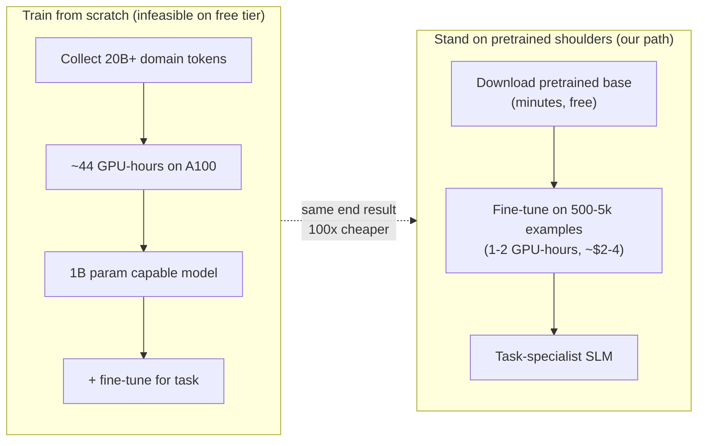

# Module 1.5 — Why We Stop Here: Scaling and the Case for Pretrained Bases

> You just trained a 550k-parameter model on 1 MB of text in 10 minutes. GPT-3 has 175 billion parameters, trained on 300 billion tokens, consuming ~3.1 × 10²³ FLOP. This module is about the gap between those two sentences — and why the right engineering response is not to close it from scratch, but to stand on shoulders.

---

## Learning Goal

By the end of this module you can:

1. State the three scaling-law axes (parameters, data, compute) and explain how they interact.
2. Describe what capabilities *emerge* with scale that cannot be achieved by simply training longer on the same data.
3. Calculate why pretraining a capable SLM from scratch is infeasible on free tier.
4. Explain the fine-tuning premise: a pretrained model has already learned language; your task is to redirect it.
5. Answer: *given a fixed compute budget, would you train bigger or longer on more data — and why is that the wrong question without data?*

---

## The Scaling Laws

In 2020, Kaplan et al. (OpenAI) showed that language model loss follows clean power laws across seven orders of magnitude in compute, parameters, and data:

```
L(N)  ≈  (N_c / N)^α_N        loss as a function of parameters (data unlimited)
L(D)  ≈  (D_c / D)^α_D        loss as a function of dataset tokens (params unlimited)
L(C)  ≈  (C_c / C)^α_C        loss as a function of compute FLOPs
```

Where `α_N ≈ 0.076`, `α_D ≈ 0.095`, `α_C ≈ 0.057`. These are empirical — they fit data from 10⁸ to 10²³ FLOPs remarkably well.

**What this means practically:** doubling the parameter count reduces loss by a fixed fraction (roughly 5%). Doubling the data reduces it by a slightly larger fraction (roughly 7%). Compute is the binding constraint — it buys you either bigger models or more data, but not both.

### The Chinchilla Correction (Hoffmann et al., 2022)

The Kaplan laws assumed data was unlimited (you could always train longer). Hoffmann et al. showed that for a *fixed compute budget*, the optimal allocation is:

```
N_opt ∝ C^0.5      (parameters)
D_opt ∝ C^0.5      (tokens)
```

Roughly: **model size and training tokens should scale equally.** A model undertrained on too little data wastes parameters. A model overtrained (many epochs over small data) hits diminishing returns.

Chinchilla (70B params, 1.4T tokens) outperformed GPT-3 (175B params, 300B tokens) trained on 1/5th the data — because GPT-3 was significantly undertrained given its parameter count.

**For DeskMate:** this means a 1–3B parameter model trained on *enough domain tokens* will outperform a 7B model trained on far fewer domain tokens. Quality of fine-tuning data matters more than raw model size at the scale we're operating.

---

## What Emerges With Scale

Not all capabilities scale smoothly. Some appear suddenly at threshold sizes — "emergent abilities":

| Capability | Approximate emergence threshold |
|---|---|
| In-context learning (few-shot) | ~1B parameters |
| Chain-of-thought reasoning | ~10B parameters |
| Instruction following (zero-shot) | ~1B + RLHF |
| Arithmetic (multi-step) | ~7B+ |
| Code generation (functional) | ~1B+ |

Your nano-SLM (550k params) cannot do any of these. It has learned character-level statistics of Shakespearean English — patterns of co-occurrence. It has not learned grammar, semantics, or reasoning.

**For DeskMate's encoder SLM:** the task is classification and extraction — no emergent reasoning needed. A 66M-parameter DistilBERT or 22M-parameter MiniLM, pretrained on general text, is strong enough to learn triage intent and priority with a few thousand examples.

**For DeskMate's decoder SLM:** the task is reply generation. Instruction following and professional tone emerge at ~1–3B parameters after SFT. This is exactly the range we target in Phase 3 (Phi-2 at 2.7B, Qwen2.5-1.5B, SmolLM2-1.7B).

---

## Why Pretraining From Scratch Is Infeasible

A back-of-envelope calculation:

### Compute required for a useful 1B-parameter model

Using Chinchilla's optimal ratio: `D_opt ≈ 20 × N` → 1B params needs ~20B tokens.

FLOPs per token for a forward + backward pass: `≈ 6 × N` (a widely-used approximation).

```
Total FLOPs = 6 × 1B × 20B = 1.2 × 10²⁰ FLOP
```

### Free-tier compute

A Colab T4 delivers ~65 TFLOP/s (FP16). Assuming 50% MFU (model FLOP utilisation — a generous estimate for a from-scratch implementation):

```
Effective FLOP/s = 65 × 10¹² × 0.5 = 3.25 × 10¹³ FLOP/s

Time = 1.2 × 10²⁰ / 3.25 × 10¹³ ≈ 3.7 × 10⁶ seconds ≈ 42 days
```

But Colab free tier gives you at most ~4 hours per session before disconnection. You would need ~10,000 sessions, each saving and resuming a checkpoint — and Colab does not guarantee availability.

### Cost on rented A100

An H100 delivers ~1,000 TFLOP/s at ~75% MFU:

```
Time = 1.2 × 10²⁰ / (10¹⁵ × 0.75) ≈ 160,000 seconds ≈ 44 hours
Cost at $3/hr ≈ $130
```

This is for one 1B-parameter run — without hyperparameter search, ablations, or the data pipeline to collect and clean 20B domain tokens.

**Conclusion:** from-scratch pretraining of a useful model is technically feasible on rented A100s but expensive and time-consuming. For the scope of this course (free tier + occasional rented GPU), we use **pretrained bases** and teach them new behaviour through fine-tuning.

---

## The Fine-Tuning Premise

A large pretrained model has already learned:

- Syntax and grammar of English (and many other languages).
- World knowledge absorbed from web text, books, and code.
- How to follow discourse structure (paragraphs, headings, lists).
- Statistical associations between concepts that enable few-shot generalisation.

Your fine-tuning job is not to teach it language — that's done. Your job is to **redirect it**: adjust its output distribution toward your task (support triage, professional reply tone, JSON extraction) using a small amount of high-quality domain examples.

```
Pretrained base model   →   Fine-tuned specialist
  (knows language)            (knows your task)
       +
  small domain dataset
  (500–5k examples)
       +
  1–2 GPU-hours
```

This is why the course pivots here. The nano-SLM you just built is the *educational foundation* — you now understand every computation that happens inside any transformer. The *production path* starts in Phase 2 with a pretrained encoder and Phase 3 with a pretrained decoder.

---

## Mermaid: Where Your Compute Goes



---

## The Wrong Question — and the Right One

> *Given a fixed compute budget, would you train bigger or longer on more data?*

**The wrong framing:** this question assumes data is free and abundant. In most domain-specific applications it is neither.

**Chinchilla's answer (when data is unlimited):** scale both equally — `N ∝ C^0.5`, `D ∝ C^0.5`. Neither dominates.

**The real question for DeskMate:** you have a fixed number of real support tickets (say, 100k). Your compute budget determines the maximum model you can fine-tune. Given *that* data ceiling:

- More parameters do not help if the model can already fit the data.
- More training steps on the same data risk overfitting.
- The correct lever is **data quality**: better labelling, better synthetic augmentation, better filtering — not raw scale.

This is the principle that drives Phase 2 (careful data labelling and synthetic augmentation) and Phase 3 (high-quality SFT data construction before any fine-tuning begins).

---

## Key Numbers to Remember

| Model | Params | Training tokens | Approx FLOPs |
|---|---|---|---|
| Your nano-SLM | 550k | ~1M (Tiny Shakespeare) | ~3 × 10¹² |
| GPT-2 small | 117M | 40B (WebText) | ~2.8 × 10¹⁹ |
| DistilBERT | 66M | 16B | ~6 × 10¹⁸ |
| Phi-2 | 2.7B | 1.4T (curated) | ~1.7 × 10²² |
| Llama 3.2 1B | 1B | 9T | ~5.4 × 10²² |
| GPT-3 | 175B | 300B | ~3.1 × 10²³ |

Your nano-SLM is roughly 10 orders of magnitude below GPT-3 in training compute. The gap is not bridgeable with free-tier resources — but fine-tuning a Phi-2 or Llama 1B is.

---

## Deliverable

This is a reading module — no code. Write a short analysis (½ page) answering:

1. What is the Chinchilla-optimal token count for a 1B-parameter model?
2. How many GPU-hours would it take to pretrain that model on a free T4?
3. Given a budget of $10 on rented A100s and a dataset of 100k support tickets (~5M tokens), what is the most sensible allocation: pretrain from scratch, DAPT an existing model, or jump straight to fine-tuning? Justify.

---

## Checkpoint

> *Given a fixed compute budget, would you train bigger or longer on more data — and why is that the wrong question without data?*

Strong answer:
- Chinchilla says: scale both equally when data is unlimited.
- When data is fixed (your real situation), the question becomes moot — you cannot train longer without overfitting, and more parameters do not help if data is the ceiling.
- The correct lever when data-constrained is data quality: better curation, better labels, better synthetic augmentation.
- For DeskMate: with 100k tickets and a $10 budget, fine-tuning beats both DAPT and from-scratch on every axis (cost, time, quality).

---

## What's Next

Module 1.6 — Modern architecture variants: what changed since GPT-2. You'll compare your nano-SLM's design choices against RoPE, GQA, SwiGLU, and Flash Attention — the four changes that define every modern SLM base model. This sets up the informed base-model selection in Phase 3.
