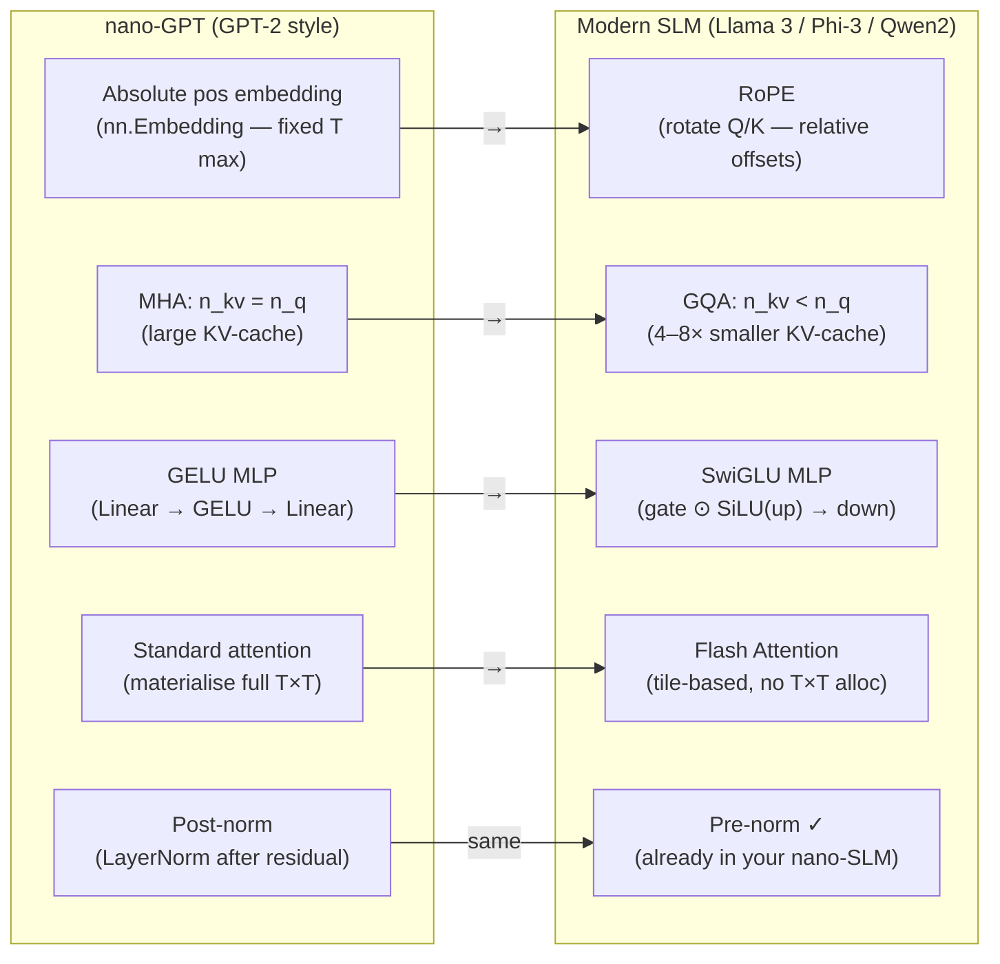

# Module 1.6 — Modern Architecture Variants: What Changed Since GPT-2

> Your nano-SLM is a faithful GPT-2 replica. Every modern SLM base you will fine-tune in Phase 3 — Llama, Phi, Qwen, SmolLM — differs from it in four specific ways. This module explains each change, why it was made, and what it means when you read a model card.

---

## Learning Goal

By the end of this module you can:

1. Explain RoPE and why it generalises to longer contexts better than learned absolute positions.
2. Explain SwiGLU and why it replaced GELU in modern MLP blocks.
3. Explain GQA/MQA and calculate the KV-cache memory reduction.
4. Explain Flash Attention at the algorithm level and why it matters for training and serving.
5. Fill in the comparison table for any model card you encounter.
6. Answer: *why does GQA reduce KV-cache memory, and why does that matter more for serving than for training?*

---

## Your nano-GPT vs Modern SLMs: The Four Deltas

| Component | nano-GPT (GPT-2 style) | Modern SLM (Llama / Phi / Qwen) | Why it changed |
|---|---|---|---|
| Positional encoding | Learned absolute (`nn.Embedding(T, d)`) | RoPE — rotary applied to Q/K | Generalises to longer contexts; no position embedding table |
| LayerNorm placement | Post-norm (after residual addition) | Pre-norm (before sub-layer) | Training stability at depth; no warmup needed |
| MLP activation | GELU | SwiGLU (gated) | Same quality, fewer parameters, faster |
| Attention K/V | 1 K/V head per Q head (MHA) | Shared K/V heads (GQA/MQA) | Dramatically smaller KV-cache at inference |
| Attention kernel | Standard (materialise full T×T matrix) | Flash Attention | 2–4× faster, far lower HBM memory |

Pre-norm was already adopted in your nano-SLM (Module 1.3). The other four are what remains to understand.

---

## 1. RoPE — Rotary Position Embedding

### The problem with learned absolute positions

Your nano-SLM has `self.pos_emb = nn.Embedding(block_size, d_model)`. Position 0 has a learned vector; position 127 has a learned vector. The model never sees position 128 — it is literally out of vocabulary for the position table.

To extend context during fine-tuning or inference you would need to interpolate or retrain the position embeddings.

### RoPE's solution

Instead of adding a position vector to the token embedding, RoPE **rotates Q and K vectors** by an angle proportional to position before the dot product:

```
q_m = R_m · q          (rotate query at position m)
k_n = R_n · k          (rotate key at position n)

score(m, n) = (R_m · q)ᵀ · (R_n · k)
            = qᵀ · R_m^T R_n · k
            = qᵀ · R_{m-n} · k      (rotation matrices commute this way)
```

The score depends only on the **relative offset** `m - n`, not on absolute positions. This is why RoPE generalises: the model learns "how to attend 5 positions back" rather than "how to attend to position 52." At inference you can extend the sequence beyond training length, and the model has seen the relative offsets before.

### In practice

RoPE is applied in 2-D pairs along the `d_head` dimension — each pair of dimensions gets its own rotation frequency (high frequency for nearby positions, low frequency for distant ones). This is the same idea as sinusoidal positional encoding but applied multiplicatively to Q and K rather than additively to the input.

```python
# Pseudocode — the real implementation rotates pairs of dims
cos, sin = get_rope_cos_sin(seq_len, d_head, device)
q_rotated = apply_rope(q, cos, sin)
k_rotated = apply_rope(k, cos, sin)
scores = q_rotated @ k_rotated.transpose(-2, -1) * d_head**-0.5
```

**Used by:** Llama 2/3, Qwen2, Phi-3, Mistral, SmolLM2.

---

## 2. SwiGLU — Gated MLP Activation

### Standard GELU MLP (your nano-SLM)

```
x → Linear(d, 4d) → GELU → Linear(4d, d)
```

Parameters: `d×4d + 4d×d = 8d²`.

### SwiGLU

```
gate = Linear(d, 8d/3)      ← "gate" projection
up   = Linear(d, 8d/3)      ← "up" projection
x → (gate ⊙ SiLU(up)) → Linear(8d/3, d)
```

Parameters: `3 × d×(8d/3) = 8d²` — identical count.

The element-wise product `gate ⊙ SiLU(up)` lets each neuron modulate its own activation via a learned gate. Empirically this reaches the same loss as GELU with the same parameter count, but with faster convergence and sometimes better final quality on downstream tasks.

**SiLU** (Sigmoid Linear Unit) = `x × sigmoid(x)` — smooth, non-zero gradient everywhere.

**Why 8d/3?** The standard 4× expansion uses `4d` hidden units. SwiGLU needs two projections of that hidden size, so `2 × h = 8d`, giving `h = 4d`. But implementations typically round to the nearest multiple of 64 or 256, and use `8d/3` to match the GELU MLP parameter count exactly.

**Used by:** Llama 2/3, Qwen2, Mistral, Phi-3.

---

## 3. GQA — Grouped Query Attention

### MHA (your nano-SLM): 1 K/V head per Q head

```
n_heads = 8
Q heads: 8    (one per attention head)
K heads: 8    (one per attention head)
V heads: 8    (one per attention head)
```

At inference, for each new token generated you must **cache** K and V for all past positions (the KV-cache). Memory = `2 × n_heads × T × d_head × bytes_per_element`.

For a 7B model (n_heads=32, d_head=128, FP16) with context T=4096:
```
KV-cache per token = 2 × 32 × 128 × 2 bytes = 16,384 bytes = 16 KB
Full context (4096 tokens) = 4096 × 16 KB = 64 MB per sequence
8 concurrent sequences = 512 MB — just for KV-cache
```

### MQA: Multi-Query Attention

All Q heads share **one** K head and one V head:

```
Q heads: 8
K heads: 1    (shared across all Q heads)
V heads: 1    (shared across all Q heads)
```

KV-cache drops by `n_heads × ` — 8× smaller. Quality drops slightly because all queries compete for a single set of keys/values.

### GQA: Grouped Query Attention (the compromise)

Q heads are split into `n_groups` groups; each group shares one K and one V head:

```
n_heads = 8,  n_groups = 2
Q heads: 8
K heads: 2    (group 1 uses K₁; group 2 uses K₂)
V heads: 2
```

KV-cache is `n_groups/n_heads × MHA`. With `n_groups=2`, 4× smaller. Quality closely matches MHA because groups still specialise.

### Why this matters more for serving than training

During **training**, all K and V values for the entire batch are computed in one forward pass and never cached — there is no KV-cache. Memory pressure comes from activations and gradients, not from KV storage.

During **serving** (autoregressive generation), each new token requires one forward pass and the KV-cache grows by one row per layer. Serving 100 concurrent users with 4096-token contexts on MHA consumes 100 × 512 MB = 50 GB of KV-cache alone — exceeding a single A100. With GQA (8 groups → 4×), that drops to 12.5 GB. GQA is what makes serving throughput tractable.

**Used by:** Llama 3 (n_kv_heads=8 vs n_heads=32 on the 8B model), Qwen2, Mistral.

---

## 4. Flash Attention

### The memory bottleneck in standard attention

Standard attention materialises the full `(B, n_heads, T, T)` score matrix in GPU HBM (high-bandwidth memory) before the softmax:

```
scores = Q @ Kᵀ / √d_head    # (B, H, T, T) — all in HBM
weights = softmax(scores)      # another (B, H, T, T) in HBM
out = weights @ V              # (B, H, T, d_head)
```

For T=4096, H=32, B=4, FP16:
```
(B, H, T, T) = 4 × 32 × 4096 × 4096 × 2 bytes = 4 GB just for the score matrix
```

This is the dominant memory cost at long context — not the model weights.

### Flash Attention's approach (Dao et al., 2022)

Flash Attention computes attention **in tiles that fit in SRAM** (the fast on-chip cache), never writing the full T×T matrix to HBM:

1. Split Q, K, V into blocks of size B_r × B_c that fit in SRAM.
2. For each Q-block, iterate over all K/V-blocks, accumulating the softmax-normalised output in a running sum.
3. Use the log-sum-exp trick to correctly normalise across blocks without materialising the full row.

The result is **mathematically identical** to standard attention — not approximate. But the I/O pattern is entirely different: instead of writing a 4 GB matrix to HBM and reading it back, you keep everything in SRAM and write only the final output.

**Effect:**
- 2–4× faster (fewer HBM reads/writes, which are the bottleneck on modern GPUs).
- 5–20× less HBM memory for the attention step.
- Enables much longer contexts (8k, 32k, 128k tokens) that standard attention cannot fit.

**In practice:** `F.scaled_dot_product_attention()` in PyTorch 2.0+ automatically uses Flash Attention when the inputs are on CUDA and the shapes are compatible. You get it for free by calling that function instead of the manual Q @ Kᵀ softmax pattern.

```python
# Standard (your nano-SLM) — materialises full T×T
scores  = q @ k.transpose(-2, -1) * d_head**-0.5
scores  = scores.masked_fill(mask == 0, float("-inf"))
weights = scores.softmax(-1)
out     = weights @ v

# Flash Attention (PyTorch 2.0+) — same result, far less memory
out = F.scaled_dot_product_attention(q, k, v, attn_mask=None, is_causal=True)
```

**Used by:** all modern training frameworks; enabled by default in `transformers >= 4.36` via `attn_implementation="flash_attention_2"`.

---

## Mermaid: nano-GPT vs Modern SLM



---

## Model Card Reading Guide

When you open a Hugging Face model card in Phase 3, look for:

```
"architectures": ["LlamaForCausalLM"]     → RoPE, GQA, SwiGLU, pre-norm
"num_attention_heads": 32
"num_key_value_heads": 8                  → GQA with 8 K/V groups
"hidden_size": 2048                       → d_model
"num_hidden_layers": 24                   → n_layers
"intermediate_size": 8192                 → MLP hidden dim (≈ 4× d_model or 8d/3 for SwiGLU)
"rope_theta": 500000                      → RoPE base frequency (higher = longer context)
"max_position_embeddings": 131072         → context length
```

The ratio `num_key_value_heads / num_attention_heads` tells you the GQA compression:
- `8/32 = 0.25` → KV-cache is 4× smaller than MHA
- `1/32 = 0.03` → MQA
- `32/32 = 1.0` → standard MHA (your nano-SLM)

---

## Deliverable

Fill in this comparison table using the model card of your Phase 3 candidate. We will confirm the candidate in Module 3.1 — for now, use **Qwen2.5-1.5B** as the default.

| Component | nano-SLM (yours) | Qwen2.5-1.5B | What the difference means in practice |
|---|---|---|---|
| Parameters | 550k | 1.54B | |
| Context length | 128 tokens | 32,768 tokens | |
| Positional encoding | Learned absolute | RoPE (θ=1,000,000) | |
| LayerNorm placement | Pre-norm ✓ | Pre-norm ✓ | |
| MLP activation | GELU | SwiGLU | |
| Q heads | 4 | 12 | |
| K/V heads | 4 (MHA) | 2 (GQA) | |
| d_model | 128 | 1,536 | |
| n_layers | 6 | 28 | |
| Training tokens | ~1M (Tiny Shakespeare) | 18T | |
| Flash Attention | No | Yes (FA2) | |

*(Fill in the "What the difference means" column yourself.)*

---

## Checkpoint

> *Why does GQA reduce KV-cache memory, and why does that matter more for serving than for training?*

Strong answer:
- **How:** In MHA, every Q head has its own K and V projection. GQA shares K/V across groups of Q heads. KV-cache size ∝ `n_kv_heads × T × d_head`. With `n_kv_heads = n_heads/4`, cache is 4× smaller.
- **Why serving, not training:** During training, the full batch forward pass computes all K/V values fresh — there is no caching. Memory pressure is from activations + gradients. During autoregressive inference, K/V for all past positions must be retained in GPU memory (one row per token per layer). With 100 concurrent users at 4096-token context on a 32-head MHA model, the KV-cache alone exceeds a single A100. GQA makes multi-user serving feasible.

---

## What's Next

Module 1.7 — Bridge: nano-GPT → pretrained bases; what DAPT is. You'll close the conceptual gap between "train from scratch" and "fine-tune a pretrained model," and understand when (and whether) domain-adaptive pretraining is worth doing before fine-tuning. After that, Phase 1 is complete and Phase 2 begins.
