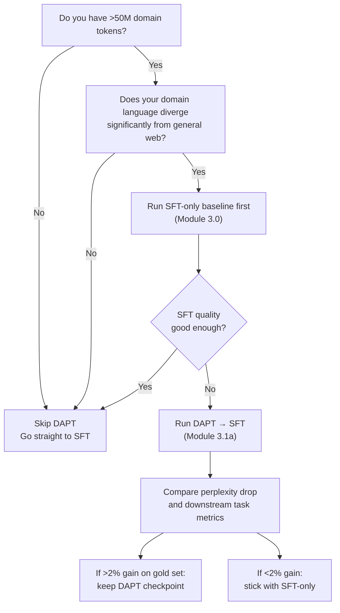

# Module 1.7 — Bridge: nano-GPT → Pretrained Bases; What DAPT Is

> This module closes Phase 1. You have built a transformer from scratch and understand every operation inside it. Now we map that understanding onto the pretrained models you will fine-tune in Phases 2–9 — and introduce the one technique that sits between pretraining and fine-tuning: Domain-Adaptive Pretraining.

---

## Learning Goal

By the end of this module you can:

1. Articulate precisely what a pretrained base model has learned and what it has not.
2. Explain the three-stage pipeline: pretrain → DAPT (optional) → SFT.
3. State the three criteria that make DAPT worth doing.
4. Apply those criteria to DeskMate and write a justified decision.
5. Answer: *DAPT and SFT both train on domain text — what is fundamentally different about their objectives and the data they require?*

---

## What a Pretrained Base Has Already Learned

When you download `Qwen2.5-1.5B` or `microsoft/phi-2`, you are getting a model that has processed roughly 7–18 trillion tokens of text. That training run cost millions of dollars and months of GPU time. What did it buy?

### Linguistic competence
- Grammar of English (and dozens of other languages): subject-verb agreement, pronoun resolution, clause boundaries.
- Morphology: "run", "runs", "running", "runner" are related — the model does not see them as four unrelated tokens.
- Discourse structure: paragraphs, headings, bulleted lists, dialogue turns.

### World knowledge
- Factual associations: capitals, company founders, scientific facts, historical events — absorbed from web text and books.
- Commonsense reasoning: "if X then likely Y" statistical associations that enable few-shot generalisation.
- Code and structured formats: JSON, markdown, SQL — seen extensively in training data.

### What it has NOT learned
- Your product names, version strings, and error codes.
- The tone and vocabulary of support-desk English specifically.
- Your intent taxonomy (what "account access" means vs "billing dispute").
- That "P1" means urgent in your company's priority scheme.
- How to reliably produce a JSON object with exactly the fields you need.

Fine-tuning teaches the last set. The first set is already there — you are not teaching it English from scratch.

---

## The Three-Stage Pipeline

```
Stage 1: Pretraining          Stage 2: DAPT (optional)         Stage 3: SFT
──────────────────────        ─────────────────────────        ──────────────────────
Objective: next-token         Objective: next-token            Objective: next-token
           prediction                    prediction                       prediction
                                                                          (on completions
Data: trillions of            Data: tens of millions                      only — loss mask)
      general tokens                of domain tokens
                                                               Data: hundreds to thousands
Model: randomly               Model: pretrained base                 of (prompt, response)
       initialised                                                   pairs

Cost: millions $              Cost: $5–50 (rented GPU)         Cost: $1–10 (free tier
                              per run                                or small rented GPU)

Result: capable base          Result: domain-shifted            Result: task specialist
        model                        base model
```

You own Stage 3. Stage 2 is optional and decided in this module. Stage 1 is what you download.

---

## Domain-Adaptive Pretraining (DAPT)

DAPT is continued pretraining of a pretrained model on a large domain corpus using the same next-token prediction objective. Nothing about the architecture or training loop changes — only the data distribution shifts from "general web" to "your domain."

### What it does

Before DAPT, the model's internal representations are calibrated for general web text. Rare domain terms may be split into many subword pieces (increasing sequence length and reducing coherence). The model may generate fluent general English but struggle with domain-specific phrasing.

After DAPT, the model has "warmed up" its weights to the statistical patterns of your domain. The residual stream at each layer has been adjusted toward domain-typical activations. The most immediate visible effect: lower perplexity on held-out domain text.

### Real examples

| Model | Base | DAPT corpus | Task |
|---|---|---|---|
| BioMedLM | GPT-2 (117M) | PubMed abstracts + full text (~50B tokens) | Biomedical QA |
| LegalBERT | BERT-base | EU legal documents (~12GB) | Legal NLI, NER |
| FinBERT | BERT-base | Financial news + analyst reports | Sentiment |
| CodeLlama | Llama 2 (7B) | GitHub code (~500B tokens) | Code generation |

Each of these used the same pretraining objective (next-token for GPT-style, MLM for BERT-style) but on a domain-specific corpus. SFT was then applied on top of the DAPT checkpoint.

### The objective during DAPT

```python
for batch in domain_corpus_dataloader:
    logits = model(batch["input_ids"])
    loss   = cross_entropy(logits, batch["input_ids"][:, 1:])  # next-token, no masking
    loss.backward()
    opt.step()
```

Every token in the domain text contributes to the loss — the model is learning the language statistics of the corpus, not a specific task.

---

## DAPT vs SFT: The Fundamental Difference

| | DAPT | SFT |
|---|---|---|
| **Objective** | Next-token prediction on all tokens | Next-token prediction on completion tokens only (instruction tokens masked out) |
| **Data format** | Raw domain text — no labels needed | `(instruction, response)` pairs — both are required |
| **Data volume** | Millions to billions of tokens | Hundreds to thousands of examples |
| **What it teaches** | Domain vocabulary, style, and statistics | Specific task behaviour and output format |
| **Cost** | Medium ($5–50/run on rented GPU) | Low ($0–10, often free tier) |
| **When it helps** | When domain language diverges significantly from general web | Always — this is the primary adaptation step |

The same model can undergo both: DAPT first to shift language statistics, then SFT to teach task behaviour. The key insight is that they are **additive** — DAPT makes SFT easier by reducing the distribution gap the fine-tuning must bridge.

---

## When Is DAPT Worth It?

Three criteria must all be true:

### 1. Your domain language diverges significantly from general web text

Support-desk English uses ordinary vocabulary. Contrast: medical literature uses Latin terminology, abbreviations (`SOB`, `Hx`, `Dx`), and sentence structures not seen in web text. BioMedLM's DAPT produced large perplexity drops because the base GPT-2 had almost no exposure to PubMed-style writing.

**DeskMate:** support tickets use everyday English — "I can't log in", "my card was declined", "please refund my order." A Qwen2.5 or Phi-3 pretrained on trillions of tokens has seen enormous amounts of similar text. The vocabulary divergence is low.

### 2. You have more than ~50M domain tokens

With fewer tokens, DAPT noise (catastrophic forgetting of general language) often outweighs the domain adaptation benefit. The sweet spot is 50M–10B domain tokens.

**DeskMate:** a typical SaaS company has 100k–1M historical support tickets. At ~50 tokens per ticket, that is 5M–50M tokens — borderline. Without a large external support-domain corpus, we are at the low end.

### 3. SFT alone leaves measurable quality on the table

This can only be confirmed empirically: run SFT on the pretrained base, measure quality on the gold set, then compare to DAPT → SFT. If the gap is less than 2–3% on your key metrics, DAPT is not worth the engineering overhead.

**DeskMate:** we establish the SFT baseline in Module 3.0. Until we have that number, DAPT remains optional. Module 3.1a is the decision point.

---

## Mermaid: Decision Tree for DAPT



---

## DeskMate Decision Note

**Question:** Should DeskMate's decoder undergo DAPT before SFT?

**Applying the three criteria:**

**Criterion 1 — Domain divergence:** Low. Support-desk English is everyday language. A model trained on trillions of tokens from the web has extensive exposure to customer service text, help-desk articles, and FAQ documents. Divergence is minimal compared to medical or legal domains. ❌

**Criterion 2 — Token volume:** Borderline. Assume 500k historical tickets × 50 tokens = 25M tokens. Below the 50M threshold without external augmentation. We could supplement with public customer-support datasets (~50M additional tokens), which would push us over. ⚠️

**Criterion 3 — SFT gap:** Unknown until Module 3.0 establishes the baseline. Marked as TBD. ❓

**Preliminary conclusion:** Skip DAPT for the initial run. Proceed directly to SFT on the pretrained decoder base. Revisit in Module 3.1a after measuring the SFT-only baseline. DAPT is the first lever to pull if SFT quality is unsatisfactory.

**Revision condition:** If SFT-only reply quality on the gold set falls below the zero-shot GPT-4o-mini baseline established in Module 3.0, run DAPT on the combined ticket corpus + public customer-support data before the next SFT run.

---

## What Changes When You Fine-Tune a Pretrained Model

When you fine-tune `Qwen2.5-1.5B` instead of your 550k nano-SLM, the code changes are minimal:

```python
# nano-SLM (from scratch)
model = NanoSLM(V, D_MODEL, N_HEADS, N_LAYERS, BLOCK_SIZE, DROPOUT)
tokenizer = CharTokenizer(text)

# Pretrained base (fine-tuning)
from transformers import AutoModelForCausalLM, AutoTokenizer
model     = AutoModelForCausalLM.from_pretrained("Qwen/Qwen2.5-1.5B")
tokenizer = AutoTokenizer.from_pretrained("Qwen/Qwen2.5-1.5B")
```

The training loop is the same: `forward → loss → backward → step`. What changes:
- The tokenizer has a 150k vocabulary (not 65 characters).
- The model has 1.5B parameters (not 550k).
- You use PEFT/LoRA to update only a small adapter (Phase 3) rather than all weights.
- The loss mask zeros out instruction tokens so the model only learns to produce completions.

Everything you built in Phase 1 is still operating inside the pretrained model. The `Head`, `Block`, `FeedForward` — they all exist; you just did not write them this time.

---

## Checkpoint

> *DAPT and SFT both train on domain text — what is fundamentally different about their objectives and the data they require?*

Strong answer:

**Objective:**
- DAPT uses the standard next-token prediction loss across all tokens in the domain corpus — no labels, no masking. The model is learning language statistics.
- SFT uses next-token prediction but masks out the loss on instruction tokens — only completion tokens contribute. The model is learning task behaviour.

**Data:**
- DAPT requires raw domain text (millions of tokens, no annotation). Any text from the domain works.
- SFT requires paired `(instruction, response)` examples where the response is exactly the desired model output. Quality and coverage of the pairs matter more than volume.

**What they teach:**
- DAPT adjusts the model's internal representation of language — it shifts *how* the model encodes text.
- SFT adjusts *what the model outputs* in response to a specific input format — it teaches task behaviour.

A model that has undergone DAPT is a better starting point for SFT on that domain because its representations are already calibrated to the domain's vocabulary and style.

---

## Phase 1 Complete

You have now built a transformer from scratch, understood every operation in it, seen why scale matters and where the limits are, and mapped your knowledge onto the modern architecture and training pipeline you will use in Phases 2–9.

**What you own:**
- The complete forward pass (tokenize → embed → N blocks → norm → LM head → logits → sample).
- The training loop (batch → forward → loss → backward → step → estimate).
- The four modern architecture choices (RoPE, SwiGLU, GQA, Flash Attention) and why each exists.
- The scaling intuition: why pretraining from scratch is infeasible and fine-tuning is the path.
- The DAPT decision framework and a justified initial decision for DeskMate.

**Phase 2 begins:** encoder SLM for triage and extraction. You will load a real pretrained model, label real data, and train the first production component of DeskMate.
