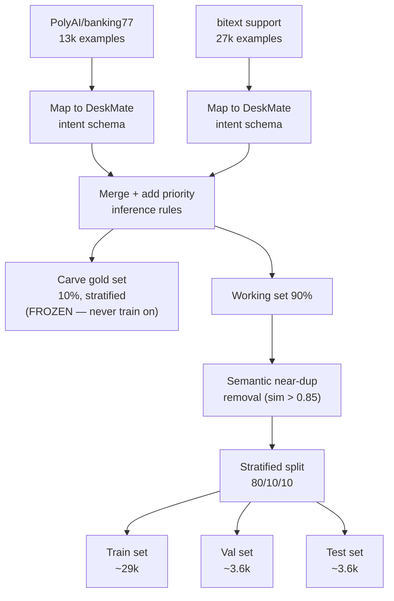

# Module 2.1 — Problem Framing, Label Schema & Data Acquisition

> Phase 2 starts here. You have a model architecture you understand — now you need something to train it on. This module turns "triage support tickets" into a concrete labeled problem with a schema, acquires real public data, and produces a frozen gold set you will never train on. Every downstream module depends on the decisions made here.

---

## Learning Goal

By the end of this module you can:

1. Define a label schema with an explicit out-of-scope class and justify each label.
2. Identify and avoid the two main leakage traps in support-ticket data.
3. Load, reconcile, and unify two public datasets into DeskMate's schema.
4. Perform a leak-free train/val/test split using semantic deduplication.
5. Carve out and freeze a gold evaluation set.
6. Answer: *name two leakage traps in support data and how you avoided them; justify your out-of-scope class.*

---

## Problem Framing

DeskMate's encoder SLM must read an incoming support ticket and output:

```json
{
  "intent":    "billing_dispute",
  "category":  "billing",
  "priority":  "high"
}
```

This is a **multi-output classification** problem: one head for intent (fine-grained), one for category (coarser grouping), one for priority. We train all three jointly because they share the same contextual representation of the ticket text.

### Why a pretrained encoder, not GPT-style generation?

- Encoders are bidirectional — every token attends to every other token, producing richer sentence representations.
- Classification and extraction tasks need a *pooled vector* summarising the whole input, not a *next-token distribution*.
- At DeskMate's scale (a few hundred milliseconds per ticket, CPU-friendly), a 22M–66M parameter encoder is orders of magnitude faster than any decoder.

---

## The Label Schema

### Intent taxonomy (14 classes + out-of-scope)

| Intent | Example ticket |
|---|---|
| `account_access` | "I can't log in, password reset email never arrived" |
| `account_settings` | "I need to change my email address" |
| `billing_dispute` | "I was charged twice for last month" |
| `billing_inquiry` | "What is included in the Pro plan?" |
| `cancellation` | "I want to cancel my subscription" |
| `data_privacy` | "Please delete all my personal data (GDPR)" |
| `feature_request` | "It would be great if you could add dark mode" |
| `onboarding` | "How do I connect my Slack workspace?" |
| `outage_report` | "Your service has been down for 2 hours" |
| `payment_failure` | "My credit card is being declined" |
| `performance_issue` | "The dashboard takes 30 seconds to load" |
| `refund_request` | "I'd like a refund for the unused months" |
| `technical_bug` | "The export button throws a 500 error" |
| `usage_question` | "How do I export data to CSV?" |
| `out_of_scope` | Spam, gibberish, or topics entirely unrelated to SaaS support |

### Category (6 classes — coarser grouping of intent)

`account` · `billing` · `data` · `product` · `technical` · `out_of_scope`

### Priority (3 classes)

| Level | Criteria |
|---|---|
| `high` | Service down / data loss / security issue / revenue impact |
| `medium` | Core feature broken, workaround exists |
| `low` | Cosmetic, inquiry, feature request, general question |

### The out-of-scope class

Every production classifier needs an explicit rejection class. Without it, the model is forced to assign every input to one of the defined intents — a spam message becomes `account_access`, a gibberish ticket becomes `technical_bug`. The out-of-scope class gives the model a legal home for inputs that don't belong to any defined intent. **Routing policy:** out-of-scope tickets go to a human review queue, not to an automated response pipeline.

---

## Annotation Guidelines (Abbreviated)

1. **Assign the most specific intent that fits.** A ticket saying "I can't log in because my card was declined" is `billing_dispute` (the root cause), not `account_access` (the symptom).
2. **Priority is about impact, not urgency phrasing.** "URGENT please help" is not automatically `high` — assess the actual impact.
3. **When ambiguous between two intents, prefer the one that drives a different routing action.** `billing_dispute` and `refund_request` have different handlers; mark correctly.
4. **Out-of-scope:** any ticket where you genuinely cannot assign one of the 14 intents confidently, or which contains only spam/gibberish.

---

## Leakage Traps in Support Data

### Trap 1: Near-duplicate tickets across splits

Users often submit the same issue multiple times ("I already sent this yesterday"). If ticket A and ticket B are near-duplicates and A lands in train while B lands in test, the model memorises A and appears to generalise to B — but hasn't actually learned anything transferable. The test metric is artificially inflated.

**Fix:** compute pairwise embedding similarity (or Jaccard on tokens) across all splits after initial splitting. Any pair with similarity > 0.85 must be consolidated into one split.

### Trap 2: Label leakage via metadata

Support systems often auto-tag tickets by department, product, or agent queue before a human assigns intent. If these tags correlate with labels and are included as input features, the model learns to use the pre-existing routing signal rather than the text itself — it looks good in testing but fails when deployed without those tags.

**Fix:** use only the raw ticket text as input. Strip all metadata (agent, queue, department, product tag) from the input column. Metadata may be used as a label source (e.g. extract priority from the agent's SLA flag), but never as a model input.

---

## Data Acquisition Plan

We use two public HuggingFace datasets and reconcile their label spaces into DeskMate's schema.

### Dataset 1: `PolyAI/banking77`

- 13,083 queries across 77 fine-grained banking intents.
- Single-turn customer queries, clean English, balanced classes.
- Intent labels are banking-specific (`card_payment_wrong_exchange_rate`, `change_pin`, etc.) but map cleanly to DeskMate's intent taxonomy.
- No priority labels — we infer from intent (e.g. `card_payment_problem` → `high`).

### Dataset 2: `bitext/Bitext-customer-support-llm-chatbot-training-dataset`

- ~27k examples across 27 intents covering SaaS-style support.
- Fields: `instruction` (ticket text), `intent`, `category`, `response`.
- Intents and categories align more closely with DeskMate's schema.
- No priority labels — inferred from category + intent.

### Reconciliation approach

```
banking77 intent          →   DeskMate intent
card_not_working          →   payment_failure
cancel_transfer           →   cancellation
wrong_amount_of_cash_recv →   billing_dispute
...

bitext intent             →   DeskMate intent
(already close; minor renames)
```

All examples not mappable to a DeskMate intent are labelled `out_of_scope`.

---

## Split Strategy

```
Total unified dataset  ≈ 40k examples
     │
     ├── Gold set (10%, 4k)     ← carved out FIRST, before any dedup
     │   Never trained on. Never touched until final evaluation.
     │   Stratified by intent and priority.
     │
     └── Working set (90%, 36k)
              │
              ├── Semantic dedup pass   (remove pairs with sim > 0.85)
              │
              ├── Train  (80%, ≈29k)
              ├── Val    (10%, ≈3.6k)   ← used for early stopping
              └── Test   (10%, ≈3.6k)   ← reported metrics

Split order matters: gold → dedup → train/val/test.
Never dedup across the gold boundary.
```

### Why stratified?

Support intent distributions are naturally skewed — `usage_question` is common; `data_privacy` is rare. A random split of a skewed dataset may leave rare classes under-represented in val/test, making the metrics misleading. Stratification ensures each class appears in each split proportionally.

---

## Mermaid: Data Pipeline



---

## Notebook: What You'll Build (08_data_acquisition.ipynb)

1. **Setup** — install `datasets`, `sentence-transformers`, `pandas`; seed; paths.
2. **Load datasets** — `load_dataset` for both sources; inspect schemas and class distributions.
3. **Intent mapping** — define mapping dicts; apply to both datasets; verify coverage.
4. **Priority inference** — rule-based assignment from intent + keywords; show distribution.
5. **Merge and deduplicate** — combine, drop exact duplicates, then embedding-based near-dup pass.
6. **Gold set carve-out** — stratified 10% sample; save to `data/gold/`; freeze (make read-only).
7. **Train/val/test split** — stratified split of working set; verify class distributions match.
8. **Datasheet** — summary table: sizes, class counts, source breakdown.
9. **Save** — write splits to `data/processed/`; push to HF Hub (optional, behind HF login).

---

## Deliverable

- `data/gold/` — frozen evaluation set (read-only after creation).
- `data/processed/train.jsonl`, `val.jsonl`, `test.jsonl` — unified, deduped, split data.
- Datasheet (printed in notebook): row counts, intent distribution per split, source breakdown.

---

## Checkpoint

> *Name two leakage traps in support data and how you avoided them; justify your out-of-scope class.*

Strong answer:
1. **Near-duplicate leakage** — users resubmit the same issue. Fixed by computing embedding similarity post-split and consolidating any pair with sim > 0.85 into one split before training begins.
2. **Metadata leakage** — pre-existing routing tags (agent queue, department) correlate with labels. Fixed by using only raw ticket text as the model input; metadata used only as a label source, never a feature.
3. **Out-of-scope justification** — a classifier without a rejection class is forced to assign every input to a defined intent, even spam and gibberish. The out-of-scope class gives the model a legal home for unrecognised inputs and prevents misrouting. In production, out-of-scope tickets route to a human review queue.

---

## What's Next

Module 2.2 — Synthetic data generation. The public datasets give us ~40k examples but lack DeskMate-specific signals: your exact product names, version strings, error codes, and the per-token extraction spans needed for the field extractor. Module 2.2 generates those using a teacher LLM.
