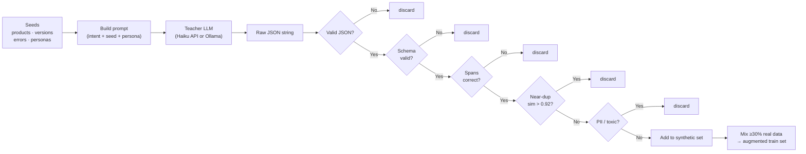

# Module 2.2 — Synthetic Data Generation

> The public datasets give you intent labels for general support queries. They do not give you DeskMate-specific signals: your product names, version strings, error codes, priority labels tied to business impact, or the per-token character spans your field extractor needs. This module generates those using a teacher LLM — and builds the discipline (validation, dedup, real-data mixing) that separates useful synthetic data from a model-collapse trap.

---

## Learning Goal

By the end of this module you can:

1. Explain why a structured-output prompt (JSON with spans) eliminates the need for separate annotation.
2. Design a seed-based prompt that controls diversity across intents, personas, and product scenarios.
3. Implement both teacher paths: Anthropic API (Claude Haiku) and local Ollama fallback.
4. Validate generated examples against a JSON schema and compute span correctness.
5. Remove near-duplicates from the synthetic set before mixing with real data.
6. Answer: *how do you keep synthetic data diverse, and why is a real-data anchor essential?*

---

## What the Public Data Doesn't Give You

| Signal | Public datasets | What you need |
|---|---|---|
| Intent labels | ✅ banking77, bitext | ✅ mapped in Module 2.1 |
| Category labels | ✅ inferred | ✅ done |
| Priority labels | ⚠️ inferred by rules | ✅ need high-confidence labelled examples |
| Product / version / error_code | ❌ none | ✅ need for field extractor |
| Character spans for extraction | ❌ none | ✅ needed for NER training (Module 2.5) |
| DeskMate-specific language | ❌ generic | ✅ your product names, error messages |

Synthetic generation fills every row with a ❌ or ⚠️.

---

## The Core Idea: Structured-Output Generation

Instead of asking the teacher model for a ticket and then annotating it separately, ask it to produce **ticket + labels + spans in one JSON object**. Labels come for free — the teacher assigned them while writing the ticket.

```json
{
  "text": "I upgraded to Pro v3.2.1 last Tuesday and now I get error ERR_AUTH_TOKEN_EXPIRED every time I try to export a CSV. I need this fixed urgently.",
  "intent": "technical_bug",
  "category": "technical",
  "priority": "high",
  "fields": {
    "product":    {"value": "Pro",              "start": 17, "end": 20},
    "version":    {"value": "v3.2.1",           "start": 21, "end": 27},
    "error_code": {"value": "ERR_AUTH_TOKEN_EXPIRED", "start": 83, "end": 106}
  }
}
```

Character spans (`start`, `end`) into the `text` field give the NER head (Module 2.5) its training signal without any manual annotation.

---

## Prompt Design for Diversity

The most common failure mode in synthetic data: 1,000 examples that all sound like the same ticket reworded. Three mechanisms prevent this:

### 1. Seed lists

Fix the intent, then vary the product, version, error code, and scenario seed independently:

```
intent=technical_bug
product=["WorkflowAI", "ConnectHub", "DataSync Pro", "TaskBoard", "ReportKit"]
version=["2.0.1", "3.1.0-beta", "4.5.2", "latest", "v1.9"]
error_code=["ERR_AUTH_TOKEN_EXPIRED", "ERR_RATE_LIMIT", "CONN_TIMEOUT_502",
            "EXPORT_FAILED_413", "SYNC_CONFLICT_409"]
seed=["can't export", "integration broke", "API key invalid", "webhook not firing"]
```

Each combination is a different example. With 5 products × 5 versions × 5 errors × 5 seeds = 625 unique technical_bug combinations — before any language variation.

### 2. Personas

Different users write differently. A "frustrated enterprise IT admin" uses different vocabulary than a "confused first-time user." Specifying a persona forces the teacher to vary register, formality, and vocabulary:

```
personas = [
    "frustrated enterprise IT administrator",
    "confused first-time user who is not technical",
    "startup founder worried about data loss",
    "operations manager under deadline pressure",
    "developer who found an edge case",
]
```

### 3. Controlled attributes

Vary sentence length (short / medium / long), writing style (terse / detailed / with steps-to-reproduce), and whether the user mentions priority urgency explicitly or leaves it implicit. This prevents the model from learning surface patterns (all high-priority tickets say "URGENT") rather than semantic content.

---

## Two Teacher Paths

### Path A: Anthropic API (Claude Haiku — recommended)

~$0.50–2.00 for 5,000 examples at ~300 tokens each. Highest quality, fastest.

```python
import anthropic

client = anthropic.Anthropic(api_key=ANTHROPIC_API_KEY)

def generate_example(intent, product, version, error_code, seed_phrase, persona):
    prompt = build_prompt(intent, product, version, error_code, seed_phrase, persona)
    msg = client.messages.create(
        model="claude-haiku-20240307",
        max_tokens=512,
        messages=[{"role": "user", "content": prompt}],
    )
    return msg.content[0].text
```

### Path B: Ollama Local Fallback (free)

Run a 7–8B model locally. Quality slightly lower than Haiku, but zero cost.

```python
import requests

def generate_example_ollama(prompt, model="llama3.1:8b"):
    resp = requests.post("http://localhost:11434/api/generate",
                         json={"model": model, "prompt": prompt, "stream": False},
                         timeout=60)
    return resp.json()["response"]
```

Ollama setup: `brew install ollama && ollama pull llama3.1:8b` (Mac/Linux).
On Colab: install via `!curl -fsSL https://ollama.com/install.sh | sh` and run in background.

---

## Quality Control Pipeline

```
Teacher output
    │
    ▼
1. JSON parse         → discard if invalid JSON
    │
    ▼
2. Schema validation  → discard if missing required keys or wrong value types
    │
    ▼
3. Span verification  → text[start:end] == fields.X.value  (character math)
    │
    ▼
4. Intent check       → intent must be one of the 15 DeskMate classes
    │
    ▼
5. Near-dup filter    → cosine similarity > 0.92 against existing examples
    │
    ▼
6. PII / toxicity     → simple regex rules (no real email/phone in examples)
    │
    ▼
→ Add to synthetic working set
```

Typical pass rate with Claude Haiku: 85–92%. With Ollama 8B: 65–80%. Budget extra generation calls to hit your target count.

---

## The Model-Collapse Trap

If you train a model entirely on synthetic data generated by model A, fine-tune it, then use that fine-tuned model to generate more data for the next round — the distribution narrows with each round. Rare but correct examples become extinct. The model hallucinates with increasing confidence.

**The fix is simple: always anchor on real data.**

Mix ratio: at minimum 30% real examples in every training batch. The real examples anchor the model to the true data distribution. Synthetic examples fill gaps (rare intents, DeskMate-specific fields) without replacing the real signal.

```python
# At training time — do NOT train on synthetic-only batches
real_weight    = 1.0   # full weight on real examples
synthetic_weight = 0.7  # slight downweight on synthetic
```

Or simply ensure the train split (from Module 2.1) always forms the majority, with synthetic added on top.

---

## Mermaid: Synthetic Generation Pipeline



---

## Notebook: What You'll Build (09_synthetic_data.ipynb)

1. **Setup** — install `anthropic`, seed, paths; load existing train set from Module 2.1.
2. **Seed configuration** — define product names, versions, error codes, personas, scenario seeds for each intent.
3. **Prompt builder** — `build_prompt(intent, product, version, error_code, seed, persona)` → formatted string.
4. **Teacher path A** — Anthropic API generator with retry logic and rate-limit handling.
5. **Teacher path B** — Ollama fallback; auto-detect which path to use.
6. **Quality control pipeline** — JSON parse → schema validation → span verification → PII regex.
7. **Near-dup removal** — MiniLM embeddings over synthetic set only (do not re-embed real data).
8. **Mix and save** — merge synthetic into working set; verify ≥30% real anchor; save augmented train.
9. **Stats** — count per intent before/after; compare intent distribution to real-only baseline.

---

## Deliverable

- `src/synth_generator.py` — standalone generator script (importable, not notebook-only).
- `data/processed/train_augmented.jsonl` — merged real + synthetic training set.
- Stats printed in notebook: N synthetic generated, N passed QC, per-intent breakdown.

---

## Checkpoint

> *How do you keep synthetic data diverse, and why is a real-data anchor essential?*

Strong answer:
- **Diversity mechanisms:** (1) Seed lists — cross-product of intent × product × version × error × scenario gives hundreds of structurally distinct combinations. (2) Personas — vary register, formality, vocabulary. (3) Controlled attributes — vary length and whether urgency is explicit or implicit. These prevent surface-pattern overfitting.
- **Real-data anchor:** Synthetic data narrows the distribution each generation step. Without real examples, rare correct patterns disappear (model collapse). A ≥30% real-data anchor in every training batch keeps the model calibrated to the true data distribution. Synthetic fills gaps; real prevents drift.

---

## What's Next

Module 2.3 — Data prep for encoder fine-tuning. You'll tokenize the augmented dataset with the encoder's own tokenizer, build attention masks, encode labels as integers, and produce a `DatasetDict` ready for the `Trainer`. The tokenizer must match the model — a lesson from Module 0.4 that shows up concretely here.
