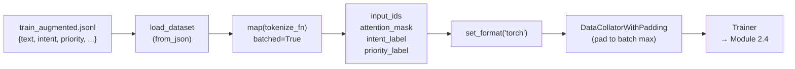

# Module 2.3 — Data Prep for Encoder Fine-Tuning

> The gap between "a JSONL file of labeled tickets" and "tensors the Trainer can consume" is small but riddled with subtle bugs. This module closes that gap: tokenize with the model's own tokenizer, handle padding and attention masks correctly, encode labels as integers, and produce a `DatasetDict` ready to hand to the `Trainer`.

---

## Learning Goal

By the end of this module you can:

1. Explain why the tokenizer must come from the same checkpoint as the model.
2. Tokenize a batch of variable-length texts with truncation and padding to a fixed length.
3. Explain what the attention mask is and what it does for padded positions.
4. Encode intent and priority labels as integer tensors.
5. Use a `DataCollatorWithPadding` to avoid over-padding in batches.
6. Answer: *what does the attention mask do for padded sequences?*

---

## The Tokenizer Must Match the Model

This was covered in Module 0.4 but shows up concretely here. Every pretrained encoder has a tokenizer that was trained alongside it:

- `distilbert-base-uncased` → WordPiece tokenizer, vocabulary 30,522 tokens, lowercase
- `microsoft/MiniLM-L12-H384-uncased` → WordPiece, same vocabulary family, lowercase
- `bert-base-uncased` → WordPiece, vocabulary 30,522, lowercase

If you tokenize with one and load the other, token IDs don't correspond to the embeddings — the model receives meaningless inputs. Always:

```python
MODEL_NAME = "microsoft/MiniLM-L12-H384-uncased"
tokenizer  = AutoTokenizer.from_pretrained(MODEL_NAME)
model      = AutoModelForSequenceClassification.from_pretrained(MODEL_NAME, ...)
```

---

## Tokenization for Sequence Classification

For intent classification, the encoder reads the whole ticket and produces a pooled representation. The standard approach:

```
[CLS] Fix  the  login  bug  [SEP] [PAD] [PAD] ...
  0    101  1996  4902  5415  102   0     0
```

- `[CLS]` — special token at position 0; its final hidden state is pooled and used as the sequence representation.
- `[SEP]` — marks the end of the sequence.
- `[PAD]` — fills positions up to `max_length` when the sequence is shorter than the batch maximum.

### Truncation and padding

```python
tokenizer(
    texts,
    truncation=True,       # cut to max_length if too long
    padding="max_length",  # pad to exactly max_length
    max_length=128,        # 128 is plenty for support tickets (~30–60 tokens)
    return_tensors="pt",   # return PyTorch tensors
)
```

Returns a dict with keys:
- `input_ids` — `(B, 128)` LongTensor of token IDs
- `attention_mask` — `(B, 128)` BinaryTensor: 1 for real tokens, 0 for pad
- `token_type_ids` — (BERT-style) segment IDs; 0 everywhere for single-sequence tasks

---

## The Attention Mask

The attention mask tells the model which positions are real content and which are padding.

Without it, the self-attention computation would mix padding tokens into every position's contextual representation — padding tokens carry no meaning and would dilute the signal.

### What it does mechanically

In scaled dot-product attention:

```python
scores = Q @ K.T / sqrt(d_head)
# Before softmax, mask out pad positions:
scores[attention_mask == 0] = -inf   # pad positions → zero weight after softmax
weights = softmax(scores)
```

Pad positions receive `-inf` before softmax → their weight collapses to 0 → they contribute nothing to the weighted sum of values.

### What it does for the CLS pooling

The CLS token's representation is influenced by all tokens with non-zero attention weights. With correct masking, only real ticket tokens influence the CLS embedding — padding never pollutes it.

```
attention_mask: [1, 1, 1, 1, 1, 1, 0, 0, 0, ...]
                CLS Fix the login bug SEP PAD PAD PAD
```

---

## Dynamic Padding with DataCollatorWithPadding

Padding every sequence to a fixed `max_length=128` wastes computation when most tickets are 30 tokens long — you pad to 128 and compute attention over 98 useless positions per example.

`DataCollatorWithPadding` pads each **batch** to the length of the longest sequence in that batch:

```
Batch 1: [30, 25, 28, 22 tokens] → pad to 30
Batch 2: [45, 40, 48, 35 tokens] → pad to 48
```

Average padding per sequence drops from ~98 to ~5–10 tokens. Training is meaningfully faster.

```python
from transformers import DataCollatorWithPadding

collator = DataCollatorWithPadding(tokenizer=tokenizer)
# Pass to Trainer as data_collator=collator
```

When using the collator, tokenize without padding (or with `padding=False`) and let the collator handle it at batch assembly time.

---

## Label Encoding

The model expects integer class indices, not strings.

### Intent labels

```python
INTENT2ID = {intent: i for i, intent in enumerate(INTENTS)}
ID2INTENT  = {i: intent for intent, i in INTENT2ID.items()}

# In the dataset map:
example["intent_label"] = INTENT2ID[example["intent"]]
```

### Priority labels

```python
PRIORITY2ID = {"low": 0, "medium": 1, "high": 2}
ID2PRIORITY  = {0: "low", 1: "medium", 2: "high"}

example["priority_label"] = PRIORITY2ID[example["priority"]]
```

### Multi-label vs multi-head

We train **two separate classification heads** on top of the same encoder:
1. Intent head: `nn.Linear(hidden_size, n_intents)` — 15-class softmax
2. Priority head: `nn.Linear(hidden_size, 3)` — 3-class softmax

Both heads share the encoder backbone. The loss is the sum of the two cross-entropy losses.

In Phase 2 we train these separately for clarity (Module 2.4 trains the intent head; priority can be added as a second head or a separate model). Module 2.4 will use `AutoModelForSequenceClassification` with `num_labels=15` for intent first.

---

## The Full Tokenization Pipeline

```python
def tokenize_fn(examples):
    out = tokenizer(
        examples["text"],
        truncation=True,
        max_length=128,
        padding=False,          # let DataCollatorWithPadding handle it
    )
    out["intent_label"]   = [INTENT2ID[i]   for i in examples["intent"]]
    out["priority_label"] = [PRIORITY2ID[p] for p in examples["priority"]]
    return out

tokenized = raw_ds.map(
    tokenize_fn,
    batched=True,
    remove_columns=["text", "intent", "category", "priority", "source"],
)
```

### Shape check (one example)

```
input_ids      : [101, 1045, 2064, 1005, 1056, ...]  LongTensor length ≤ 128
attention_mask : [1,   1,    1,    1,    1,    ...]  same length
intent_label   : 0                                   scalar int
priority_label : 1                                   scalar int
```

---

## Mermaid: Data Prep Pipeline



---

## Common Bugs

| Bug | Symptom | Fix |
|---|---|---|
| Wrong tokenizer for model | Nonsense outputs even after training | Always `from_pretrained(MODEL_NAME)` for both |
| Forgetting `set_format("torch")` | Dataset returns Python lists, not tensors | Call `tokenized.set_format("torch")` |
| Label column named wrong | `Trainer` can't find labels | Rename to `"labels"` or pass `label_names` to `TrainingArguments` |
| Padding before collator | Wastes compute; collator re-pads anyway | Use `padding=False` in tokenize; let collator handle it |
| Token type IDs missing | Some BERT checkpoints need them | `return_token_type_ids=True` if checkpoint requires |
| Max length too short | Long tickets silently truncated, label from truncated position | Check `tokenizer.model_max_length`; 128 covers 95%+ of support tickets |

---

## Notebook: What You'll Build (10_encoder_dataprep.ipynb)

1. **Setup** — install `transformers`, `datasets`; seed; load tokenizer.
2. **Load splits** — read `train_augmented.jsonl`, `val.jsonl`, `test.jsonl` into a `DatasetDict`.
3. **Inspect raw data** — print one example, check text lengths distribution.
4. **Build label maps** — `INTENT2ID`, `PRIORITY2ID`; verify round-trips.
5. **Tokenize** — `map(tokenize_fn, batched=True)`; inspect output columns and shapes.
6. **Set format** — `set_format("torch")`; verify tensor types.
7. **DataCollator** — instantiate `DataCollatorWithPadding`; show dynamic padding in action.
8. **DataLoader smoke test** — one batch through a DataLoader; print shapes.
9. **Save artifacts** — pickle label maps; save tokenized dataset to disk (`save_to_disk`).

---

## Deliverable

- `data/processed/tokenized/` — tokenized `DatasetDict` saved to disk.
- `data/processed/label_maps.json` — `INTENT2ID`, `PRIORITY2ID`, `ID2INTENT`, `ID2PRIORITY`.
- Notebook run end-to-end with shapes confirmed: `input_ids (B, T)`, `attention_mask (B, T)`, `labels (B,)`.

---

## Checkpoint

> *What does the attention mask do for padded sequences?*

Strong answer: The attention mask is a binary tensor (1 for real tokens, 0 for pad). Before the softmax in scaled dot-product attention, positions where `attention_mask == 0` receive `-inf` as their score, so their softmax weight collapses to zero. Padded positions contribute nothing to any token's contextual representation. Without the mask, padding tokens would be weighted positively and dilute the signal in every attention head — the model would need to learn to ignore them, wasting capacity. With the mask, the encoder never "sees" padding.

---

## What's Next

Module 2.4 — Fine-tune the encoder for intent + priority. You'll load `AutoModelForSequenceClassification`, wire the tokenized dataset and `DataCollatorWithPadding` into a `Trainer`, and train a classifier that runs in milliseconds on CPU.
