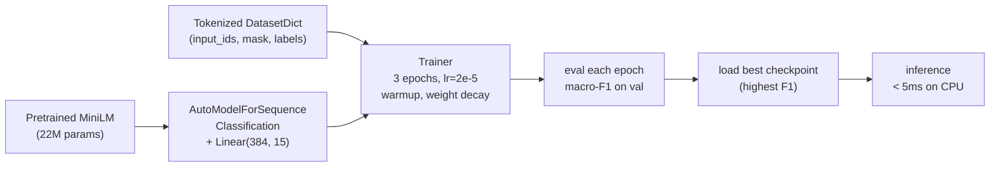

# Module 2.4 — Fine-Tune an Encoder for Intent + Priority

> The data is ready, the tensors are shaped, the labels are integers. This module completes the loop: load a pretrained encoder with a classification head, hand everything to `Trainer`, and produce a model that classifies support tickets in milliseconds — on CPU.

---

## Learning Goal

By the end of this module you can:

1. Load `AutoModelForSequenceClassification` and explain what the classification head adds.
2. Configure `TrainingArguments` with the key hyperparameters for a small encoder fine-tune.
3. Implement a `compute_metrics` function for multi-class classification.
4. Train a full intent + priority classifier and verify it reaches reasonable val accuracy.
5. Run inference on a raw string in under 5 lines.
6. Answer: *your val accuracy is high but production accuracy is low — list three likely causes.*

---

## What `AutoModelForSequenceClassification` Adds

`AutoModelForSequenceClassification.from_pretrained(MODEL_NAME, num_labels=N)` loads the pretrained encoder and attaches a classification head on top:

```
Encoder backbone (MiniLM: 12 layers, d_model=384)
    ↓
[CLS] hidden state  →  shape (B, 384)
    ↓
Dropout(0.1)
    ↓
Linear(384, N)      →  shape (B, N)  ← logits, one per class
    ↓
(Cross-entropy loss during training; argmax at inference)
```

The encoder weights start from the pretrained checkpoint. The classification head (`Linear(384, N)`) is randomly initialised — it has never seen your label space. Fine-tuning updates both.

**Why full fine-tune at this size?** MiniLM has 22M parameters. At this scale, full fine-tuning is feasible on free Colab and consistently outperforms frozen-encoder + head-only training, because language patterns in the lower layers need to adapt to support-desk phrasing.

---

## Two Heads: Intent and Priority

We train two separate models for clarity:
- **Intent model** — `num_labels=15`, primary routing signal.
- **Priority model** — `num_labels=3`, secondary signal for SLA assignment.

An alternative is one model with two heads sharing the backbone (multi-task). That's more efficient but harder to debug and tune. Single-task first; optimise later if latency or memory is a constraint.

---

## Key Hyperparameters

| Hyperparameter | Value | Why |
|---|---|---|
| `learning_rate` | `2e-5` | Standard for BERT-family fine-tuning; too high → catastrophic forgetting, too low → slow convergence |
| `num_train_epochs` | `3` | 3 epochs is the Goldilocks for small encoders on a few thousand examples |
| `per_device_train_batch_size` | `32` | Fits in Colab CPU/T4; larger batches need higher LR |
| `warmup_ratio` | `0.1` | 10% of steps used for linear LR warmup — prevents early instability |
| `weight_decay` | `0.01` | L2 regularisation on non-bias parameters |
| `eval_strategy` | `"epoch"` | Evaluate on val set at end of each epoch |
| `load_best_model_at_end` | `True` | Load the checkpoint with best val metric when training completes |
| `metric_for_best_model` | `"f1"` | Use macro-F1 (not accuracy) because classes are imbalanced |

---

## Why Macro-F1, Not Accuracy?

Support intent classes are naturally imbalanced — `usage_question` and `technical_bug` dominate; `data_privacy` and `outage_report` are rare. A model that always predicts `usage_question` achieves ~20% accuracy for free.

**Macro-F1** averages F1 across all classes with equal weight regardless of class size. A rare class that the model consistently misses pulls the macro-F1 down even if the common classes are handled well. It is the right metric for routing decisions where every intent must work.

```python
from sklearn.metrics import f1_score, accuracy_score

def compute_metrics(eval_pred):
    logits, labels = eval_pred
    preds = logits.argmax(axis=-1)
    return {
        "accuracy": accuracy_score(labels, preds),
        "f1":       f1_score(labels, preds, average="macro", zero_division=0),
    }
```

---

## Training Arguments

```python
from transformers import TrainingArguments

args = TrainingArguments(
    output_dir       = "models/intent_classifier",
    num_train_epochs = 3,
    per_device_train_batch_size = 32,
    per_device_eval_batch_size  = 64,
    learning_rate    = 2e-5,
    warmup_ratio     = 0.1,
    weight_decay     = 0.01,
    eval_strategy    = "epoch",
    save_strategy    = "epoch",
    load_best_model_at_end = True,
    metric_for_best_model  = "f1",
    greater_is_better      = True,
    logging_steps    = 50,
    fp16             = torch.cuda.is_available(),   # mixed precision on GPU only
    seed             = 42,
)
```

---

## The Trainer

```python
from transformers import Trainer

trainer = Trainer(
    model          = model,
    args           = args,
    train_dataset  = train_ds,
    eval_dataset   = val_ds,
    data_collator  = collator,
    compute_metrics= compute_metrics,
    tokenizer      = tokenizer,   # needed for collator inside Trainer
)

trainer.train()
```

The `Trainer` handles: batching (via `data_collator`), forward pass, loss computation, gradient accumulation, LR scheduling (warmup + cosine/linear decay), evaluation at each epoch, checkpointing, and best-model loading.

---

## Inference After Training

```python
from transformers import pipeline

classifier = pipeline(
    "text-classification",
    model=trainer.model,
    tokenizer=tokenizer,
    device=-1,            # CPU
    return_all_scores=False,
)

result = classifier("I can't log in, password reset doesn't work.")
# → [{"label": "LABEL_0", "score": 0.93}]
# Map label back: ID2INTENT[int(result[0]["label"].split("_")[1])]
```

Or directly:

```python
inputs = tokenizer("I can't log in.", return_tensors="pt", truncation=True, max_length=128)
with torch.no_grad():
    logits = model(**inputs).logits
intent_id = logits.argmax().item()
print(ID2INTENT[intent_id])
```

---

## Mermaid: Fine-Tuning Flow



---

## Val Accuracy High, Production Accuracy Low — Three Causes

This is the most common failure mode in classification projects. Three likely explanations:

### 1. Distribution shift

The val set was sampled from the same source (banking77 + bitext) as the training set. Production tickets come from your actual users, who phrase things differently, use your product names, and write in your company's support context. The model has never seen this distribution.

**Fix:** collect and label a representative sample of real production tickets; add them to training or at minimum use them for evaluation (this is what the gold set in Module 2.1 is for).

### 2. Label leakage in the val split

Near-duplicate tickets in both train and val inflate val metrics. A model that memorised ticket A in train looks brilliant when it sees nearly-identical ticket B in val — but neither of those patterns exist in production.

**Fix:** semantic deduplication before splitting (done in Module 2.1). Always evaluate on the frozen gold set (Module 2.6) for a clean signal.

### 3. Overfit to surface patterns

The training data (particularly synthetic examples) may contain consistent surface cues — e.g. all `outage_report` examples start with "service is down". The model learns the cue, not the intent. In production, users phrase outages without those cues.

**Fix:** diversity in synthetic generation (seeds + personas, Module 2.2); error analysis on the gold set to identify systematic failure modes (Module 2.6).

---

## Notebook: What You'll Build (11_encoder_finetune.ipynb)

1. **Setup** — install, load tokenizer, load label maps from `label_maps.json`.
2. **Load tokenized datasets** — `load_from_disk`; rename `intent_label → labels` for Trainer.
3. **Intent classifier** — load `AutoModelForSequenceClassification(num_labels=15)`; `TrainingArguments`; `compute_metrics`; `Trainer.train()`; plot training loss curve.
4. **Priority classifier** — same pattern with `num_labels=3`; reuse the tokenized dataset with `priority_label → labels`.
5. **Evaluation** — per-class F1 table; confusion matrix for intent model.
6. **Inference demo** — classify 5 sample tickets end-to-end; print predicted intent + priority.
7. **Save** — push both models to `models/` and optionally to HF Hub.

---

## Deliverable

- `models/intent_classifier/` — fine-tuned MiniLM intent model.
- `models/priority_classifier/` — fine-tuned MiniLM priority model.
- Per-class F1 table and confusion matrix in notebook output.
- Inference demo: 5 sample tickets with predicted labels.

---

## Checkpoint

> *Your val accuracy is high but production accuracy is low — list three likely causes.*

Strong answer names at least three of: distribution shift (val from same source as train; production is different), label leakage via near-duplicates inflating val metrics, surface-pattern overfitting (synthetic cues not present in production), class imbalance masked by accuracy metric, or the gold set not being used (val is not independent enough).

---

## What's Next

Module 2.5 — Token classification for field extraction (NER). Using the character spans generated by the synthetic pipeline (Module 2.2), you'll train `AutoModelForTokenClassification` to pull product name, version, and error code out of a ticket as a JSON object. This is the second production component of DeskMate's encoder SLM.
