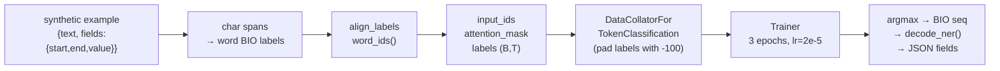

# Module 2.5 — Token Classification for Field Extraction (NER)

> Intent and priority tell the router *what* and *how urgent*. Field extraction tells the agent *which product*, *which version*, *which error code*. This module turns the character spans your synthetic generator produced into a fine-tuned NER head that outputs a structured JSON per ticket.

---

## Learning Goal

By the end of this module you can:

1. Explain the BIO tagging scheme and why it encodes spans unambiguously.
2. Describe the subword-alignment problem and implement label alignment with `word_ids()`.
3. Load `AutoModelForTokenClassification` and configure a DataCollator for token-level tasks.
4. Compute token-level (seqeval) F1 and span-level extraction F1.
5. Decode predicted BIO sequences back to `{"product": "...", "version": "...", ...}`.
6. Answer: *why does subword tokenization complicate token-level labels, and how do you align them?*

---

## The BIO Tagging Scheme

BIO (Begin – Inside – Outside) encodes spans as a sequence of per-token labels:

```
Token:  I      cannot   use    DeskMate   Pro    v2      .3      on   Windows    10
BIO:    O      O        O      B-product  I-product B-version I-version  O   B-os    I-os
```

- `O` — outside any span
- `B-<field>` — first token of a `<field>` span
- `I-<field>` — continuation token inside a `<field>` span

Why BIO and not a simpler scheme? Because spans can be adjacent. Two consecutive `B-` tags unambiguously start two separate spans; `I-` can only follow a `B-` or another `I-` of the same field type.

### Label set for DeskMate

Our synthetic generator produces three field types: `product`, `version`, `os`. With BIO that gives:

```
O, B-product, I-product, B-version, I-version, B-os, I-os
```

7 labels total. Label 0 is always `O` by convention.

```python
LABELS = ["O", "B-product", "I-product", "B-version", "I-version", "B-os", "I-os"]
LABEL2ID = {l: i for i, l in enumerate(LABELS)}
ID2LABEL = {i: l for i, l in enumerate(LABELS)}
```

---

## The Subword-Alignment Problem

This is the classic NER fine-tuning trap. WordPiece splits `DeskMate` into `['desk', '##mate']`. Your annotation says label `B-product` for the *word* `DeskMate`, but the tokenizer produces *two subword tokens*. What label does `##mate` get?

**The rule:** the first subword of a word gets the word's label; all subsequent subwords of the same word get `-100` (PyTorch's ignore index for cross-entropy).

```
Word:     DeskMate     Pro
Subwords: desk  ##mate Pro
Labels:   B-product  -100  I-product
```

`-100` tells the loss function and the evaluation loop to skip that position entirely. Only one label per word is computed — the label on the first subword.

### Implementing alignment with `word_ids()`

The tokenizer returns `word_ids()` — a list that maps each subword token to its source word index (or `None` for special tokens like `[CLS]` and `[SEP]`).

```python
def align_labels(tokenized_inputs, labels_per_word):
    word_ids   = tokenized_inputs.word_ids()
    aligned    = []
    prev_word  = None
    for wid in word_ids:
        if wid is None:
            aligned.append(-100)           # [CLS], [SEP]
        elif wid != prev_word:
            aligned.append(labels_per_word[wid])   # first subword → real label
        else:
            aligned.append(-100)           # continuation subword → ignore
        prev_word = wid
    return aligned
```

This function must be called per-example (not batched), because `word_ids()` is per-sequence.

---

## From Character Spans to Word Labels

The synthetic generator (Module 2.2) stored spans as character offsets:

```json
{
  "text": "I cannot use DeskMate Pro v2.3 on Windows 10.",
  "fields": {
    "product": {"start": 13, "end": 24, "value": "DeskMate Pro"},
    "version": {"start": 25, "end": 29, "value": "v2.3"},
    "os":      {"start": 33, "end": 43, "value": "Windows 10"}
  }
}
```

To convert to BIO word labels:
1. Split text into words with character-level offsets (use `tokenizer(..., return_offsets_mapping=True)`).
2. For each word, check which field span (if any) it overlaps.
3. If a word starts at the same offset as a span → `B-<field>`.
4. If a word is inside a span (not the first word) → `I-<field>`.
5. Otherwise → `O`.

The tokenizer's `offset_mapping` gives `(char_start, char_end)` per subword, which makes this straightforward.

---

## DataCollator for Token Classification

`DataCollatorForTokenClassification` is the NER equivalent of `DataCollatorWithPadding`. It pads both `input_ids` and the `labels` sequence to the batch maximum, using `-100` as the padding value for labels (so padded label positions are ignored in the loss).

```python
from transformers import DataCollatorForTokenClassification

collator = DataCollatorForTokenClassification(tokenizer=tokenizer)
```

The key difference from the sequence-classification collator: labels are now a sequence `(B, T)` not a scalar `(B,)`, so both tensors must be padded together to the same length.

---

## AutoModelForTokenClassification

```python
from transformers import AutoModelForTokenClassification

model = AutoModelForTokenClassification.from_pretrained(
    MODEL_NAME,
    num_labels=len(LABELS),
    id2label=ID2LABEL,
    label2id=LABEL2ID,
)
```

The architecture is identical to sequence classification except the head is applied at every token position, not just CLS:

```
Encoder backbone → (B, T, 384)
                        ↓
               Linear(384, 7)  → (B, T, 7)   logits per token
                        ↓
               argmax(dim=-1)  → (B, T)       predicted label per token
```

Loss is cross-entropy computed only at positions where `label != -100` — real tokens and first subwords only.

---

## Evaluation: seqeval

Span-level NER evaluation uses the `seqeval` library, which reconstructs complete spans from BIO sequences before computing precision/recall/F1:

```python
from seqeval.metrics import classification_report, f1_score

# Convert predicted IDs back to BIO strings, stripping -100 positions
def decode_predictions(predictions, labels):
    true_labels = [[ID2LABEL[l] for l in label if l != -100] for label in labels]
    true_preds  = [
        [ID2LABEL[p] for p, l in zip(pred, label) if l != -100]
        for pred, label in zip(predictions, labels)
    ]
    return true_preds, true_labels

report = classification_report(true_labels, true_preds)
```

Seqeval F1 is computed at span level: a span is correct only if the entire span boundary matches — partial overlaps count as wrong. This is stricter than token-level F1 and better reflects extraction quality.

---

## Decoding Spans to JSON

After inference, the model produces a per-token BIO sequence. To reconstruct the extracted fields:

```python
def decode_ner(tokens, bio_labels):
    result    = {}
    cur_field = None
    cur_toks  = []

    for token, label in zip(tokens, bio_labels):
        if label.startswith("B-"):
            if cur_field:
                result[cur_field] = tokenizer.convert_tokens_to_string(cur_toks).strip()
            cur_field = label[2:]
            cur_toks  = [token]
        elif label.startswith("I-") and cur_field == label[2:]:
            cur_toks.append(token)
        else:
            if cur_field:
                result[cur_field] = tokenizer.convert_tokens_to_string(cur_toks).strip()
            cur_field = None
            cur_toks  = []

    if cur_field:
        result[cur_field] = tokenizer.convert_tokens_to_string(cur_toks).strip()

    return result
```

Called after inference:
```python
inputs = tokenizer(text, return_tensors="pt", truncation=True, max_length=128)
with torch.no_grad():
    logits = model(**inputs).logits            # (1, T, 7)
pred_ids = logits[0].argmax(-1).tolist()
tokens   = tokenizer.convert_ids_to_tokens(inputs["input_ids"][0])
bio_seq  = [ID2LABEL[i] for i in pred_ids]
fields   = decode_ner(tokens, bio_seq)
# → {"product": "DeskMate Pro", "version": "v2.3", "os": "Windows 10"}
```

---

## Common Bugs

| Bug | Symptom | Fix |
|---|---|---|
| No `word_ids()` → labels not aligned | `O` label at every subword, inflated accuracy | Always align with `word_ids()` per sequence |
| Batching `word_ids()` | `word_ids()` is per-sequence; calling it on a batch silently returns only one sequence's mapping | Call inside a loop or `map()` with `batched=False` for the alignment step |
| Labels padded with `0` instead of `-100` | `O` tokens counted in loss at pad positions | `DataCollatorForTokenClassification` uses `-100`; don't override |
| Evaluating with accuracy | Token-level accuracy is dominated by `O` labels (90%+) and looks great even for a broken model | Always use seqeval span-level F1 |
| WordPiece `##` tokens in output | `convert_tokens_to_string` keeps `##` | Use `tokenizer.convert_tokens_to_string()` — it strips `##` and re-joins correctly |
| `I-` without preceding `B-` | BIO violation in decoded output causes seqeval parse error | In `decode_ner`, start a new span only on `B-`; drop lone `I-` tokens |

---

## Mermaid: NER Pipeline



---

## Notebook: What You'll Build (12_ner_extraction.ipynb)

1. **Setup** — install `transformers`, `datasets`, `seqeval`.
2. **Label schema** — define LABELS, LABEL2ID, ID2LABEL; verify round-trips.
3. **Load synthetic data** — read `train_augmented.jsonl` from 2.2; inspect one example with fields.
4. **Char spans → BIO** — implement `spans_to_bio()` using `offset_mapping`; verify on 3 examples.
5. **Tokenize + align** — `tokenizer(..., return_offsets_mapping=True)` + `align_labels()`; shape check `(T,)`.
6. **Dataset map** — `map(tokenize_and_align, batched=False)`; verify label distribution.
7. **DataCollator** — `DataCollatorForTokenClassification`; show batch padding in action.
8. **Train** — `AutoModelForTokenClassification`, `TrainingArguments`, `Trainer.train()`; seqeval metrics.
9. **Evaluate** — per-entity F1 table using `seqeval.metrics.classification_report`.
10. **Decode demo** — run inference on 5 raw tickets; print extracted JSON fields.
11. **Save** — save model to `models/field_extractor/`.

---

## Deliverable

- `models/field_extractor/` — fine-tuned MiniLM NER model.
- Per-entity seqeval F1 table (product, version, os).
- Inference demo: 5 sample tickets each returning `{"product": ..., "version": ..., "os": ...}`.

---

## Checkpoint

> *Why does subword tokenization complicate token-level labels, and how do you align them?*

Strong answer: WordPiece splits words into subword tokens (e.g., `DeskMate` → `desk`, `##mate`), so a word-level annotation (`B-product` for `DeskMate`) must be distributed across two tokens. Only the first subword receives the real label; continuation subwords get `-100` (cross-entropy ignore index), so they don't contribute to the loss or evaluation. The alignment is done using `word_ids()` from the tokenizer output: iterate over the list, assign the word's label when the word index changes, and assign `-100` when the word index repeats (continuation subword) or is `None` (special tokens).

---

## What's Next

Module 2.6 — Domain-specific evaluation. Now that you have an intent classifier, priority classifier, and NER extractor, Module 2.6 measures them rigorously on the frozen gold set: per-class F1, calibration curves, threshold tuning, and structured error analysis to find systematic failure modes.
