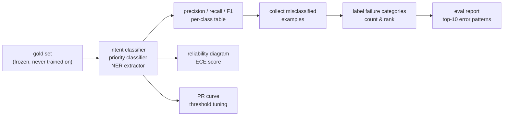

# Module 2.6 — Domain-Specific Evaluation

> Training metrics tell you the model is learning. Evaluation on the gold set tells you whether the model is useful. This module goes beyond accuracy: calibration, threshold tuning, per-class diagnosis, and structured error analysis — the toolkit for finding systematic failure before it reaches users.

---

## Learning Goal

By the end of this module you can:

1. Compute and interpret precision, recall, and F1 at the per-class level.
2. Explain why accuracy is a misleading metric on imbalanced label distributions.
3. Describe what model calibration means and how to read a reliability diagram.
4. Tune a decision threshold for a specific operating point (e.g., high-recall routing).
5. Perform structured error analysis: categorise failure modes and count their frequency.
6. Answer: *when is macro-F1 the right metric over accuracy?*

---

## The Gold Set

The gold set was created in Module 2.1: a representative, human-verified sample of tickets, read-only (`os.chmod(..., 0o444)`), never trained on, never augmented. It is the ground truth against which all models are evaluated at deployment time.

Why not use the test split from the training pipeline? The test split was held out during training but was drawn from the same sources (banking77 + bitext + synthetic) and the same distribution as the train set. It measures in-distribution generalisation. The gold set measures real-world applicability — a much harder and more meaningful bar.

---

## Precision, Recall, F1 — Per Class

For each class `c`:

```
Precision(c) = TP_c / (TP_c + FP_c)   # of all predictions of class c, what fraction was correct
Recall(c)    = TP_c / (TP_c + FN_c)   # of all true class c examples, what fraction did we catch
F1(c)        = 2 × P(c) × R(c) / (P(c) + R(c))
```

**Read precision and recall as a pair.** A model can achieve 100% precision by predicting rarely; 100% recall by predicting always. F1 balances them.

For a support ticket router:
- **Low recall on `outage_report`** means outage tickets are mis-routed — engineers never see them. A latent incident escalates unnoticed.
- **Low precision on `billing_dispute`** means non-billing tickets go to the billing queue — agents waste time on irrelevant work.

These failure modes have different real-world costs. Per-class metrics expose them; aggregated accuracy hides them.

---

## When Is Macro-F1 the Right Metric?

**Macro-F1** averages F1 across all classes with equal weight, regardless of class size.

**Accuracy** averages correct predictions across all examples, so large classes dominate.

Use macro-F1 when:
1. **Classes are imbalanced** — `usage_question` accounts for 20% of tickets but `data_privacy` for 1%. A model that predicts `usage_question` for every ambiguous example scores 20% accuracy for free while failing completely on rare but critical intents.
2. **Every class must work** — routing failure on any intent degrades user experience. There is no "acceptable" class to ignore.
3. **You want a single number** — macro-F1 is the standard benchmark metric for multi-class NLP tasks with imbalanced distributions.

Use accuracy when classes are balanced and misclassification costs are uniform (rare in practice).

---

## Calibration

A model's predicted probability should reflect its actual accuracy. If the model says 0.9 confidence for 100 examples, approximately 90 of those predictions should be correct. This is calibration.

**Why it matters for DeskMate:** confidence scores are used for routing decisions — e.g., route to the primary agent if confidence > 0.8, else route to a human. If the model is overconfident (says 0.9 when it's correct only 60% of the time), high-confidence routing sends wrong tickets to agents without human review.

### Reliability diagram (calibration plot)

Group predictions into confidence bins (e.g., [0.0, 0.1), [0.1, 0.2), ..., [0.9, 1.0]).  
For each bin, plot:
- x-axis: mean predicted confidence in the bin
- y-axis: actual fraction correct in the bin

A perfectly calibrated model lies on the diagonal `y = x`. Points above the diagonal → underconfident (the model understimates its accuracy). Points below → overconfident (the model is more wrong than it thinks).

```python
from sklearn.calibration import calibration_curve

fraction_pos, mean_conf = calibration_curve(
    y_true=(y_true == target_class).astype(int),
    y_prob=probas[:, target_class],
    n_bins=10,
)
```

### ECE — Expected Calibration Error

A scalar calibration summary:

```
ECE = Σ_b (|B_b| / n) × |acc(B_b) − conf(B_b)|
```

Where `B_b` is bin `b`, `|B_b|` is the count, `acc` is bin accuracy, `conf` is bin mean confidence. ECE = 0 is perfect calibration. ECE > 0.05 typically warrants recalibration.

---

## Threshold Tuning

`AutoModelForSequenceClassification` returns a probability distribution over classes. The default decision is `argmax`. But you can apply a per-class threshold for asymmetric cost scenarios:

**Scenario:** an `outage_report` that is missed costs 10× more than a false alarm. You want recall ≥ 0.95 on `outage_report`. Find the minimum confidence threshold for the `outage_report` class such that you hit that recall target, accepting whatever precision results.

```python
from sklearn.metrics import precision_recall_curve

precision, recall, thresholds = precision_recall_curve(
    y_true=(y_true == outage_id).astype(int),
    probas_pred=probas[:, outage_id],
)
# Find the threshold where recall >= 0.95
idx = next(i for i, r in enumerate(recall) if r >= 0.95)
t   = thresholds[idx]
print(f"Threshold {t:.3f} → precision {precision[idx]:.3f}, recall {recall[idx]:.3f}")
```

The PR curve shows the full precision-recall trade-off across all thresholds. You pick an operating point based on business requirements, not the model's default.

---

## Structured Error Analysis

Aggregate metrics tell you *how much* the model fails. Error analysis tells you *why* — and which failure modes to fix first.

### Process

1. Collect all misclassified gold examples.
2. Read 50–100 errors. For each, label it with a failure category.
3. Count each category. Sort by frequency.
4. Fix the top 3 categories.

### Failure categories for DeskMate intent

| Category | Description | Example |
|---|---|---|
| Phrasing gap | Intent is clear to a human but uses vocabulary not in training | "login widget stuck" → predicted `technical_bug`, true `account_access` |
| Ambiguous ticket | Ticket legitimately fits two intents | "I need a refund because your service was down" → `refund_request` vs `outage_report` |
| Synthetic artefact | Model learned a surface cue present in synthetic but not real data | All `outage_report` synthetics started with "service is down"; real ticket says "nothing works" |
| Rare class underfit | Class has too few training examples; model never learned it | `data_privacy` with only 30 training examples |
| Label noise | Gold label is actually wrong | Human annotator labelled a cancellation request as `billing_dispute` |

---

## Mermaid: Evaluation Pipeline



---

## Notebook: What You'll Build (13_evaluation.ipynb)

1. **Setup** — install `scikit-learn`, `matplotlib`, load label maps and gold set.
2. **Load models** — load intent and priority classifiers from `models/` (or use placeholder predictions).
3. **Per-class F1** — `classification_report`; print and save table.
4. **Confusion matrix** — heatmap on the gold set; annotate top-5 confusion pairs.
5. **Calibration** — reliability diagram for the intent classifier; compute ECE.
6. **PR curves** — plot precision-recall curve for `outage_report` and `billing_dispute`; find thresholds for recall≥0.95.
7. **Error analysis** — collect misclassified examples; sample 20; assign failure categories; count and rank.
8. **Evaluation report** — print a structured summary: metrics table + top-10 error patterns.

---

## Deliverable

- `reports/eval_report.md` — structured evaluation report with:
  - Per-class F1 table (intent)
  - Confusion matrix (saved as image)
  - ECE score + calibration plot
  - Top-10 error patterns with counts and example tickets
- Confusion matrix saved as `reports/intent_confusion_gold.png`.

---

## Checkpoint

> *When is macro-F1 the right metric over accuracy?*

Strong answer: macro-F1 is the right metric when (1) the label distribution is imbalanced — accuracy is dominated by the majority class and can look good while the model completely fails on minority classes; (2) every class must perform adequately — macro-F1 weights each class equally regardless of size, so a model that ignores a rare but critical class (e.g., `outage_report`) is penalised. Accuracy would reward that model proportionally to how rare the class is. A concrete example: a 15-class intent classifier where `usage_question` is 25% of examples achieves 25% accuracy by always predicting the same class; macro-F1 would be ~1.7% (1/15 × 25%), correctly flagging the model as broken.

---

## What's Next

Module 2.7 (optional) — Distillation: shrink the models further. Or skip ahead to Phase 3: the decoder SLM, domain-adapted generation, and structured output via constrained decoding.
