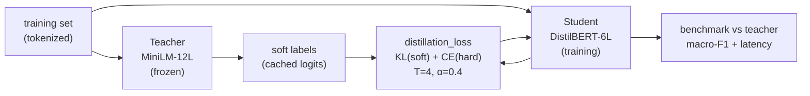

# Module 2.7 — Distillation: Shrink It Further (Optional)

> The intent classifier works. Now the question is: does it need to be 22M parameters at inference time? Knowledge distillation trains a smaller student model to mimic a larger teacher, recovering most of the quality at a fraction of the cost. This module teaches the mechanics and builds a distilled DeskMate intent classifier.

---

## Learning Goal

By the end of this module you can:

1. Explain what a student learns from soft labels that hard labels cannot teach.
2. Implement the Hinton distillation loss: KL divergence on temperature-scaled distributions.
3. Train a DistilBERT-66M student to match a MiniLM-22M teacher.
4. Benchmark the student against the teacher on quality (macro-F1) and latency.
5. Decide when distillation is worth the effort versus simply deploying the teacher.
6. Answer: *what does the student learn from soft labels that hard labels don't teach?*

---

## What the Student Learns from Soft Labels

With hard labels, every wrong class gets probability 0 and the correct class gets 1. A ticket labelled `billing_dispute` gives the model no information about how close it was to `billing_inquiry` or `refund_request`.

The teacher's output distribution tells a richer story:

```
billing_dispute :  0.82
billing_inquiry :  0.11
refund_request  :  0.05
account_access  :  0.01
...
```

This says: yes, it's `billing_dispute`, but it's also a bit like `billing_inquiry` and `refund_request`. The inter-class similarity structure is encoded in the probabilities. The student trained on these soft targets learns that `billing_dispute` and `billing_inquiry` are closer to each other than either is to `outage_report` — a regularity that zero/one labels cannot express.

This is the key insight: **soft labels are a compressed form of the teacher's generalisation knowledge**, and they act as strong regularisation for the student.

---

## The Hinton Distillation Loss

The full distillation loss combines two terms:

```
L = α × L_CE(y_hard, logits_student)
  + (1 - α) × T² × KL(softmax(logits_teacher / T) ‖ softmax(logits_student / T))
```

| Symbol | Meaning |
|---|---|
| `y_hard` | One-hot ground truth labels |
| `logits_student` | Student model output |
| `logits_teacher` | Teacher model output (frozen, no gradient) |
| `T` | Temperature: scales down the sharpness of both distributions |
| `α` | Mix weight: 0 = pure distillation, 1 = pure cross-entropy |
| `T²` | Compensates for the reduced gradient magnitude at high temperature |

### Why temperature?

At `T = 1` the teacher's distribution is often near-argmax (e.g., 0.97 / 0.02 / 0.01). The inter-class information lives in the tiny probabilities — KL divergence is dominated by the top class and the soft-label signal is nearly the same as a hard label.

At `T = 4`, the distribution is flattened:

```
T=1:  [0.97, 0.02, 0.01, ...]
T=4:  [0.61, 0.22, 0.11, ...]   ← much more informative
```

The student can now clearly learn the inter-class relationships. After training, the student is evaluated at `T = 1`.

Typical values: `T = 3–6`, `α = 0.3–0.5`.

---

## Implementation

### Step 1 — Generate teacher soft labels

Run the frozen teacher over the training set and cache its logits. Soft labels are generated once and stored; they don't change during student training.

```python
teacher.eval()
teacher_logits = []
with torch.no_grad():
    for batch in train_loader:
        out = teacher(**batch)
        teacher_logits.append(out.logits.cpu())
teacher_logits = torch.cat(teacher_logits)  # (N, num_labels)
```

### Step 2 — Distillation loss function

```python
import torch.nn.functional as F

def distillation_loss(student_logits, teacher_logits, hard_labels, T=4.0, alpha=0.4):
    # Cross-entropy on hard labels
    ce_loss = F.cross_entropy(student_logits, hard_labels)

    # KL divergence on temperature-scaled soft labels
    soft_teacher = F.log_softmax(teacher_logits / T, dim=-1)
    soft_student = F.log_softmax(student_logits / T, dim=-1)
    kd_loss = F.kl_div(soft_student, soft_teacher.exp(), reduction='batchmean') * (T ** 2)

    return alpha * ce_loss + (1 - alpha) * kd_loss
```

Note: `kl_div` expects `(log_input, target)`. We pass log-softmax of student as input and softmax of teacher as target.

### Step 3 — Training loop

The `Trainer` API doesn't natively support custom loss functions with cached teacher logits, so we use a custom training loop or a `Trainer` subclass with `compute_loss` overridden.

```python
class DistillationTrainer(Trainer):
    def __init__(self, teacher_logits, T=4.0, alpha=0.4, **kwargs):
        super().__init__(**kwargs)
        self.teacher_logits = teacher_logits  # pre-computed, on CPU
        self.T     = T
        self.alpha = alpha

    def compute_loss(self, model, inputs, return_outputs=False, **kwargs):
        labels = inputs.pop("labels")
        out    = model(**inputs)
        # Retrieve cached teacher logits for this batch (by position in dataset)
        batch_teacher = self.teacher_logits[self._batch_idx].to(out.logits.device)
        loss = distillation_loss(out.logits, batch_teacher, labels, self.T, self.alpha)
        return (loss, out) if return_outputs else loss
```

Tracking `self._batch_idx` requires incrementing a counter in a `training_step` callback — shown in the notebook.

---

## Student Architecture

We distil into `distilbert-base-uncased` (66M parameters):

| Model | Params | Layers | d_model |
|---|---|---|---|
| MiniLM-L12-H384 (teacher) | 22M | 12 | 384 |
| DistilBERT-base (student) | 66M | 6 | 768 |

Wait — the "student" is *bigger* here? In terms of parameters, yes. DistilBERT's d_model=768 vs MiniLM's 384 makes it larger. But **inference latency** depends on depth (number of sequential transformer layers) more than width. DistilBERT has 6 layers; MiniLM has 12. On CPU, DistilBERT is typically 40–50% faster for short sequences despite having more parameters.

The real distillation target in production would be an even smaller model (e.g., 4–6 layers, d_model=256). The module demonstrates the pattern; the size comparison is a deliberate teaching moment.

---

## When Is Distillation Worth It?

| Scenario | Worth it? |
|---|---|
| Latency budget < 10ms on CPU | Yes — 6-layer vs 12-layer matters |
| Serving >1000 requests/sec | Yes — cost compounds |
| Single researcher's laptop | No — deploy the teacher directly |
| Data is limited (<500 examples/class) | Marginal — teacher won't learn much to transfer |
| Production has GPU available | No — GPU cost difference is small; quality matters more |

Rule of thumb: distillation pays off when inference latency or throughput is a hard constraint *and* you have a strong teacher (>80% macro-F1 on the gold set). For DeskMate at this stage, it is likely premature — but the pattern is directly applicable if DeskMate scales to high traffic.

---

## Mermaid: Distillation Pipeline



---

## Notebook: What You'll Build (14_distillation.ipynb)

1. **Setup** — install, seed, load label maps, tokenizer.
2. **Load teacher** — MiniLM intent classifier from `models/intent_classifier/`.
3. **Generate soft labels** — run teacher over train set; save cached logits tensor.
4. **Load student** — `DistilBertForSequenceClassification` with `num_labels=15`.
5. **Distillation loss** — implement `distillation_loss()`; unit-test it on random inputs.
6. **DistillationTrainer** — subclass `Trainer`, override `compute_loss`; batch-index tracking.
7. **Train student** — 5 epochs (distillation typically needs more epochs than regular fine-tuning).
8. **Evaluate both** — side-by-side macro-F1 on the gold set.
9. **Latency benchmark** — time 100 inference calls for each model; compute throughput.
10. **Save student** — `models/intent_classifier_distilled/`.

---

## Deliverable

- `models/intent_classifier_distilled/` — distilled 6-layer classifier.
- Side-by-side benchmark: teacher macro-F1, student macro-F1, teacher latency, student latency.
- A written recommendation: deploy teacher or student for DeskMate's current scale?

---

## Checkpoint

> *What does the student learn from soft labels that hard labels don't teach?*

Strong answer: soft labels carry the teacher's inter-class similarity structure. A hard label tells the student only which class is correct. A soft label (e.g., `billing_dispute: 0.82, billing_inquiry: 0.11, refund_request: 0.05`) additionally tells the student how similar each wrong class is to the correct one. The student learns that `billing_dispute` is much closer to `billing_inquiry` than to `outage_report`. This similarity information acts as regularisation — the student generalises better to ambiguous examples than if trained only on hard labels, because it has learned the structure of the label space, not just the boundaries.

---

## What's Next

**Phase 3** — The decoder SLM: domain-adapted generation. You built the encoder pipeline (classify + extract). Now you adapt a 1–3B autoregressive model to generate support replies, using PEFT/LoRA to make the fine-tune affordable on free Colab.
