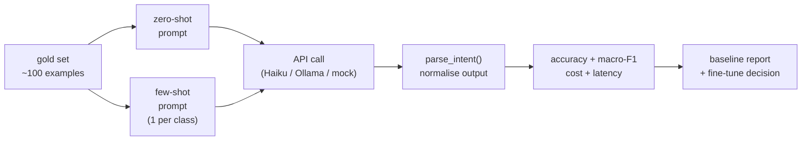

# Module 3.0 — Prompting Baselines: Zero- and Few-Shot Before You Fine-Tune

> Before writing a single training example, measure what the base model already does. The baseline is not a formality — it is the answer to "is fine-tuning actually necessary?" and the benchmark every subsequent module must beat.

---

## Learning Goal

By the end of this module you can:

1. Design a zero-shot and a few-shot prompt for intent classification.
2. Run batch inference against a hosted API and compute accuracy/F1 on the gold set.
3. Estimate cost-per-query and latency for both prompt strategies.
4. Apply the four-quadrant decision framework: when to prompt, when to fine-tune.
5. Answer: *your few-shot baseline hits 72% accuracy — how do you decide whether fine-tuning is worth the effort to reach 88%?*

---

## Why Baselines Come First

Every team that skips this step regrets it at least once. The failure mode is:

1. Spend two weeks preparing SFT data.
2. Fine-tune for three days.
3. Evaluate. Accuracy: 84%.
4. Discover the few-shot baseline was already at 81%.
5. Net gain: 3 points at 2 weeks of cost.

The baseline answers three questions before you commit resources:

- **Is fine-tuning necessary?** If the prompted base model is already within 5 points of your quality target, the answer is often no.
- **What does the fine-tune need to beat?** A number without a baseline is meaningless.
- **What prompt patterns should the SFT format reuse?** The few-shot examples that work well in prompting often become the seed training examples.

---

## The Decoder for Prompting Baselines

Phase 3 centres on decoder (autoregressive) models — Qwen2.5, SmolLM2, Phi-3-mini, Gemma-2 — rather than the encoders used in Phase 2. For prompting baselines we use an API-hosted model to avoid GPU setup. Two options:

| Path | Model | Cost | Setup |
|---|---|---|---|
| Anthropic API | `claude-haiku-4-5-20251001` | ~$0.001 / gold example | HF_TOKEN not needed; ANTHROPIC_API_KEY in Colab Secrets |
| Ollama (free) | `qwen2.5:1.5b` | $0 | Ollama installed locally; not usable on Colab |
| Mock (fallback) | deterministic stub | $0 | Works everywhere; returns random-but-seeded predictions |

The notebook auto-detects which path is available.

---

## Prompt Design

### Zero-shot prompt

```
You are a support ticket classifier. Read the ticket and output ONLY the intent label.
Valid intents: account_access, account_settings, billing_dispute, billing_inquiry,
cancellation, data_privacy, feature_request, onboarding, outage_report,
payment_failure, performance_issue, refund_request, technical_bug, usage_question,
out_of_scope

Ticket: {text}
Intent:
```

No examples. Tests the model's pre-existing knowledge of support-ticket language.

### Few-shot prompt

One example per intent class (15 examples total) prepended before the target ticket. The examples are drawn from the training set — never from the gold set.

```
You are a support ticket classifier. Output ONLY the intent label.

Examples:
Ticket: "I cannot log in, the password reset email never arrived."
Intent: account_access

Ticket: "I was charged twice for the Pro plan. Please refund the duplicate."
Intent: billing_dispute

... (13 more examples)

Ticket: {text}
Intent:
```

### Why one example per class?

- 15 examples × ~30 tokens each = ~450 tokens of context — well within any model's context limit.
- Covers every valid class so the model knows the full label space.
- More examples per class rarely help for classification but do add cost.

### Output parsing

The model is instructed to output only the label. In practice it sometimes outputs `"account_access."` or `"Intent: account_access"`. Normalise before scoring:

```python
def parse_intent(raw: str) -> str:
    raw = raw.strip().lower().rstrip(".,;:")
    # strip any "intent:" prefix the model may add
    for prefix in ("intent:", "label:", "answer:"):
        if raw.startswith(prefix):
            raw = raw[len(prefix):].strip()
    # match to known intents
    for intent in INTENTS:
        if intent in raw:
            return intent
    return "out_of_scope"   # fallback for unrecognised output
```

---

## Cost and Latency Estimation

### Cost per query

For `claude-haiku-4-5-20251001` (as of knowledge cutoff):

```
~450 tokens (few-shot prompt) + ~30 tokens (ticket) = ~480 input tokens
~5 tokens output (intent label)

Cost ≈ 480 × $0.00000025 + 5 × $0.00000125 = $0.00012 + $0.000006 ≈ $0.000126 / query
```

For 100 gold examples: ~$0.013. Negligible for a baseline run.

### Latency per query

API round-trip for a 5-token output: ~300–600ms. For 100 examples sequentially: ~45–60 seconds. Use async or batch API for larger sets.

### Compare to encoder inference

The fine-tuned MiniLM classifier (Module 2.4): ~5ms per example on CPU, $0.00 per query (self-hosted). This is the economic argument for fine-tuning at scale: prompting is 60× slower and costs money per query. At 10,000 queries/day that is ~$1.26/day → ~$460/year, vs one-time fine-tuning compute.

---

## The Fine-Tune Decision Framework

Four-quadrant model based on (quality gap) × (scale / cost sensitivity):

```
                    Low scale            High scale
                    (<1k queries/day)    (>10k queries/day)
                  ┌─────────────────────┬──────────────────────┐
 Gap < 5pp       │  Prompt. Done.      │  Prompt + cache.     │
 (baseline ≥     │  Fine-tune is       │  Consider fine-tune  │
  target - 5)    │  premature.         │  for cost only.      │
                  ├─────────────────────┼──────────────────────┤
 Gap ≥ 5pp       │  Evaluate effort.   │  Fine-tune.          │
 (baseline <     │  Is 5pp worth       │  ROI is clear.       │
  target - 5)    │  2 weeks of work?   │                      │
                  └─────────────────────┴──────────────────────┘
```

Applied to the checkpoint question: "few-shot baseline hits 72%, target is 88%, gap is 16pp."

- Is 16pp worth the effort? Yes — 72% accuracy on routing means 28% of tickets are mis-routed, which is operationally unacceptable.
- Additional signals: error analysis (are the 28% errors random or systematic?); data availability (do you have enough labeled examples for SFT?); deployment scale (if 10k tickets/day, the API cost of prompting is also prohibitive).

Conclusion for 72% baseline → 88% target: fine-tune.

---

## Mermaid: Baseline Evaluation Flow



---

## Notebook: What You'll Build (15_prompting_baselines.ipynb)

1. **Setup** — install `anthropic`; load label maps; load gold set.
2. **Prompt templates** — zero-shot and few-shot; build few-shot preamble from training examples.
3. **API client** — auto-detect Anthropic / Ollama / mock path.
4. **Zero-shot baseline** — run over gold set; measure accuracy, macro-F1, latency, cost.
5. **Few-shot baseline** — same metrics; compare to zero-shot.
6. **Error analysis** — which intents confuse the base model most?
7. **Cost projection** — extrapolate to 1k / 10k / 100k queries/day.
8. **Decision note** — print a structured recommendation: prompt vs fine-tune for DeskMate.

---

## Deliverable

- `reports/baseline_report.md` — scored baseline:
  - Zero-shot accuracy / macro-F1 / latency / cost
  - Few-shot accuracy / macro-F1 / latency / cost
  - Top-5 intent confusion pairs for the few-shot model
  - Fine-tune decision with justification
- Notebook run end-to-end (mock path works without any API key).

---

## Checkpoint

> *Your few-shot baseline hits 72% accuracy. How do you decide whether fine-tuning is worth the effort to reach 88%?*

Strong answer addresses four factors:
1. **Operational gap**: 16pp means 28% of tickets are mis-routed. Is that acceptable for this product? Almost certainly not for a support-routing system.
2. **Data availability**: do you have enough labeled examples to reach 88%? (Yes — Module 2.1 and 2.2 built a multi-thousand-example dataset.)
3. **Scale / cost**: at high query volume, API cost compounds; a self-hosted fine-tuned encoder is orders of magnitude cheaper per query.
4. **Error type**: if the 28% errors are random and uniformly distributed, fine-tuning will help. If they cluster on a few intents, targeted data augmentation (Module 2.2) may resolve it without full fine-tuning.

---

## What's Next

Module 3.1 — Choosing a base model. Now that the baseline is established and the fine-tune decision is made, pick the right small decoder: compare Qwen2.5-1.5B, SmolLM2-1.7B, and Phi-3-mini on license, context length, benchmark scores, and DeskMate fit.
