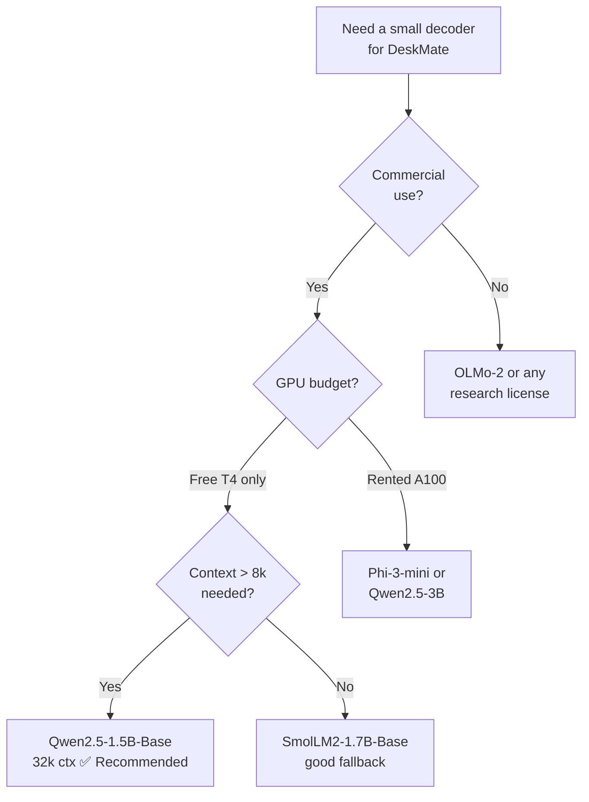

# Module 3.1 — Choosing a Base Model

> Every subsequent fine-tuning decision is constrained by the base model you pick. Get the license wrong and your model can't ship. Get the size wrong and it either won't fit in memory or will be slower than the encoder it was supposed to complement. This module maps the small-decoder landscape and makes a principled choice for DeskMate.

---

## Learning Goal

By the end of this module you can:

1. Name the key small-decoder families and their size ranges.
2. Read a model card for the four DeskMate-relevant properties: license, context length, base vs instruct, benchmark position.
3. Explain why base models are sometimes preferable to instruct models for fine-tuning.
4. Produce a comparison table and make a documented recommendation.
5. Answer: *why might you pick a base model over an instruct model for fine-tuning?*

---

## The Small-Decoder Landscape

"Small" for our purposes means 0.5–3B parameters — models that run inference on a free Colab T4 (16GB VRAM) and can be fine-tuned with LoRA in under 2 hours.

### Families and representative models (2024–2025)

| Family | Org | Representative sizes | License | Notes |
|---|---|---|---|---|
| **Qwen2.5** | Alibaba | 0.5B, 1.5B, 3B, 7B | Apache 2.0 | Strong multilingual; excellent at instruction following after SFT; Qwen2.5-1.5B is the DeskMate default |
| **SmolLM2** | HuggingFace | 135M, 360M, 1.7B | Apache 2.0 | Trained on high-quality curated data (FineWeb-Edu, DCLM); punches above its weight on reasoning tasks |
| **Phi-3-mini** | Microsoft | 3.8B | MIT | "Textbook quality" training data; strong reasoning; larger than the others but quantises to 4-bit easily |
| **Gemma-2** | Google | 2B, 9B | Gemma ToS | Technically strong; license restricts some commercial use cases — read carefully |
| **Llama-3.2** | Meta | 1B, 3B | Llama 3 Community | Wide ecosystem; 1B/3B fine-tuned variants widely available; Llama license allows commercial use under 700M MAU |
| **OLMo-2** | AI2 | 1B, 7B | Apache 2.0 | Fully open (weights, data, code); excellent for research; lower benchmark scores than Qwen/Phi at same size |

---

## What to Read on a Model Card

Four properties matter for DeskMate:

### 1. License

| License type | Commercial use | Modification | Redistribution |
|---|---|---|---|
| Apache 2.0 | ✅ Yes | ✅ Yes | ✅ Yes, with notice |
| MIT | ✅ Yes | ✅ Yes | ✅ Yes |
| Llama 3 Community | ✅ Yes (< 700M MAU) | ✅ Yes | ✅ Yes |
| Gemma ToS | Conditional | Yes | Restricted |
| Non-commercial research | ❌ No | Yes | Restricted |

**Rule:** if you might charge money for a product that uses the model, you need Apache 2.0, MIT, or equivalent. Do not assume "open weights" means "commercial use allowed".

### 2. Base vs Instruct

- **Base model** — trained only on next-token prediction over raw text. No system prompt, no chat template, no RLHF/DPO alignment. Raw language modelling.
- **Instruct model** — additionally fine-tuned (SFT + RLHF or DPO) to follow instructions, refuse harmful requests, and use a specific chat template format.

### Why pick base for fine-tuning?

When you SFT an instruct model on a domain task, you are fine-tuning on top of an already-aligned model. Two problems arise:

1. **Chat template collision**: instruct models expect `[INST]...[/INST]` or `<|user|>...<|assistant|>` wrappers. If your SFT data doesn't use the same template, the model partially ignores your training data or produces garbled outputs.
2. **RLHF interference**: RLHF pushed the model's weights toward a general "helpful assistant" behaviour. Your domain SFT may fight this bias for support-ticket vocabulary and formatting, requiring more steps to converge.

When you SFT a base model, the model has no prior instruction format to conflict with. Your SFT data defines the format from scratch — cleaner and more predictable.

**Exception**: if you need general chat capabilities plus domain knowledge (e.g., DeskMate's decoder should also handle free-form support replies), start from an instruct model and fine-tune with the same chat template. For pure classification or structured-output tasks, base is usually better.

### 3. Context length

Support tickets average 30–80 tokens. A context of 2k is more than enough. All candidates here support ≥2k; Qwen2.5 and SmolLM2 support 32k out of the box.

Context length affects KV-cache memory at serving time. For DeskMate's use case this is not a bottleneck, but it matters for RAG (Phase 4) where you concatenate retrieved documents.

### 4. Benchmark position

Use as a rough sanity check, not an absolute truth. The benchmarks that matter most for support-desk NLP:

- **MMLU** — general knowledge; proxy for how much world knowledge was baked in
- **HellaSwag** — commonsense completion; correlates with fluency
- **ARC-Challenge** — reasoning; correlates with instruction-following quality after SFT
- **MT-Bench** — open-ended chat; most relevant if building conversational DeskMate

For our task (intent classification baseline + support reply generation), MMLU and MT-Bench are the most predictive.

---

## DeskMate Candidate Comparison

| Property | Qwen2.5-1.5B-Base | SmolLM2-1.7B-Base | Phi-3-mini-4k-instruct |
|---|---|---|---|
| Params | 1.5B | 1.7B | 3.8B |
| License | Apache 2.0 ✅ | Apache 2.0 ✅ | MIT ✅ |
| Base / Instruct | Base | Base | Instruct |
| Context length | 32k | 8k | 4k |
| MMLU (5-shot) | ~60% | ~49% | ~68% |
| Colab T4 fit (fp16) | ✅ 3GB VRAM | ✅ 3.4GB VRAM | ⚠️ 7.6GB VRAM |
| Colab T4 fit (4-bit) | ✅ ~1GB | ✅ ~1GB | ✅ ~2GB |
| LoRA fine-tune time (T4, 3 epochs) | ~45 min | ~50 min | ~90 min |
| Multilingual | Strong | Moderate | English-focused |
| Ecosystem / community | Large | Growing | Large |
| **DeskMate fit** | ✅ **Recommended** | Good fallback | Good if GPU available |

---

## Recommendation: Qwen2.5-1.5B-Base

**Why Qwen2.5-1.5B-Base:**

1. **Apache 2.0 license** — no restrictions on commercial use.
2. **Fits in free Colab T4 at fp16** without quantisation — simpler setup, no precision-related bugs.
3. **32k context** — future-proofs for RAG (Phase 4) without a model swap.
4. **Strong MMLU for its size** — more world knowledge baked in than SmolLM2, which pays off on the long tail of support topics.
5. **Base model** — clean SFT without chat-template collision.
6. **Active ecosystem** — large community of fine-tuned variants to learn from.

**When to switch:**
- **SmolLM2-1.7B** if you want a fully open, reproducible training stack (AI2-style).
- **Phi-3-mini** if quality ceiling matters more than compute cost and you have a T4 or better.
- **Qwen2.5-1.5B-Instruct** instead of Base if DeskMate needs to also handle open-ended chat without task-specific fine-tuning.

---

## How to Read the HF Model Card (Checklist)

```
☐ License — Apache 2.0 / MIT / other?
☐ Base or instruct?
☐ Chat template (if instruct) — what format does it expect?
☐ context_length in config.json — rope_scaling?
☐ Benchmark table — MMLU, HellaSwag, ARC-C
☐ Tokenizer type — BPE? SentencePiece? Tiktoken?
☐ Known issues / limitations section
☐ Paper or tech report link
```

For Qwen2.5-1.5B-Base:

```python
from transformers import AutoConfig

config = AutoConfig.from_pretrained("Qwen/Qwen2.5-1.5B")
print(config.model_type)           # qwen2
print(config.num_hidden_layers)    # 28
print(config.hidden_size)          # 1536
print(config.max_position_embeddings)  # 131072 (uses RoPE scaling)
print(config.vocab_size)           # 151936
```

---

## Mermaid: Model Selection Decision



---

## Deliverable

`modules/phase_3/3.1_base_model_selection/3.1_base_model_selection.md` (this file).

The comparison table above is the deliverable. Key outputs:
- Three candidates evaluated on: params, license, base/instruct, context, MMLU, T4 fit, fine-tune time.
- **Recommendation: Qwen2.5-1.5B-Base** for DeskMate.
- Decision checklist for reading any future model card.

---

## Checkpoint

> *Why might you pick a base model over an instruct model for fine-tuning?*

Strong answer covers two reasons:
1. **No chat-template collision**: instruct models bake in a specific prompt format (e.g., `[INST]...[/INST]`). SFT data that doesn't match this template fights the model's learned format, producing inconsistent outputs or requiring extra steps to override.
2. **No RLHF interference**: RLHF pushed the weights toward "helpful assistant" behaviour. For a narrow domain task (intent classification, structured extraction), this prior is noise — your domain SFT must overcome it rather than build on it.

A base model starts with no format assumptions: your SFT defines the behaviour from scratch, giving you tighter control and faster convergence on the target task.

---

## What's Next

Module 3.1a (optional) — Domain-Adaptive Pretraining (DAPT): continued next-token prediction on raw support-desk text before SFT. Relevant if your domain vocabulary diverges strongly from the base model's pretraining distribution.

Module 3.2 — SFT data preparation: format the Bitext `instruction→response` pairs and your synthetic replies into the Qwen2.5 SFT format; build the DataCollator for instruction tuning.
