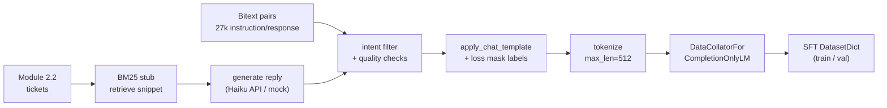

# Module 3.2 — Data Prep for Instruction Fine-Tuning (SFT)

> The encoder pipeline classifies and extracts. The decoder pipeline generates support replies. Before the model can learn to reply, you need to show it what a reply looks like — in exactly the format it expects. This module builds that dataset.

---

## Learning Goal

By the end of this module you can:

1. Explain what a chat template is and why the model requires the exact format it was trained with.
2. Apply loss masking: train on response tokens only, not prompt tokens.
3. Build a DeskMate SFT dataset from Bitext instruction/response pairs and synthetic grounded replies.
4. Use a retrieval stub (BM25) to condition synthetic replies on document context.
5. Inspect token counts and flag examples that exceed the context budget.
6. Answer: *why do we mask the prompt tokens from the loss?*

---

## Chat Templates

Every decoder model that has been instruction-tuned expects a specific wrapping around the user/assistant turn. Qwen2.5-Base has no built-in chat template (it is a base model). When we SFT it, we choose a template and apply it consistently across all training examples and at inference time.

We use the standard Qwen2.5-Instruct chat template format for our SFT data — this makes the fine-tuned model compatible with `AutoTokenizer.apply_chat_template`:

```
<|im_start|>system
You are DeskMate, a concise support assistant. Respond in 2–4 sentences.<|im_end|>
<|im_start|>user
{ticket}<|im_end|>
<|im_start|>assistant
{reply}<|im_end|>
```

Special tokens:
- `<|im_start|>` / `<|im_end|>` — turn delimiters; already in Qwen2.5's vocabulary.
- The tokenizer's `eos_token` is appended after the final `<|im_end|>` so the model learns when to stop.

**The format must be applied identically at fine-tuning time and at inference time.** A mismatch causes the model to generate garbage or refuse to stop — the most common SFT debugging bug.

---

## Prompt Loss Masking

During SFT, the model is trained to predict the next token at every position. But we only care about the model learning to generate good *replies* — not to predict the system prompt or the user's ticket (which it sees as fixed input context, not something it generates).

Loss masking sets the label for all prompt tokens to `-100` (PyTorch's cross-entropy ignore index):

```
Token sequence:  <|im_start|> system \n You ... <|im_end|> <|im_start|> user \n {ticket} <|im_end|> <|im_start|> assistant \n {reply} <|im_end|>
Labels:          -100         -100   -100 -100  -100       -100         -100 -100 -100    -100       -100            real  real  real   real
```

Only the response tokens (after `<|im_start|>assistant\n`) contribute to the loss.

**Why?** Without masking, the model spends most of its gradient budget learning to predict the system prompt and user ticket — text that is deterministic from the training data, not the model's job. Masking focuses the loss entirely on the generation quality. Empirically, masked SFT converges faster and produces fewer "prompt-echoing" outputs.

---

## SFT Data Sources

### Source 1: Bitext instruction/response pairs

The `bitext/Bitext-customer-support-llm-chatbot-training-dataset` (Module 2.1) contains 27k `instruction→response` pairs across 27 intent categories with human-written responses. These are gold-quality SFT examples.

Mapping: use the same intent mapping from Module 2.1 to select examples in DeskMate's 15-class schema. Filter to keep only examples where the intent maps cleanly (exclude `out_of_scope`).

### Source 2: Synthetic grounded replies

The synthetic generator (Module 2.2) produced labeled tickets. We now extend it to generate *replies* conditioned on a retrieved document snippet — simulating the RAG-augmented production flow without building the full RAG stack yet.

**Retrieval stub (BM25):** keyword search over a small synthetic FAQ corpus. The retrieved snippet is injected into the prompt:

```
<|im_start|>system
You are DeskMate. Use the provided context to answer the ticket in 2–4 sentences.<|im_end|>
<|im_start|>user
Context: {retrieved_snippet}

Ticket: {ticket_text}<|im_end|>
<|im_start|>assistant
{synthetic_reply}<|im_end|>
```

The BM25 stub is replaced by the full dense retriever in Phase 4. For now, it ensures the model learns to use context — which is the SFT objective — not the quality of the retriever.

---

## Data Quality Over Quantity

The most common SFT mistake is prioritising quantity. 10,000 mediocre examples consistently underperform 500 excellent ones.

Quality filters for DeskMate SFT data:

| Filter | Threshold | Why |
|---|---|---|
| Response length | 20–200 tokens | Too short = no signal; too long = the model learns to pad |
| No hallucinated product names | regex check against known products | Prevents confabulation contaminating training |
| No prompt leakage | response must not start with `Context:` or `Ticket:` | Catches generation failures |
| No near-duplicates | cosine sim < 0.92 on reply embedding | Prevents the model memorising one reply formula |
| Faithfulness | reply must reference the intent category | Weak proxy for grounded response |

---

## Token Budget

Qwen2.5-1.5B supports 32k context. For SFT with LoRA on a T4 (16GB VRAM):

- **Max sequence length for training: 512 tokens** — longer sequences increase memory quadratically with attention.
- System prompt: ~20 tokens
- User turn (ticket): ~30–80 tokens
- Assistant turn (reply): ~50–150 tokens
- Total typical: ~100–250 tokens — well within 512.

Any example exceeding 512 tokens is truncated or discarded. Log the count.

---

## DataCollator for SFT

We use `DataCollatorForSeq2Seq` (or `trl`'s built-in collator with `DataCollatorForCompletionOnlyLM`) to handle:

1. Padding sequences to the batch maximum.
2. Setting prompt token labels to `-100`.
3. Returning `input_ids`, `attention_mask`, `labels`.

```python
from trl import DataCollatorForCompletionOnlyLM

response_template = "<|im_start|>assistant\n"
collator = DataCollatorForCompletionOnlyLM(
    response_template=response_template,
    tokenizer=tokenizer,
)
```

`DataCollatorForCompletionOnlyLM` finds the `response_template` string in each tokenized example and masks everything before it with `-100` automatically.

---

## Full Pipeline

```python
def format_example(ticket, reply, context=None):
    system = "You are DeskMate, a concise support assistant. Respond in 2-4 sentences."
    if context:
        user_content = "Context: " + context + "\n\nTicket: " + ticket
    else:
        user_content = ticket
    messages = [
        {"role": "system",    "content": system},
        {"role": "user",      "content": user_content},
        {"role": "assistant", "content": reply},
    ]
    return tokenizer.apply_chat_template(
        messages, tokenize=False, add_generation_prompt=False)

def tokenize_sft(example):
    text = format_example(example["ticket"], example["reply"],
                           example.get("context"))
    enc  = tokenizer(text, truncation=True, max_length=512, padding=False)
    enc["labels"] = enc["input_ids"].copy()
    return enc
```

---

## Mermaid: SFT Data Pipeline



---

## Notebook: What You'll Build (16_sft_dataprep.ipynb)

1. **Setup** — install `trl`, `rank-bm25`; load tokenizer for Qwen2.5-1.5B.
2. **Bitext source** — load dataset, filter to DeskMate intents, sample balanced set.
3. **Synthetic FAQ corpus** — build a small 15-doc corpus (one per intent); BM25 index.
4. **Synthetic replies** — for each ticket from Module 2.2, retrieve snippet + generate reply via Haiku API / mock.
5. **Quality filters** — apply all 5 filters; log pass/fail counts.
6. **Chat template** — `apply_chat_template`; verify `<|im_start|>` / `<|im_end|>` present.
7. **Tokenize** — `map(tokenize_sft, batched=False)`; token length distribution; drop >512.
8. **Loss mask demo** — print one example with labels; show `-100` at prompt positions.
9. **DataCollator** — `DataCollatorForCompletionOnlyLM`; one batch through a DataLoader; verify shapes.
10. **Save** — `save_to_disk("data/processed/sft_dataset")`; print final split sizes.

---

## Deliverable

- `data/processed/sft_dataset/` — tokenized SFT `DatasetDict` with loss-masked labels.
- Final dataset stats: total examples, token length distribution (median, p95), examples dropped.
- One annotated example showing `input_ids`, `attention_mask`, `labels` with `-100` positions marked.

---

## Checkpoint

> *Why do we mask the prompt tokens from the loss?*

Strong answer: the loss function measures how well the model predicts the next token. Prompt tokens (system message, user ticket) are fixed context that the model receives as input — predicting them teaches the model nothing useful about how to *respond*. If prompt tokens are included in the loss, the gradient budget is wasted on learning to reproduce the system prompt and user text, which are already determined. Masking with `-100` (cross-entropy ignore index) focuses 100% of the gradient on the assistant reply tokens, where the model needs to improve. Practically: masked SFT converges faster, produces fewer "prompt-echoing" outputs (where the model repeats the ticket back instead of answering), and achieves higher reply quality per training step.

---

## What's Next

Module 3.3 — PEFT theory: LoRA and QLoRA. Before running the fine-tune, understand what LoRA does to the weight matrices, how rank `r` controls the parameter budget, and how QLoRA adds 4-bit quantisation to make full-model fine-tuning fit on a free T4.
