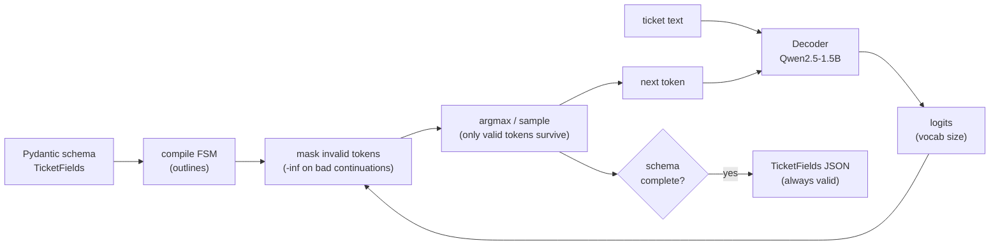

# Module 3.2a — Structured / Constrained Decoding for Extraction

> Standard decoding lets the model generate any token. Constrained decoding uses an output schema to make malformed output structurally impossible. This module builds a JSON-schema-constrained extractor using `outlines` and benchmarks it against the NER head from Module 2.5.

---

## Learning Goal

By the end of this module you can:

1. Explain how token-level logit masking enforces a schema at decoding time.
2. Use `outlines` to generate guaranteed-valid JSON from any HuggingFace model.
3. Compare constrained decoding vs a fine-tuned NER head on extraction F1, latency, and malformed-output rate.
4. Answer: *constrained decoding guarantees a valid JSON structure — what does it NOT guarantee, and when would you still prefer a fine-tuned NER head?*

---

## The Problem with Free-Form Extraction

A decoder asked to output a JSON object will usually comply — but not always:

```
Prompt:  Extract product, version, os as JSON. Ticket: "DeskMate Pro v2.3 on Windows 10"
Output:  {"product": "DeskMate Pro", "version": "v2.3"   ← missing closing brace
Output:  product=DeskMate Pro, version=v2.3              ← wrong format entirely
Output:  The product is DeskMate Pro, version v2.3       ← prose instead of JSON
```

Any downstream parser must handle all three failure modes. At scale, even a 1% malformed-output rate is operationally painful.

---

## How Constrained Decoding Works

At each decoding step, the model produces logits over its full vocabulary (~150k tokens for Qwen2.5). Constrained decoding builds a finite-state machine (FSM) from the target schema and uses it to mask out every token that would violate the schema at that point in the sequence:

```
Current output so far: {"product": "
Valid next tokens: any character token (continuing the string value)
Invalid tokens: "}", ":", "[", ... (would close or malform the JSON)
→ Logits for invalid tokens set to -inf before softmax
```

The FSM advances with each generated token. At every step, only schema-valid continuations survive. The result is structurally guaranteed — not probabilistically likely, but *provably* valid.

**Libraries:** `outlines` (most ergonomic, Pydantic-based schema), `lm-format-enforcer`, `guidance`.

---

## `outlines` API

```python
import outlines
from pydantic import BaseModel
from typing import Optional

class TicketFields(BaseModel):
    product:    str
    version:    str
    os:         Optional[str] = None
    error_code: Optional[str] = None

model     = outlines.models.transformers("Qwen/Qwen2.5-1.5B")
generator = outlines.generate.json(model, TicketFields)

result = generator(
    "Extract the fields as JSON. Ticket: "
    "'DeskMate Pro v2.3 crashes with ERR_404 on Windows 10'"
)
# result is always a TicketFields instance — never malformed
print(result.product)    # "DeskMate Pro"
print(result.version)    # "v2.3"
print(result.os)         # "Windows 10"
print(result.error_code) # "ERR_404"
```

The generator wraps the model and intercepts its logit output at each step. The Pydantic schema is compiled into a JSON schema, then into an FSM that drives the token masking.

---

## What Constrained Decoding Does NOT Guarantee

This is the critical distinction:

| Guarantee | Constrained decoding | Fine-tuned NER |
|---|---|---|
| Output is valid JSON | ✅ Always | ✅ When trained correctly |
| Field names match schema | ✅ Always | ✅ Always |
| Field *values* are correct | ❌ Never | ✅ When trained |
| Works zero-shot | ✅ Yes (with a capable model) | ❌ Requires labeled spans |
| Generalises to new fields | ✅ Just update schema | ❌ Requires retraining |
| Latency | ❌ Slower (FSM per step) | ✅ Faster (single forward pass) |

**What it doesn't guarantee:** semantic correctness. If the ticket says "I'm using version 2.3" and the model fills `version = "2"`, the JSON is valid but wrong. The model must still understand what `version` means in context.

### When to prefer fine-tuned NER (Module 2.5)

- High-throughput production (thousands of tickets/second) — NER is one encoder forward pass; constrained decoding is N autoregressive steps.
- Domain has consistent, learnable span patterns — the NER head learns them precisely.
- Compute budget is tight — NER on a 22M encoder is far cheaper than a 1.5B decoder.

### When to prefer constrained decoding

- Schema evolves frequently — adding a new field requires no retraining, just schema update.
- Zero-shot or few-shot deployment — no labeled span data available.
- The model is already deployed for generation and extraction is a secondary task — avoids maintaining a separate NER model.

---

## Benchmark: Constrained Decoding vs NER Head

We compare on the gold set from Module 2.1 (examples with annotated fields):

| Metric | NER head (Module 2.5) | Constrained decoding |
|---|---|---|
| Extraction F1 (seqeval) | Trained model result | Zero-shot result |
| Malformed-output rate | 0% (always valid BIO) | 0% (schema-enforced) |
| Latency (per ticket, CPU) | ~5ms | ~200–500ms |
| Schema change cost | Retrain | Edit Pydantic class |

The notebook runs both and prints this table with real numbers.

---

## Mermaid: Constrained Decoding Flow



---

## Notebook: What You'll Build (17_constrained_decoding.ipynb)

1. **Setup** — install `outlines`; load Qwen2.5-1.5B (or a smaller model for speed).
2. **Pydantic schema** — define `TicketFields` with `product`, `version`, `os`, `error_code`.
3. **FSM demo** — show token masking in action on one example.
4. **Batch extraction** — run constrained decoding over gold examples with fields.
5. **NER comparison** — load Module 2.5 field extractor; run same examples.
6. **Metrics** — extraction F1, malformed-output rate, latency for both.
7. **Comparison table** — print the four-metric side-by-side table.
8. **Schema evolution demo** — add `error_code` field to schema; show it works with zero additional training.

---

## Deliverable

- `reports/constrained_decoding_benchmark.md` — four-metric comparison table.
- Notebook run end-to-end (falls back to a small model if Qwen2.5-1.5B is unavailable).
- A written recommendation: which extractor should DeskMate use in production?

---

## Checkpoint

> *Constrained decoding guarantees a valid JSON structure. What does it NOT guarantee, and when would you still prefer a fine-tuned NER head?*

Strong answer: constrained decoding guarantees structural validity (no malformed JSON, all required fields present) but makes no guarantees about semantic correctness — the model can still hallucinate values or misidentify spans. A fine-tuned NER head (Module 2.5) learns precise span boundaries from labeled examples and is 40–100× faster at inference (single encoder forward pass vs N autoregressive steps). Prefer NER when: the schema is stable, training data exists, and throughput matters. Prefer constrained decoding when: the schema evolves, no labeled span data is available, or the decoder is already deployed for generation and extraction is a secondary task.

---

## What's Next

Module 3.3 — PEFT theory: LoRA and QLoRA. Understanding the memory math before running the fine-tune.
