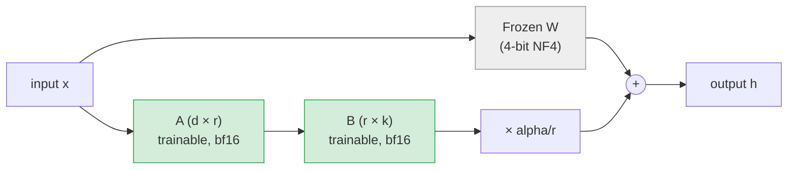

# Module 3.3 — PEFT Theory: LoRA & QLoRA

> Full fine-tuning a 1.5B-parameter model requires storing the model weights, the gradients, and the optimiser states — roughly 24 GB for Adam in fp32. A free Colab T4 has 16 GB. This module explains the two tricks that make it fit: LoRA (train only low-rank update matrices) and QLoRA (store the frozen base in 4-bit).

---

## Learning Goal

By the end of this module you can:

1. Explain what LoRA does to a weight matrix and why it reduces trainable parameters.
2. Define rank `r`, `lora_alpha`, and which modules to target.
3. Describe how QLoRA extends LoRA with 4-bit base quantisation.
4. Do the memory arithmetic for a 1.5B-parameter model with and without QLoRA.
5. Answer: *roughly what fraction of parameters does LoRA train, and why does that slash memory?*

---

## Full Fine-Tuning: The Memory Problem

For a model with parameter count `N` (in fp32, 4 bytes each):

| Component | Memory |
|---|---|
| Model weights | `4N` bytes |
| Gradients | `4N` bytes |
| Adam optimiser (m + v) | `8N` bytes |
| **Total** | **`16N` bytes** |

For Qwen2.5-1.5B (`N ≈ 1.5 × 10⁹`):

```
16 × 1.5 × 10⁹ bytes = 24 GB
```

A free Colab T4 has 16 GB VRAM. Full fine-tuning at fp32 is impossible. Even bf16 (2 bytes per weight) still needs ~12 GB for weights alone, plus gradients and optimiser states.

---

## LoRA: Low-Rank Adaptation

### The idea

Every weight matrix `W` in a transformer is large. When you fine-tune a large pretrained model on a small downstream task, the *change* to `W` that the model needs to learn has been empirically shown to have low intrinsic rank — most of the "update signal" lives in a much smaller subspace.

LoRA exploits this: instead of updating `W` directly, freeze `W` and learn two small matrices `A` (shape `d × r`) and `B` (shape `r × k`) such that the effective update is:

```
W_effective = W + B · A   (where W is frozen, only A and B are trained)
```

The forward pass becomes:

```
h = x W^T + x A^T B^T
  = x W^T + (xA^T) B^T       ← A collapses d→r, B expands r→k
```

`A` is initialised with random Gaussian; `B` is initialised to zero — so at the start of training, `B·A = 0` and the model is identical to the pretrained base.

### Why this slashes parameters

For a single attention projection `W_q` of shape `(d_model, d_model)` with `d_model = 1536` (Qwen2.5-1.5B):

```
Original W_q          : 1536 × 1536 = 2,359,296 parameters
LoRA with r=16        : 1536×16 + 16×1536 = 49,152 parameters (2.1% of original)
```

Across all targeted linear layers, LoRA trains roughly **0.5–2% of total parameters** — the exact fraction depends on `r` and which modules are targeted.

### Memory savings

Only `A` and `B` need gradients and optimiser states. The frozen `W` needs neither:

| Component | Full FT | LoRA (r=16) |
|---|---|---|
| Model weights (stored) | `4N` | `4N` (fp16/bf16 ≈ `2N`) |
| Trainable params | `N` | `~0.01N` |
| Gradients | `4N` | `4 × 0.01N` |
| Adam states | `8N` | `8 × 0.01N` |
| **Gradient + optimiser total** | `12N` | `~0.12N` |

The base model weights are stored but frozen — they do not need gradient tracking (`requires_grad=False`).

---

## LoRA Hyperparameters

### Rank `r`

Controls the dimension of the update subspace. Larger `r` → more expressivity → more parameters to train.

| `r` | Trainable params (approx) | When to use |
|---|---|---|
| 4 | ~0.1% of base | Tiny datasets (<200 examples); severe compute constraints |
| 8 | ~0.2% | Default starting point for most tasks |
| 16 | ~0.4% | DeskMate default — good balance for SFT |
| 32 | ~0.8% | Richer tasks; diminishing returns after r=32 for most domains |
| 64+ | >1% | Rarely necessary; full fine-tuning often better at this point |

### `lora_alpha`

A scaling constant applied to the LoRA update:

```
output += (lora_alpha / r) × B·A·x
```

The effective learning rate of the LoRA update scales with `lora_alpha / r`. Common convention: set `lora_alpha = 2 × r` (e.g., `r=16, alpha=32`). This keeps the effective scale constant as you change `r`.

### Target modules

Which linear layers to apply LoRA to. For transformer decoders, the most impactful modules are:

```python
target_modules = ["q_proj", "k_proj", "v_proj", "o_proj",   # attention
                  "gate_proj", "up_proj", "down_proj"]        # FFN (SwiGLU)
```

Using `target_modules = "all-linear"` targets every `nn.Linear` layer — more parameters but also more capability. Safe starting point for SFT.

### `lora_dropout`

Dropout applied to the LoRA matrices during training. `0.05` is standard. Set to `0` for inference.

---

## QLoRA: 4-Bit Quantised Base + LoRA

QLoRA (Dettmers et al., 2023) adds one more trick: store the frozen base weights in 4-bit precision instead of 16-bit, then dequantise them on-the-fly to bf16 for the forward/backward pass through `A` and `B`.

### NF4 quantisation

NF4 (NormalFloat4) is the 4-bit data type used by QLoRA. It is optimally suited for normally distributed weights (which most transformer weights approximately are):

- 16 quantisation levels, spaced to match the normal distribution.
- Stored in 4 bits per parameter; dequantised to bf16 at compute time.
- Memory: `0.5N` bytes for the base weights (vs `2N` for bf16).

### Double quantisation

The quantisation constants themselves are quantised (from fp32 → fp8), saving an additional ~0.4 GB for a 1.5B model.

### QLoRA memory for Qwen2.5-1.5B

```
Base weights (NF4, 4-bit)    : 0.5 × 1.5B × 1 byte   ≈  0.75 GB
LoRA trainable params (bf16) : 0.01 × 1.5B × 2 bytes  ≈  0.03 GB
Gradients (LoRA only, fp32)  : 0.01 × 1.5B × 4 bytes  ≈  0.06 GB
Adam states (LoRA only)      : 0.01 × 1.5B × 8 bytes  ≈  0.12 GB
Activations + KV cache       : ~1–3 GB (seq_len=512)
─────────────────────────────────────────────────────────────────
Total                        : ≈ 2–4 GB   (fits comfortably in 16 GB T4)
```

Without QLoRA (bf16 base + LoRA): ~4–6 GB — still fits, but less headroom for batch size.

---

## Architecture Diagram



The frozen base (`W`) is dequantised to bf16 for each forward pass, then discarded. Only `A` and `B` accumulate gradients.

---

## BitsAndBytesConfig

```python
from transformers import BitsAndBytesConfig

bnb_config = BitsAndBytesConfig(
    load_in_4bit=True,
    bnb_4bit_quant_type="nf4",           # NormalFloat4
    bnb_4bit_compute_dtype="bfloat16",   # dequantise to bf16 for compute
    bnb_4bit_use_double_quant=True,      # double quantisation
)

model = AutoModelForCausalLM.from_pretrained(
    "Qwen/Qwen2.5-1.5B",
    quantization_config=bnb_config,
    device_map="auto",                   # place layers across GPUs/CPU automatically
)
```

### `device_map="auto"`

For a single T4, all layers land on `cuda:0`. For multi-GPU or CPU offloading, `device_map="auto"` places layers greedily to fill VRAM first, then overflow to CPU RAM. For DeskMate, single GPU is assumed.

---

## LoRA Config

```python
from peft import LoraConfig, TaskType

lora_config = LoraConfig(
    r=16,
    lora_alpha=32,
    target_modules="all-linear",
    lora_dropout=0.05,
    bias="none",                   # do not add LoRA to bias terms
    task_type=TaskType.CAUSAL_LM,
)
```

After applying `get_peft_model(model, lora_config)`, inspect what is trainable:

```python
model.print_trainable_parameters()
# → trainable params: 11,534,336 || all params: 1,555,034,112 || trainable%: 0.7416
```

~0.74% of parameters are trained. The rest are frozen.

---

## Saving and Merging Adapters

LoRA saves only the `A` and `B` matrices — a few MB per checkpoint rather than GB:

```python
# Save only the LoRA adapter
model.save_pretrained("models/deskmate-lora-adapter/")

# At inference: load base + adapter
from peft import PeftModel
base    = AutoModelForCausalLM.from_pretrained("Qwen/Qwen2.5-1.5B", ...)
adapter = PeftModel.from_pretrained(base, "models/deskmate-lora-adapter/")

# Optional: merge adapter into base weights for faster inference
merged = adapter.merge_and_unload()  # returns a standard AutoModelForCausalLM
```

After merging, the model runs at the same speed as the original base — there is no LoRA overhead. Merging is recommended for production serving.

---

## Common Pitfalls

| Pitfall | Symptom | Fix |
|---|---|---|
| `bitsandbytes` not installed | `ValueError: ... quantization_config requires bitsandbytes` | `pip install bitsandbytes` |
| `device_map` on CPU-only machine | Quantised model tries to load on CUDA, fails | `device_map="cpu"` for testing; real run needs GPU |
| Gradient checkpointing + LoRA | `RuntimeError` about in-place ops on leaf tensors | Add `model.enable_input_require_grads()` before training |
| `lora_alpha` too small | LoRA update effectively zero; loss doesn't move | Use `alpha = 2 × r` as baseline |
| Training full model instead of LoRA | GPU OOM immediately | Call `get_peft_model()` before `Trainer` |
| Saving base model instead of adapter | Checkpoint is 3 GB instead of 10 MB | Check `type(model)` — should be `PeftModelForCausalLM` |

---

## Deliverable

This module is theory-only. The deliverable is understanding the mechanics well enough to configure `BitsAndBytesConfig` and `LoraConfig` correctly in Module 3.4.

Quick self-check:
- Can you write the forward pass equation for LoRA? (`h = xW^T + x A^T B^T`)
- Can you calculate trainable parameters for `r=16` on Qwen2.5-1.5B?
- Can you explain why `bnb_4bit_compute_dtype="bfloat16"` — what is stored vs what is computed?

---

## Checkpoint

> *Roughly what fraction of parameters does LoRA train, and why does that slash memory?*

Strong answer: LoRA trains roughly 0.5–2% of parameters (the exact fraction depends on rank `r` and which modules are targeted — for Qwen2.5-1.5B with `r=16` and `all-linear`, ~0.74%). Memory is slashed because only the trainable parameters need gradients and optimiser states. In full fine-tuning, Adam stores momentum and variance for every parameter, costing `8N` bytes for optimiser states alone. With LoRA, those states cover only the ~0.01N trainable parameters — a 100× reduction in optimiser memory. The frozen base weights still occupy VRAM but require no gradient tracking (`requires_grad=False`), so they are just read-only buffers. QLoRA additionally compresses those frozen weights to 4-bit, halving their memory footprint again.

---

## What's Next

Module 3.4 — Run the QLoRA fine-tune. Load Qwen2.5-1.5B in 4-bit with `bitsandbytes`, apply the LoRA config, and run `SFTTrainer` on the dataset from Module 3.2. Smoke-test with 200 examples on free Colab first; then launch the full run on a rented A100.
