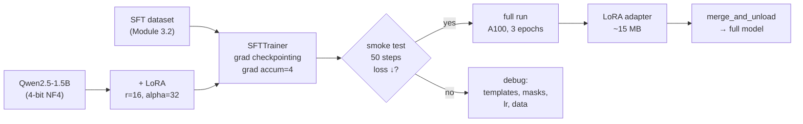

# Module 3.4 — Run the QLoRA Fine-Tune

> All the setup is done: the data is formatted and tokenized (3.2), the architecture is understood (3.3), the base model is chosen (3.1). This module runs the actual fine-tune — smoke-test first on 200 examples for free, then the full run on a rented GPU.

---

## Learning Goal

By the end of this module you can:

1. Load a 4-bit quantised model with `bitsandbytes` and apply a LoRA config with `peft`.
2. Use `SFTTrainer` from `trl` with gradient accumulation and gradient checkpointing.
3. Apply the smoke-test-first discipline: verify loss drops over 50 steps before paying for compute.
4. Save a LoRA adapter, reload it, and optionally merge it into the base weights.
5. Inspect before/after sample outputs to verify the fine-tune is working qualitatively.
6. Answer: *which two memory-saving techniques let this fit in 16 GB, and what do they cost you?*

---

## The Smoke-Test-First Discipline

Before committing a rented GPU hour, run 50 training steps on 200 examples on the free Colab T4. Check exactly one thing: **does the training loss decrease?**

If loss does not decrease over 50 steps, something is wrong — bad data format, wrong chat template, masked labels applied incorrectly, learning rate too high or too low. Fix it for free before paying.

If loss decreases, the training setup is correct. Launch the full run.

```
Smoke test: 200 examples, 50 steps, free T4 (~5 min)
           → loss trend down? → launch full run on A100
           → loss flat/up?    → debug before spending money
```

---

## The Two Memory-Saving Techniques

### 1. QLoRA (4-bit base + LoRA adapters)

Covered in Module 3.3. The frozen base is stored in NF4 (4-bit), cutting base-weight VRAM from ~3 GB (bf16) to ~0.75 GB. Only the LoRA `A` and `B` matrices are trained (~0.74% of parameters, ~0.03 GB).

**Cost:** dequantisation overhead at each forward/backward pass. Roughly 10–20% slower than bf16 LoRA. Negligible in practice for fine-tuning.

### 2. Gradient Checkpointing

Standard backpropagation stores all intermediate activations from the forward pass to compute gradients. For a 1.5B model with sequence length 512, this is ~4–6 GB of activation memory.

Gradient checkpointing recomputes activations during the backward pass instead of storing them:

```
Normal:      Store all activations  → fast backward, high memory
Checkpointing: Recompute as needed  → slow backward, low memory
```

**Cost:** ~30% slower backward pass (each activation recomputed once). Memory savings: ~60–70% reduction in activation memory. For our case: ~4 GB saved, enabling batch_size ≥ 2 on a T4.

Together, QLoRA + gradient checkpointing bring total VRAM usage for Qwen2.5-1.5B SFT to **~3–5 GB on a T4**, well within 16 GB.

---

## Full Training Configuration

### `bitsandbytes` 4-bit loading

```python
from transformers import BitsAndBytesConfig, AutoModelForCausalLM, AutoTokenizer

bnb_config = BitsAndBytesConfig(
    load_in_4bit=True,
    bnb_4bit_quant_type="nf4",
    bnb_4bit_compute_dtype="bfloat16",
    bnb_4bit_use_double_quant=True,
)

model = AutoModelForCausalLM.from_pretrained(
    "Qwen/Qwen2.5-1.5B",
    quantization_config=bnb_config,
    device_map="auto",
)
model.config.use_cache = False             # required for gradient checkpointing
model.enable_input_require_grads()         # required for LoRA + gradient checkpointing
```

### LoRA config

```python
from peft import LoraConfig, TaskType

lora_config = LoraConfig(
    r=16,
    lora_alpha=32,
    target_modules="all-linear",
    lora_dropout=0.05,
    bias="none",
    task_type=TaskType.CAUSAL_LM,
)
```

### SFTTrainer arguments

```python
from transformers import TrainingArguments

# Smoke-test config (free T4)
smoke_args = TrainingArguments(
    output_dir              = "models/deskmate-qlora-smoke",
    num_train_epochs        = 1,
    max_steps               = 50,
    per_device_train_batch_size = 1,
    gradient_accumulation_steps = 4,      # effective batch = 4
    gradient_checkpointing  = True,
    learning_rate           = 2e-4,
    warmup_steps            = 5,
    bf16                    = True,        # bf16 compute for LoRA matrices
    logging_steps           = 10,
    save_steps              = 50,
    report_to               = "none",
    seed                    = 42,
)

# Full-run config (rented A100 40GB)
full_args = TrainingArguments(
    output_dir              = "models/deskmate-qlora-full",
    num_train_epochs        = 3,
    per_device_train_batch_size = 8,
    gradient_accumulation_steps = 2,      # effective batch = 16
    gradient_checkpointing  = True,
    learning_rate           = 2e-4,
    warmup_ratio            = 0.05,
    lr_scheduler_type       = "cosine",
    bf16                    = True,
    logging_steps           = 25,
    eval_strategy           = "epoch",
    save_strategy           = "epoch",
    load_best_model_at_end  = True,
    report_to               = "none",
    seed                    = 42,
)
```

### SFTTrainer

```python
from trl import SFTTrainer, DataCollatorForCompletionOnlyLM

RESPONSE_TEMPLATE = "<|im_start|>assistant\n"
collator = DataCollatorForCompletionOnlyLM(RESPONSE_TEMPLATE, tokenizer=tokenizer)

trainer = SFTTrainer(
    model          = model,
    args           = smoke_args,          # swap to full_args for full run
    train_dataset  = sft_ds["train"],
    eval_dataset   = sft_ds["val"],
    data_collator  = collator,
    peft_config    = lora_config,
    tokenizer      = tokenizer,
    max_seq_length = 512,
)
trainer.train()
```

---

## Saving and Loading the Adapter

```python
# Save adapter only (~10–30 MB)
trainer.model.save_pretrained("models/deskmate-qlora-adapter/")
tokenizer.save_pretrained("models/deskmate-qlora-adapter/")

# Reload for inference
from peft import PeftModel

base  = AutoModelForCausalLM.from_pretrained("Qwen/Qwen2.5-1.5B", **bnb_kwargs)
model = PeftModel.from_pretrained(base, "models/deskmate-qlora-adapter/")

# Optional: merge for faster inference (no LoRA overhead)
merged = model.merge_and_unload()
merged.save_pretrained("models/deskmate-merged/")
```

---

## Inference: Before vs After

```python
def generate_reply(model, tokenizer, ticket, context=None, max_new_tokens=150):
    system = "You are DeskMate, a concise support assistant. Respond in 2-4 sentences."
    user   = (f"Context: {context}\n\n" if context else "") + f"Ticket: {ticket}"
    messages = [
        {"role": "system",    "content": system},
        {"role": "user",      "content": user},
    ]
    prompt = tokenizer.apply_chat_template(
        messages, tokenize=False, add_generation_prompt=True)
    inputs = tokenizer(prompt, return_tensors="pt").to(model.device)
    with torch.no_grad():
        output = model.generate(
            **inputs,
            max_new_tokens=max_new_tokens,
            do_sample=False,              # greedy for reproducibility
            pad_token_id=tokenizer.eos_token_id,
        )
    # Decode only the newly generated tokens
    new_tokens = output[0][inputs["input_ids"].shape[1]:]
    return tokenizer.decode(new_tokens, skip_special_tokens=True)
```

---

## Mermaid: Training Flow



---

## Notebook: What You'll Build (18_qlora_finetune.ipynb)

1. **Setup** — install `bitsandbytes`, `peft`, `trl`; detect GPU.
2. **Load SFT dataset** — `load_from_disk("data/processed/sft_dataset")`; inspect one example.
3. **Load 4-bit model** — `BitsAndBytesConfig`; `from_pretrained`; print memory usage.
4. **Apply LoRA** — `LoraConfig`; `print_trainable_parameters()`.
5. **Enable gradient checkpointing** — `model.enable_input_require_grads()`.
6. **Smoke test** — `SFTTrainer` with `max_steps=50`; plot loss; confirm it drops.
7. **Before samples** — generate 3 replies with the un-finetuned model; print.
8. **Full run** — switch to `full_args`; train 3 epochs; save adapter.
9. **After samples** — same 3 tickets post-fine-tune; compare.
10. **Merge adapter** — `merge_and_unload()`; save merged model; verify file size.
11. **VRAM report** — print peak memory usage at each stage.

---

## Deliverable

- `models/deskmate-qlora-adapter/` — LoRA adapter (~15 MB).
- `models/deskmate-merged/` — merged full model for inference.
- Before/after sample outputs for 3 tickets (printed in notebook).
- VRAM usage table: base load, after LoRA, after training, peak.

---

## Checkpoint

> *Which two memory-saving techniques let this fit in 16 GB, and what do they cost you?*

Strong answer:
1. **QLoRA (4-bit quantisation + LoRA)** — stores the frozen base in NF4 (4-bit) instead of bf16, reducing base-weight VRAM from ~3 GB to ~0.75 GB. Only the tiny LoRA adapters (~0.03 GB) need gradient tracking. Cost: ~10–20% slower compute per step due to dequantisation; negligible in practice.
2. **Gradient checkpointing** — instead of storing all forward-pass activations for backprop (~4–6 GB), recomputes them during the backward pass. Cost: ~30% slower backward pass (each activation computed twice). Memory saving: ~3–4 GB, enabling batch size ≥ 2. Together they bring total VRAM to ~3–5 GB for Qwen2.5-1.5B, well within the T4's 16 GB.

---

## What's Next

Module 3.5 — "Is bigger actually better?" Run a 7B QLoRA on a rented A100 and compare quality, latency, and cost/1k-requests against the 1.5B model. Earn the right to call DeskMate an SLM with evidence.
