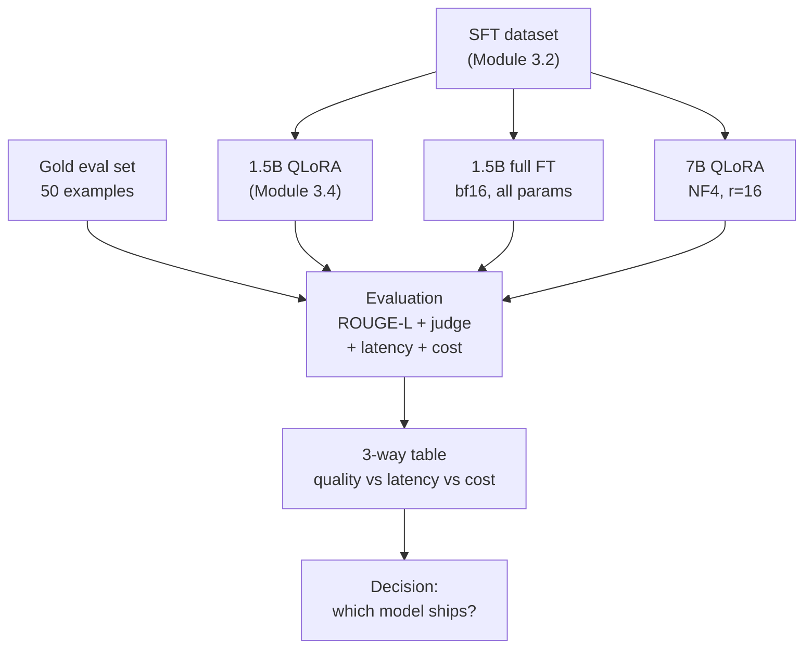

# Module 3.5 — Is Bigger Actually Better?

> You built a 1.5B QLoRA. Now earn the right to call DeskMate an SLM — with measured evidence, not vibes. Run two more fine-tunes on a rented A100, compare all three across quality, latency, and cost, and make a data-driven decision.

---

## Learning Goal

By the end of this module you can:

1. Fine-tune Qwen2.5-7B with QLoRA and Qwen2.5-1.5B with full fine-tune (LoRA disabled) on the same SFT dataset.
2. Benchmark all three models on the gold set using identical prompts.
3. Build a three-way comparison table: quality (ROUGE-L + LLM-as-judge), latency (p50/p95 ms), and cost ($/1k-requests).
4. Answer: *at what quality gap would the bigger model become worth its cost for DeskMate?*

---

## The Experiment Design

Three models, same SFT dataset (Module 3.2), same gold eval set:

| Model | Fine-tune method | Trainable params | Est. VRAM | Est. train time (A100) |
|---|---|---|---|---|
| Qwen2.5-1.5B + QLoRA | NF4 + LoRA r=16 | ~0.74% | ~4 GB | ~30 min |
| Qwen2.5-1.5B full fine-tune | bf16, all params | 100% | ~12 GB | ~45 min |
| Qwen2.5-7B + QLoRA | NF4 + LoRA r=16 | ~0.34% | ~8 GB | ~90 min |

All three run on the same A100 40 GB in sequence — total rented time ~3–4 hrs (~$3–6).

---

## Why the Comparison Is Fair

All three models must use:

- **Same SFT dataset** — same splits, same tokenization, same chat template.
- **Same prompt at inference** — identical system message and user message format.
- **Same gold eval set** — 50 held-out examples with human-written reference replies.
- **Same decoding config** — greedy (`do_sample=False`, `max_new_tokens=150`).

The only variable is model size and fine-tune method.

---

## Theory: The Domain-Specific vs Generalist Trade-Off

This is the central claim of the SLM thesis (book §1.6): a small model fine-tuned on domain data can match or beat a large general-purpose model on a narrow task, at far lower cost.

The trade-off has three axes:

### Quality

A 7B model has more capacity: better language, better reasoning, better zero-shot generalisation. On a narrow task like DeskMate — route a ticket, extract fields, generate a 2–4 sentence reply — a 1.5B model fine-tuned on domain data will usually close most of this gap. The question is how much gap remains.

Typical real-world outcome: fine-tuned 1.5B reaches 85–95% of fine-tuned 7B quality on narrow task metrics. The remaining gap is usually in:
- Ambiguous or unusual phrasing
- Multi-step reasoning ("explain why billing was wrong then offer a remedy")
- Longer replies that require coherent structure

### Latency

Autoregressive generation latency scales roughly linearly with parameter count at fixed batch size and sequence length:

```
Qwen2.5-1.5B:  ~30–60ms per reply  (T4 GPU, greedy, 100 tokens)
Qwen2.5-7B:    ~120–250ms per reply (T4 GPU, greedy, 100 tokens)
```

For a support ticket system with SLA targets (e.g., < 200ms), the 7B model may already be at the limit — the 1.5B model has comfortable headroom.

### Cost

Inference cost is dominated by parameter count and throughput. Rough estimates for a support system processing 100k tickets/day:

```
1.5B QLoRA, single A10G (~24 GB VRAM):
  → can batch ~8 tickets simultaneously
  → ~$0.0004 / ticket  (A10G at $0.75/hr)

7B QLoRA, single A10G:
  → can batch ~2 tickets simultaneously
  → ~$0.0016 / ticket  (same GPU, 4× lower throughput)
```

At 100k tickets/day: 1.5B costs ~$40/day, 7B costs ~$160/day. That's $44k/year difference for a support system.

### The Decision Framework

```
quality_gap = score_7B - score_1.5B    # on your gold set

if quality_gap < 0.03:     # ~3 ROUGE-L points
    → 1.5B is the right call. The gap isn't worth 4× inference cost.
if 0.03 ≤ quality_gap < 0.10:
    → Look at specific failure types. Can more training data close the gap?
    → If yes: invest in data, not compute.
    → If no (reasoning/complexity failures): consider 7B.
if quality_gap ≥ 0.10:
    → The task is harder than a narrow SFT task. 7B may be necessary.
    → Re-examine task scope: is DeskMate doing too much in one reply?
```

The checkpoint answer for DeskMate (a narrow 2–4 sentence reply task):

> *A quality gap of ≥0.10 ROUGE-L (or consistent LLM-as-judge preference for 7B on 20%+ of tickets) would make the bigger model worth its cost. Below that threshold, the 4× inference cost differential is unjustifiable for a production support system.*

---

## Quality Metrics

### ROUGE-L

Longest Common Subsequence F1 between predicted reply and reference reply. Fast, reference-based, no API cost.

```python
from rouge_score import rouge_scorer
scorer = rouge_scorer.RougeScorer(['rougeL'], use_stemmer=True)
result = scorer.score(reference, prediction)
print(result['rougeL'].fmeasure)
```

Interpretation: 0.4–0.6 is typical for support reply generation; 0.25 can still be good if the model rephrases correctly.

### LLM-as-Judge (pairwise)

Ask an LLM (Claude / Haiku / Ollama) to compare two replies for the same ticket and pick the better one:

```python
def judge_pair(ticket, reply_a, reply_b, model="claude-haiku-4-5-20251001"):
    prompt = (
        "You are evaluating support ticket replies. Given the ticket below, "
        "which reply is better? Reply with exactly 'A', 'B', or 'TIE'.\n\n"
        f"Ticket: {ticket}\n\nReply A: {reply_a}\n\nReply B: {reply_b}\n\n"
        "Better reply (A/B/TIE):"
    )
    # ... call model ...
    return verdict  # 'A', 'B', or 'TIE'
```

Run pairwise: 1.5B QLoRA vs 7B QLoRA on all 50 gold examples. Count wins. This gives a preference rate that is more interpretable than ROUGE-L for generation tasks.

**Known pitfalls (revisited in Module 3.6):**
- Verbosity bias: longer replies tend to win regardless of quality.
- Position bias: the first reply tends to win. Mitigate: randomise which model is A vs B, evaluate both orderings, average.

### Latency (p50/p95)

Time the `model.generate()` call including tokenization, excluding model load:

```python
import time

def timed_generate(model, tokenizer, ticket, n=10):
    latencies = []
    for _ in range(n):
        t0 = time.perf_counter()
        _ = generate_reply(model, tokenizer, ticket)
        latencies.append((time.perf_counter() - t0) * 1000)
    import numpy as np
    return np.percentile(latencies, 50), np.percentile(latencies, 95)
```

### Cost ($/1k requests)

```python
def cost_per_1k(latency_p50_ms, gpu_hourly_rate=0.75):
    requests_per_hour = 3_600_000 / latency_p50_ms
    cost_per_request  = gpu_hourly_rate / requests_per_hour
    return cost_per_request * 1000   # $/1k
```

---

## Full Fine-Tune vs QLoRA (Same Model Size)

The third model — 1.5B full fine-tune — answers a separate question: does LoRA's parameter efficiency hurt quality compared to full fine-tuning?

Expected result: QLoRA and full fine-tune produce similar quality for narrow SFT tasks. Full fine-tune is only materially better when:
- The task requires learning entirely new vocabulary or concepts not in pretraining.
- The SFT dataset is very large (>50k examples) — enough to benefit from full parameter flexibility.

For DeskMate's ~500–3k example SFT set, QLoRA should match full fine-tune quality within noise.

---

## Mermaid: Experiment Flow



---

## Notebook: What You'll Build (19_bigger_vs_smaller.ipynb)

1. **Setup** — install, detect GPU, define paths.
2. **Load SFT dataset** — same as Module 3.4.
3. **Train 1.5B full fine-tune** — `TrainingArguments` with no `peft_config`; bf16; 3 epochs.
4. **Train 7B QLoRA** — `BitsAndBytesConfig` + `LoraConfig` r=16; `SFTTrainer`; save adapter.
5. **Load all three models** — 1.5B QLoRA (from 3.4), 1.5B full FT, 7B QLoRA.
6. **Generate replies on gold set** — 50 tickets, all three models, greedy decode.
7. **ROUGE-L scores** — `rouge_scorer` on all three; print per-model mean.
8. **Pairwise judge** — 1.5B QLoRA vs 7B QLoRA on 20 examples; count wins.
9. **Latency benchmark** — `timed_generate()` on each model; p50 + p95.
10. **Cost estimate** — `cost_per_1k()` for each model at current GPU rate.
11. **Three-way table** — combined quality / latency / cost comparison.
12. **Decision paragraph** — auto-generate based on measured gaps.
13. **Save report** — `reports/bigger_vs_smaller_report.md`.

---

## Deliverable

- `reports/bigger_vs_smaller_report.md` — three-way comparison table + one-paragraph decision with evidence.
- All three model adapters / checkpoints saved (or clearly documented as skipped with reasoning).

---

## Checkpoint

> *At what quality gap would the bigger model become worth its cost for DeskMate?*

Strong answer: a ROUGE-L gap of ≥0.10 (absolute) or LLM-judge preference for the 7B model on ≥20% of tickets (with both orderings tested to cancel position bias) would justify the 4× inference cost. Below those thresholds, the correct response is to invest in training data quality, not model size — more high-quality SFT examples will close the gap at zero marginal inference cost.

---

## What's Next

Module 3.6 — Evaluating generative output. Build a proper eval harness: ROUGE-L, LLM-as-judge with bias mitigation, human spot-check protocol, and a regression test set so future changes cannot silently degrade quality.
