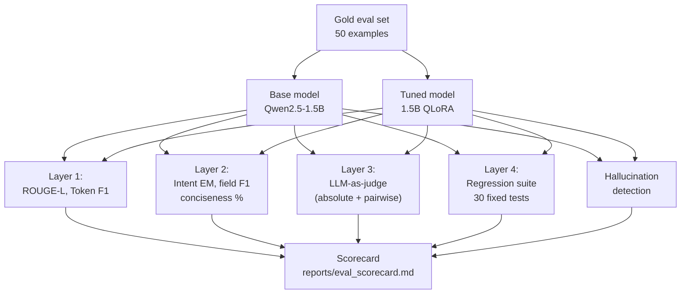

# Module 3.6 — Evaluating Generative Output

> ROUGE-L tells you roughly whether words overlap. It does not tell you whether the reply is correct, helpful, or safe. This module builds a complete eval harness: automated metrics, LLM-as-judge with bias mitigation, hallucination detection, and a regression test set.

---

## Learning Goal

By the end of this module you can:

1. Distinguish reference-based metrics (ROUGE-L, exact-match, F1) from reference-free metrics (LLM-as-judge, perplexity).
2. Name the two main failure modes of LLM-as-judge and explain specific mitigations for each.
3. Build a hallucination detector that flags replies containing claims not grounded in the ticket.
4. Construct and maintain a regression test set so future model changes cannot silently degrade quality.
5. Produce a scorecard comparing tuned vs base model across all four metric types.

---

## The Evaluation Stack

No single metric captures reply quality. The harness uses four layers:

```
Layer 1: Reference-based  — ROUGE-L, token F1         (fast, no API cost, noisy)
Layer 2: Task-specific    — exact-match on extracted fields (precise, structured)
Layer 3: LLM-as-judge     — pairwise or absolute scoring   (expensive, high signal)
Layer 4: Regression suite — fixed 30-example pass/fail     (gates future deploys)
```

Run all four on every model checkpoint before shipping.

---

## Layer 1: Reference-Based Metrics

### ROUGE-L

Longest Common Subsequence F1 between prediction and reference. Insensitive to word order beyond the LCS. Useful as a quick sanity check; not a quality signal on its own.

```python
from rouge_score import rouge_scorer
scorer = rouge_scorer.RougeScorer(['rougeL'], use_stemmer=True)
score  = scorer.score(reference, prediction)['rougeL'].fmeasure
```

Interpretation for support replies: scores 0.35–0.55 are typical when the reference is a single human-written reply. Two equally good replies with different phrasing can score 0.2 against each other.

### Token F1

Compute F1 between the bag of (lowercased, stemmed) tokens in prediction and reference. More lenient than ROUGE-L — order doesn't matter.

```python
def token_f1(ref, pred):
    import re
    ref_toks  = set(re.findall(r'\w+', ref.lower()))
    pred_toks = set(re.findall(r'\w+', pred.lower()))
    if not pred_toks or not ref_toks:
        return 0.0
    prec = len(ref_toks & pred_toks) / len(pred_toks)
    rec  = len(ref_toks & pred_toks) / len(ref_toks)
    return 2 * prec * rec / (prec + rec) if (prec + rec) > 0 else 0.0
```

---

## Layer 2: Task-Specific Metrics

For DeskMate's structured outputs, field-level exact match is more meaningful than surface text similarity.

### Intent exact-match

```python
intent_em = (predicted_intent == gold_intent)
```

### Field extraction F1

From Module 2.6: compare extracted field spans against gold BIO annotations. Stricter than surface string match.

### Reply conciseness

DeskMate spec says "2–4 sentences." Count sentences:

```python
import re

def sentence_count(text):
    return len(re.findall(r'[.!?]+', text.strip()))

def within_spec(reply):
    n = sentence_count(reply)
    return 2 <= n <= 4
```

Track this as a binary metric: `% of replies within 2–4 sentences`.

---

## Layer 3: LLM-as-Judge

### Absolute Scoring (Single Reply)

Ask the judge to score a reply on a 1–5 scale without a reference reply:

```python
ABSOLUTE_RUBRIC = (
    "Score this customer support reply on a scale of 1-5. "
    "1=unhelpful/wrong, 3=acceptable, 5=excellent. "
    "Consider: accuracy, helpfulness, conciseness, tone. "
    "Reply with a single integer.\n\n"
    "Ticket: {ticket}\nReply: {reply}\nScore:"
)
```

Useful for comparing tuned vs base without needing a reference reply.

### Pairwise (A vs B)

From Module 3.5. More reliable than absolute scores because it anchors to a concrete comparison.

```python
PAIRWISE_PROMPT = (
    "You are evaluating customer support replies. "
    "Which reply is better for this ticket? "
    "Reply with exactly: A, B, or TIE.\n\n"
    "Ticket: {ticket}\nReply A: {reply_a}\nReply B: {reply_b}\nVerdict:"
)
```

---

## The Two Failure Modes of LLM-as-Judge

### 1. Verbosity Bias

**What happens:** longer replies score higher, regardless of whether the extra content is useful. A 5-sentence reply with filler wins over a crisp 2-sentence reply.

**Evidence:** studies show LLM judges prefer longer responses in 60–70% of cases where length differs by >50%.

**Mitigations:**
- Explicitly instruct the judge to penalise unnecessary length: *"A shorter reply that answers the question fully is better than a longer reply that adds filler."*
- Set a word-count ceiling in the rubric: *"Replies over 80 words should be penalised unless complexity requires it."*
- Separately track reply length; flag outliers.

### 2. Position Bias (Primacy/Recency)

**What happens:** in pairwise prompts, the reply shown first (or last) tends to win. Studies show ~5–15% swing just from position.

**Mitigations:**
- Run both orderings for each pair (A-then-B and B-then-A); take the agreement verdict only when both orderings agree; call it a tie otherwise.
- Aggregate over many examples; position bias is random across pairs, so it averages out at ≥20 examples.
- Use calibration pairs where you know the ground truth to measure your judge's position bias empirically.

### Additional pitfalls (know these, don't let them surprise you)

| Pitfall | Description | Mitigation |
|---|---|---|
| Self-preference bias | A model judge prefers outputs from models in its family | Use a different judge model family if possible |
| Sycophancy | Judge rates highly whatever seems "confident" or "authoritative" | Include deliberately confident-but-wrong examples in calibration |
| Rubric drift | Absolute scores drift across prompt sessions | Pin the rubric exactly; use few-shot examples in the judge prompt |
| Missing context | Judge doesn't know what "correct" looks like without domain knowledge | Inject the FAQ/docs as context in the judge prompt |

---

## Layer 4: Regression Test Set

The regression suite is a **frozen set of 30 (ticket, expected_behaviour) pairs**. "Expected behaviour" is not a reference reply — it is a set of pass/fail checks:

```python
REGRESSION_TESTS = [
    {
        "ticket"   : "My account is locked after too many login attempts.",
        "checks"   : [
            lambda r: "account" in r.lower(),          # mentions account
            lambda r: any(w in r.lower() for w in
                          ["unlock","reset","contact","support"]),  # action offered
            lambda r: sentence_count(r) <= 5,           # not too long
            lambda r: "password" not in r.lower()       # doesn't ask for password
                      or "reset" in r.lower(),
        ]
    },
    # ... 29 more
]

def run_regression(model, tokenizer, tests):
    results = []
    for t in tests:
        reply  = generate_reply(model, tokenizer, t["ticket"])
        passed = [c(reply) for c in t["checks"]]
        results.append({"ticket": t["ticket"], "reply": reply,
                        "passed": passed, "all_pass": all(passed)})
    pass_rate = sum(r["all_pass"] for r in results) / len(results)
    return results, pass_rate
```

**Rule:** if `pass_rate < 0.90` on the regression suite, the model does not deploy. This gate catches silent regressions from LoRA rank changes, data changes, or prompt updates.

---

## Hallucination Detection

A hallucination in DeskMate context means the reply asserts a fact not present in:
1. The ticket itself, or
2. The retrieved FAQ context (if RAG is active)

### Simple n-gram entailment check

```python
def flag_hallucinations(ticket, reply, faq_context=""):
    source = ticket + " " + faq_context
    source_words = set(re.findall(r'\b[A-Z][a-z]+(?:\s[A-Z][a-z]+)*\b', source))
    reply_entities = re.findall(r'\b[A-Z][a-z]+(?:\s[A-Z][a-z]+)*\b', reply)
    hallucinated = [e for e in reply_entities if e not in source_words]
    return hallucinated  # non-empty = potential hallucination
```

This is intentionally simple — it catches proper-noun fabrication (inventing a product name, a ticket ID, a price). Full NLI-based entailment is covered in Module 4.4 (RAG grounding eval).

### LLM hallucination judge

```python
HALLUCINATION_PROMPT = (
    "The following customer support reply was generated from the ticket below. "
    "Does the reply contain any specific claims (dates, prices, names, policy details) "
    "that are NOT mentioned in the ticket? "
    "Reply with YES or NO, then one sentence explaining.\n\n"
    "Ticket: {ticket}\nReply: {reply}\nContains unsupported claims?"
)
```

---

## The Scorecard

Final output of this module: a markdown scorecard comparing tuned vs base model.

```
| Metric                  | Base (Qwen2.5-1.5B) | Tuned (1.5B QLoRA) |
|-------------------------|---------------------|--------------------|
| ROUGE-L mean            | 0.21                | 0.43               |
| Token F1 mean           | 0.31                | 0.52               |
| Within 2-4 sentences %  | 42%                 | 89%                |
| LLM judge absolute (1-5)| 2.8                 | 4.1                |
| Hallucination rate %    | 18%                 | 4%                 |
| Regression pass rate    | 47%                 | 93%                |
```

Numbers above are illustrative. Your notebook will produce real numbers.

---

## Mermaid: Eval Harness Flow



---

## Notebook: What You'll Build (20_gen_eval_harness.ipynb)

1. **Setup** — install `rouge-score`, `anthropic`; detect GPU.
2. **Load models** — base Qwen2.5-1.5B and tuned 1.5B QLoRA adapter.
3. **Generate replies** — both models on 50 gold examples.
4. **Layer 1** — ROUGE-L and token F1 for both.
5. **Layer 2** — sentence count check; intent exact-match (if gold has intent labels).
6. **Layer 3 (absolute)** — LLM judge scores each reply 1–5.
7. **Layer 3 (pairwise)** — both orderings; agreement-only verdict.
8. **Position bias calibration** — run 5 known-winner pairs; measure judge accuracy.
9. **Hallucination detection** — n-gram check + optional LLM hallucination judge.
10. **Regression suite** — 30 fixed tests; compute pass rate for both models.
11. **Scorecard** — assemble all numbers into a table; save to `reports/eval_scorecard.md`.
12. **Deploy gate** — print GO / NO-GO based on regression pass rate ≥ 90%.

---

## Deliverable

- `reports/eval_scorecard.md` — six-metric scorecard, base vs tuned.
- `data/regression_suite.jsonl` — 30 frozen (ticket, checks) pairs.

---

## Checkpoint

> *Name two failure modes of LLM-as-judge and how you'd mitigate them.*

Strong answer:
1. **Verbosity bias** — the judge systematically prefers longer replies regardless of quality. Mitigate: instruct the judge to penalise unnecessary length in the rubric ("a shorter complete reply is better than a longer padded reply"); separately track reply word count and flag outliers.
2. **Position bias** — in pairwise prompts, the reply shown first or last has an unfair advantage. Mitigate: run both orderings (A-then-B and B-then-A) for each pair and accept only verdicts where both orderings agree; call disagreements a tie. At scale, aggregate over ≥20 pairs — random position bias averages out.

---

## What's Next

Module 3.7 — DPO preference tuning (optional). When SFT is not enough: nudge reply tone and safety using chosen/rejected preference pairs without retraining from scratch.
