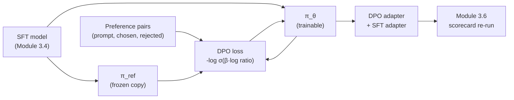

# Module 3.7 — Preference Tuning: DPO (Optional)

> **Status: OPTIONAL.** SFT teaches the model *what* to say. DPO teaches it *what not to say* — without retraining from scratch and without a reward model. This module introduces Direct Preference Optimisation and runs a small DPO pass on DeskMate's tone and format.

---

## When to Do This Module

Do this module if, after completing 3.6 eval, you observe one or more of these:

- The model gives technically correct replies but with the wrong tone (overly formal, dismissive, passive-aggressive).
- The model hedges excessively ("I'm sorry but I cannot help with…") when it should resolve.
- The model violates format constraints despite SFT (replies too long, wrong structure).
- LLM-judge or human reviewers consistently prefer a different style.

**If your Module 3.6 scorecard shows ≥90% regression pass rate and no systematic tone complaints, SFT is sufficient. Skip this module.**

---

## Why SFT Isn't Always Enough

SFT trains the model to imitate `chosen` examples. It has no mechanism to push *away* from bad outputs. When the problematic behaviour is:

- **Format-level** (replies consistently too long, wrong punctuation, wrong structure): more SFT data targeting that format usually fixes it.
- **Style-level** (correct facts, wrong tone): SFT data is harder to construct at scale because you need to write many examples of the *right* tone.
- **Safety-level** (model occasionally says something inappropriate): SFT on safe examples suppresses bad behaviour but doesn't explicitly penalise it.

For these cases, preference pairs — `(prompt, chosen_reply, rejected_reply)` — are more efficient. You can annotate a small set (50–200 pairs) and DPO does the rest.

---

## What DPO Does

RLHF trains a reward model and then uses RL to optimise the LM against it. DPO eliminates the reward model entirely by showing that the optimal policy under a KL-constrained RLHF objective can be derived directly from preference pairs:

### The DPO Objective

```
L_DPO = -E[(x, y_w, y_l)] [
    log σ( β · log (π_θ(y_w|x) / π_ref(y_w|x))
         - β · log (π_θ(y_l|x) / π_ref(y_l|x)) )
]
```

Where:
- `π_θ` — the model being trained
- `π_ref` — the frozen reference model (typically the SFT checkpoint)
- `y_w` — the chosen (winning) reply
- `y_l` — the rejected (losing) reply
- `β` — KL coefficient (controls how far `π_θ` can diverge from `π_ref`; typical 0.1–0.5)
- `σ` — sigmoid

**In plain terms:** DPO adjusts the model to assign higher relative probability to `y_w` than `y_l`, compared to what the reference model would assign. It uses the reference model as an implicit reward signal.

### What β Controls

```
β → 0 : model can move far from SFT; strong preference signal, high forgetting risk
β → 1 : model stays close to SFT; weak preference signal, safe
```

For DeskMate's small tone/format corrections: `β = 0.1` is a reasonable starting point.

---

## Constructing Preference Pairs for DeskMate

You need `(prompt, chosen, rejected)` triples. Each triple captures one thing the model should do differently.

### Tone pairs

```python
# Chosen: empathetic, actionable
chosen  = ("We're sorry to hear you're locked out. "
           "Click 'Forgot password' on the login page and we'll send a reset link immediately.")
# Rejected: technically correct but terse and cold
rejected = "Use the password reset feature."
```

### Format pairs

```python
# Chosen: 2 sentences, no padding
chosen  = ("The CSV export is temporarily unavailable due to a known issue. "
           "Our team expects a fix within 24 hours and will notify you by email.")
# Rejected: same content padded to 6+ sentences
rejected = ("Thank you for contacting DeskMate support. We appreciate your patience. "
            "We have been informed of the issue you are experiencing with the CSV export "
            "functionality. Our team is currently investigating. We will do our best to "
            "resolve this issue as quickly as possible. Thank you for your understanding.")
```

### Safety pairs

```python
# Chosen: professional refusal with redirection
chosen  = "I'm not able to share other customers' account information for privacy reasons. "
          "Please contact our trust@deskmate.com team if you have a specific data concern."
# Rejected: vague non-answer
rejected = "I cannot help with that."
```

### Building 50+ pairs

For each of the five DeskMate intents, create ~10 pairs targeting tone/format/safety issues you observed in Module 3.6. Use the LLM judge from 3.6 to verify chosen > rejected (don't trust your own instinct for all of them).

---

## DPO Training with `trl`

```python
from trl import DPOTrainer, DPOConfig
from peft import LoraConfig

dpo_config = DPOConfig(
    beta=0.1,
    output_dir="models/deskmate-dpo",
    num_train_epochs=1,
    per_device_train_batch_size=2,
    gradient_accumulation_steps=4,
    learning_rate=5e-7,          # much lower than SFT — we're nudging, not retraining
    lr_scheduler_type="cosine",
    bf16=True,
    logging_steps=10,
    report_to="none",
    seed=42,
)

# LoRA on the DPO model (trains the same adapter structure as SFT)
peft_config = LoraConfig(
    r=16, lora_alpha=32,
    target_modules="all-linear",
    lora_dropout=0.05, bias="none",
    task_type="CAUSAL_LM",
)

trainer = DPOTrainer(
    model=model,             # SFT model (or SFT adapter merged into base)
    ref_model=None,          # None → trl uses an internal frozen copy
    args=dpo_config,
    train_dataset=dpo_dataset,
    peft_config=peft_config,
    processing_class=tokenizer,
)
trainer.train()
```

**Note:** `ref_model=None` tells `trl` to create a frozen copy of the input model internally. This is correct when using LoRA — the adapter weights are trainable, the base (and the internal ref copy) stays frozen.

### Dataset format

`trl`'s `DPOTrainer` expects columns `prompt`, `chosen`, `rejected`:

```python
from datasets import Dataset

dpo_dataset = Dataset.from_list([
    {
        "prompt"  : "Ticket: I cannot log in. My reset email never arrived.",
        "chosen"  : "We're sorry to hear you're locked out ...",
        "rejected": "Use the password reset feature.",
    },
    ...
])
```

---

## What DPO Does NOT Fix

| Problem | DPO helps? | Better fix |
|---|---|---|
| Model produces factually wrong information | ❌ | More SFT data with correct facts; RAG (Module 4) |
| Model ignores retrieved context | ❌ | RAG grounding eval (Module 4.4) |
| Model is slow | ❌ | Quantisation (Module 5) |
| Model is too large for deployment | ❌ | Distillation (Module 2.7) |
| Model uses wrong tone | ✅ | DPO on tone pairs |
| Model is too verbose | ✅ | DPO on length pairs |
| Model gives unsafe replies | ✅ (partial) | DPO on safety pairs + evaluation gate |
| Model gives the right facts but poorly structured | ✅ | DPO on format pairs |

---

## Mermaid: DPO Flow



---

## Notebook: What You'll Build (21_dpo_tuning.ipynb)

1. **Setup** — install `trl`; load SFT model + tokenizer.
2. **Build preference dataset** — 50 `(prompt, chosen, rejected)` pairs across 5 intents.
3. **Inspect pairs** — show chosen vs rejected for 3 examples; verify judge prefers chosen.
4. **DPO config** — `DPOConfig` with `β=0.1`, low LR; `LoraConfig`.
5. **Train** — `DPOTrainer.train()`; plot reward margin over steps.
6. **Before/after** — same 5 sample tickets; show SFT reply vs DPO reply.
7. **Re-run regression gate** — DPO must not regress below the 90% threshold from Module 3.6.
8. **Tone scorecard delta** — LLM judge: SFT vs DPO on the 5 tone-targeted pairs.
9. **Save adapter**.

---

## Deliverable

- `models/deskmate-dpo-adapter/` — DPO LoRA adapter.
- Before/after tone comparison (5 examples, SFT vs DPO).
- Regression gate result: DPO pass rate must be ≥90% (no regression from SFT).

---

## Checkpoint

> *What kind of problem does preference tuning fix that more SFT data won't?*

Strong answer: preference tuning fixes **distributional preference problems** — where the model has learned *what* to say from SFT but defaults to a style, tone, or format that differs from what users actually prefer. More SFT data adds more examples of the *correct* output but does not explicitly signal that certain outputs are worse than others. DPO, by directly comparing `chosen` vs `rejected` on the same prompt, teaches the model what to *avoid* — which is particularly effective for: (1) tone issues that are hard to eliminate by adding more "good tone" examples, (2) safety-boundary cases where the model must learn that certain reply patterns are always worse regardless of the factual content, and (3) verbosity where the model must learn that shorter is better *relative to* longer even when both are factually correct. DPO cannot fix factual errors, hallucinations, or missing knowledge — those require better data or retrieval.

---

## What's Next

This completes Phase 3 — The Decoder SLM. All modules done:

- 3.0 Prompting baselines
- 3.1 Base model selection
- 3.1a DAPT (optional, deferred)
- 3.2 SFT data prep
- 3.2a Constrained decoding
- 3.3 LoRA & QLoRA theory
- 3.4 Run the QLoRA fine-tune
- 3.5 Bigger vs smaller experiment
- 3.6 Evaluating generative output
- **3.7 DPO preference tuning** ← you are here

**Phase 4** — Retrieval-Augmented Generation: stop the decoder from making things up. Ground it in your real FAQ and documentation.
