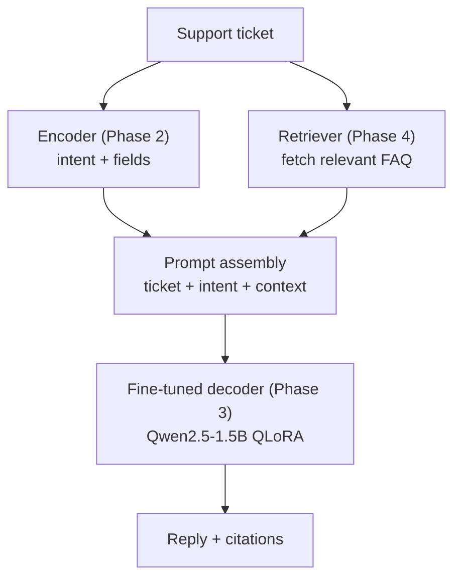

# Module 4.1 — RAG vs Fine-Tuning (and Why DeskMate Uses Both)

> Fine-tuning and RAG solve different problems. Conflating them leads to the wrong architecture — either a model that knows how to talk but makes things up, or a model that retrieves facts but formats them badly. This module draws the line precisely and produces a written decision for DeskMate.

---

## Learning Goal

By the end of this module you can:

1. State exactly what fine-tuning changes (behaviour/format/style) and what it does not (knowledge currency).
2. State exactly what RAG changes (knowledge grounding) and what it does not (behaviour/style/safety).
3. Apply the four-quadrant decision framework to any new capability request.
4. Answer: *your docs change weekly — fine-tune or RAG? Why?*

---

## The Core Distinction

```
Fine-tuning teaches HOW to respond.
RAG supplies WHAT to say.
```

These are orthogonal. A model trained on thousands of DeskMate support conversations learns:
- Tone: empathetic, concise, professional
- Format: 2–4 sentences, action-first, no filler
- Task: route → extract → reply
- Safety: never share other users' data, never impersonate a human

It does **not** learn:
- Which products are currently in beta
- What the current refund policy says
- Which bugs were fixed in last week's release
- What the actual SLA commitment is for the Pro plan

Those facts change. Training data has a cutoff. A fine-tuned model that was trained in January does not know about the March policy update — and it will confidently make something up.

RAG solves this. It retrieves current text from your knowledge base at inference time and injects it into the prompt as context. The model then reads the answer from the retrieved passage rather than recalling it from weights.

---

## What Each Approach Changes

| Capability | Fine-tuning | RAG |
|---|---|---|
| Tone and style | ✅ Learned from examples | ❌ No effect |
| Reply format (length, structure) | ✅ Learned from examples | ❌ No effect |
| Task understanding (route/extract) | ✅ Learned from examples | ❌ No effect |
| Safety behaviour | ✅ Reinforced by DPO (3.7) | ❌ No effect |
| Current product facts | ❌ Frozen at training cutoff | ✅ Retrieved live |
| Policy details that update | ❌ Stale | ✅ Retrieved live |
| Long-tail edge cases not in training | ❌ Hallucinated | ✅ Retrieved if in docs |
| Structured field extraction | ✅ Encoder NER (Phase 2) | ❌ No effect |

---

## The Four-Quadrant Decision Framework

```
              Facts change often?
                  YES        NO
              ┌──────────┬──────────┐
  Behaviour   │          │          │
  problem?    │ Both RAG │   RAG    │
  NO          │    +     │  alone   │
              │ Fine-tune│          │
              ├──────────┼──────────┤
  Behaviour   │          │          │
  problem?    │ Fine-tune│Fine-tune │
  YES         │    +     │  alone   │
              │   RAG    │          │
              └──────────┴──────────┘
```

- **Fine-tune alone:** behaviour/format/safety issues, stable domain knowledge. Example: customer support tone, JSON extraction schema, intent routing.
- **RAG alone:** factual QA over frequently updated docs with no behaviour issues. Example: "does plan X include feature Y?" queried on a current pricing page.
- **Both:** most production systems. The model knows *how* to respond (fine-tuning); the prompt contains *what* the answer is (RAG).
- **Neither:** the base model is already capable enough for the task. Example: simple classification with a good prompt.

---

## Why "Both" Is the Production Default

In production NLP, the typical architecture is:

```
[User ticket]
     │
     ▼
[Encoder — Phase 2]           ← intent + field extraction
     │
     ▼
[Retriever — Phase 4.2/4.3]   ← fetch relevant FAQ / docs
     │
     ▼
[Prompt assembly]             ← ticket + retrieved context
     │
     ▼
[Fine-tuned decoder — Phase 3] ← generate grounded reply
     │
     ▼
[Reply with citations]
```

The fine-tuned decoder knows how to structure a concise, empathetic support reply. The retriever supplies the current facts (policy, version history, known bugs). Without fine-tuning the reply quality is generic; without RAG the facts are stale or hallucinated.

---

## Why RAG Does Not Replace Fine-Tuning

A common mistake: "I'll just RAG everything and skip fine-tuning."

Problems:
1. **Format.** The base model generates lengthy, poorly structured replies even when the retrieved context is perfect. Fine-tuning is what makes replies concise and action-first.
2. **Task understanding.** Routing a ticket to the right team, extracting product/version/OS — these are learned behaviours, not factual lookups.
3. **Safety.** The base model will impersonate a human, share non-existent policy details, or make up refund amounts. Safety behaviour is trained, not retrieved.
4. **Cost.** Injecting large retrieved contexts into every prompt is expensive. Fine-tuning teaches the model to answer *short* questions concisely; RAG handles the cases where the answer truly requires external knowledge.

---

## Why Fine-Tuning Does Not Replace RAG

The opposite mistake: "I'll just fine-tune on all our docs."

Problems:
1. **Staleness.** Knowledge baked into weights is frozen at training time. A policy change requires a new fine-tune run — days of work and compute cost.
2. **Hallucination under distribution shift.** The model interpolates between training examples. For facts it has seen rarely or not at all, it generates plausible-sounding but wrong answers.
3. **Auditability.** You cannot easily explain *why* a model said something based on its weights. With RAG you can show the user the retrieved passage and the citation.
4. **Long-tail.** Your FAQ may have 500 articles. Fine-tuning on all of them does not guarantee recall of low-frequency content; RAG retrieves it on demand.

---

## DeskMate Decision Note

**Decision: Use both fine-tuning (Phase 3) and RAG (Phase 4).**

| Capability | Mechanism | Module |
|---|---|---|
| Intent classification | Encoder fine-tune | 2.4 |
| Field extraction (NER) | Encoder fine-tune | 2.5 |
| Reply tone and format | Decoder SFT + DPO | 3.4, 3.7 |
| Safety boundaries | DPO preference pairs | 3.7 |
| Current product facts | RAG — retriever | 4.2, 4.3 |
| Policy and SLA details | RAG — retriever | 4.2, 4.3 |
| Grounded cited reply | RAG + decoder | 4.4 |

**Checkpoint answer:** Your docs change weekly → **use RAG, not fine-tuning, for the facts.** Fine-tuning cannot keep up with weekly doc changes — each re-run costs compute and time, and knowledge baked into weights cannot be selectively updated. RAG retrieves the current version of any doc at inference time, requires no retraining when docs update, and makes the source of each claim auditable. Fine-tuning handles what does not change: how the model responds, not what it says.

---

## Mermaid: DeskMate Production Architecture



---

## What's Next

Module 4.2 — Chunking & embeddings. Turn the DeskMate FAQ and documentation into a searchable vector index: chunking strategies, sentence-transformer embeddings, and FAISS/Chroma.
