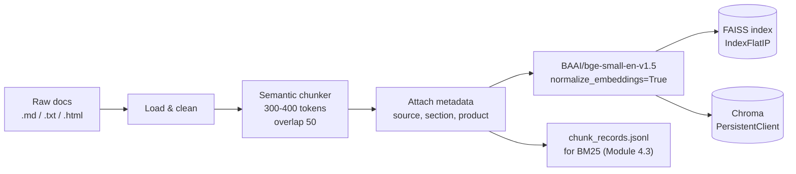

# Module 4.2 — Chunking & Embeddings

> The retriever can only find what has been indexed. Chunking quality determines what the retriever can see; embedding quality determines what it considers similar. Both decisions dominate RAG quality more than any model choice downstream.

---

## Learning Goal

By the end of this module you can:

1. Explain why chunking strategy matters more than embedding model choice for most RAG systems.
2. Choose between fixed-size, sentence-boundary, and semantic chunking for a given document type.
3. Select an appropriate sentence-transformer embedding model and understand its output space.
4. Build a FAISS or Chroma vector index from a chunked document corpus.
5. Answer: *how do chunk size and overlap trade off recall against noise?*

---

## Why Chunking Dominates RAG Quality

Embedding models map variable-length text to a fixed-size dense vector. The quality of that mapping degrades as the text gets longer: a 2000-token chunk has one vector that must represent many different topics, and the vector ends up in an average position in the embedding space that is close to nothing in particular.

The consequence: **if the chunk is too large, the retriever misses it even when it contains the right answer.** The embedding of the question lands in a different neighbourhood than the embedding of the bloated chunk.

Conversely, if chunks are too small, the answer may be split across chunk boundaries — retrieved chunks contain the question's keywords but not the complete answer.

**Chunking is the problem. Embedding is just the measurement tool.**

---

## Chunking Strategies

### 1. Fixed-Size Chunking

Split every N tokens (or characters) with an overlap of M tokens.

```python
def fixed_chunk(text, chunk_size=256, overlap=32):
    tokens = text.split()   # word-level approximation; use tokenizer for precision
    chunks  = []
    start   = 0
    while start < len(tokens):
        end = min(start + chunk_size, len(tokens))
        chunks.append(" ".join(tokens[start:end]))
        start += chunk_size - overlap
    return chunks
```

**Pros:** simple, predictable, works on any text.  
**Cons:** splits mid-sentence, mid-paragraph; damages context at boundaries.  
**Use when:** documents are uniform in structure (e.g., chat logs, code).

### 2. Sentence-Boundary Chunking

Split at sentence boundaries, group into windows of ~N sentences:

```python
import re

def sentence_chunk(text, sentences_per_chunk=5, overlap_sentences=1):
    sents  = re.split(r'(?<=[.!?])\s+', text.strip())
    chunks = []
    step   = sentences_per_chunk - overlap_sentences
    for i in range(0, len(sents), step):
        chunk = " ".join(sents[i: i + sentences_per_chunk])
        if chunk.strip():
            chunks.append(chunk)
    return chunks
```

**Pros:** preserves sentence integrity; readable chunks.  
**Cons:** sentences vary wildly in length; one very long sentence can bloat a chunk.  
**Use when:** documents are well-written prose (FAQs, policy docs, blog posts).

### 3. Semantic (Paragraph / Header) Chunking

Split on structural boundaries — blank lines, markdown headers, HTML `<p>` tags:

```python
def semantic_chunk(text, max_tokens=300):
    paragraphs = re.split(r'\n{2,}', text.strip())
    chunks, buf, buf_len = [], [], 0
    for para in paragraphs:
        para_len = len(para.split())
        if buf_len + para_len > max_tokens and buf:
            chunks.append("\n\n".join(buf))
            buf, buf_len = [], 0
        buf.append(para)
        buf_len += para_len
    if buf:
        chunks.append("\n\n".join(buf))
    return chunks
```

**Pros:** chunks align with natural topic units; best for structured docs.  
**Cons:** paragraph lengths vary; requires consistent formatting.  
**Use when:** markdown documentation, help-centre articles, structured FAQs.  
**This is DeskMate's default** — the FAQ and release notes are markdown.

---

## The Chunk Size vs Overlap Trade-Off

```
chunk_size ↑  →  each chunk covers more context
             →  but embedding quality degrades (vector represents many topics)
             →  recall ↓ for specific fact lookups
             →  noise ↑ when injected into prompt (irrelevant sentences included)

chunk_size ↓  →  embeddings are more precise
             →  but answers can span chunk boundaries → retrieval misses them
             →  more chunks in the index → slower search

overlap ↑   →  boundary-spanning answers are captured in the overlapping region
             →  but duplicate content appears in top-k results → prompt bloat
             →  storage cost increases proportionally

overlap ↓   →  efficient storage
             →  but boundary gaps reappear
```

**DeskMate recommendation:**
- `chunk_size = 300–400 tokens` — long enough for a full FAQ answer, short enough for a precise embedding.
- `overlap = 50 tokens` — covers sentence-boundary gaps without duplicating whole paragraphs.
- Adjust based on hit-rate@3 on the gold eval set (measured in Module 4.3).

---

## Embedding Models

An embedding model maps a text chunk to a dense vector. At query time, the same model maps the question to a vector; retrieval finds the nearest chunk vectors in the index.

### Choosing a model

| Model | Dim | Max tokens | Speed | Quality | Use case |
|---|---|---|---|---|---|
| `all-MiniLM-L6-v2` | 384 | 256 | Very fast | Good | CPU, free tier |
| `all-mpnet-base-v2` | 768 | 384 | Fast | Better | CPU, more RAM |
| `BAAI/bge-small-en-v1.5` | 384 | 512 | Fast | Very good | DeskMate default |
| `BAAI/bge-base-en-v1.5` | 768 | 512 | Moderate | Excellent | Rented GPU |

**DeskMate default:** `BAAI/bge-small-en-v1.5` — Apache 2.0, 512-token context, strong MTEB benchmark performance at low cost. Fits comfortably on free Colab CPU.

### Embedding a chunk

```python
from sentence_transformers import SentenceTransformer

model = SentenceTransformer("BAAI/bge-small-en-v1.5")
embedding = model.encode("DeskMate Pro v2.3 billing issue", normalize_embeddings=True)
# shape: (384,)  — L2-normalised for cosine similarity via dot product
```

`normalize_embeddings=True` is critical: after L2 normalisation, cosine similarity equals dot product, which FAISS's `IndexFlatIP` computes cheaply.

---

## The Embedding Space

What does "similar embedding" actually mean? Two texts have similar embeddings if they are semantically related — not just lexically.

```
"I cannot log in"           → embedding near {"login", "access", "authentication"}
"password reset failed"     → nearby in the embedding space
"CSV export 500 error"      → different neighbourhood
"pricing for Pro plan"      → different neighbourhood again
```

The retriever uses this space to find chunks that answer a query. A query about login issues retrieves the login-related FAQ chunks, not the billing ones — even if the exact words differ.

**Asymmetric retrieval:** some models distinguish between queries and passages. `bge` is trained for this: it expects queries to be prefixed with `"Represent this sentence for searching relevant passages: "`. This matters for retrieval quality.

```python
query_prefix = "Represent this sentence for searching relevant passages: "
query_emb = model.encode(query_prefix + query_text, normalize_embeddings=True)
# Chunk embeddings are NOT prefixed — only queries
chunk_emb  = model.encode(chunk_text, normalize_embeddings=True)
```

---

## Vector Databases: FAISS vs Chroma

### FAISS (Facebook AI Similarity Search)

A library for efficient similarity search over dense vectors. Used as an in-process index — no server required.

```python
import faiss
import numpy as np

dim  = 384   # matches embedding model output
idx  = faiss.IndexFlatIP(dim)   # exact inner-product search
idx.add(np.array(embeddings, dtype="float32"))

# Search
D, I = idx.search(np.array([query_emb], dtype="float32"), k=5)
# D: distances (scores), I: indices into the embedding array
```

**Pros:** extremely fast, no server, easy to save/load as a file.  
**Cons:** no metadata filtering in `IndexFlatIP`; purely vector-based.

### Chroma

A lightweight vector database with metadata filtering built in. Good for development.

```python
import chromadb

client     = chromadb.PersistentClient(path="data/chroma_db")
collection = client.get_or_create_collection("deskmate_faq",
                 metadata={"hnsw:space": "cosine"})

collection.add(
    documents=chunks,
    embeddings=embeddings,
    metadatas=[{"source": c["source"], "section": c["section"]} for c in chunk_records],
    ids=[f"chunk_{i}" for i in range(len(chunks))],
)

results = collection.query(query_embeddings=[query_emb.tolist()], n_results=5)
```

**Pros:** metadata filtering (e.g., filter by `product="Pro"`); persistent by default.  
**Cons:** slower than FAISS at scale; overkill for < 10k chunks.

**DeskMate default:** Chroma for development (metadata filtering with the encoder fields from Module 2.5); FAISS for the benchmarking cell.

---

## Mermaid: Indexing Pipeline



---

## Notebook: What You'll Build (22_rag_chunking_embeddings.ipynb)

1. **Setup** — install `sentence-transformers`, `faiss-cpu`, `chromadb`.
2. **Build FAQ corpus** — 15 DeskMate FAQ articles covering all 5 intents; save as `.md` files.
3. **Fixed-size chunker** — implement and demo on one article; show boundary artifacts.
4. **Semantic chunker** — paragraph-boundary split; compare chunk quality.
5. **Chunk size ablation** — chunk 128 / 256 / 512 tokens; plot embedding spread (PCA).
6. **Embed with `bge-small-en-v1.5`** — encode all chunks; print shape and sample norms.
7. **Query prefix demo** — show retrieval quality with vs without query prefix.
8. **Build FAISS index** — `IndexFlatIP`; run 5 sample queries; print top-3 results.
9. **Build Chroma index** — same chunks + metadata; run same queries; verify match.
10. **Metadata filter demo** — filter by product field from Module 2.5 encoder output.
11. **Save index** — FAISS `.index` file + `chunk_records.jsonl` for Module 4.3.
12. **Index stats** — chunk count, total tokens, index size on disk.

---

## Deliverable

- `data/processed/chunk_records.jsonl` — all chunks with text + metadata (source, section, product tag).
- `data/faiss/deskmate_faq.index` — FAISS IndexFlatIP over all chunk embeddings.
- `data/chroma_db/` — Chroma persistent store with metadata.

---

## Checkpoint

> *How do chunk size and overlap trade off recall against noise?*

Strong answer: larger chunks improve recall for answers that span multiple sentences (the answer is less likely to straddle a chunk boundary) but degrade embedding precision — one dense vector must encode many topics, so the vector lands in an average position that may not be near any specific query. Smaller chunks produce sharper embeddings but increase the chance that a multi-sentence answer is split across two non-adjacent chunks, causing a retrieval miss. Overlap mitigates boundary gaps by duplicating the overlapping region across neighbouring chunks, ensuring boundary-spanning answers appear in at least one chunk — but it inflates the index and can cause the same content to appear in multiple top-k results, adding noise to the injected prompt. The right balance is measured empirically using hit-rate@k on a gold query set (Module 4.3), not chosen by intuition.

---

## What's Next

Module 4.3 — Retrieval that actually works. Dense-only retrieval misses keyword-specific queries. Hybrid BM25 + dense search with a cross-encoder reranker closes most of the gap. Measured by hit-rate@3 on the gold eval set.
