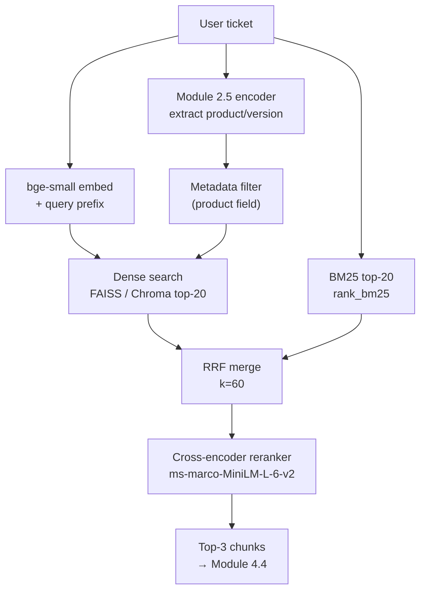

# Module 4.3 — Retrieval That Actually Works

> Dense vector search is good at semantic similarity. BM25 is good at exact keyword matching. Neither alone is best. Hybrid search + a cross-encoder reranker closes most of the remaining gap — and the Module 2.5 encoder fields give us metadata filtering for free.

---

## Learning Goal

By the end of this module you can:

1. Explain when pure dense retrieval fails and why BM25 rescues it.
2. Implement Reciprocal Rank Fusion (RRF) to merge BM25 and dense ranked lists.
3. Apply a cross-encoder reranker to reorder the merged candidate set.
4. Use the product/version fields from the Module 2.5 NER extractor as metadata filters.
5. Measure retrieval quality with hit-rate@k and MRR on a gold query set.
6. Answer: *when does pure vector search fail and BM25 save you?*

---

## Why Dense Retrieval Alone Fails

Dense retrieval maps queries and chunks to the same embedding space and finds nearest neighbours. This works well when the query is semantically similar to the answer chunk — even if the words differ.

It fails when:

**1. Exact keyword queries**
```
Query:  "ERR_404 export button"
Chunk:  "CSV export returns ERR_404 when dataset exceeds 50k rows"
```
The embedding of `ERR_404 export button` may not land near the embedding of the chunk — error codes are rare tokens that may not have strong learned representations. BM25 matches `ERR_404` exactly.

**2. Product names and version numbers**
```
Query:  "Qwen2.5-1.5B quantisation"
```
Embedding models often tokenise version strings poorly. `1.5B` may map to an unusual subword token with a weak positional embedding. BM25 matches it exactly via inverted index.

**3. Acronyms and domain jargon**
```
Query: "2FA TOTP backup codes"
```
Dense models learn from general text; domain acronyms are underrepresented. BM25 has no concept of "underrepresented" — it matches character-level tokens regardless.

**4. Negation and contrast**
```
Query: "what is NOT included in the Pro plan"
```
Dense embeddings conflate `Pro plan features` and `not included in Pro plan` because the semantic neighbourhood is similar. BM25 cannot help here either — but neither should you be surprised when dense-only retrieval fails.

---

## BM25 (Best Match 25)

BM25 is a sparse retrieval model from 1994. Given a query `q` with terms `t_1 ... t_n` and a document `d`:

```
BM25(q, d) = Σ_i IDF(t_i) · (tf(t_i, d) · (k1 + 1)) / (tf(t_i, d) + k1 · (1 - b + b · |d|/avgdl))
```

Where:
- `tf(t, d)` — term frequency of `t` in document `d`
- `IDF(t)` — inverse document frequency (rare terms score higher)
- `k1 = 1.5` — term frequency saturation (diminishing returns on repetition)
- `b = 0.75` — length normalisation (shorter docs score higher per matching token)
- `|d|` — document length in tokens
- `avgdl` — average document length across corpus

Implementation with `rank_bm25`:

```python
from rank_bm25 import BM25Okapi

corpus_tokens = [chunk['text'].lower().split() for chunk in chunk_records]
bm25 = BM25Okapi(corpus_tokens)

query_tokens = "ERR_404 export button".lower().split()
scores = bm25.get_scores(query_tokens)
top_k  = scores.argsort()[::-1][:10]
```

---

## Hybrid Search via Reciprocal Rank Fusion

RRF merges two ranked lists without requiring score calibration. Given rank `r_i` of document `d` in list `i`:

```
RRF(d) = Σ_i  1 / (k + r_i(d))
```

Where `k = 60` (empirically good; dampens the influence of very high ranks).

```python
def rrf(ranked_lists, k=60):
    scores = {}
    for ranked in ranked_lists:
        for rank, doc_id in enumerate(ranked):
            scores[doc_id] = scores.get(doc_id, 0) + 1 / (k + rank + 1)
    return sorted(scores, key=scores.get, reverse=True)
```

Why RRF instead of score interpolation (`α·dense + (1-α)·bm25`)?
- BM25 scores are unbounded; dense cosine scores are in `[-1, 1]`. Calibrating the mix requires tuning `α` on your specific corpus.
- RRF uses only ranks, which are already comparable. No calibration needed.

---

## Cross-Encoder Reranker

The hybrid retriever produces a candidate set (top-20 or top-50). A cross-encoder reranker scores each `(query, candidate)` pair jointly — it attends to both at once and produces a single relevance score.

This is fundamentally more powerful than bi-encoder retrieval (which encodes query and chunk independently) because the cross-encoder can see interactions between query tokens and document tokens.

```python
from sentence_transformers import CrossEncoder

reranker = CrossEncoder("cross-encoder/ms-marco-MiniLM-L-6-v2")

pairs = [(query, chunk['text']) for chunk in candidates]
scores = reranker.predict(pairs)
ranked = sorted(zip(scores, candidates), key=lambda x: x[0], reverse=True)
top3   = [c for _, c in ranked[:3]]
```

**Cost:** the cross-encoder runs inference for every `(query, candidate)` pair. At 20 candidates, this is 20 forward passes — acceptable at low QPS, but must be batched and cached at scale.

**When to skip the reranker:** if your corpus is small (< 500 chunks) and queries are broad, the bi-encoder hybrid is usually sufficient. Add the reranker when you can measure that it improves hit-rate@3 by more than 5 points.

---

## Metadata Filtering with Encoder Fields

The Module 2.5 NER extractor produces structured fields from the ticket:

```python
{
    "product"    : "DeskMate Pro",
    "version"    : "v2.3",
    "os"         : "Windows 10",
    "error_code" : "ERR_404"
}
```

These can be used as **pre-filters** on the Chroma or FAISS metadata:

```python
# Only retrieve chunks about "DeskMate Pro" or "all products"
results = collection.query(
    query_embeddings=[q_emb.tolist()],
    n_results=20,
    where={"$or": [
        {"product": {"$eq": extracted_fields["product"]}},
        {"product": {"$eq": "all"}},
    ]}
)
```

This dramatically reduces the search space for product-specific queries and avoids surfacing irrelevant docs (e.g., AgentCore release notes when the ticket is about DeskMate Pro).

---

## Evaluation: Hit-Rate@k and MRR

### Hit-Rate@k

The fraction of queries for which the correct chunk appears in the top-k results:

```python
def hit_rate_at_k(results, gold_chunk_ids, k):
    hits = sum(
        1 for result_ids, gold_ids in zip(results, gold_chunk_ids)
        if any(g in result_ids[:k] for g in gold_ids)
    )
    return hits / len(results)
```

Typical targets: hit-rate@1 ≥ 0.60, hit-rate@3 ≥ 0.80, hit-rate@5 ≥ 0.90.

### Mean Reciprocal Rank (MRR)

Rewards finding the correct chunk earlier in the ranked list:

```python
def mrr(results, gold_chunk_ids):
    rr_sum = 0
    for result_ids, gold_ids in zip(results, gold_chunk_ids):
        for rank, doc_id in enumerate(result_ids, start=1):
            if doc_id in gold_ids:
                rr_sum += 1 / rank
                break
    return rr_sum / len(results)
```

MRR@10 captures both "did we find it?" and "how quickly?".

---

## Full Retrieval Pipeline

```python
def retrieve(query, fields, k_final=3):
    # 1. Metadata filter (from Module 2.5 encoder)
    product_filter = fields.get("product", "all")

    # 2. Dense retrieval (top-20 after metadata filter)
    q_emb = embedder.encode(BGE_PREFIX + query, normalize_embeddings=True)
    dense_results = collection.query(
        query_embeddings=[q_emb.tolist()], n_results=20,
        where={"$or": [{"product": {"$eq": product_filter}},
                       {"product": {"$eq": "all"}}]}
    )
    dense_ids = [m["id"] for m in dense_results["metadatas"][0]]   # approximate

    # 3. BM25 retrieval (top-20)
    query_toks = query.lower().split()
    bm25_scores = bm25.get_scores(query_toks)
    bm25_ids    = [chunk_records[i]["id"]
                   for i in bm25_scores.argsort()[::-1][:20]]

    # 4. RRF merge
    merged_ids  = rrf([dense_ids, bm25_ids])[:50]
    candidates  = [next(r for r in chunk_records if r["id"] == cid)
                   for cid in merged_ids if any(r["id"] == cid for r in chunk_records)]

    # 5. Cross-encoder rerank
    if candidates:
        pairs   = [(query, c["text"]) for c in candidates]
        scores  = reranker.predict(pairs)
        ranked  = sorted(zip(scores, candidates), key=lambda x: x[0], reverse=True)
        return [c for _, c in ranked[:k_final]]
    return candidates[:k_final]
```

---

## Mermaid: Retrieval Pipeline



---

## Notebook: What You'll Build (23_rag_retriever.ipynb)

1. **Setup** — load chunk records + FAISS index + Chroma from Module 4.2.
2. **BM25 index** — `BM25Okapi` over all chunk texts; test 5 queries.
3. **Dense retrieval** — FAISS top-20 with query prefix; test same 5 queries.
4. **Side-by-side** — show where BM25 wins and where dense wins.
5. **RRF merge** — implement `rrf()`; run on 5 queries; inspect merged ranking.
6. **Load reranker** — `cross-encoder/ms-marco-MiniLM-L-6-v2`; score candidates.
7. **Full pipeline** — `retrieve(query, fields, k=3)` end-to-end.
8. **Gold query set** — 20 `(query, gold_chunk_id)` pairs across 5 intents.
9. **Hit-rate@k** — evaluate dense-only / BM25-only / hybrid / hybrid+rerank at k=1,3,5.
10. **MRR** — compute for each retrieval variant.
11. **Comparison table** — print results; identify which variant wins.
12. **Save pipeline** — serialise `bm25` index + `chunk_records` for Module 4.4.

---

## Deliverable

- `data/processed/bm25_corpus.pkl` — serialised BM25Okapi index.
- `reports/retrieval_eval.md` — hit-rate@1/3/5 and MRR for four retrieval variants.
- Full `retrieve()` function ready to wire to the decoder in Module 4.4.

---

## Checkpoint

> *When does pure vector search fail and BM25 save you?*

Strong answer: dense retrieval fails on **exact-match queries** — error codes (`ERR_404`), product version strings (`v2.3`), domain acronyms (`TOTP`, `SAML`), and proper nouns that were rare or absent in the embedding model's pretraining corpus. The embedding model maps these tokens to generic or noisy positions in the vector space, so the query embedding ends up far from the chunk that contains the exact term. BM25 uses an inverted index with TF-IDF weighting and matches these tokens exactly regardless of how well the embedding model represents them. The practical rule: if your query contains exact strings that must appear in the retrieved document (error codes, version numbers, product SKUs), BM25 will find them reliably; if your query is semantically paraphrased from the document (different words, same meaning), dense retrieval wins. Hybrid search covers both failure modes.

---

## What's Next

Module 4.4 — Wire RAG to the decoder. Assemble the full prompt (ticket + retrieved chunks + citation instructions), generate grounded replies, and measure faithfulness: is what the model said actually supported by the retrieved text?
