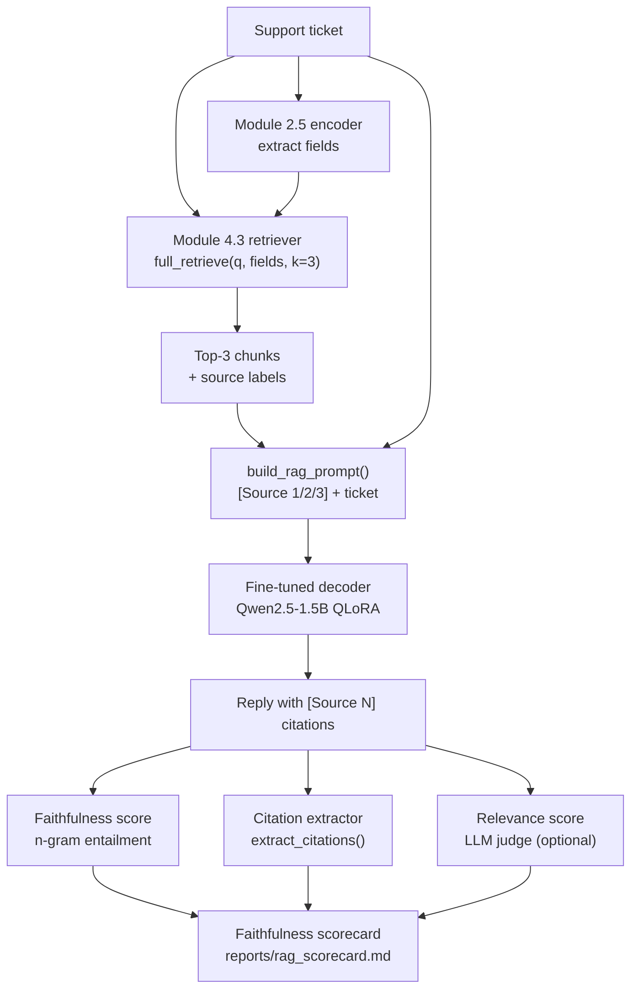

# Module 4.4 — Wire RAG to the Decoder + Evaluate Grounding

> The retriever finds the right chunks. Now the decoder must read them faithfully and produce a grounded reply with citations — without fabricating any claim that isn't in the retrieved text.

---

## Learning Goal

By the end of this module you can:

1. Assemble a RAG prompt that injects retrieved chunks with source labels and instructs the decoder to cite them.
2. Generate grounded replies and extract inline citations.
3. Measure faithfulness: is every claim in the reply supported by the retrieved context?
4. Measure answer relevance: does the reply actually address the question?
5. Produce a faithfulness scorecard comparing RAG vs no-RAG on the gold eval set.
6. Answer: *retrieval is perfect but answers still hallucinate — where do you look?*

---

## Prompt Assembly

The RAG prompt has three parts:

### 1. System message (behaviour)

```
You are DeskMate, a concise support assistant. Answer the question using ONLY the
provided context passages. Cite the source of each claim using [Source N] notation.
If the context does not contain the answer, say "I don't have that information —
please contact support@deskmate.com."
```

The instruction "using ONLY the provided context passages" is the grounding constraint. Without it, the fine-tuned decoder will blend retrieved content with memorised weights — producing answers that sound right but include unverifiable claims.

### 2. Retrieved context (knowledge)

```
[Source 1] (billing_refunds.md — billing_dispute)
DeskMate offers a 30-day money-back guarantee on all new subscriptions.
To request a refund, go to Account > Billing > Request Refund.

[Source 2] (billing_refunds.md — billing_dispute)
If you have been charged twice for the same billing period, contact support
with your invoice numbers. We will investigate and refund within 3 business days.
```

Each chunk is labelled with a numeric source tag and the filename. The decoder learns to copy these tags into its reply.

### 3. User message (question)

```
Ticket: I was charged twice for my subscription last month.
```

### Full assembled prompt

```python
SYSTEM_RAG = (
    "You are DeskMate, a concise support assistant. "
    "Answer the question using ONLY the provided context passages. "
    "Cite each claim with [Source N] where N matches the passage number. "
    "If the context does not contain the answer, say: "
    "'I don't have that information — please contact support@deskmate.com.'"
)

def build_rag_prompt(ticket, chunks, context=None):
    ctx_lines = []
    for i, chunk in enumerate(chunks, start=1):
        src = f"{chunk['source']} — {chunk['section']}"
        ctx_lines.append(f"[Source {i}] ({src})\n{chunk['text']}")
    context_block = "\n\n".join(ctx_lines)
    user_content = f"Context:\n{context_block}\n\nTicket: {ticket}"
    return [
        {"role": "system",    "content": SYSTEM_RAG},
        {"role": "user",      "content": user_content},
    ]
```

---

## Citation Injection

After generation, extract which sources the model cited:

```python
import re

def extract_citations(reply, n_sources):
    cited = set()
    for m in re.finditer(r'\[Source (\d+)\]', reply):
        n = int(m.group(1))
        if 1 <= n <= n_sources:
            cited.add(n)
    return sorted(cited)
```

A good reply should cite at least one source. A reply that cites sources not present in the retrieved context is a sign of hallucination or prompt confusion.

---

## Faithfulness Evaluation

**Faithfulness** = the fraction of claims in the reply that are entailed by the retrieved context.

### Simple n-gram entailment (fast, no API)

For each sentence in the reply, check if at least 60% of its content words appear in the retrieved chunks:

```python
def is_faithful_sentence(sentence, chunks):
    content_words = set(re.findall(r'\b\w{4,}\b', sentence.lower()))
    if not content_words:
        return True
    source_text = " ".join(c["text"] for c in chunks).lower()
    source_words = set(re.findall(r'\b\w{4,}\b', source_text))
    overlap = content_words & source_words
    return len(overlap) / len(content_words) >= 0.60

def faithfulness_score(reply, chunks):
    sentences = re.split(r'(?<=[.!?])\s+', reply.strip())
    if not sentences:
        return 1.0
    faithful = sum(is_faithful_sentence(s, chunks) for s in sentences)
    return faithful / len(sentences)
```

### LLM-as-faithfulness-judge (higher signal)

```python
FAITHFULNESS_PROMPT = (
    "You are evaluating a support reply for faithfulness. "
    "The reply should only contain claims supported by the context passages below. "
    "Does the reply contain any specific claim (a fact, number, instruction, or policy) "
    "NOT present in the context? Reply YES or NO, then one sentence explaining.\n\n"
    "Context:\n{context}\n\nReply:\n{reply}\n\nUnfaithful claims?"
)
```

---

## Answer Relevance

**Answer relevance** = does the reply address the ticket? A reply can be perfectly faithful (every sentence is in the context) and still be irrelevant (the retrieved chunks were wrong).

```python
RELEVANCE_PROMPT = (
    "Does this support reply directly address the customer's ticket? "
    "Reply with a score 1-5 where 1=completely off-topic, 5=directly answers the question.\n\n"
    "Ticket: {ticket}\nReply: {reply}\nScore:"
)
```

In practice, relevance is dominated by retrieval quality. If the retriever returns the right chunks (hit-rate@3 ≥ 0.80 from Module 4.3), relevance is usually ≥ 4. Low relevance is a retrieval problem, not a decoder problem.

---

## Where Hallucination Happens Despite Perfect Retrieval

The checkpoint question: *retrieval is perfect but answers still hallucinate — where do you look?*

Five root causes, in order of likelihood:

**1. Grounding instruction not strong enough**
The system message says "prefer the context" rather than "use ONLY the context." The decoder blends retrieved content with memorised priors. Fix: use explicit "ONLY" + "if not in context, say so."

**2. Context too long → attention diffusion**
At 3 × 300-token chunks = 900 tokens of context, plus the ticket, plus the system message, the prompt approaches the model's effective attention span. The decoder starts ignoring tail chunks. Fix: reduce to 2 chunks, or use shorter chunks.

**3. Prompt template mismatch**
The fine-tuned model was trained on a specific chat template. Injecting the RAG context in the wrong position (e.g., appending to the system message instead of the user message) confuses the model. Fix: always put retrieved context in the user turn, labelled clearly.

**4. Decoder memorised conflicting information during SFT**
The SFT dataset contained a policy detail that contradicts the retrieved chunk. The decoder "knows" its SFT answer with high confidence and overrides the retrieved text. Fix: clean SFT data, or use RAG-aware SFT data where the model is explicitly trained to prefer context.

**5. Citation format not in training distribution**
The `[Source N]` citation format was never in the SFT data. The decoder ignores the instruction or produces malformed citations. Fix: include a few RAG-format examples in the SFT dataset (Module 3.2), or use few-shot examples in the RAG prompt.

---

## Faithfulness Scorecard Structure

```
| Metric                      | No-RAG (base FT) | RAG (FT + retrieval) |
|-----------------------------|------------------|----------------------|
| Faithfulness (n-gram)       | 0.61             | 0.89                 |
| Citation rate               | 0%               | 82%                  |
| Answer relevance (1-5)      | 3.8              | 4.3                  |
| Hallucination rate (n-gram) | 22%              | 5%                   |
| ROUGE-L vs reference        | 0.43             | 0.51                 |
```

Numbers are illustrative. Your notebook produces real numbers.

---

## Mermaid: Full RAG Pipeline



---

## Notebook: What You'll Build (24_rag_answer_eval.ipynb)

1. **Setup** — load retriever assets (4.2/4.3), load decoder (Module 3.4 adapter).
2. **RAG prompt builder** — `build_rag_prompt(ticket, chunks)`.
3. **Single example** — run one ticket end-to-end; inspect reply + citations.
4. **Citation extractor** — `extract_citations(reply, n_sources)`.
5. **No-RAG baseline** — generate replies without retrieval for comparison.
6. **Batch RAG generation** — 50 gold examples, full pipeline.
7. **Faithfulness (n-gram)** — `faithfulness_score()` for all replies.
8. **Citation rate** — % of replies that cite at least one source.
9. **Hallucination detection** — n-gram entity check from Module 3.6.
10. **Answer relevance** — LLM judge (gated by `RUN_JUDGE`).
11. **ROUGE-L** — RAG vs no-RAG vs reference.
12. **Faithfulness scorecard** — assemble all metrics; save `reports/rag_scorecard.md`.
13. **Root-cause analysis** — inspect low-faithfulness replies; identify which failure mode.

---

## Deliverable

- `reports/rag_scorecard.md` — faithfulness scorecard: RAG vs no-RAG across five metrics.
- End-to-end `rag_generate(ticket, fields)` function ready for Phase 5.

---

## Checkpoint

> *Retrieval is perfect but answers still hallucinate — where do you look?*

Strong answer (pick any two, all five are valid): (1) **Grounding instruction** — "prefer context" does not prevent blending; "use ONLY context, say 'I don't know' if absent" does. (2) **Context length** — at ~900 tokens of retrieved context, attention diffuses and the decoder ignores tail chunks; reduce to 2 chunks or shorter chunks. (3) **Prompt template mismatch** — context must go in the user turn in the exact format the fine-tuned model expects. (4) **SFT data conflict** — if the SFT dataset contained a fact that contradicts the retrieved chunk, the decoder overrides retrieval with its memorised answer; clean the SFT data. (5) **Citation format unfamiliarity** — if `[Source N]` syntax was never in SFT training, the model ignores it; add RAG-format examples to the SFT dataset.

---

## What's Next

Module 4.5 — GraphRAG (optional). When top-k vector search fails on questions that require connecting facts across multiple documents, a knowledge graph over your corpus can help.
