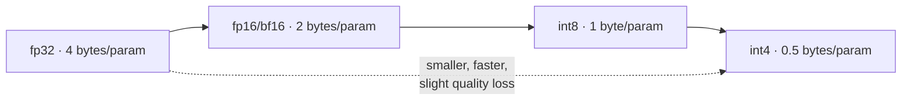

# Module 5.1 — Precision Formats

> **Goal:** Understand what fp32, fp16, bf16, int8, and int4 mean for memory consumption, inference speed, and output quality — and what quantisation fundamentally trades away.

---

## Why Precision Matters

Every number stored in a neural network occupies memory. At inference time, all model weights must fit in VRAM (for GPU) or RAM (for CPU). The numeric format you choose directly controls:

- **Memory footprint** — how large the model is at rest and during inference
- **Throughput** — how fast matrix multiplications run (hardware has native support for narrower formats)
- **Quality** — how much rounding error accumulates across billions of multiplications

---

## Floating-Point Formats

### fp32 — 32-bit float (single precision)

```
[S][  8-bit exponent  ][         23-bit mantissa         ]
```

- **4 bytes per parameter**
- Range: ≈ ±3.4 × 10³⁸; precision: ~7 significant decimal digits
- Training default: most frameworks train in fp32 by default (or mixed fp32/fp16)
- Inference use: safe but slow; 4× the memory of fp16

### fp16 — 16-bit float (half precision)

```
[S][5-bit exp][10-bit mantissa]
```

- **2 bytes per parameter**
- Range: ±65 504; precision: ~3 significant decimal digits
- Risk: **overflow** on large activations (values > 65 504 become `inf`). Common during transformer attention where logits can spike.
- Inference use: widely supported on modern GPUs (NVIDIA Volta+); good speed/quality balance
- Training use: requires loss scaling to prevent underflow of small gradients

### bf16 — bfloat16 (brain float)

```
[S][8-bit exp][7-bit mantissa]
```

- **2 bytes per parameter**
- Same exponent width as fp32 → **same range as fp32**, no overflow risk
- Lower mantissa precision than fp16 (7 vs 10 bits) → slightly noisier
- Training use: preferred over fp16 for modern LLM training (Google TPUs, NVIDIA Ampere+); no loss scaling needed
- Inference use: same memory as fp16; slightly better numerical stability

### Summary: floating-point at a glance

| Format | Bytes | Exponent bits | Mantissa bits | Overflow risk |
|--------|-------|---------------|---------------|---------------|
| fp32   | 4     | 8             | 23            | None          |
| fp16   | 2     | 5             | 10            | Yes (> 65 504)|
| bf16   | 2     | 8             | 7             | None          |

---

## Integer Formats

When you quantise a model, you map floating-point weights into integer bins. This is **not** a native storage format for the model architecture — it requires a **dequantisation step** at inference time (or fused hardware kernels that operate directly on integers).

### int8 — 8-bit integer

- **1 byte per parameter**
- 256 discrete levels
- Quantisation maps each weight tensor to a range `[min, max]` → 256 bins
- Scale factor stored per tensor (or per channel) to recover approximate float values
- Quality loss: small; ROUGE-L typically drops < 0.01 for well-calibrated int8
- Throughput gain: 2× memory bandwidth reduction vs fp16; modern GPUs run int8 matrix multiplications natively
- Library: `bitsandbytes` (`load_in_8bit=True`), ONNX Runtime, TensorRT

### int4 — 4-bit integer

- **0.5 bytes per parameter**
- 16 discrete levels
- **NF4 (NormalFloat4):** QLoRA's variant — quantises to 4-bit values spaced according to a normal distribution, not linearly. Better quality for weight distributions that are approximately Gaussian.
- Quality loss: moderate; ROUGE-L typically drops 0.02–0.05 vs fp16 baseline; depends heavily on calibration data and quantisation scheme
- Throughput gain: 8× memory reduction vs fp32; 4× vs fp16
- Library: `bitsandbytes` (`load_in_4bit=True` + `BitsAndBytesConfig`), GGUF format (llama.cpp), AWQ, GPTQ

---

## The Precision → Memory Formula

```
VRAM (GB) = (num_parameters × bytes_per_param) / 1_000_000_000
```

For inference (weights only — no gradient or optimizer state):

| Format | Bytes/param | 1.5B model | 3B model | 7B model |
|--------|-------------|------------|----------|----------|
| fp32   | 4.0         | 6.0 GB     | 12.0 GB  | 28.0 GB  |
| fp16   | 2.0         | 3.0 GB     | 6.0 GB   | 14.0 GB  |
| bf16   | 2.0         | 3.0 GB     | 6.0 GB   | 14.0 GB  |
| int8   | 1.0         | 1.5 GB     | 3.0 GB   | 7.0 GB   |
| int4   | 0.5         | 0.75 GB    | 1.5 GB   | 3.5 GB   |

> **Rule of thumb:** fp16 needs ~2 GB per billion parameters. int4 needs ~0.5 GB per billion parameters.

Note: real inference adds activation memory on top of weights (roughly 10–20% extra), so plan for headroom.

---

## What Quantisation Fundamentally Trades Away

Quantisation is a lossy compression. Here is what gets lost:

### 1. Representational precision in weights

Weights that were spread over a continuous fp32 range get snapped to discrete bins. A weight of `0.31417` and `0.31389` might both map to the same int4 bin. This rounding error accumulates across every layer.

### 2. Outlier fidelity

Transformer weight matrices contain a small number of **outlier weights** — values much larger than the bulk of the distribution. A global scale factor (`max / 127` for int8) must accommodate the outlier, which wastes resolution on the typical values. Per-channel quantisation mitigates this; NF4 addresses it by using non-linear bin spacing.

### 3. Activation precision (for activation quantisation)

Weight-only quantisation (what `bitsandbytes` does) only quantises weights, not activations. Full int8 inference (weights + activations) gives the biggest speedup but risks larger quality loss, especially for models with activation outliers.

### 4. Calibration sensitivity

Quantisation schemes that use a calibration dataset to pick scale factors can perform very differently if the calibration set doesn't match the target domain. A model quantised on Wikipedia may behave worse on support ticket data.

### What quantisation does NOT trade away (at low quality loss)

- **Model architecture** — the same Transformer structure runs; only the numeric representation changes.
- **Tokenizer** — unchanged.
- **Attention pattern** — approximately preserved; the model still routes tokens to relevant positions.
- **Relative ranking** of outputs — a well-quantised model usually agrees with fp16 on the best token ~98–99% of the time.

---

## Format Selection Guide for DeskMate



| Scenario | Recommended format | Reason |
|---|---|---|
| Training (modern GPU) | bf16 | No overflow risk; same range as fp32 |
| Training (older GPU, no bf16) | fp16 + loss scaling | Ampere+ supports bf16 natively |
| Inference, A100/H100 available | fp16 or bf16 | Full quality, fast matmuls |
| Inference, single consumer GPU (24 GB) | int8 | 3B model fits with headroom |
| Inference, laptop / 8 GB GPU | int4 (GGUF or NF4) | Only option at this memory budget |
| Serving latency-sensitive (SLA < 200ms) | int4 + speculative decoding | See Module 5.7 |

For DeskMate in development: **int4 (NF4)** via `BitsAndBytesConfig` — matches the QLoRA setup from Module 3.4 and fits in a free Colab T4 (15 GB VRAM, model uses ~1.5 GB leaving room for KV cache and activations).

---

## Checkpoint

> *Estimate the memory needed to load a 3B-parameter model in fp16 vs int4.*

**fp16:**
```
3 × 10⁹ params × 2 bytes/param = 6 × 10⁹ bytes = 6.0 GB
```

**int4:**
```
3 × 10⁹ params × 0.5 bytes/param = 1.5 × 10⁹ bytes = 1.5 GB
```

int4 saves 4.5 GB — allowing a 3B model to run on a free Colab T4 (15 GB) or a laptop GPU (8 GB) with room left for KV cache (~0.5–1 GB for typical context lengths) and activations.

---

## Book Reference

§6.1 — *Precision and Quantisation* in the course text covers the bit-level layouts of fp16/bf16/int8 and the calibration-based quantisation workflow in more depth.

---

## What's Next

Module 5.2 — 8-bit quantisation in practice: load the DeskMate decoder in int8 via `bitsandbytes`, benchmark VRAM usage and inference throughput against the fp16 baseline, and measure quality change (ROUGE-L, LLM judge).
