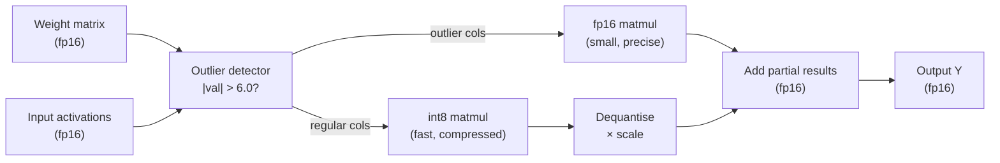

# Module 5.2 — 8-bit Quantisation

> **Goal:** Halve memory with minimal quality loss — load the DeskMate decoder in int8, measure VRAM savings, benchmark throughput, and check that ROUGE-L barely moves.

---

## How int8 Quantisation Works

Each weight tensor is mapped from fp16/fp32 floating-point values into 256 discrete int8 bins.

### Absmax quantisation (the basic form)

Given a weight vector **W** and scale factor **s**:

```
s = max(|W|) / 127
W_int8 = round(W / s)          # quantise
W_approx = W_int8 * s          # dequantise
```

The scale `s` is stored alongside the int8 tensor (one float per tensor or per output channel).

**Error:** `W_approx ≈ W` but with rounding to the nearest of 256 levels. For weights distributed approximately around zero, this is fine. The problem is **outliers**.

---

## The Outlier Problem

Transformer weight matrices — especially in attention projections after many layers — develop **outlier features**: a small number of dimensions with values 10–100× larger than the rest.

If one weight is `0.003` and another is `89.4` in the same tensor:

```
s = 89.4 / 127 = 0.704
round(0.003 / 0.704) = round(0.004) = 0      # small weight collapses to zero
round(89.4 / 0.704) = round(127.0) = 127     # outlier captured fine
```

The small weight loses all precision. In large models (7B+), this causes a measurable quality drop — sometimes catastrophic (perplexity doubles).

---

## LLM.int8() — Outlier-Aware Mixed-Precision

`bitsandbytes` implements the **LLM.int8()** algorithm (Dettmers et al., 2022):

### The key insight

Outliers occupy a very small fraction of dimensions (< 1% of channels in practice), but those dimensions are consistent — the same channels are outliers across many tokens.

### The algorithm (per matrix multiply)

```
Y = X · W

1. Detect outlier columns in X (those with |value| > threshold, default 6.0)
2. Extract the outlier sub-matrix X_out and corresponding rows of W: W_out
3. Compute X_out · W_out  in fp16   (preserves outlier precision)
4. Compute X_reg · W_reg  in int8   (fast, quantised)
5. Dequantise the int8 result, add the fp16 result, return Y
```

The result: outlier dimensions never pass through int8. Regular dimensions get 2× memory bandwidth savings. Quality is preserved at near-fp16 fidelity.

### Trade-off

- Matrix multiply is slightly slower than a pure int8 kernel (mixing two data types, two compute paths)
- On modern GPUs (Ampere+) the net effect is roughly 1.2–1.5× latency per token vs fp16 (not faster, but not much slower)
- Memory savings remain: ~2× vs fp16 for weights

---

## Memory Savings in Practice

For the DeskMate decoder (Qwen2.5-1.5B, 1.5 billion parameters):

| Format | Bytes/param | Weight memory |
|--------|-------------|---------------|
| fp32   | 4.0         | 6.0 GB        |
| fp16   | 2.0         | 3.0 GB        |
| int8   | 1.0         | 1.5 GB        |

Plus overhead: scale factors (one fp16 per output channel per layer), KV cache (fp16, ~0.3–0.5 GB at typical context), activations. In total int8 saves ~1.5 GB vs fp16 for a 1.5B model.

---

## Loading in int8 with bitsandbytes

```python
from transformers import AutoModelForCausalLM, AutoTokenizer, BitsAndBytesConfig

bnb_config = BitsAndBytesConfig(load_in_8bit=True)

model = AutoModelForCausalLM.from_pretrained(
    "Qwen/Qwen2.5-1.5B-Instruct",
    quantization_config=bnb_config,
    device_map="auto",
)
tokenizer = AutoTokenizer.from_pretrained("Qwen/Qwen2.5-1.5B-Instruct")
```

That is the entire change. Hugging Face's `from_pretrained` path handles the rest: it calls `bitsandbytes` to quantise each Linear layer on the fly as weights are loaded into VRAM.

### What gets quantised

All `nn.Linear` layers are converted. Embedding layers and layer norms remain in fp16 (they are small and sensitive to precision).

---

## Benchmarking: What to Measure

### 1. VRAM

```python
import torch
torch.cuda.memory_allocated() / 1e9   # GB in use
torch.cuda.memory_reserved()  / 1e9   # GB reserved by allocator
```

Compare peak VRAM: fp16 model vs int8 model, same batch.

### 2. Throughput (tokens per second)

```python
import time

start = time.perf_counter()
outputs = model.generate(inputs, max_new_tokens=100)
elapsed = time.perf_counter() - start
tps = 100 / elapsed
```

Expect int8 to be 10–30% slower per token than fp16 on a T4 (due to the mixed-precision overhead in LLM.int8()). On A100 with native int8 tensor cores the gap narrows.

### 3. Quality (ROUGE-L)

Run both models on 50 DeskMate gold examples. Expect ROUGE-L to drop < 0.01 between fp16 and int8 for a well-calibrated model.

---

## Expected Results

| Metric              | fp16 baseline | int8 |
|---------------------|---------------|------|
| Weight VRAM         | ~3.0 GB       | ~1.5 GB |
| Peak VRAM (inference)| ~4.2 GB      | ~2.7 GB |
| Tokens/sec (T4)     | ~28           | ~22  |
| ROUGE-L (50 examples)| measured     | ≤ measured − 0.01 |
| Citation rate       | measured      | ≈ same |

Numbers are approximate; your notebook measures the real values.

---

## When to Use int8

| Situation | int8 appropriate? |
|---|---|
| Free Colab T4 (15 GB), 1.5B model | No — fp16 already fits; int8 mainly helps tighter budgets |
| T4 with 7B model (14 GB fp16, 7 GB int8) | **Yes — int8 makes it fit** |
| Latency-critical production serving | No — use fp16 or int4+speculative; int8 adds overhead vs fp16 |
| Debugging / prototype on 8 GB GPU | **Yes** — saves enough to fit |

For DeskMate's 1.5B model, int8 is mostly pedagogical at this scale. Module 5.3 (int4) is where DeskMate gains a meaningful benefit.

---

## Book Reference

§6.2 — covers LLM.int8() in depth, including the outlier detection threshold and per-channel vs per-tensor quantisation.

---

## Mermaid: int8 Quantisation Data Flow



---

## Checkpoint

> *What problem do outlier features cause, and how does LLM.int8() handle it?*

Outlier features (a small number of weight/activation dimensions with values 10–100× the typical range) dominate the absmax scale factor, which forces all normal weights to lose most of their 8-bit precision — some collapsing to zero. LLM.int8() detects these outlier columns at runtime, routes them through a separate fp16 matrix multiply, and computes everything else in int8. The two partial results are added in fp16. This preserves outlier precision without sacrificing the memory savings from int8 for the (vast majority of) regular dimensions.

---

## Notebook: What You'll Build (30_quantize_8bit.ipynb)

1. **Setup** — install `bitsandbytes`; check GPU.
2. **fp16 baseline** — load Qwen2.5-1.5B in fp16; record VRAM + tokens/sec.
3. **int8 load** — `BitsAndBytesConfig(load_in_8bit=True)`; record VRAM.
4. **Single example** — run same prompt through both; compare replies.
5. **Throughput benchmark** — 10 repetitions, 100 new tokens each; plot tokens/sec.
6. **ROUGE-L comparison** — 50 DeskMate gold examples; fp16 vs int8.
7. **VRAM report** — bar chart: fp16 vs int8 peak VRAM.
8. **Summary table** — VRAM / throughput / ROUGE-L in one DataFrame; save `reports/quant_8bit_report.md`.

---

## What's Next

Module 5.3 — 4-bit quantisation: GPTQ, AWQ, and GGUF. Where int8 halves memory, int4 quarters it — and for a 1.5B model, that means fitting comfortably on a laptop CPU or an 8 GB GPU without a GPU at all.
