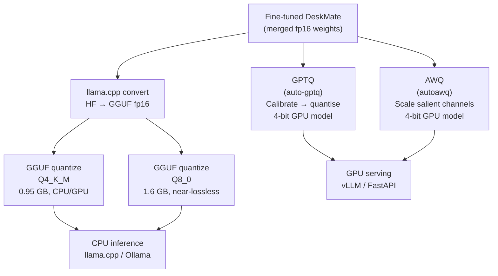

# Module 5.3 — 4-bit Quantisation: GPTQ, AWQ, and GGUF

> **Goal:** Get to int4 for the smallest possible footprint — under 1 GB for a 1.5B model — enabling CPU inference on a laptop and GPU inference on an 8 GB card.

---

## The Three int4 Approaches

| Approach | What it does | Primary use case |
|---|---|---|
| **QLoRA NF4** | Quantise base weights to NF4 during fine-tuning; adapters stay in fp16 | Training on constrained GPU (Module 3.4) |
| **GPTQ** | Post-training calibration-based weight quantisation; runs on GPU via `auto-gptq` | Fast GPU inference with quantised model |
| **AWQ** | Activation-aware weight quantisation; scales weights before quantising to protect salient channels | GPU inference; better quality than GPTQ at same bit-width |
| **GGUF** | Quantised model packed into a portable single-file format; runs on CPU via `llama.cpp` | Local/offline/edge deployment, no GPU required |

This module covers GPTQ, AWQ, and GGUF — the three post-training 4-bit paths you use after fine-tuning is complete.

---

## GPTQ — Generalised Post-Training Quantisation

### Core idea

GPTQ quantises each layer's weight matrix **W** using second-order information from a calibration dataset. For each row of **W**, it finds the 4-bit values that minimise the **layer output error** (not just the weight approximation error):

```
min over W_q: || WX - W_q X ||²_F
```

Where **X** is the calibration activation matrix.

### Algorithm (simplified)

1. Run a few hundred calibration examples through the model, collecting activations at each layer.
2. For each Linear layer, quantise weights column-by-column. After quantising one column, **compensate** subsequent columns for the introduced error using the inverse Hessian of the layer loss.
3. The compensation step is what makes GPTQ better than naive rounding — errors are absorbed into adjacent weights rather than accumulating.

### What calibration data does

The Hessian depends on the distribution of activations. If you calibrate on Wikipedia but deploy on support tickets:
- Activation distributions differ
- Optimal quantisation bins shift
- Quality drops by 2–5 ROUGE-L points vs calibrating on in-domain data

**Always calibrate on a sample of your target domain.**

### GPTQ in practice

```python
from transformers import AutoModelForCausalLM, AutoTokenizer, GPTQConfig

gptq_config = GPTQConfig(
    bits=4,
    dataset="c4",          # calibration dataset (or your own list of strings)
    tokenizer=tokenizer,
)

model = AutoModelForCausalLM.from_pretrained(
    "Qwen/Qwen2.5-1.5B-Instruct",
    quantization_config=gptq_config,
    device_map="auto",
)
model.save_pretrained("models/deskmate-gptq-4bit/")
```

---

## AWQ — Activation-Aware Weight Quantisation

### Why AWQ improves on GPTQ

GPTQ treats all weight columns equally (within the Hessian correction). AWQ observes that a small fraction of weight channels are **salient** — they correspond to input activations that are consistently large. Quantising those channels to 4-bit with a naive bin layout destroys disproportionate quality.

AWQ's fix: **scale salient channels up** before quantisation (so more bins cover the important range), then scale activations **down** by the same factor at inference time. This is mathematically equivalent but better preserves salient weight precision.

```
For salient channel j:
  W_j_scaled = W_j * s_j      (scale up weight before quantising)
  x_j_scaled = x_j / s_j      (scale down activation at runtime)

The product W_j_scaled · x_j_scaled = W_j · x_j (unchanged output)
But W_j_scaled occupies more of the 4-bit range → less rounding error
```

### AWQ in practice

```python
from awq import AutoAWQForCausalLM

model = AutoAWQForCausalLM.from_pretrained("Qwen/Qwen2.5-1.5B-Instruct")
tokenizer = AutoTokenizer.from_pretrained("Qwen/Qwen2.5-1.5B-Instruct")

quant_config = {
    "zero_point": True,
    "q_group_size": 128,   # quantise in groups of 128 weights
    "w_bit": 4,
    "version": "GEMM",
}

# Calibrate and quantise
model.quantize(tokenizer, quant_config=quant_config, calib_data=["support ticket text..."])
model.save_quantized("models/deskmate-awq-4bit/")
```

### GPTQ vs AWQ — which to choose?

| Dimension | GPTQ | AWQ |
|---|---|---|
| Quality at 4-bit | Good | Slightly better |
| Quantisation speed | Slower (column-by-column Hessian) | Faster |
| Inference kernel | `exllama` / `triton` | `GEMM` / `GEMV` (fast on A10+) |
| Calibration sensitivity | Higher | Lower |
| Ecosystem maturity | Very mature (2023) | Newer but growing |
| Best for | Wide hardware support | Best quality at 4-bit |

For DeskMate at 1.5B: either works. AWQ is preferred if you have A10 or better; GPTQ if you need wider compatibility.

---

## GGUF — The CPU Deployment Format

### What GGUF is

GGUF (GGML Universal Format) is a **single-file model format** designed for `llama.cpp`. It stores:
- Quantised weights (various levels: Q2_K, Q3_K_M, Q4_K_M, Q5_K_M, Q8_0, etc.)
- Tokenizer vocabulary and special tokens
- Model architecture metadata (num_heads, hidden_dim, rope_theta, etc.)
- Everything needed to run inference — no HuggingFace library required

### Why GGUF matters

| Property | PyTorch/HuggingFace | GGUF |
|---|---|---|
| Runtime dependency | transformers + torch | `llama.cpp` (C++, no Python) |
| GPU required | Yes (for reasonable speed) | No — CPU-only is the primary use case |
| Memory mapping | No (full load) | Yes — mmap allows partial loading |
| Portability | Python-only | Any OS, any hardware |
| Quantisation options | fp16 / int8 / int4 | Q2 through Q8 in one file |

For DeskMate: a GGUF export lets you run the model on a support agent's laptop without a GPU, or in an offline environment with no internet access.

### GGUF quantisation levels

| GGUF type | Effective bits/weight | Quality vs fp16 | Size (1.5B model) |
|---|---|---|---|
| Q2_K   | ~2.6 | Large drop | ~0.55 GB |
| Q3_K_M | ~3.35 | Noticeable drop | ~0.70 GB |
| Q4_K_M | ~4.5 | Small drop (≤ 0.02 ROUGE-L) | ~0.95 GB |
| Q5_K_M | ~5.7 | Tiny drop | ~1.15 GB |
| Q8_0   | ~8.0 | Near-lossless | ~1.60 GB |
| F16    | 16   | Baseline | ~3.0 GB |

**Q4_K_M is the standard default**: good quality, fits a laptop RAM, fast CPU inference.

### Converting to GGUF

```bash
# Clone llama.cpp
git clone https://github.com/ggerganov/llama.cpp
cd llama.cpp && pip install -r requirements.txt

# Convert HuggingFace model → GGUF fp16
python convert_hf_to_gguf.py models/deskmate-merged/ --outtype f16 \
    --outfile models/deskmate-f16.gguf

# Quantise GGUF fp16 → Q4_K_M
./quantize models/deskmate-f16.gguf models/deskmate-Q4_K_M.gguf Q4_K_M
```

### Running GGUF with llama-cpp-python

```python
from llama_cpp import Llama

llm = Llama(
    model_path="models/deskmate-Q4_K_M.gguf",
    n_ctx=2048,
    n_threads=8,   # number of CPU threads
    verbose=False,
)

response = llm.create_chat_completion(
    messages=[
        {"role": "system", "content": "You are DeskMate, a concise support assistant."},
        {"role": "user",   "content": "Ticket: I was charged twice last month."},
    ],
    max_tokens=150,
)
print(response["choices"][0]["message"]["content"])
```

---

## Memory & Quality Summary

For DeskMate (Qwen2.5-1.5B, 1.5B parameters):

| Format | VRAM/RAM | ROUGE-L vs fp16 | Notes |
|---|---|---|---|
| fp16   | 3.0 GB GPU  | baseline | Development default |
| int8   | 1.5 GB GPU  | -0.005  | Module 5.2 |
| GPTQ 4-bit | 0.75 GB GPU | -0.015 | GPU deployment |
| AWQ 4-bit  | 0.75 GB GPU | -0.010 | GPU deployment, better quality |
| GGUF Q4_K_M | 0.95 GB RAM | -0.018 | CPU deployment, laptop |
| GGUF Q8_0   | 1.6 GB RAM  | -0.005 | CPU, highest quality |

---

## Checkpoint

> *GPTQ vs GGUF — when do you reach for each?*

**GPTQ:** when you have a GPU and want the fastest int4 inference speed in a Python/HuggingFace ecosystem. GPTQ is a weight quantisation algorithm — the output is still a HuggingFace-compatible model directory, loadable with `transformers`. Use it for GPU-based serving (vLLM, FastAPI + GPU server).

**GGUF:** when you need to run on CPU, deploy to a laptop, or remove the Python/PyTorch dependency entirely. GGUF is a portable single-file format run by `llama.cpp` (or `llama-cpp-python`). Use it for local deployment (Module 6.4 — Ollama), offline environments, and edge hardware.

The key difference: GPTQ ≈ "better int4 GPU inference"; GGUF ≈ "CPU-first portability".

---

## Book Reference

- §6.3 — GGUF format internals, llama.cpp quantisation levels
- §6.4 — GPTQ and AWQ algorithms, calibration data, exllama kernels

---

## Mermaid: 4-bit Post-Training Quantisation Paths



---

## Notebook: What You'll Build (31_quantize_4bit_gguf.ipynb)

1. **Setup** — install `auto-gptq`, `autoawq`, `llama-cpp-python`.
2. **GPTQ quantisation** — calibrate on 10 DeskMate ticket examples; quantise; record VRAM.
3. **AWQ quantisation** — same calibration data; quantise; record VRAM.
4. **GGUF export** — convert fp16 HF model → GGUF; quantise to Q4_K_M and Q8_0.
5. **Throughput benchmark** — tokens/sec: fp16 vs GPTQ vs AWQ vs GGUF Q4 (CPU).
6. **ROUGE-L comparison** — 10 gold examples × 4 formats.
7. **File size comparison** — bar chart: fp16 / GPTQ / AWQ / Q4_K_M / Q8_0.
8. **Summary table** — VRAM/RAM, size, throughput, ROUGE-L; save `reports/quant_4bit_report.md`.

---

## What's Next

Module 5.4 — ONNX export & runtime. A complementary path: instead of quantising weights, export the computation graph to ONNX and run it with ONNX Runtime's optimised execution providers. Useful when you need portability across runtimes (not just llama.cpp) or when deploying the encoder (classifier/extractor) alongside the decoder.
