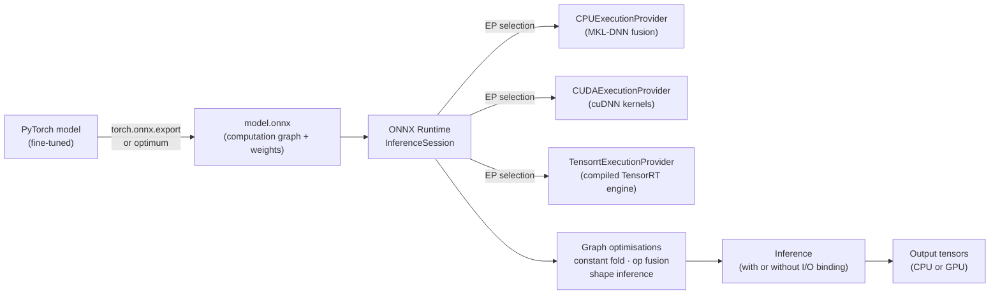

# Module 5.4 — ONNX Export & Runtime

> **Goal:** Export DeskMate's encoder and decoder to a portable ONNX graph, then run them with ONNX Runtime's optimised execution providers — benchmarked against the PyTorch baseline.

---

## What ONNX Is

**ONNX (Open Neural Network Exchange)** is a standardised format for representing computation graphs. A trained model is serialised as a `.onnx` file containing:

- A directed acyclic graph (DAG) of **operators** (MatMul, LayerNorm, Attention, Softmax, …)
- **Initialisers** — the weight tensors (stored directly in the file or externally)
- **Input/output signatures** — named tensors with shape and dtype information
- **Opset version** — the operator specification revision (opset 17 is current for most uses)

The graph has no Python, PyTorch, or framework dependency. Any runtime that implements the ONNX operator set can execute it.

---

## Why Export to ONNX

| Motivation | Detail |
|---|---|
| **Runtime portability** | Run on ONNX Runtime, TensorRT, DirectML, CoreML, NNAPI, QNN — same file |
| **CPU optimisation** | ONNX Runtime's CPU execution provider uses Intel MKL-DNN / OpenBLAS, often faster than vanilla PyTorch CPU |
| **Graph fusion** | ORT fuses adjacent operators (e.g. LayerNorm = 5 ops → 1 fused kernel) automatically |
| **Deployment without PyTorch** | A C++ inference service, mobile app, or browser (ONNX.js) can run the model |
| **Quantisation pipeline** | ONNX Runtime supports static int8 quantisation on the exported graph |

For DeskMate: the **encoder** (Module 2.5, `deberta-v3-small`) benefits most — it runs on every ticket at low latency. The **decoder** can also be exported, but autoregressive LLM ONNX export has limitations (see caveats below).

---

## ONNX Operators and Types

### Core operator categories

| Category | Examples |
|---|---|
| Tensor algebra | MatMul, Gemm, Conv, Transpose |
| Elementwise | Add, Mul, Relu, Gelu, Sigmoid |
| Reduction | ReduceMean, ReduceSum, Softmax |
| Shape manipulation | Reshape, Squeeze, Unsqueeze, Concat, Slice |
| Normalisation | LayerNorm (opset 17), BatchNormalization |
| Attention (contrib) | MultiHeadAttention (ORT contrib op — not standard ONNX) |

### Data types

`float32`, `float16`, `int8`, `int32`, `int64`, `bool`. The graph signature specifies dtype per input/output. Casting operators (`Cast`) bridge between types.

---

## Exporting with `torch.onnx.export`

### Encoder (classification / extraction head)

```python
import torch
from transformers import AutoModelForSequenceClassification, AutoTokenizer

tokenizer = AutoTokenizer.from_pretrained("microsoft/deberta-v3-small")
model     = AutoModelForSequenceClassification.from_pretrained(
                "models/deskmate-encoder/")
model.eval()

# Dummy input that matches the real input shape
dummy = tokenizer("Example support ticket", return_tensors="pt",
                  padding="max_length", max_length=128, truncation=True)

torch.onnx.export(
    model,
    args=(dummy["input_ids"], dummy["attention_mask"]),
    f="models/deskmate_encoder.onnx",
    input_names=["input_ids", "attention_mask"],
    output_names=["logits"],
    dynamic_axes={
        "input_ids":      {0: "batch_size", 1: "seq_len"},
        "attention_mask": {0: "batch_size", 1: "seq_len"},
        "logits":         {0: "batch_size"},
    },
    opset_version=17,
    do_constant_folding=True,   # fold constant sub-expressions at export
)
```

`dynamic_axes` marks batch and sequence dimensions as variable — without this, the exported model only accepts the exact shape used for the dummy input.

### Decoder (Qwen2.5-1.5B)

For autoregressive decoders, use `optimum` which handles the KV-cache loop:

```python
from optimum.onnxruntime import ORTModelForCausalLM

model_ort = ORTModelForCausalLM.from_pretrained(
    "Qwen/Qwen2.5-1.5B-Instruct",
    export=True,                # triggers ONNX export on first load
    provider="CUDAExecutionProvider",
)
model_ort.save_pretrained("models/deskmate_decoder_onnx/")
```

`optimum` splits the decoder into two graphs: `model.onnx` (prefill, no KV cache) and `model_with_past.onnx` (decode step, accepts KV cache). This avoids re-computing attention over the full context at each generation step.

---

## ONNX Runtime — Execution Providers

ONNX Runtime (ORT) selects an **execution provider (EP)** to run the graph. EPs map ONNX operators to hardware-specific kernels:

| Execution Provider | Hardware | Use case |
|---|---|---|
| `CPUExecutionProvider` | Any CPU | Default; uses MKL/OpenBLAS |
| `CUDAExecutionProvider` | NVIDIA GPU | Primary GPU path |
| `TensorrtExecutionProvider` | NVIDIA GPU | Highest GPU throughput (compiles to TensorRT) |
| `CoreMLExecutionProvider` | Apple Silicon | Mac/iOS deployment |
| `DirectMLExecutionProvider` | Windows GPU (DX12) | AMD/Intel GPU on Windows |
| `ROCMExecutionProvider` | AMD GPU | |

ORT tries EPs in the priority list and falls back:

```python
import onnxruntime as ort

session = ort.InferenceSession(
    "models/deskmate_encoder.onnx",
    providers=["CUDAExecutionProvider", "CPUExecutionProvider"],
)
print(session.get_providers())  # shows which EP is active
```

---

## I/O Binding

### The problem: data transfer on the hot path

Without I/O binding, each ORT inference call:
1. Allocates a new output tensor on GPU
2. Copies the result back to CPU (so the Python caller can read it)
3. On the next call, copies inputs from CPU back to GPU

For a latency-critical service running thousands of tickets/minute, this CPU↔GPU transfer is pure overhead — especially when the output of one model is the input to the next (encoder → decoder).

### The fix: I/O binding

```python
io_binding = session.io_binding()

# Bind input: tensor already on GPU, skip the CPU→GPU copy
input_on_gpu = input_tensor.contiguous().cuda()
io_binding.bind_input(
    name="input_ids",
    device_type="cuda",
    device_id=0,
    element_type=np.int64,
    shape=tuple(input_on_gpu.shape),
    buffer_ptr=input_on_gpu.data_ptr(),
)

# Bind output: allocate directly on GPU, skip the GPU→CPU copy
io_binding.bind_output("logits", device_type="cuda", device_id=0)

session.run_with_iobinding(io_binding)

# Read output (stays on GPU if you pass it to another CUDA model)
logits = io_binding.copy_outputs_to_cpu()[0]
```

**What I/O binding removes from the hot path:** the CPU↔GPU memory copies for inputs and outputs. For a DeBERTa encoder with a 128-token input, this saves ~0.5–2 ms per call — significant when the encoder runs on every inbound ticket.

---

## Graph Optimisations Applied by ORT

When you load an `.onnx` file, ORT applies a sequence of graph-level optimisations automatically:

| Optimisation | What it does |
|---|---|
| **Constant folding** | Pre-computes sub-expressions that depend only on weights |
| **Operator fusion** | Merges adjacent ops into a single kernel (e.g., Attention = Q/K/V matmuls + softmax + output projection → one fused op) |
| **Layer normalisation fusion** | Fuses the 5-op LayerNorm sequence into a single ORT-native op |
| **GELU fusion** | Fuses the GELU approximation into a single kernel |
| **Shape inference** | Propagates shapes through the graph, enabling further static optimisations |

You control the optimisation level:

```python
sess_opts = ort.SessionOptions()
sess_opts.graph_optimization_level = ort.GraphOptimizationLevel.ORT_ENABLE_ALL
session = ort.InferenceSession("model.onnx", sess_opts, providers=[...])
```

---

## ONNX for LLMs — Caveats

| Limitation | Detail |
|---|---|
| **Autoregressive loop is in Python** | `torch.onnx.export` captures the single forward pass. The token-by-token loop (sample, append, re-run) stays in Python unless you use `optimum`. |
| **Dynamic shapes complicate TensorRT** | TensorRT requires fixed shapes or narrow dynamic ranges. Variable sequence length = must provide shape profiles. |
| **KV cache is a large dynamic tensor** | Efficient KV cache requires careful binding; `optimum` handles this but adds complexity. |
| **Best fit: encoder models** | Classifiers, extractors, embedding models — fixed input/output shape, single forward pass — export cleanly and benefit most from ORT optimisations. |

For DeskMate: **export the encoder** (DeBERTa) for production. The decoder can be exported via `optimum` but for CPU inference, GGUF (Module 5.3) is simpler and often faster.

---

## Expected Benchmark (DeBERTa encoder, 128-token input, batch=1)

| Runtime | Latency (ms) | Notes |
|---|---|---|
| PyTorch CPU | ~45 ms | Baseline |
| ORT CPU (`ORT_ENABLE_ALL`) | ~22 ms | ~2× speedup from fusion + MKL |
| ORT CUDA | ~4 ms | GPU, no I/O binding |
| ORT CUDA + I/O binding | ~2 ms | GPU, no CPU↔GPU copy overhead |

Numbers are illustrative; your notebook measures the real values on the available hardware.

---

## Checkpoint

> *What does I/O binding remove from the hot path?*

I/O binding eliminates the CPU↔GPU memory transfers for model inputs and outputs. Without it, ORT copies input tensors from CPU RAM to GPU VRAM before each forward pass, and copies output tensors back from GPU VRAM to CPU RAM after — even if the data was already on GPU and the output will immediately be moved back to GPU. I/O binding lets you hand ORT a GPU pointer directly (no copy in) and receive the output at a pre-allocated GPU buffer (no copy out). For a DeBERTa encoder processing thousands of tickets/minute, removing these copies saves 0.5–2 ms per call.

---

## Book Reference

- Chapter 5 (all) — ONNX export, ORT session options, execution providers, graph optimisation levels
- §5.5–5.6 — I/O binding details and benchmark methodology

---

## Mermaid: ONNX Export & Inference Flow



---

## Notebook: What You'll Build (32_onnx_export.ipynb)

1. **Setup** — install `onnx`, `onnxruntime-gpu`, `optimum[onnxruntime]`.
2. **Export encoder** — `torch.onnx.export` with dynamic axes; validate with `onnx.checker`.
3. **ORT session** — load encoder ONNX; inspect providers; print fused op count.
4. **CPU benchmark** — PyTorch CPU vs ORT CPU (`ORT_ENABLE_ALL`); latency distribution.
5. **GPU benchmark** — ORT CUDA vs ORT CUDA + I/O binding; latency distribution.
6. **Export decoder** — `ORTModelForCausalLM` via `optimum`; record file sizes.
7. **Decoder throughput** — ORT vs PyTorch tokens/sec on same GPU.
8. **ROUGE-L check** — confirm ORT decoder output matches PyTorch (< 0.01 ROUGE-L delta).
9. **Summary table** — latency / throughput / ROUGE-L; save `reports/onnx_report.md`.

---

## What's Next

Module 5.5 — Profiling & graph optimisation. Instead of picking optimisation options by intuition, profile the ONNX model to find the actual bottleneck (slowest operator), then apply a targeted fix.
