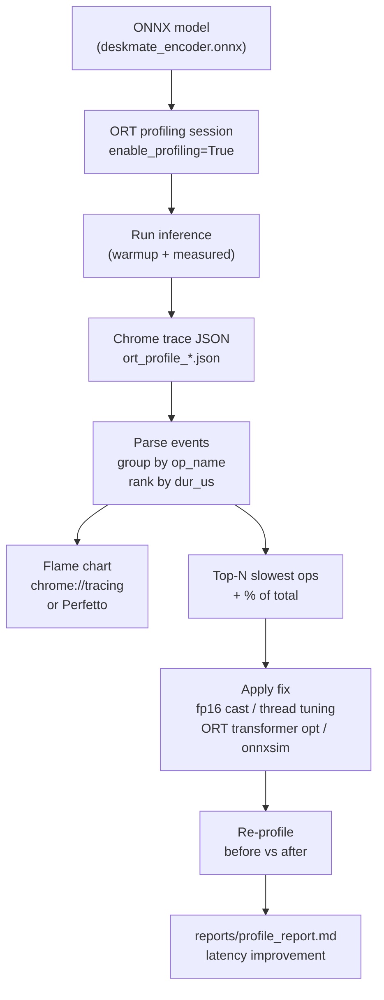

# Module 5.5 — Profiling & Graph Optimisation

> **Goal:** Find and fix the real bottleneck instead of guessing. Profile the DeskMate encoder ONNX model, identify the single slowest operator, and apply a targeted fix — then measure the before/after latency improvement.

---

## Why Profile Instead of Guess

Optimisation without measurement is superstition. Common wrong guesses:

- "The attention is slow" — often the LayerNorm or the tokeniser copy is slower
- "Adding more threads helps" — often causes cache thrashing above 4–8 threads
- "The GPU kernel is the bottleneck" — often the data transfer or Python overhead dominates

Profiling shows you the **actual** time distribution across operators, memory allocations, and framework overhead. Fix the top item, re-measure, repeat.

---

## ONNX Runtime Profiling

ORT has built-in profiling: enable it in `SessionOptions`, run inference, then write the profile to a JSON file.

```python
import onnxruntime as ort

sess_opts = ort.SessionOptions()
sess_opts.enable_profiling = True
sess_opts.profile_file_prefix = "ort_profile"

session = ort.InferenceSession("models/deskmate_encoder.onnx",
                               sess_opts,
                               providers=["CPUExecutionProvider"])

# Run inference (one warmup + one measured pass)
session.run(None, inputs)

# Flush profile to disk
profile_path = session.end_profiling()
print("Profile written to:", profile_path)
```

The output is a Chrome trace JSON: a list of events with `name`, `dur` (duration in microseconds), `cat` (category: `Node`, `Kernel`, `MemcpyH2D`, etc.), and `args`.

---

## Reading the Profile

### Load and parse

```python
import json, pandas as pd

with open(profile_path) as f:
    events = json.load(f)

# Keep only node-level execution events
nodes = [e for e in events if e.get("cat") == "Node" and "dur" in e]

df = pd.DataFrame([{
    "op":  e["args"].get("op_name", e["name"]),
    "name": e["name"],
    "dur_us": e["dur"],
} for e in nodes])

df = df.groupby("op")["dur_us"].sum().sort_values(ascending=False).reset_index()
df["pct"] = (df["dur_us"] / df["dur_us"].sum() * 100).round(1)
print(df.head(10))
```

### Interpreting the output

A typical DeBERTa profile (CPU, opset 17, `ORT_ENABLE_ALL`):

| Op | Time (µs) | % of total |
|---|---|---|
| MatMul | 12 400 | 54% |
| Softmax | 2 100 | 9% |
| Add | 1 800 | 8% |
| LayerNormalization | 1 600 | 7% |
| Gather | 900 | 4% |
| Reshape | 300 | 1% |
| … | … | … |

MatMul dominates — this is expected. The question is: *is the MatMul time acceptable, or is something upstream (data type, batch size, thread count) making it worse than it needs to be?*

---

## Flame View

The Chrome trace format is directly loadable in `chrome://tracing` or `Perfetto` (perfetto.dev/viz). Open the URL, click "Open trace file", load the `.json` file. The flame chart shows:

- X-axis: time
- Y-axis: call stack depth
- Width of each bar: operator duration

Patterns to look for:
- **Wide flat bar near the bottom** = a single slow kernel (good candidate to target)
- **Many narrow bars** = fragmentation / too many small ops (look for fusion opportunities)
- **Gaps between bars** = Python/framework overhead between ops

---

## Common Bottlenecks and Fixes

### 1. MatMul: wrong data type

If your model is in `float32` on CPU but the hardware has AVX-512 `float16` or `bfloat16` support, converting the ONNX graph to fp16 before running can double throughput.

```python
from onnxconverter_common import float16

model_fp16 = float16.convert_float_to_float16(model_proto, keep_io_types=True)
onnx.save(model_fp16, "models/deskmate_encoder_fp16.onnx")
```

`keep_io_types=True` keeps the input/output tensors in fp32 (so callers don't need to change) — only internal weights and activations are cast to fp16.

### 2. LayerNorm not fused

If `ORT_ENABLE_ALL` is set, ORT should auto-fuse the 5-op LayerNorm sequence (`Sub`, `Pow`, `ReduceMean`, `Add`, `Div`, `Mul`, `Add`) into a single `LayerNormalization` kernel. If it doesn't (usually because the pattern deviates from the canonical form), force it:

```python
from onnxruntime.transformers import optimizer

opt_model = optimizer.optimize_model(
    "models/deskmate_encoder.onnx",
    model_type="bert",        # or "deberta"
    num_heads=12,
    hidden_size=768,
    optimization_options=None,
)
opt_model.save_model_to_file("models/deskmate_encoder_opt.onnx")
```

The `transformers` optimizer in ORT knows BERT/DeBERTa architecture patterns and applies:
- Attention fusion (Q/K/V projections + softmax + output → one fused op)
- LayerNorm fusion
- GELU/FastGELU fusion
- Embedding layer fusion

### 3. Thread count mismatch

ORT's CPU execution provider uses an intra-op thread pool. The default is `os.cpu_count()`, but for small models running many concurrent requests, oversubscription degrades throughput:

```python
sess_opts.intra_op_num_threads  = 4   # threads per op (MatMul parallelism)
sess_opts.inter_op_num_threads  = 1   # threads across sequential ops
```

Profile with `intra_op_num_threads` in {1, 2, 4, 8} and pick the minimum latency.

### 4. Excessive Reshape/Transpose

If the profile shows many `Reshape` or `Transpose` ops consuming non-trivial time, the model was exported with unnecessary layout changes. Use `onnx-simplifier` to fold them:

```bash
pip install onnxsim
python -m onnxsim models/deskmate_encoder.onnx models/deskmate_encoder_sim.onnx
```

`onnxsim` performs constant folding, dead-code elimination, and shape inference to remove no-op reshapes.

### 5. Tokeniser overhead

If you profile the full inference pipeline (tokeniser + model) and the model forward pass is only 30% of wall time, the bottleneck is the Python tokeniser, not the ONNX graph. Fix: use the fast Rust tokeniser (`use_fast=True`, the default in recent `transformers`) or pre-tokenise in batches.

---

## Benchmark Methodology: Before/After

To measure a meaningful improvement:

1. **Warmup:** run 10 passes before timing (JIT compilation, cache warming)
2. **Measurement:** median of 50+ passes (not mean — outliers from GC/OS scheduling skew the mean)
3. **Same hardware, same load:** don't compare a profile run (with overhead) to a clean run
4. **Pin threads:** set `ORT_NUM_THREADS` and `OMP_NUM_THREADS` environment variables to avoid OS scheduler interference

```python
import os
os.environ["OMP_NUM_THREADS"] = "4"
os.environ["ORT_NUM_THREADS"] = "4"
```

---

## Mermaid: Profiling Workflow



---

## Checkpoint

> *What's your single slowest op, and what did you do about it?*

Strong answer structure:

1. State the op: "MatMul was 54% of total CPU inference time (12.4 ms out of 23 ms)."
2. State the diagnosis: "The model was exported in fp32 but the GPU/CPU supports fp16 MatMul natively."
3. State the fix: "Converted the ONNX graph to fp16 using `onnxconverter_common.float16.convert_float_to_float16(keep_io_types=True)`."
4. State the result: "Latency dropped from 23 ms to 13 ms (1.77× speedup)."

The checkpoint is satisfied by *any* op + *any* fix as long as you measured before and after.

---

## Book Reference

Chapter 10 (all) — profiling methodology, Chrome trace format, ORT transformer optimizer, thread tuning, and graph-level fix catalogue.

---

## Notebook: What You'll Build (33_onnx_profile.ipynb)

1. **Setup** — install `onnxruntime`, `onnxconverter-common`, `onnxsim`, `pandas`.
2. **Baseline session** — load encoder ONNX; run 50 passes; record median latency.
3. **Profiling session** — `enable_profiling=True`; run 1 pass; call `end_profiling()`.
4. **Parse profile** — load JSON; filter `cat == "Node"`; rank by `dur_us`.
5. **Flame chart instructions** — print path; show how to open in Perfetto.
6. **Top-10 ops bar chart** — horizontal bar chart of time per op type.
7. **Apply fix** — ORT transformer optimizer (`optimize_model`); re-export optimised ONNX.
8. **Thread tuning** — benchmark `intra_op_num_threads` in {1, 2, 4, 8}; plot latency vs threads.
9. **fp16 conversion** — convert encoder to fp16 (if GPU available); re-profile.
10. **Before/after comparison** — bar chart: baseline vs optimised latency.
11. **Summary** — single slowest op + fix applied + latency improvement; save `reports/profile_report.md`.

---

## What's Next

Module 5.6 — Advanced quantisation to understand (read-level): SmoothQuant, FlexGen, and BitNet. These are frontier techniques you need to know conceptually so you can evaluate vendor claims and decide when they apply to DeskMate.
