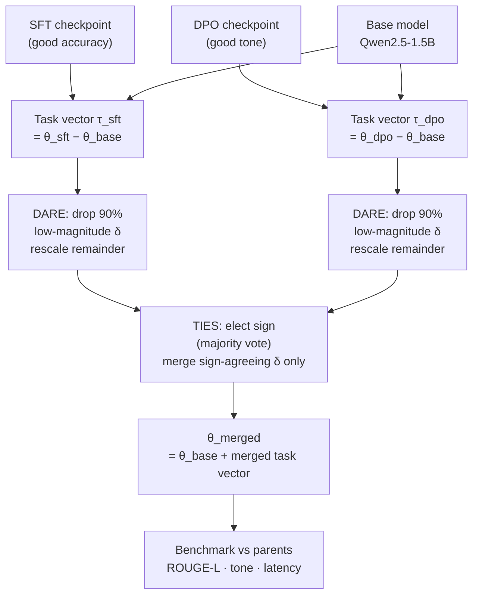

# Module 5.8 — Model Merging: SLERP & DARE-TIES (Optional)

> **Status: OPTIONAL.** Do this module if you have both an SFT checkpoint and a DPO-tuned checkpoint and want to combine their strengths without re-training. Skip it if you only have one fine-tuned variant or if your regression suite already passes ≥ 90% with a single checkpoint.

---

## When to Do This Module

Model merging is worth the effort when you have **two fine-tuned checkpoints with complementary strengths**:

| Checkpoint | Strength | Weakness |
|---|---|---|
| `deskmate-sft-adapter` (Module 3.4) | High ROUGE-L, accurate domain content | Occasionally terse or abrupt tone |
| `deskmate-dpo-adapter` (Module 3.7) | Better tone, format, politeness | Slightly lower ROUGE-L vs SFT alone |

Merging combines both properties into one model at **zero additional training cost** and **zero latency cost** — a merged model has the same parameter count and the same inference speed as either parent.

---

## What Model Merging Is

Standard fine-tuning produces a model `θ_ft = θ_base + Δθ` where `Δθ` is the weight delta introduced by training. Two fine-tuned models have different deltas:

```
θ_sft = θ_base + Δθ_sft
θ_dpo = θ_base + Δθ_dpo
```

Model merging combines the deltas to produce a single model with properties of both:

```
θ_merged = θ_base + f(Δθ_sft, Δθ_dpo)
```

The key question is what `f` should be. Three techniques answer it differently.

---

## Task Vectors

A **task vector** is the weight delta introduced by fine-tuning:

```
τ_sft = θ_sft − θ_base
τ_dpo = θ_dpo − θ_base
```

The simplest merge is linear interpolation:

```
θ_merged = θ_base + λ·τ_sft + (1−λ)·τ_dpo
```

This is also called **model soup** or **weight averaging**. It works surprisingly well when the two models are trained from the same base. λ = 0.5 gives equal weight; tune λ on a validation set.

**Problem:** task vectors interfere when they occupy the same directions in weight space. A weight that SFT pushed in one direction and DPO pushed in the opposite direction will partially cancel — degrading both capabilities.

---

## SLERP — Spherical Linear Interpolation

Linear interpolation treats weight matrices as flat vectors in Euclidean space. SLERP treats them as **vectors on a unit sphere** and interpolates along the geodesic (shortest arc on the sphere's surface).

For two weight vectors `w_1` and `w_2` at interpolation fraction `t`:

```
SLERP(w_1, w_2, t) = sin((1−t)·Ω)/sin(Ω) · w_1 + sin(t·Ω)/sin(Ω) · w_2

where Ω = arccos(w_1ᵀ·w_2 / (‖w_1‖·‖w_2‖))
```

### Why spherical interpolation is better

Linear interpolation can produce intermediate weight vectors with **smaller magnitude** than either parent (imagine two vectors pointing in different directions — the average points somewhere in between but is shorter). Smaller-magnitude weights change the model's effective "scale" and can hurt layer normalisation.

SLERP preserves the magnitude throughout the interpolation path — the merged vector stays on the sphere, so layer norms see the same scale as in the parent models.

### In practice

```python
from mergekit.merge import MergeConfiguration

merge_config = MergeConfiguration.model_validate({
    "merge_method": "slerp",
    "models": [
        {"model": "models/deskmate-sft-merged/"},
        {"model": "models/deskmate-dpo-merged/"},
    ],
    "base_model": "Qwen/Qwen2.5-1.5B-Instruct",
    "parameters": {"t": 0.5},   # 0=SFT, 1=DPO
    "dtype": "float16",
})
```

---

## DARE-TIES

DARE-TIES improves on simple linear merging in two steps:

### Step 1: DARE — Drop And REscale

Many fine-tuning delta weights are redundant — they are small perturbations that contribute little to the model's capability. DARE prunes a fraction `p` of the lowest-magnitude delta weights to zero:

```
For each weight δ in Δθ:
    if |δ| < percentile_p(|Δθ|):
        δ ← 0           # drop
    else:
        δ ← δ / (1−p)   # rescale to preserve expected magnitude
```

Typical `p = 0.9` — drop 90% of delta weights, keep the top 10% by magnitude. The rescaling ensures the remaining weights compensate for the dropped ones in expectation.

**Why this helps merging:** redundant weights from two models tend to overlap and interfere. By dropping them before merging, you keep only the high-signal delta weights — which are more likely to encode distinct, non-overlapping capabilities.

### Step 2: TIES — TrIm, Elect Sign and Merge

After DARE, multiple delta weight tensors may disagree on the **sign** of a weight update. A positive SFT delta and a negative DPO delta for the same weight cancel out — losing both capabilities.

TIES resolves this:

1. **Trim:** apply DARE sparsity (already done)
2. **Elect sign:** for each weight position, take a majority vote across all models — if more models push the weight positive than negative, set the sign to positive (and vice versa)
3. **Merge:** average only the delta weights that agree with the elected sign; ignore the rest

```python
# In mergekit:
merge_config = MergeConfiguration.model_validate({
    "merge_method": "dare_ties",
    "models": [
        {"model": "models/deskmate-sft-merged/", "parameters": {"weight": 0.5, "density": 0.1}},
        {"model": "models/deskmate-dpo-merged/", "parameters": {"weight": 0.5, "density": 0.1}},
    ],
    "base_model": "Qwen/Qwen2.5-1.5B-Instruct",
    "dtype": "float16",
})
```

`density: 0.1` = keep the top 10% magnitude delta weights (drop 90%).

---

## Technique Comparison

| Technique | Core idea | Best for | Risk |
|---|---|---|---|
| **Linear (task vector)** | Average deltas with weight λ | Quick baseline | Interference when directions conflict |
| **SLERP** | Geodesic interpolation on unit sphere | Two models, same base | Still linear in the spherical sense; no sign-conflict resolution |
| **DARE-TIES** | Prune low-magnitude deltas, then resolve sign conflicts | 2+ models with potentially conflicting updates (SFT + DPO) | Aggressive sparsity (density=0.1) can degrade rare capabilities |

For DeskMate (SFT + DPO): **DARE-TIES is the right choice** — SFT and DPO update the same weights in potentially opposite directions (SFT pushes toward concise factual responses; DPO pushes toward polite tone), and TIES resolves those conflicts.

---

## What Weight Interference Looks Like

The checkpoint question: *what symptom tells you that weight interference is degrading the merged model?*

Signs of weight interference:
1. **ROUGE-L drops below both parents** — the merged model is worse at domain accuracy than the SFT-only model, AND worse at tone than the DPO-only model. Both task vectors are cancelling each other.
2. **Regression test failure rate increases** — the merged model fails test cases that both parents passed.
3. **Incoherent outputs** — the model produces plausible-looking but factually wrong or tonally inconsistent replies.
4. **Loss spike at the boundary** — if you evaluate perplexity on the fine-tuning data for each model separately, both will be higher for the merged model than for the respective parent.

**Next step when you see interference:** reduce the DARE density (drop more aggressively, e.g. `density: 0.05`), or adjust the sign-election threshold in TIES, or reduce the interpolation weight `λ` toward the stronger parent.

---

## DeskMate Use Case

```
θ_base = Qwen/Qwen2.5-1.5B-Instruct
τ_sft  = deskmate-sft-merged/   (Module 3.4 adapter merged into base)
τ_dpo  = deskmate-dpo-merged/   (Module 3.7 adapter merged into base)

Goal: θ_merged achieves:
  - ROUGE-L ≥ θ_sft ROUGE-L − 0.02   (domain accuracy preserved)
  - Tone rating ≥ θ_dpo tone − 0.5   (tone quality preserved)
  - Latency = θ_sft latency           (same parameter count, same speed)
```

---

## Checkpoint

> *What symptom tells you that weight interference is degrading the merged model, and what is your next step?*

**Symptom:** ROUGE-L on the gold set is lower than **both** parent models — the merged model is worse at domain accuracy than the SFT checkpoint AND worse at tone than the DPO checkpoint. Equivalently: the regression suite pass rate drops below the pass rate of either parent alone. This indicates the SFT and DPO task vectors are cancelling in the directions that matter most for DeskMate's capabilities.

**Next step:** increase DARE sparsity — set `density` from 0.1 to 0.05, keeping only the top 5% highest-magnitude delta weights per tensor. This removes more of the low-signal overlap between the two task vectors, reducing interference. Re-benchmark after each change. If interference persists, adjust the TIES weight ratio to favour the stronger parent (e.g. `weight: 0.7` for SFT, `weight: 0.3` for DPO).

---

## TODO: Revisit Condition

Revisit this module if:

1. Your regression pass rate exceeds 90% on both the SFT and DPO checkpoints separately — merging only makes sense when both checkpoints are individually sound.
2. You have merged the LoRA adapters into the base model for both variants (Module 3.4 and 3.7 must both be complete and merged).
3. You have user feedback indicating that the SFT checkpoint lacks tone quality that the DPO checkpoint provides — this confirms the complementary-strengths condition.

---

## Book Reference

Chapter 9 — model merging methods, task vectors, SLERP geometry, and DARE-TIES derivation.

---

## Mermaid: DARE-TIES Pipeline



---

## Notebook: What You'll Build (36_model_merging.ipynb)

1. **Setup** — install `mergekit`.
2. **Compute task vectors** — `τ_sft = θ_sft − θ_base`; `τ_dpo = θ_dpo − θ_base`; L2 norm of each.
3. **Linear merge (baseline)** — `θ_merged = θ_base + 0.5·τ_sft + 0.5·τ_dpo`; benchmark.
4. **SLERP merge** — mergekit `slerp`, t=0.5; benchmark.
5. **DARE-TIES merge** — mergekit `dare_ties`, density=0.1; benchmark.
6. **ROUGE-L comparison** — merged model vs SFT parent vs DPO parent on gold set.
7. **Tone rating** — LLM-as-judge tone score (gated by `RUN_JUDGE`); compare 3 models.
8. **Interference check** — confirm merged ROUGE-L ≥ min(SFT, DPO) ROUGE-L − 0.02.
9. **λ sweep** — scan SLERP t ∈ {0.2, 0.4, 0.5, 0.6, 0.8}; find optimal blend.
10. **Summary table** — ROUGE-L / tone / latency for SFT / DPO / linear / SLERP / DARE-TIES.
11. **Save** — merged model to `models/deskmate-merged-final/`; report to `reports/merge_report.md`.

---

## What's Next

Module 5.8 is the last Phase 5 module. Phase 5 complete → Phase 6: Deployment & Serving.
