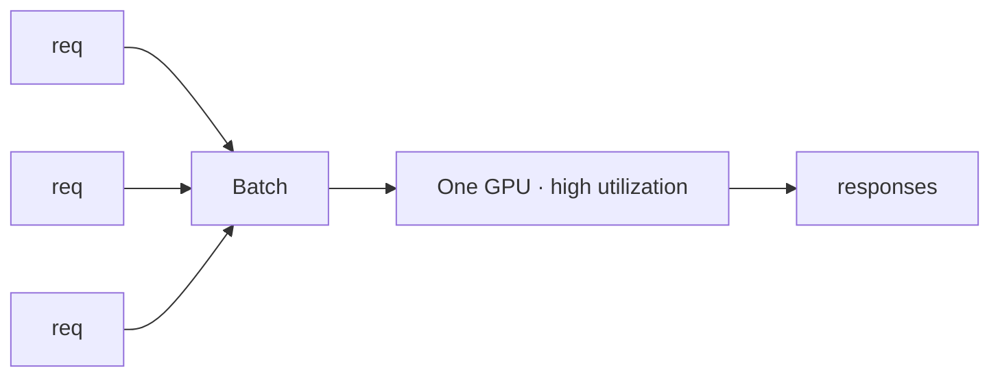

# Module 6.1 — Inference Economics: Cost, Batching, Throughput

> **Goal:** Reason quantitatively about serving — calculate what it costs to run DeskMate at scale, understand why batching is the primary lever for GPU utilisation, and learn the throughput vs latency trade-off you will make explicit in every production deployment decision.

---

## The Serving Problem

A fine-tuned model sitting on disk costs nothing. A model serving requests costs real money per token generated. Before deploying, you need to answer:

1. How much does it cost to generate one support reply?
2. How many requests can one GPU handle per minute?
3. What batch size gives the best cost-per-token without violating latency SLAs?

---

## Inference Cost Formula

```
cost_per_reply = (gpu_hourly_rate / 3_600_000) × median_latency_ms × safety_margin
```

Example for DeskMate on a T4 spot instance ($0.35/hr), 150 ms/reply, 1.3 safety margin:

```
cost_per_reply = (0.35 / 3_600_000) × 150 × 1.3
              ≈ $0.000020  ($0.02 per 1 000 replies)
```

At 5 000 daily tickets: ~$0.10/day. At 100 000 daily tickets: ~$2/day. This is the number to put in front of stakeholders.

### Cost per 1 000 tokens (for comparison with API providers)

```
cost_per_1k_tokens = gpu_hourly / (3_600_000 / p50_ms) / avg_reply_tokens × 1_000
```

---

## GPU Utilisation and the Memory Wall

A transformer forward pass is **memory-bandwidth-bound**, not compute-bound, for typical batch sizes. The GPU's arithmetic units (Tensor Cores) are capable of far more FLOPs than the memory bus can feed them with data.

```
Arithmetic intensity = FLOPs / bytes_moved

For a MatMul with weight W ∈ R^{m×n}:
  FLOPs     = 2 × m × n × batch_size
  bytes_moved = (m × n × dtype_bytes) + (batch_size × m × dtype_bytes)

At batch_size=1, fp16:
  FLOPs     = 2 × m × n
  bytes_moved ≈ 2 × m × n  (weight dominates)
  intensity ≈ 1 FLOP/byte  → memory-bound
  
At batch_size=32:
  FLOPs     = 64 × m × n
  bytes_moved ≈ 2 × m × n + 32 × 2 × m  → still weight-dominated for large n
  intensity ≈ 32 FLOPs/byte → approaching compute-bound
```

**Implication:** at batch_size=1, most of the GPU's compute is idle while it waits for weight data from HBM. Larger batches amortise the weight load across more requests, driving utilisation higher.

---

## Batching

**Batching** groups multiple requests into a single forward pass. The GPU processes all inputs in the batch simultaneously — the compute cost per request drops, but total latency increases because the last request in the batch must wait for the batch to fill.

### Static batching

Collect `B` requests, wait until all `B` arrive (or a timeout fires), then run one forward pass. Simple but wasteful: if B=8 but only 5 requests arrive before the timeout, you wait and then run a partial batch.

### Dynamic / continuous batching

vLLM (Module 6.2) uses **continuous batching**: as soon as one request finishes generating, a new request is inserted into the batch for the next iteration. The GPU is never waiting for a fixed batch to fill — it always has work.

### Throughput vs latency trade-off

| Metric | At batch=1 | At batch=B (large) |
|---|---|---|
| Latency per request | Lowest | Highest (waits for batch) |
| Throughput (req/sec) | Lowest | Highest |
| GPU utilisation | Low (~20%) | High (~80%+) |
| Cost per request | High | Low |

**The trade-off:** you can optimise for one or the other, but not both simultaneously without continuous batching. For DeskMate's SLA:

- Interactive (human waits): target p99 < 2 s → batch size 4–8
- Async / queued: no interactive SLA → batch size 16–32

---

## KV-Cache Intuition

During autoregressive generation, each new token attends to **all previous tokens**. Without caching, this means re-computing key/value projections for the entire context at every step.

The **KV cache** stores the key and value tensors for each past token, so each generation step only computes Q/K/V for the **one new token**, then concatenates to the cached K and V.

```
Without KV cache:
  step t attention cost = O(t²)  (quadratic in sequence length)

With KV cache:
  step t attention cost = O(t)   (linear — only the new token queries the cache)
```

### Memory cost of KV cache

```
kv_cache_bytes = 2 × n_layers × n_heads × head_dim × seq_len × batch_size × dtype_bytes
```

For Qwen2.5-1.5B (28 layers, 16 heads, head_dim=64, seq_len=512, batch=8, fp16):

```
= 2 × 28 × 16 × 64 × 512 × 8 × 2
≈ 2.4 GB
```

This is why large batches with long contexts can exhaust VRAM even when the model weights fit. The KV cache grows with `batch_size × seq_len` — the two levers you tune to fit serving into your VRAM budget.

---

## Estimating Generation Time

```
total_latency_ms ≈ prefill_ms + n_tokens × decode_ms_per_token

prefill_ms         = time to process the input prompt (parallel, fast)
decode_ms_per_token = time per autoregressive step (sequential, memory-bound)
```

For DeskMate (1.5B, T4, fp16):

| Phase | Typical time |
|---|---|
| Prefill (128-token prompt) | ~15 ms |
| Decode per token | ~35 ms |
| 100-token reply | 15 + 100×35 = ~3.5 sec at batch=1 |
| 100-token reply | 15 + 100×12 = ~1.2 sec at batch=8 (amortised) |

This is why batch=1 serving is expensive and slow — the full memory bandwidth cost is paid per token with no amortisation.

---

## Getting the Most from One GPU

Ordered by impact:

1. **Enable KV cache** (always on by default in HuggingFace/vLLM)
2. **Use fp16 or bf16** — 2× memory reduction vs fp32, same throughput on Tensor Core hardware
3. **Batch requests** — even batch=4 cuts cost-per-token by ~3×
4. **Use continuous batching** (vLLM) — eliminates idle time between batches
5. **Quantise to int8 or int4** — 2–4× more requests fit in VRAM simultaneously
6. **Use paged attention** (vLLM) — fragments KV cache, no VRAM wasted on padding

---

## Checkpoint

> *Why does batching raise throughput but can hurt p99 latency?*

**Throughput rises** because batching amortises the cost of loading weight tensors from GPU memory (HBM) across multiple requests. At batch=1, the GPU reads the full weight matrix to generate one token. At batch=B, the same weight read produces B tokens — so cost per token falls by ~B× (up to the compute-bound limit).

**p99 latency rises** because a request that arrives just after a batch starts must wait for the entire batch to finish before its first token is produced. With static batching at batch=B and decode time `T` per step, the worst-case queuing delay is `B × T` before the last-admitted request even begins generating. With async/continuous batching this is mitigated, but there is still head-of-line blocking when a long request holds up a slot.

The operational fix: cap batch size so that max queuing delay ≤ p99 SLA, and use continuous batching to reclaim slots as requests finish.

---

## Mermaid: Batching Pipeline



---

## Book Reference

- §4.2 — GPU memory hierarchy, HBM bandwidth, arithmetic intensity
- §4.3 — batching strategies, continuous batching, DeepSpeed inference

---

## What's Next

Module 6.2 — Serving with vLLM: the production-grade engine that implements continuous batching, paged attention, and an OpenAI-compatible API — all in one command.
