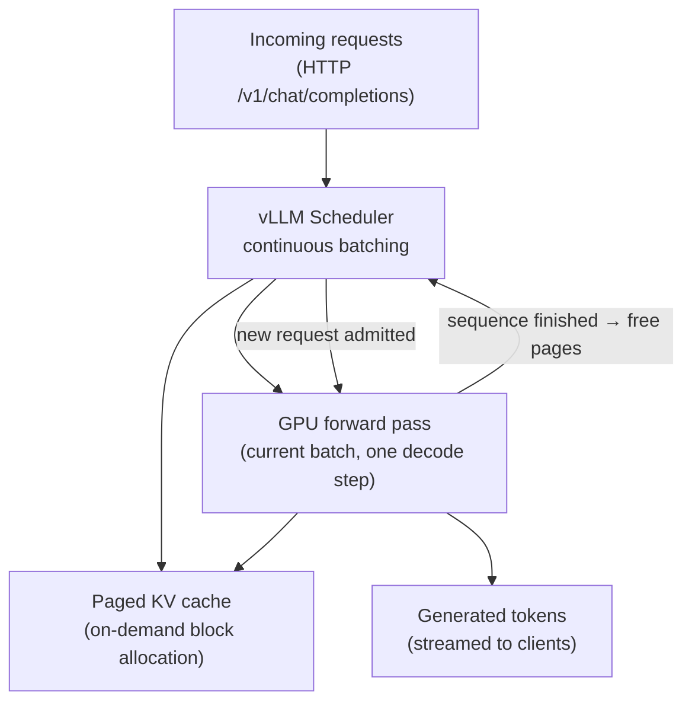

# Module 6.2 — Serving with vLLM

> **Goal:** Production-grade throughput with continuous batching and paged attention — serve DeskMate via vLLM's OpenAI-compatible API and load-test it.

---

## Why vLLM

Standard HuggingFace `model.generate()` is a research tool, not a serving engine. Its limitations at production scale:

| Problem | HuggingFace generate | vLLM |
|---|---|---|
| Batching | Static, manual | Continuous (automatic) |
| KV cache management | Full allocation per request | Paged — no wasted VRAM |
| API compatibility | Python only | OpenAI-compatible HTTP |
| Throughput (req/sec) | Low | 10–24× higher |
| Concurrency | 1 request at a time | Many concurrent requests |

---

## Paged Attention

The standard KV cache allocates a contiguous block of VRAM for each request's full context length **upfront**, even if the request will only use a fraction of it. With batch=32 and max_seq_len=2048, you reserve `32 × 2048 × bytes_per_kv_entry` regardless of actual usage — often wasting 30–60% of allocated VRAM on padding.

**Paged attention** (vLLM's core innovation) manages the KV cache like an OS manages virtual memory:

1. VRAM is divided into fixed-size **pages** (blocks of, say, 16 tokens each)
2. Each request is allocated pages on demand as its sequence grows
3. Pages from finished requests are immediately returned to the free pool
4. Pages for one request do not need to be contiguous in physical VRAM

**What paged attention does for memory:** eliminates the gap between allocated VRAM and actually-used VRAM. Internal fragmentation drops from ~30–60% to < 4%, allowing significantly more requests to fit simultaneously — directly increasing throughput at the same VRAM budget.

---

## Continuous Batching

vLLM's scheduler runs an **iteration loop**: at every decode step, it:

1. Checks which sequences finished their generation
2. Removes finished sequences and frees their pages
3. Admits new waiting requests to fill the freed slots
4. Runs one forward pass over the current batch

No request waits for a fixed batch window to close. The GPU is always busy. This eliminates the idle time between static batches — the primary source of throughput loss in naive serving.

---

## Starting vLLM

### Offline (batch) mode

```python
from vllm import LLM, SamplingParams

llm = LLM(model="Qwen/Qwen2.5-1.5B-Instruct", dtype="float16")
params = SamplingParams(max_tokens=150, temperature=0.0)

prompts = [
    "Ticket: I was charged twice last month.\nAnswer:",
    "Ticket: How do I reset 2FA?\nAnswer:",
]
outputs = llm.generate(prompts, params)
for o in outputs:
    print(o.outputs[0].text)
```

### Online (API server) mode

```bash
# Start the OpenAI-compatible API server
python -m vllm.entrypoints.openai.api_server \
    --model Qwen/Qwen2.5-1.5B-Instruct \
    --dtype float16 \
    --max-model-len 2048 \
    --port 8000
```

The server is now reachable at `http://localhost:8000/v1/` — compatible with the OpenAI Python client, LangChain, and any other tool that speaks OpenAI's API.

### Calling the vLLM server

```python
from openai import OpenAI

client = OpenAI(base_url="http://localhost:8000/v1", api_key="not-needed")

response = client.chat.completions.create(
    model="Qwen/Qwen2.5-1.5B-Instruct",
    messages=[
        {"role": "system", "content": "You are DeskMate, a concise support assistant."},
        {"role": "user",   "content": "Ticket: I was charged twice last month."},
    ],
    max_tokens=150,
    temperature=0.0,
)
print(response.choices[0].message.content)
```

---

## Load Testing

Load testing measures how the server behaves under concurrent requests — the metric that matters for production, not single-request latency.

### Key metrics

| Metric | Definition |
|---|---|
| **Throughput** | Total tokens generated per second across all concurrent users |
| **p50 latency** | Median time from request submission to last token received |
| **p99 latency** | 99th percentile latency — what your worst 1% of users experience |
| **Time to first token (TTFT)** | Time from submission to first token — matters for streaming UIs |

### Load test with `locust`

```python
# locustfile.py
from locust import HttpUser, task, between
import json, random

TICKETS = [
    "I was charged twice for my subscription.",
    "How do I reset my 2FA device?",
    "The CSV export is not working.",
    "Can I get a refund after 30 days?",
    "My iOS app crashes after the update.",
]

class DeskMateUser(HttpUser):
    wait_time = between(0.1, 0.5)

    @task
    def ask_question(self):
        payload = {
            "model": "Qwen/Qwen2.5-1.5B-Instruct",
            "messages": [
                {"role": "system", "content": "You are DeskMate."},
                {"role": "user",   "content": f"Ticket: {random.choice(TICKETS)}"},
            ],
            "max_tokens": 150,
            "temperature": 0.0,
        }
        self.client.post("/v1/chat/completions",
                         json=payload,
                         headers={"Content-Type": "application/json"})
```

```bash
locust -f locustfile.py --host http://localhost:8000 \
       --users 20 --spawn-rate 2 --run-time 60s
```

### Alternative: `wrk` or `vegeta` for simpler HTTP load

```bash
# vegeta: 10 req/sec for 30 seconds
echo 'POST http://localhost:8000/v1/chat/completions' | \
  vegeta attack -rate=10 -duration=30s -body=payload.json | \
  vegeta report
```

---

## Expected Results (T4 GPU, Qwen2.5-1.5B, fp16)

| Concurrency | Throughput (tok/sec) | p50 latency | p99 latency |
|---|---|---|---|
| 1 | ~100 | ~1.4 s | ~2.0 s |
| 4 | ~320 | ~2.1 s | ~3.5 s |
| 8 | ~520 | ~3.8 s | ~6.0 s |
| 16 | ~640 | ~6.5 s | ~10 s |

Throughput scales near-linearly up to the memory-bandwidth ceiling; p99 latency grows with concurrency. Your load test identifies the concurrency sweet spot for DeskMate's SLA.

---

## Checkpoint

> *What does paged attention do for memory?*

Paged attention eliminates VRAM waste from KV cache fragmentation. Standard serving pre-allocates a contiguous block of VRAM for each request's maximum context length — even when the request's actual sequence is much shorter. This wastes 30–60% of allocated VRAM on unused padding. Paged attention manages the KV cache like OS virtual memory: it divides VRAM into small fixed-size pages (e.g. 16 tokens each) and allocates them on demand as a request's sequence grows. Pages from finished requests are immediately reclaimed. Because pages don't need to be contiguous, no space is reserved for future tokens that may never arrive. Internal fragmentation drops to < 4%, allowing significantly more concurrent requests to fit in the same VRAM — the direct cause of vLLM's throughput advantage.

---

## Book Reference

§11.1 — vLLM architecture, paged attention algorithm, continuous batching scheduler internals.

---

## Mermaid: vLLM Serving Architecture



---

## Notebook: What You'll Build (37_serve_vllm_fastapi.ipynb — shared with 6.3)

Module 6.2 shares a notebook with Module 6.3. The notebook covers vLLM setup (6.2) and the FastAPI wrapper (6.3) in sequence. See [6.3_fastapi](../6.3_fastapi/6.3_fastapi.md) for the full notebook outline.

---

## What's Next

Module 6.3 — A FastAPI service that wraps the full DeskMate pipeline (encoder triage → retriever → vLLM decoder) behind a clean HTTP API with `/triage` and `/answer` endpoints.
