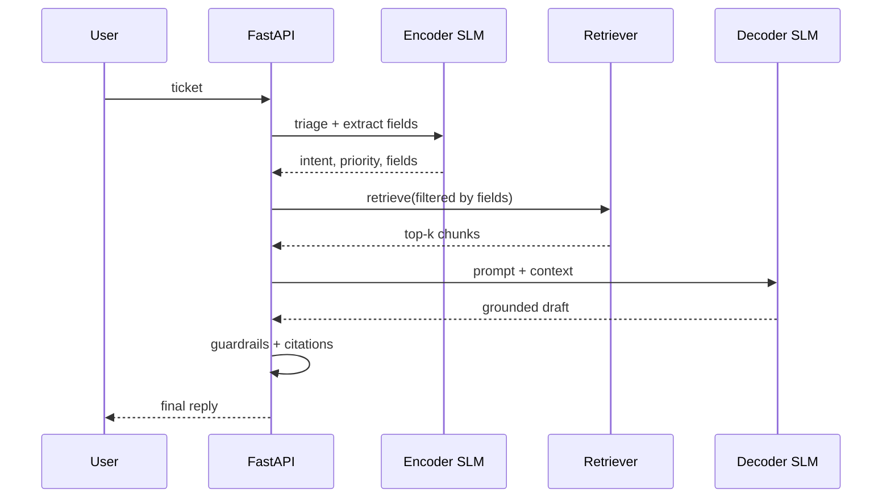

# Module 7.1 — System Architecture & Orchestration

> **Goal:** Assemble triage → route → retrieve → generate → guardrails as one coherent service — the complete DeskMate pipeline running end-to-end with input validation, output filtering, citation enforcement, and confidence-based short-circuits.

---

## Why LLMs Alone Aren't Enough

A raw decoder model cannot be a production support system by itself:

| Gap | Problem | Fix |
|---|---|---|
| **No knowledge cutoff handling** | Model weights have a training cutoff; product docs change weekly | RAG retriever (Module 4.3) |
| **No domain grounding** | Model generates plausible but unverified claims | Faithfulness guardrail + citation enforcement |
| **No routing** | Every ticket goes to the expensive LLM call, even FAQs | Encoder triage → low-confidence triggers escalation |
| **No safety boundary** | Model may answer questions outside its scope | Input validation + refusal on off-topic requests |
| **No auditability** | No record of which context was used to generate a reply | Citation tracking + request logging |

The full pipeline composes the components built across Phases 2–6 into a single service that addresses each gap.

---

## Full System Architecture

```
Incoming ticket
      │
      ▼
┌─────────────────────────────────────────────────────┐
│  Input Guardrail                                    │
│  • length check (< 2 000 chars)                     │
│  • language detection (English only or route)       │
│  • PII detection (flag but don't block)             │
└─────────────────────┬───────────────────────────────┘
                      │
                      ▼
┌─────────────────────────────────────────────────────┐
│  Encoder SLM (Module 2.5 — DeBERTa)                │
│  • classify intent (5 classes)                      │
│  • extract product / issue_type / urgency           │
│  • output confidence score                          │
└──────┬──────────────────────────┬───────────────────┘
       │ confidence ≥ 0.70        │ confidence < 0.70
       ▼                          ▼
 Continue pipeline          SHORT-CIRCUIT ──► Escalate to human
       │                    (skip LLM call)    (low-confidence path)
       ▼
┌─────────────────────────────────────────────────────┐
│  Retriever (Module 4.3 — FAISS + BM25 + reranker)  │
│  • query = ticket text                              │
│  • metadata filter = {product, issue_type}          │
│  • returns top-3 chunks with source labels          │
└─────────────────────┬───────────────────────────────┘
                      │
                      ▼
┌─────────────────────────────────────────────────────┐
│  RAG Prompt Builder (Module 4.4)                    │
│  • SYSTEM: "use ONLY context, cite [Source N]"      │
│  • USER: context block + ticket                     │
└─────────────────────┬───────────────────────────────┘
                      │
                      ▼
┌─────────────────────────────────────────────────────┐
│  Decoder SLM via vLLM (Modules 3.4 / 6.2)          │
│  • Qwen2.5-1.5B QLoRA fine-tuned                   │
│  • continuous batching, paged attention             │
│  • max_tokens=200, temperature=0.0                  │
└─────────────────────┬───────────────────────────────┘
                      │
                      ▼
┌─────────────────────────────────────────────────────┐
│  Output Guardrails                                  │
│  • citation enforcement: reply must cite ≥1 source  │
│  • faithfulness check (n-gram, Module 4.4): ≥ 0.60 │
│  • length check: reply must be > 20 tokens          │
│  • off-topic refusal: no citations → fallback reply │
└─────────────────────┬───────────────────────────────┘
                      │
                      ▼
              Final reply + metadata
```

---

## Guardrails in Detail

### Input guardrails

```python
MAX_TICKET_CHARS = 2000

def validate_input(ticket: str) -> tuple[bool, str]:
    if not ticket.strip():
        return False, "empty_ticket"
    if len(ticket) > MAX_TICKET_CHARS:
        return False, "too_long"
    # Optional: off-topic detection using encoder
    return True, "ok"
```

### Confidence-based short-circuit

The encoder returns a confidence score (softmax probability of the top class). Below a threshold, the pipeline does not call the LLM at all — it escalates immediately:

```python
CONFIDENCE_THRESHOLD = 0.70

def triage(ticket: str):
    intent, product, confidence = encoder_predict(ticket)
    if confidence < CONFIDENCE_THRESHOLD:
        return {
            "action": "escalate",
            "reason": "low_confidence",
            "confidence": confidence,
            "reply": None,
        }
    return {"action": "continue", "intent": intent, "product": product}
```

**Where does low-confidence triage short-circuit the pipeline?** After the encoder, before the retriever. The LLM call is the most expensive step — short-circuiting here saves ~99% of the per-request cost for ambiguous tickets. The ticket is sent to a human agent instead, with the encoder's best-guess intent as a routing hint.

### Output guardrails

```python
def apply_output_guardrails(reply: str, chunks: list, n_min_tokens: int = 20) -> dict:
    citations = extract_citations(reply, len(chunks))
    faith     = faithfulness_score(reply, chunks)
    n_tokens  = len(reply.split())

    if not citations:
        # Decoder ignored the grounding instruction — use fallback
        reply   = "I don't have that information — please contact support@deskmate.com."
        faith   = 1.0
        citations = []

    return {
        "reply": reply,
        "citations": citations,
        "faithfulness": faith,
        "guardrail_flags": {
            "no_citation":    len(citations) == 0,
            "low_faith":      faith < 0.60,
            "short_reply":    n_tokens < n_min_tokens,
        },
    }
```

---

## Routing Logic

Based on intent and confidence, the pipeline routes differently:

| Intent | Confidence | Action |
|---|---|---|
| Any intent | < 0.70 | Escalate to human; skip LLM |
| `billing_dispute` | ≥ 0.70 | Full RAG pipeline |
| `technical_bug` | ≥ 0.70 | Full RAG pipeline + urgency flag |
| `account_access` | ≥ 0.90 | Auto-reply from template (no LLM needed) |
| `general_inquiry` | ≥ 0.70 | Full RAG pipeline |
| Off-topic (no close match) | Any | Fallback reply + human review flag |

---

## The Complete Orchestrator

```python
import time, logging

logger = logging.getLogger("deskmate")

async def handle_ticket(ticket: str) -> dict:
    t0 = time.perf_counter()
    trace = {"ticket": ticket, "stages": {}}

    # 1. Input guardrail
    valid, reason = validate_input(ticket)
    if not valid:
        return {"action": "reject", "reason": reason, "reply": None}

    # 2. Encoder triage
    triage_result = triage(ticket)
    trace["stages"]["triage"] = triage_result
    if triage_result["action"] == "escalate":
        logger.info("escalate: low confidence", extra=triage_result)
        return {**triage_result, "latency_ms": round((time.perf_counter()-t0)*1000)}

    intent  = triage_result["intent"]
    product = triage_result["product"]

    # 3. Account access shortcut (template reply, no LLM)
    if intent == "account_access" and triage_result["confidence"] >= 0.90:
        return {
            "action": "template_reply",
            "reply": "To reset your password, go to the login page and click 'Forgot password'.",
            "intent": intent,
            "latency_ms": round((time.perf_counter()-t0)*1000),
        }

    # 4. Retrieve
    chunks = full_retrieve(ticket, fields={"product": product})
    trace["stages"]["retrieval"] = {"n_chunks": len(chunks)}

    # 5. Build RAG prompt + generate
    prompt = build_rag_prompt(ticket, chunks)
    reply  = await vllm_generate(prompt)
    trace["stages"]["generation"] = {"reply_len": len(reply.split())}

    # 6. Output guardrails
    result = apply_output_guardrails(reply, chunks)
    trace["stages"]["guardrails"] = result["guardrail_flags"]

    if any(result["guardrail_flags"].values()):
        logger.warning("guardrail_flag", extra=result["guardrail_flags"])

    return {
        "action": "reply",
        "reply":  result["reply"],
        "citations": result["citations"],
        "intent": intent,
        "faithfulness": result["faithfulness"],
        "latency_ms": round((time.perf_counter()-t0)*1000),
        "_trace": trace,
    }
```

---

## Mermaid: Full Pipeline Sequence



---

## Checkpoint

> *Where does a low-confidence triage short-circuit the pipeline?*

After the encoder step, before the retriever is called. The encoder classifies intent and returns a confidence score (softmax probability). If confidence is below the threshold (0.70), the orchestrator immediately returns an escalation response — no retrieval, no LLM call. This is the right place to short-circuit because: (1) the LLM call is the bottleneck in cost and latency, so eliminating it for ambiguous tickets saves ~99% of those requests' cost; (2) the encoder's best-guess intent is still returned as a routing hint for the human agent; (3) a low-confidence classification usually means the ticket is ambiguous or off-topic — categories where LLM-generated replies are most likely to be wrong.

---

## Book Reference

- §13.1 — system composition patterns for LLM applications
- §13.2 — guardrails design, input/output filtering, refusal strategies

---

## Notebook: What You'll Build (39_orchestration.ipynb)

1. **Input guardrail** — length + language check; test with edge cases.
2. **Encoder triage** — load Module 2.5 encoder; test confidence threshold.
3. **Low-confidence path** — verify short-circuit returns escalation, not LLM call.
4. **Full pipeline (single ticket)** — run one ticket end-to-end; inspect trace.
5. **Batch evaluation** — 20 gold tickets; measure stage latencies.
6. **Guardrail firing rate** — what % of replies trigger each flag.
7. **Latency breakdown** — stacked bar: input guardrail / encoder / retriever / decoder / output guardrail.
8. **Edge cases** — empty ticket, 3000-char ticket, non-English ticket, off-topic ticket.
9. **Summary** — save `reports/orchestration_report.md`.

---

## What's Next

Module 7.2 — Make DeskMate an agent: add tool-calling so it can look up an order, file a bug ticket, or escalate — and add a loop guard to prevent infinite agent loops.
