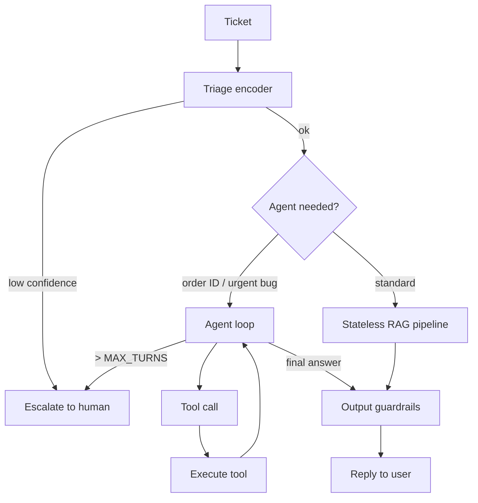

# Module 7.2 — Make DeskMate an Agent

> **Goal:** Let DeskMate take real actions — look up an order, file a bug, or escalate a ticket — by giving the decoder access to tools via function-calling, and add a loop guard to prevent infinite agent loops.

---

## What Is an Agent?

A **bare LLM** takes text in and returns text out. An **agent** is an LLM equipped with tools it can invoke in a loop — observe → think → act — until the task is complete or a stopping condition fires.

```
User request
     │
     ▼
┌──────────────────────────────────┐
│  LLM (think)                     │
│  "I need to look up order #7293." │
└──────────────┬───────────────────┘
               │ tool_call: lookup_order(id="7293")
               ▼
┌──────────────────────────────────┐
│  Tool executor                   │
│  → {"status": "shipped", ...}    │
└──────────────┬───────────────────┘
               │ tool result injected into context
               ▼
┌──────────────────────────────────┐
│  LLM (think again)               │
│  "I have the order status. I can │
│   now write the reply."          │
└──────────────┬───────────────────┘
               │ final_answer(text="Your order shipped on…")
               ▼
          Reply to user
```

This observe → think → act loop runs until the model calls `final_answer` (or the loop guard fires).

---

## Function-Calling Protocol

Modern chat models support a structured tool-calling format. The model outputs JSON describing which tool to call and with what arguments, rather than prose. The host code executes the tool and injects the result back into the conversation.

### Tool definition (OpenAI-compatible schema)

```python
TOOLS = [
    {
        "type": "function",
        "function": {
            "name": "lookup_order",
            "description": "Look up a customer order by order ID. Returns status, shipping date, and carrier.",
            "parameters": {
                "type": "object",
                "properties": {
                    "order_id": {
                        "type": "string",
                        "description": "The order ID, e.g. 'ORD-7293'",
                    }
                },
                "required": ["order_id"],
            },
        },
    },
    {
        "type": "function",
        "function": {
            "name": "file_bug",
            "description": "File a bug report in the issue tracker. Returns the new issue ID.",
            "parameters": {
                "type": "object",
                "properties": {
                    "title":       {"type": "string", "description": "Short bug title"},
                    "description": {"type": "string", "description": "Full bug description"},
                    "severity":    {"type": "string", "enum": ["low", "medium", "high", "critical"]},
                },
                "required": ["title", "description", "severity"],
            },
        },
    },
    {
        "type": "function",
        "function": {
            "name": "escalate_to_human",
            "description": "Escalate the ticket to a human agent when the issue cannot be resolved automatically.",
            "parameters": {
                "type": "object",
                "properties": {
                    "reason":   {"type": "string", "description": "Why this needs human handling"},
                    "priority": {"type": "string", "enum": ["normal", "high", "urgent"]},
                },
                "required": ["reason", "priority"],
            },
        },
    },
]
```

### Parsing a tool call

```python
import json

def parse_tool_call(response_message) -> dict | None:
    calls = getattr(response_message, "tool_calls", None)
    if not calls:
        return None
    call = calls[0]   # handle first call; loop handles the rest
    return {
        "name": call.function.name,
        "args": json.loads(call.function.arguments),
        "id":   call.id,
    }
```

---

## The Two DeskMate Tools

### Tool 1 — `lookup_order`

Used when a ticket mentions an order number ("Where is my order?", "My order hasn't arrived"). The agent extracts the order ID and calls this tool to get live status.

```python
def lookup_order(order_id: str) -> dict:
    # In production: call your order management API.
    # For DeskMate, this calls internal_api.get_order(order_id).
    return {
        "order_id": order_id,
        "status":   "shipped",
        "carrier":  "FedEx",
        "tracking": "FX-829341",
        "eta":      "2026-06-28",
    }
```

### Tool 2 — `file_bug`

Used when a ticket describes a clear reproducible bug ("The CSV export crashes with error ERR-500"). The agent files it automatically and includes the issue ID in the reply.

```python
def file_bug(title: str, description: str, severity: str) -> dict:
    # In production: call your issue tracker API (Jira, Linear, GitHub Issues).
    issue_id = f"BUG-{hash(title) % 10000:04d}"
    return {
        "issue_id": issue_id,
        "status":   "created",
        "url":      f"https://issues.deskmate.com/{issue_id}",
    }
```

---

## The Loop Guard

Without a stopping condition, an agent can call tools indefinitely — either through model confusion, hallucinated tool responses, or a bug in tool output parsing.

**Three layers of loop guard:**

```python
MAX_TURNS   = 5    # maximum tool calls per request
MAX_CONTEXT = 4096 # stop if prompt grows too large

def agent_loop(ticket: str, context_chunks: list) -> dict:
    messages = build_initial_messages(ticket, context_chunks)
    turns = 0

    while turns < MAX_TURNS:
        # Count tokens (approximation)
        total_tokens = sum(len(m["content"].split()) * 1.3 for m in messages
                          if isinstance(m.get("content"), str))
        if total_tokens > MAX_CONTEXT:
            return {"action": "error", "reason": "context_limit",
                    "reply": "Request too long — please contact support."}

        response = llm_chat(messages, tools=TOOLS)
        tool_call = parse_tool_call(response)

        # No tool call → model is done
        if tool_call is None:
            return {"action": "reply", "reply": response.content,
                    "turns": turns, "tool_calls_made": turns}

        # Execute tool
        result = dispatch_tool(tool_call["name"], tool_call["args"])

        # Inject tool result into conversation
        messages.append({"role": "assistant", "content": None,
                         "tool_calls": [{"id": tool_call["id"],
                                         "type": "function",
                                         "function": {"name": tool_call["name"],
                                                      "arguments": json.dumps(tool_call["args"])}}]})
        messages.append({"role": "tool",
                         "tool_call_id": tool_call["id"],
                         "content": json.dumps(result)})
        turns += 1

    # MAX_TURNS exhausted
    return {"action": "escalate",
            "reason": f"agent_loop_limit_exceeded (>{MAX_TURNS} turns)",
            "reply": "I wasn't able to resolve this automatically. A human agent will follow up."}
```

**Checkpoint answer:** What guardrail prevents an infinite loop? A **turn counter** (`MAX_TURNS = 5`) that stops the loop after a fixed number of tool calls and escalates to a human. The turn limit is chosen based on the maximum number of tool calls any valid request should need — for DeskMate, most requests need 0–2 tool calls, so 5 is a conservative ceiling that catches runaway loops without false-firing on legitimate multi-step requests.

---

## When Agents Help vs Add Fragility

Agents are powerful but introduce failure modes that stateless pipelines avoid:

| Situation | Use agent? | Why |
|---|---|---|
| Reply can be fully grounded in retrieved docs | No | RAG pipeline from 7.1 is enough; agents add latency + risk |
| Need live data (order status, account balance) | Yes | Tool call fetches fresh data the model can't know |
| Need to write state (file bug, escalate) | Yes | Tool call triggers real action in external system |
| Multiple steps with conditional logic | Yes | Agent loop handles branching; prompt engineering alone cannot |
| Simple FAQ lookup | No | Template or RAG reply is faster and safer |
| Unclear user intent | No | Escalate to human; don't let agent guess and act |

**Rule:** only add agent capabilities when stateless RAG + templates cannot satisfy the request. Every tool you add is a new failure mode.

---

## Updated Orchestrator with Agent Mode

The 7.1 orchestrator is extended with an `agent_mode` flag: tickets that mention order IDs or contain `technical_bug` intent with high urgency enter agent mode; others go through the original stateless RAG path.

```python
import re

ORDER_ID_PATTERN = re.compile(r'\bORD-\d+\b', re.IGNORECASE)

def handle_ticket_v2(ticket: str) -> dict:
    triage = triage_ticket(ticket)
    if triage["action"] == "escalate":
        return triage

    intent  = triage["intent"]
    product = triage["product"]

    # Decide: agent or stateless RAG
    has_order_id    = bool(ORDER_ID_PATTERN.search(ticket))
    is_urgent_bug   = (intent == "technical_bug" and triage.get("urgency") == "high")
    use_agent_mode  = has_order_id or is_urgent_bug

    if use_agent_mode:
        chunks = full_retrieve(ticket, fields={"product": product})
        return agent_loop(ticket, chunks)
    else:
        # Original stateless pipeline from Module 7.1
        return handle_ticket(ticket)
```

---

## Mermaid: Agent Flow



---

## Checkpoint

> *What guardrail prevents an agent tool-call loop from running forever?*

A **turn counter** (`MAX_TURNS`) checked at the top of every loop iteration. When the number of tool calls reaches the ceiling, the loop exits and escalates to a human rather than returning a fabricated reply. This is the primary loop guard. Complementary guards are: (1) a context-length ceiling that stops the loop before the prompt overflows the model's window; (2) a timeout at the HTTP layer that terminates requests that run too long. The turn limit is calibrated to the maximum legitimate tool depth for the use case — DeskMate needs at most 2 tool calls per request, so MAX_TURNS=5 gives headroom without allowing runaway loops.

---

## Book Reference

- §13.4 — tool use and function-calling in LLM applications
- §14.2 — agent loops, stopping conditions, and safety

---

## Notebook: What You'll Build (40_deskmate_agent.ipynb)

1. **Tool definitions** — define `lookup_order`, `file_bug`, `escalate_to_human` schemas.
2. **Tool stubs** — implement mock tools that return realistic data.
3. **Tool dispatch** — `dispatch_tool(name, args)` router with error handling.
4. **Single-step tool call** — simulate model calling `lookup_order`; inject result; get reply.
5. **Multi-step loop** — ticket requiring 2 tool calls; verify loop resolves correctly.
6. **Loop guard test** — force loop to hit MAX_TURNS; verify escalation fires, not infinite loop.
7. **Context-limit guard test** — inject a huge tool result; verify context ceiling fires.
8. **Full agent pipeline** — 10 gold tickets: stateless path vs agent path; compare latency.
9. **Agent vs RAG decision** — measure accuracy delta for order-lookup tickets.
10. **Summary** — save `reports/agent_report.md`.

---

## What's Next

Module 7.3 — Memory: short- and long-term. Add conversation history (short-term) and a persistent customer profile store (long-term) so DeskMate stays coherent across multi-turn exchanges without overflowing the context window.
