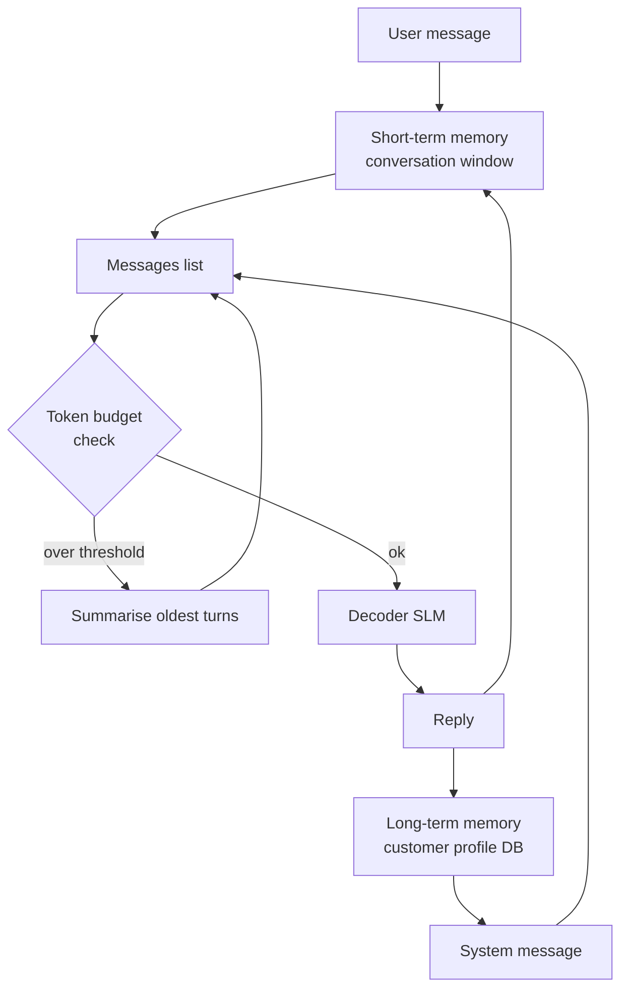

# Module 7.3 — Memory: Short- and Long-Term

> **Goal:** Add coherent multi-turn conversation support to DeskMate. Short-term memory tracks the current exchange; long-term memory persists facts across sessions. Summarisation keeps the context window from overflowing.

---

## Why Memory Matters for Support

A stateless DeskMate treats every message as a fresh ticket. This breaks multi-turn exchanges:

```
Turn 1: "My CSV export is broken."  → DeskMate: "Please upgrade to v4.3.0."
Turn 2: "I did, still broken."      → DeskMate [no memory]: "Please upgrade to v4.3.0."  ← wrong
```

With short-term memory, turn 2 carries the full conversation context so the model knows "already tried the upgrade" and escalates or asks for logs instead.

---

## Two Types of Memory

| Type | Scope | Storage | Content | DeskMate use |
|---|---|---|---|---|
| **Short-term** | One session | In-memory list | Message history | Full conversation so far (this exchange) |
| **Long-term** | Cross-session | DB / file | Distilled facts | Customer tier, known issues, past resolutions |

Short-term and long-term memory are injected into the prompt at different positions:

```
SYSTEM: <long-term memory block: customer facts>
USER:   [Turn 1] My CSV export is broken.
ASST:   [Turn 1 reply] Please upgrade to v4.3.0.
USER:   [Turn 2] I did, still broken.
ASST:   → model has both context types available
```

---

## Short-Term Memory: Conversation Window

The simplest short-term memory is a list of `(role, content)` pairs. Every reply is appended and the full list is sent on the next turn.

```python
class ConversationMemory:
    def __init__(self, max_turns: int = 10):
        self.max_turns = max_turns
        self.messages: list[dict] = []

    def add(self, role: str, content: str):
        self.messages.append({"role": role, "content": content})

    def get_window(self) -> list[dict]:
        # Keep at most max_turns exchange pairs (2 messages each)
        return self.messages[-(self.max_turns * 2):]

    def clear(self):
        self.messages = []
```

### The context-window problem

A long support conversation can fill the model's context window (2 048–8 192 tokens for small models). When the prompt overflows:
- The model truncates early context — the model "forgets" earlier turns
- Or the request fails with a length error

The solution is **sliding window + summarisation**.

---

## Keeping a Long Conversation Inside the Context Window

**Three strategies (in increasing sophistication):**

### 1. Sliding window (simplest)

Keep only the last N turns. Old turns are discarded without replacement.

```python
def get_window(self) -> list[dict]:
    return self.messages[-(self.max_turns * 2):]
```

**Problem:** if a key fact from turn 1 is referenced in turn 15, it's gone.

### 2. Summarise-and-replace

When the conversation exceeds a token threshold, compress old turns into a summary using the LLM itself. Replace the earliest turns with the summary, keep recent turns verbatim.

```python
SUMMARY_THRESHOLD = 1500  # tokens (approx words × 1.3)

def maybe_summarise(self, llm_fn) -> None:
    approx_tokens = sum(len(m["content"].split()) for m in self.messages) * 1.3
    if approx_tokens < SUMMARY_THRESHOLD:
        return
    # Summarise the oldest half
    to_summarise = self.messages[:len(self.messages) // 2]
    summary_prompt = [
        {"role": "system", "content":
         "Summarise this conversation into 3-5 bullet points. "
         "Preserve: customer's issue, actions already tried, any agreements made."},
        {"role": "user", "content":
         "\n".join(f"{m['role']}: {m['content']}" for m in to_summarise)},
    ]
    summary_text = llm_fn(summary_prompt)
    # Replace old turns with summary
    self.messages = (
        [{"role": "system", "content": f"[Conversation summary]\n{summary_text}"}]
        + self.messages[len(self.messages) // 2:]
    )
```

### 3. Hybrid (recommended for DeskMate)

- Maintain a sliding window of the **last 6 turns verbatim** (always in context)
- After every 5 turns, summarise into a 3-sentence "so far" block injected as a system message
- Long-term memory is a separate block injected before the summary

This is the strategy implemented in the notebook.

**Checkpoint answer:** Keep a long conversation inside the context window by: (1) sliding window — keep only the last N turns verbatim; (2) summarisation — compress older turns into a short LLM-generated summary and prepend it; (3) token budgeting — count tokens before each call and trigger summarisation proactively, not reactively. The key invariant is that the prompt must always fit in the model's context window before the API call, not after.

---

## Long-Term Memory: Persistent Customer Facts

Long-term memory stores facts that persist beyond a single session. For DeskMate:

```python
@dataclasses.dataclass
class CustomerProfile:
    customer_id: str
    tier: str              # "free" | "pro" | "enterprise"
    known_issues: list     # previously reported bugs not yet resolved
    past_resolutions: list # successful fixes applied
    preferred_lang: str    # "en" | "fr" | etc.
    last_contact: str      # ISO date

PROFILE_DB: dict[str, CustomerProfile] = {}  # in-memory; real impl: Redis or Postgres

def load_profile(customer_id: str) -> CustomerProfile | None:
    return PROFILE_DB.get(customer_id)

def update_profile(customer_id: str, patch: dict) -> None:
    profile = PROFILE_DB.get(customer_id)
    if profile is None:
        profile = CustomerProfile(customer_id=customer_id, tier="free",
                                  known_issues=[], past_resolutions=[],
                                  preferred_lang="en", last_contact="")
        PROFILE_DB[customer_id] = profile
    for k, v in patch.items():
        setattr(profile, k, v)
```

### Injecting long-term memory into the prompt

```python
def build_system_with_memory(profile: CustomerProfile | None) -> str:
    base = (
        "You are DeskMate, a concise support assistant. "
        "Answer using ONLY the provided context passages. Cite with [Source N]. "
        "If the context does not contain the answer, escalate."
    )
    if profile is None:
        return base

    facts = [
        f"Customer tier: {profile.tier}",
        f"Language preference: {profile.preferred_lang}",
    ]
    if profile.known_issues:
        facts.append("Open issues: " + "; ".join(profile.known_issues))
    if profile.past_resolutions:
        facts.append("Past fixes: " + "; ".join(profile.past_resolutions))

    return base + "\n\n[Customer context]\n" + "\n".join(facts)
```

---

## Memory-Aware Orchestrator

```python
class DeskMateSession:
    def __init__(self, customer_id: str):
        self.customer_id = customer_id
        self.conv = ConversationMemory(max_turns=6)
        self.profile = load_profile(customer_id)

    def handle_turn(self, user_message: str) -> str:
        # Build system message with long-term context
        system = build_system_with_memory(self.profile)

        # Add user turn
        self.conv.add("user", user_message)

        # Retrieve relevant chunks
        chunks = full_retrieve(user_message)
        ctx_block = "\n\n".join(
            f"[Source {i+1}] {c['text']}" for i, c in enumerate(chunks))

        # Build messages: system + conversation window + RAG context in last user turn
        messages = [{"role": "system", "content": system}]
        window = self.conv.get_window()
        # Inject RAG context into the latest user message
        for i, msg in enumerate(window):
            if i == len(window) - 1 and msg["role"] == "user":
                messages.append({"role": "user",
                                 "content": f"Context:\n{ctx_block}\n\n{msg['content']}"})
            else:
                messages.append(msg)

        # Generate
        reply = vllm_generate_stub(messages)

        # Add assistant turn to memory
        self.conv.add("assistant", reply)

        # Update long-term memory if a resolution was reached
        if "resolved" in reply.lower() or "fixed" in reply.lower():
            update_profile(self.customer_id,
                          {"past_resolutions": (self.profile.past_resolutions or [])
                           + [user_message[:80]]})

        return reply
```

---

## Mermaid: Memory Architecture



---

## Checkpoint

> *How do you keep a long conversation inside the context window?*

Three techniques, used together:

1. **Sliding window** — keep only the last N turns verbatim (DeskMate: 6 turns). Oldest messages are dropped.
2. **Summarise-and-replace** — when the prompt approaches the token limit, compress the dropped turns into a 3–5 bullet summary using the LLM, injected as a system message. No information is silently lost — it's compressed, not deleted.
3. **Proactive token budgeting** — count tokens before every API call (not after a failure). When `approx_tokens > SUMMARY_THRESHOLD`, trigger summarisation immediately. This ensures the model never sees a truncated prompt.

The invariant: the total prompt (system + long-term + summary + window + RAG context) must fit within the model's context window before the call.

---

## Book Reference

- §14.3 — memory systems for LLM applications: short-term, long-term, summarisation strategies

---

## Notebook: What You'll Build (41_memory.ipynb)

1. **ConversationMemory** — sliding window; test with 12-turn conversation.
2. **Summarise-and-replace** — trigger summarisation; verify old turns compressed, recent turns preserved.
3. **CustomerProfile** — load/update profile; inject as system message.
4. **DeskMateSession** — full memory-aware session class.
5. **Multi-turn scenario 1** — CSV export: 5 turns; confirm model does not repeat upgrade suggestion after user says "already tried."
6. **Multi-turn scenario 2** — order lookup over 4 turns; confirm order ID referenced correctly across turns.
7. **Context-window guard** — inject 20 turns; verify summarisation fires before overflow.
8. **Memory quality check** — compare multi-turn ROUGE-L: with memory vs stateless.
9. **Summary** — save `reports/memory_report.md`.

---

## What's Next

Module 7.4 — Monitoring, eval-in-prod, and drift detection. Add logging, online metrics, and a retraining trigger so DeskMate's quality can be tracked and improved after launch.
