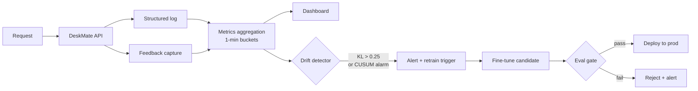

# Module 7.4 — Monitoring, Eval-in-Prod, and Drift Detection

> **Goal:** Keep DeskMate good after launch. Log every request, track online quality metrics, capture explicit and implicit feedback, run regression suites in CI, detect data and quality drift, and define a retraining trigger.

---

## Why Production Monitoring Is Different from Offline Eval

Offline evaluation (gold set ROUGE-L, F1) tells you how the model performs at training time on known data. It cannot detect:

- **Distribution shift** — ticket language changes as product evolves; model degrades silently
- **Silent regressions** — a new RAG index or prompt change that hurts a specific intent category
- **Long-tail failures** — edge cases not in the gold set that users hit in production
- **Feedback drift** — user behaviour changes (escalation rate rises, reply acceptance falls)

Production monitoring closes this gap with continuous, online signal from real traffic.

---

## The Monitoring Stack

```
Request → DeskMate API
              │
              ├─ Structured log (every request)
              │     { request_id, timestamp, customer_id,
              │       intent, confidence, faithfulness,
              │       latency_ms, guardrail_flags, action }
              │
              ├─ Feedback capture (every reply)
              │     { request_id, thumbs_up/down, escalated, reopen }
              │
              └─ Metrics aggregation (1-min buckets)
                    intent_distribution, mean_confidence,
                    escalation_rate, faithfulness_p50,
                    latency_p50/p95, guardrail_fire_rate
```

---

## 1. Structured Logging

Every request produces one log line as a JSON object. This is the source of truth for all downstream metrics, dashboards, and drift detection.

```python
import json, time, uuid, logging

logger = logging.getLogger("deskmate.requests")

def log_request(ticket: str, result: dict) -> str:
    request_id = str(uuid.uuid4())[:8]
    record = {
        "request_id":     request_id,
        "ts":             time.strftime("%Y-%m-%dT%H:%M:%SZ", time.gmtime()),
        "intent":         result.get("intent"),
        "confidence":     result.get("confidence"),
        "action":         result.get("action"),
        "faithfulness":   result.get("faithfulness"),
        "latency_ms":     result.get("latency_ms"),
        "guardrail_flags":result.get("guardrail_flags", {}),
        "ticket_len":     len(ticket),
    }
    logger.info(json.dumps(record))
    return request_id
```

---

## 2. Online Metrics

Computed by aggregating log lines in rolling windows (1 min, 1 hour, 1 day):

| Metric | Formula | Healthy range | Alert threshold |
|---|---|---|---|
| **Escalation rate** | escalated / total requests | < 15% | > 25% |
| **Mean confidence** | avg encoder confidence | > 0.80 | < 0.72 |
| **Faithfulness p50** | median faithfulness score | > 0.70 | < 0.60 |
| **No-citation rate** | no_citation_flag / replies | < 5% | > 15% |
| **Latency p95** | 95th pct total latency | < 4 000 ms | > 8 000 ms |
| **Intent distribution shift** | KL divergence vs baseline | < 0.10 | > 0.25 |

---

## 3. Feedback Capture

Two feedback signals are available in a support system:

### Explicit feedback
User rates the reply (thumbs up/down). Reliable but sparse (< 10% response rate in most products).

```python
def record_feedback(request_id: str, thumbs_up: bool, customer_id: str):
    FEEDBACK_DB[request_id] = {
        "thumbs_up":   thumbs_up,
        "customer_id": customer_id,
        "ts":          time.strftime("%Y-%m-%dT%H:%M:%SZ", time.gmtime()),
    }
```

### Implicit feedback
Behavioural signals that are always available:

| Signal | Positive | Negative |
|---|---|---|
| Ticket reopened | — | Negative (reply didn't help) |
| Escalated after reply | — | Negative (agent gave up) |
| Reply accepted (no follow-up within 24h) | Positive | — |
| Customer replied "thank you" | Positive | — |

Implicit signals are noisy but dense. Use them as soft labels for drift detection, not as hard training labels.

---

## 4. Drift Detection

Two types of drift matter for DeskMate:

### A. Data drift (input distribution change)

The language or topic distribution of incoming tickets changes.

**Detection:** measure KL divergence of the current intent distribution against the baseline (training distribution).

```python
import numpy as np

def kl_divergence(p: dict, q: dict) -> float:
    all_keys = set(p) | set(q)
    p_arr = np.array([p.get(k, 1e-9) for k in all_keys])
    q_arr = np.array([q.get(k, 1e-9) for k in all_keys])
    p_arr /= p_arr.sum()
    q_arr /= q_arr.sum()
    return float(np.sum(p_arr * np.log(p_arr / q_arr)))
```

**Baseline:** the intent distribution at training time (e.g., `billing_dispute: 0.35, technical_bug: 0.30, ...`).

**Alert:** `KL > 0.25` → input distribution has shifted significantly.

### B. Quality drift (output quality degradation)

Model replies become less faithful, more often flagged by guardrails, or escalation rate rises.

**Detection:** track rolling metrics vs baseline. Use CUSUM (Cumulative Sum) for sensitive early detection:

```python
def cusum(values: list[float], target: float, k: float = 0.5) -> tuple[list, int]:
    s = 0.0
    cusum_vals = []
    first_alarm = -1
    for i, v in enumerate(values):
        s = max(0, s + (target - v) - k)
        cusum_vals.append(s)
        if s > 5.0 and first_alarm == -1:
            first_alarm = i
    return cusum_vals, first_alarm
```

CUSUM accumulates small degradations over time and triggers an alarm when the cumulative deviation exceeds a threshold — much more sensitive than a point-in-time threshold check.

---

## 5. Retraining Trigger

**What signal tells you it's time to retrain?**

A retraining trigger fires when **any two** of the following conditions hold simultaneously for 24+ hours:

| Condition | Threshold |
|---|---|
| Mean confidence drops | < 0.72 for 24 h |
| Escalation rate rises | > 25% for 24 h |
| Intent distribution KL | > 0.25 for 24 h |
| CUSUM alarm fires | faithfulness CUSUM > 5.0 |
| Gold set regression | new candidate fails eval gate |

Requiring two simultaneous signals reduces false positives from transient spikes (e.g., a product outage that floods support with one topic for a few hours).

```python
def should_retrain(metrics_24h: dict) -> tuple[bool, list]:
    reasons = []
    if metrics_24h["mean_confidence"] < 0.72:
        reasons.append("mean_confidence < 0.72")
    if metrics_24h["escalation_rate"] > 0.25:
        reasons.append("escalation_rate > 0.25")
    if metrics_24h["intent_kl"] > 0.25:
        reasons.append("intent_kl > 0.25")
    if metrics_24h["faithfulness_cusum"] > 5.0:
        reasons.append("faithfulness_cusum_alarm")
    return len(reasons) >= 2, reasons
```

---

## 6. Regression Suite in CI

Every pull request that changes the model, prompt, or RAG index runs a regression suite before merge:

```
CI pipeline:
  1. checkout branch
  2. run_gold_eval.py → must pass ROUGE-L ≥ baseline − 0.01
  3. run_intent_eval.py → must pass F1 ≥ baseline − 0.01 per class
  4. run_guardrail_eval.py → no_citation_rate ≤ 5%, faithfulness_p50 ≥ 0.70
  5. if all pass → allow merge
  6. if any fail → block merge, post failure details to PR
```

The gold set (`data/gold/`) is frozen at collection time — never trained on.

---

## Dashboard Design

Four panels:

```
┌──────────────────┬──────────────────┐
│  Intent dist     │  Quality metrics │
│  (bar chart,     │  (line chart:    │
│   live vs base)  │  confidence,     │
│                  │  faithfulness,   │
│                  │  escalation rate)│
├──────────────────┼──────────────────┤
│  Latency p50/p95 │  Drift signals   │
│  (line chart)    │  (KL div, CUSUM, │
│                  │  retrain flag)   │
└──────────────────┴──────────────────┘
```

---

## Mermaid: Monitoring Loop



---

## Checkpoint

> *What signal tells you it's time to retrain?*

A retraining trigger fires when **two or more** of these signals hold simultaneously for 24+ hours: (1) mean encoder confidence drops below 0.72; (2) escalation rate rises above 25%; (3) intent distribution KL divergence exceeds 0.25 (input drift); (4) CUSUM alarm fires on faithfulness scores (output quality drift). Requiring two simultaneous signals reduces false positives from transient traffic spikes. The trigger dispatches a fine-tuning run on new data, and the result must pass an eval gate (≥ baseline on the gold set) before promotion to production.

---

## Book Reference

No specific book section referenced in curriculum. Aligns with general MLOps monitoring practices introduced in §14.

---

## Notebook: What You'll Build (42_monitoring.ipynb)

1. **Log generator** — simulate 500 requests with realistic metric distributions.
2. **Online metrics** — compute rolling window aggregates.
3. **Feedback capture** — record explicit + implicit feedback; compute thumbs-up rate.
4. **Intent distribution drift** — inject a drift event; measure KL divergence over time.
5. **CUSUM detector** — run CUSUM on faithfulness scores; identify first alarm.
6. **Retrain trigger** — evaluate `should_retrain()` against simulated 24-hour windows.
7. **Dashboard** — 4-panel matplotlib dashboard with all key metrics.
8. **CI regression stub** — show gold eval pass/fail logic.
9. **Summary** — save `reports/monitoring_report.md`.

---

## What's Next

Module 7.5 — Test-time compute (optional). Squeeze more reasoning out of DeskMate at inference time using best-of-N sampling and a small verifier.
