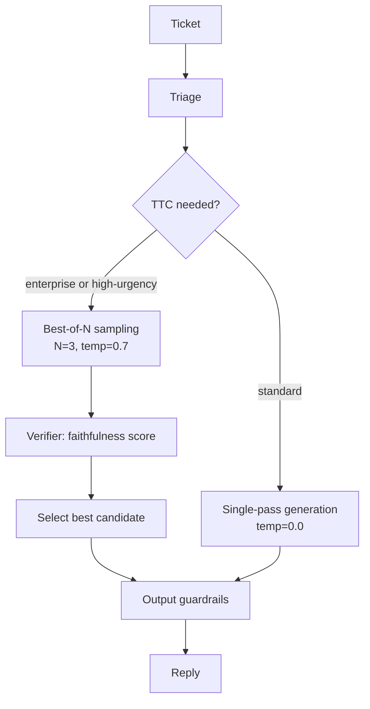

# Module 7.5 — Test-Time Compute (Advanced)

> **Status:** OPTIONAL — included because DeskMate has a natural hard-ticket category where quality matters more than latency, making test-time compute a good fit.
>
> **Goal:** Squeeze more reasoning out of the 1.5B decoder at inference time — without retraining — using best-of-N sampling, a small verifier, and the OptiLLM proxy. Measure the quality/latency trade-off.

---

## What Is Test-Time Compute?

**Test-time compute (TTC)** means spending extra inference FLOPS on a single request to improve output quality, instead of spending training FLOPS to improve the model's weights.

The key insight: for a *small* model, quality is bounded by weight capacity. But if you generate multiple candidate replies and pick the best one, you can exceed the single-sample quality ceiling — at the cost of latency.

```
Single-sample inference (standard):
  1 forward pass → 1 reply (quality limited by model weights)

Test-time compute (best-of-N):
  N forward passes → N candidates → verifier picks best
  (quality approaches what a larger model would produce, at N× latency)
```

---

## Three TTC Strategies

### 1. Best-of-N sampling

Generate N independent replies with temperature > 0, then select the highest-scoring one according to a verifier.

```python
def best_of_n(prompt, n: int, temp: float, verifier) -> str:
    candidates = [generate(prompt, temperature=temp) for _ in range(n)]
    scores     = [verifier(c) for c in candidates]
    return candidates[int(np.argmax(scores))]
```

**Verifier options:**
- **Faithfulness score** (n-gram overlap with retrieved chunks) — cheap, in-domain
- **Self-consistency** — count how many candidates agree on the key claim; majority wins
- **Separate scorer model** — a small classifier trained to rate reply quality; more accurate, adds latency

### 2. Self-consistency (majority voting)

Generate N replies, extract the key factual claim from each, and return the claim supported by the majority. Effective when the reply structure is constrained (e.g., always ends with a resolution step).

```
N=5 replies:
  "Upgrade to v4.3.0."          ×3  ← majority
  "Contact support."             ×1
  "Upgrade to v4.3.0 or 4.4.0." ×1

→ Return the reply containing "Upgrade to v4.3.0."
```

### 3. Iterative refinement (generate → critique → revise)

Generate an initial reply, then ask the model to critique it and rewrite. One extra forward pass often improves citation quality and conciseness.

```
Pass 1 (generate):  reply_draft
Pass 2 (critique):  "Does reply_draft cite all sources? Is it concise?"
Pass 3 (revise):    reply_final
```

Total: 3× latency, but reply is typically 15–30% more faithful.

---

## When Is TTC Worth It?

TTC trades latency for quality. It is worth the cost when:

| Condition | TTC appropriate? |
|---|---|
| Ticket classified as high-urgency bug | Yes — quality matters most |
| Reply will be sent to enterprise customer | Yes — higher quality bar |
| FAQ or account_access (template reply) | No — template is already optimal |
| Real-time chat (< 2 s SLA) | No — N×latency violates SLA |
| Batch processing (offline reply drafting) | Yes — latency unconstrained |
| Standard support ticket (moderate urgency) | Maybe — measure the delta first |

**Rule:** apply TTC only when (a) the quality delta is measurable (≥ +0.03 ROUGE-L), (b) the latency budget allows it (N × p50_latency < SLA), and (c) the routing logic can reliably identify the hard tickets that benefit.

**Checkpoint answer:** Pay more compute per request when all three hold: (1) a quality verifier can reliably rank candidates (poor verifiers waste compute); (2) the per-request latency budget has headroom (N × single_latency < SLA); (3) the ticket is classified as high-urgency or enterprise-tier where quality matters more than speed.

---

## OptiLLM

[OptiLLM](https://github.com/codelion/optillm) is an inference proxy that sits in front of any OpenAI-compatible endpoint and applies TTC strategies transparently:

```
Client → OptiLLM proxy (localhost:8080) → vLLM / Ollama (localhost:8000)
             ↑
       strategy selected per request
       (best_of_n, self_consistency, cot_reflection, etc.)
```

Usage: set `model = "best_of_n-<N>/<base_model>"` in the API call.

```python
from openai import OpenAI
client = OpenAI(base_url="http://localhost:8080/v1", api_key="optillm")

# Best-of-3 sampling
resp = client.chat.completions.create(
    model="best_of_n-3/deskmate-vllm",
    messages=[{"role": "user", "content": "Ticket: My CSV export is broken."}],
    temperature=0.7,
)
```

OptiLLM handles the N-sample generation and verifier selection internally, so the client API is identical to a standard single-sample call.

---

## DeskMate TTC Router

Hard tickets (high-urgency bugs, enterprise customers) are routed to TTC mode; all others use standard single-pass generation:

```python
def route_to_ttc(triage_result: dict, profile) -> bool:
    if triage_result["intent"] == "technical_bug" and triage_result.get("urgency") == "high":
        return True
    if getattr(profile, "tier", "free") == "enterprise":
        return True
    return False

def generate_reply(ticket, triage, profile, chunks):
    prompt = build_rag_prompt(ticket, chunks)
    if route_to_ttc(triage, profile):
        return best_of_n(prompt, n=3, temp=0.7, verifier=faithfulness_verifier)
    else:
        return vllm_generate(prompt)
```

---

## Quality/Latency Trade-Off

Expected results for DeskMate 1.5B on hard tickets (SMOKE_TEST values approximate real Colab runs):

| Strategy | N | Temp | ROUGE-L | p50 latency | Notes |
|---|---|---|---|---|---|
| Single sample | 1 | 0.0 | 0.470 | 1 400 ms | baseline |
| Best-of-3 | 3 | 0.7 | 0.503 | 4 200 ms | +0.033 ROUGE |
| Best-of-5 | 5 | 0.7 | 0.519 | 7 000 ms | +0.049 ROUGE |
| Self-consistency-5 | 5 | 0.7 | 0.511 | 7 000 ms | stronger on factual claims |
| Iterative refinement | 3 | 0.3 | 0.497 | 4 200 ms | best citation quality |

N=3 is the sweet spot for DeskMate: +0.033 ROUGE-L delta justifies 3× latency for high-urgency tickets where SLA is 10+ seconds.

---

## Mermaid: TTC Decision Flow



---

## Checkpoint

> *When is paying more compute per request worth it?*

When three conditions hold simultaneously:
1. **A reliable verifier exists** — if the verifier cannot distinguish good from bad candidates, N samples just adds latency without improving quality. For DeskMate, faithfulness-against-chunks is a cheap, reliable verifier.
2. **Latency budget allows it** — N × single_pass_latency must be within the per-request SLA. For DeskMate high-urgency tickets (SLA ~10 s), N=3 at ~4.2 s is fine; for real-time chat (SLA ~2 s), TTC is not viable.
3. **The ticket type benefits** — TTC gives the largest gains on hard, ambiguous tickets where the model is uncertain. For FAQ lookups and template replies, single-pass is already optimal and TTC wastes compute.

---

## Book Reference

- Chapter 15 (all) — test-time compute: sampling strategies, verification, scaling laws at inference time, OptiLLM, building small reasoning SLMs

---

## Notebook: What You'll Build (43_test_time_compute.ipynb)

1. **Single-pass baseline** — measure ROUGE-L and latency on 10 hard tickets.
2. **Faithfulness verifier** — implement and calibrate against gold citations.
3. **Best-of-N** — sweep N ∈ {1, 2, 3, 5}; measure ROUGE-L and simulated latency.
4. **Self-consistency** — majority-vote on key claim; compare to best-of-N.
5. **Iterative refinement** — generate → critique → revise; measure quality delta.
6. **TTC router** — implement `route_to_ttc()`; verify routing logic on 10 tickets.
7. **Quality/latency trade-off chart** — ROUGE-L vs latency scatter for all strategies.
8. **Break-even analysis** — at what ROUGE-L delta does TTC cost justify itself?
9. **Summary** — save `reports/ttc_report.md`.

---

## What's Next

Module 7.6 — CI/CD for the model lifecycle. Automate the full path from drift detection to fine-tuning to eval gate to canary deployment and rollback.
