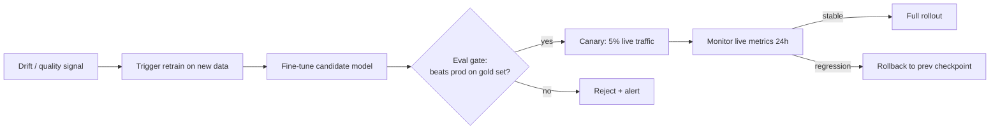

# Module 7.6 — CI/CD for the Model Lifecycle

> **Goal:** Automate the full path from "drift detected or new data arrives" to "improved model safely in production" — drift trigger → fine-tune → eval gate → canary → full rollout or rollback — so DeskMate can improve itself without manual intervention.

---

## Why the Model Is Not a Static Artefact

A software binary doesn't change after deployment. A deployed SLM does — or rather, the world around it changes:

- Product docs are updated; the RAG index evolves
- Ticket language shifts as new features ship ("my Copilot integration is broken")
- The fine-tuned model was trained on last quarter's ticket distribution
- Silent quality degradation goes unnoticed until escalation rate spikes

A CI/CD pipeline for the model lifecycle closes this gap: when drift is detected or new labelled data arrives, a new candidate model is automatically trained, evaluated, and promoted — or rejected — without human intervention in the critical path.

---

## The Four Pipeline Stages

```
Drift / quality signal ──► Trigger retrain ──► Fine-tune candidate
                                                      │
                                         ┌────────────▼────────────┐
                                         │  Eval gate               │
                                         │  new >= prod + margin?   │
                                         └────────────┬────────────┘
                                              yes      │     no
                                               │       ▼
                                               │   Reject + alert
                                               ▼
                                         Canary: 5% live traffic
                                               │
                                         Monitor 24 h
                                               │
                                        stable │     regression
                                               ▼         │
                                         Full rollout    Rollback
```

### Stage 1 — Retrain Trigger

The trigger from Module 7.4: any two of {confidence < 0.72, escalation rate > 25%, KL > 0.25, CUSUM alarm} for 24+ hours. Also fires on a weekly calendar schedule even without a quality signal, to incorporate new labelled tickets.

```python
def check_trigger(metrics: dict, new_data_count: int) -> tuple[bool, str]:
    reasons = []
    if metrics.get("mean_confidence", 1.0) < 0.72:
        reasons.append("confidence_drop")
    if metrics.get("escalation_rate", 0.0) > 0.25:
        reasons.append("high_escalation")
    if metrics.get("intent_kl", 0.0) > 0.25:
        reasons.append("distribution_shift")
    if new_data_count >= 500:
        reasons.append("new_data_available")
    fire = len(reasons) >= 1  # single signal sufficient for scheduled runs
    return fire, ",".join(reasons)
```

### Stage 2 — Fine-Tune Candidate

Runs QLoRA fine-tuning (Module 3.5) on the combined old + new data. The training script is the same as Phase 3; the pipeline just invokes it with the new data path.

```bash
# GitHub Actions step
- name: Fine-tune candidate
  run: |
    python scripts/finetune.py \
      --base_model Qwen/Qwen2.5-1.5B-Instruct \
      --data_path data/tickets_v2.jsonl \
      --output_dir checkpoints/candidate/ \
      --epochs 3 --lr 2e-4 --lora_r 16
```

### Stage 3 — Eval Gate

The candidate is promoted only if it **beats the current prod model** on all four gates simultaneously:

| Gate | Condition | Rationale |
|---|---|---|
| ROUGE-L | candidate ≥ prod − 0.01 | No overall quality regression |
| Intent macro-F1 | candidate ≥ prod − 0.01 | No classification regression |
| Per-category F1 | no category drops > 2% | Catches hidden per-class failures |
| No-citation rate | candidate ≤ 5% | Guardrail compliance |

```python
def eval_gate(candidate: dict, prod: dict) -> tuple[bool, dict]:
    checks = {
        "rouge_l":         candidate["rouge_l"]    >= prod["rouge_l"]    - 0.01,
        "intent_f1":       candidate["intent_f1"]  >= prod["intent_f1"]  - 0.01,
        "no_citation_rate":candidate["no_citation"] <= 0.05,
    }
    # Per-category F1 check
    cat_checks = {
        cat: candidate["per_cat_f1"].get(cat, 0) >= prod["per_cat_f1"].get(cat, 0) - 0.02
        for cat in prod["per_cat_f1"]
    }
    checks["per_category"] = all(cat_checks.values())
    passed = all(checks.values())
    return passed, {**checks, "per_cat_detail": cat_checks}
```

### Stage 4 — Canary Deployment

5% of live traffic is routed to the candidate; 95% to the incumbent. After 24 hours, live metrics are compared. If the candidate's escalation rate or faithfulness is worse than the incumbent by more than a tolerance, rollback fires automatically.

```python
CANARY_FRACTION = 0.05
ROLLBACK_THRESHOLD_ESC   = 0.03   # allow +3 pp degradation max
ROLLBACK_THRESHOLD_FAITH = 0.05   # allow −5 pp degradation max

def should_rollback(canary_metrics: dict, prod_metrics: dict) -> tuple[bool, str]:
    esc_delta   = canary_metrics["escalation_rate"] - prod_metrics["escalation_rate"]
    faith_delta = prod_metrics["faithfulness_p50"] - canary_metrics["faithfulness_p50"]
    if esc_delta > ROLLBACK_THRESHOLD_ESC:
        return True, f"escalation degraded by {esc_delta:.3f}"
    if faith_delta > ROLLBACK_THRESHOLD_FAITH:
        return True, f"faithfulness degraded by {faith_delta:.3f}"
    return False, "ok"
```

---

## Blind Spot of the Static Eval Gate

The eval gate compares the candidate against `data/gold/` — a frozen snapshot of labelled tickets collected at training time. This leaves two blind spots:

1. **Gold set distribution ≠ live distribution** — if `technical_bug` tickets have surged (as detected by KL divergence), the gold set still reflects the old distribution. A model that regresses on `technical_bug` but improves on `billing_dispute` can pass the gate.
2. **Gold set does not contain new ticket types** — if a new product feature creates a new ticket category, the gold set has no examples of it. The candidate can score identically to prod on gold while failing completely on the new category.

**How canary deployment addresses this:** it exposes the candidate to real live traffic for 24 hours. If the candidate fails on the new ticket types, the escalation rate rises and the rollback fires — even if the eval gate passed. Canary catches distribution-gap failures that static evaluation cannot.

---

## GitHub Actions Pipeline

```yaml
# .github/workflows/model_cicd.yml
name: DeskMate Model CI/CD

on:
  schedule:
    - cron: "0 2 * * 1"   # weekly Monday 2 AM
  workflow_dispatch:
    inputs:
      trigger_reason:
        description: "Why retrain? (e.g. drift_detected, new_data)"

jobs:
  retrain:
    runs-on: ubuntu-latest
    steps:
      - uses: actions/checkout@v4

      - name: Check retrain trigger
        id: trigger
        run: python scripts/check_trigger.py --output trigger.json

      - name: Fine-tune candidate
        if: steps.trigger.outputs.should_retrain == 'true'
        run: python scripts/finetune.py --config configs/finetune_v2.yaml

      - name: Eval gate
        id: eval
        run: python scripts/eval_gate.py --candidate checkpoints/candidate/
              --prod checkpoints/prod/ --gold data/gold/ --output gate.json

      - name: Promote to canary
        if: steps.eval.outputs.passed == 'true'
        run: python scripts/deploy_canary.py --fraction 0.05

      - name: Monitor canary (24 h)
        if: steps.eval.outputs.passed == 'true'
        run: python scripts/monitor_canary.py --wait 86400 --rollback-on-fail

      - name: Notify on failure
        if: failure()
        run: python scripts/notify.py --channel slack --message "Model CI/CD failed"
```

---

## Mermaid: Full CI/CD Pipeline



---

## Checkpoint

> *Your eval gate compares the new model only against the static gold set. What blind spot does this leave, and how does canary deployment address it?*

**Blind spot:** the static gold set reflects the ticket distribution at collection time. If the live distribution has shifted (new product features, KL divergence detected), the gold set cannot evaluate the candidate on the new ticket types. A model that improves on old categories while failing on new ones can still pass the gate. Additionally, the gold set is small (hundreds of examples) — low-frequency failure modes may not appear in it at all.

**How canary addresses it:** canary routes 5% of real live traffic to the candidate for 24 hours. This exposes it to the actual current distribution — including new ticket types not in the gold set. If the candidate degrades (escalation rate rises, faithfulness drops), the monitoring script detects the regression and triggers rollback before the other 95% of traffic is affected. Canary is a live integration test; eval gate is a unit test. Both are necessary.

---

## Book Reference

§14 (MLOps and model lifecycle) — retrain triggers, eval gates, canary deployments, rollback strategies.

---

## Notebook: What You'll Build (44_cicd.ipynb)

1. **Trigger check** — simulate 24-hour metrics; fire trigger on two-signal condition.
2. **Fine-tune stub** — simulate a fine-tuning run; produce candidate metrics.
3. **Eval gate** — evaluate candidate A (good) and candidate B (regression); verify pass/fail.
4. **Per-category F1 gate** — inject a hidden per-category regression; verify gate catches it.
5. **Canary simulator** — route 5% traffic to candidate; generate live metrics.
6. **Rollback logic** — inject degraded canary metrics; verify rollback fires.
7. **Full pipeline run** — end-to-end: trigger → fine-tune → gate → canary → promote.
8. **GitHub Actions YAML** — write `.github/workflows/model_cicd.yml` to disk.
9. **Summary** — save `reports/cicd_report.md`.

---

## What's Next

Phase 7 complete → Phase 8: DeskMate Capstone & Portfolio. The full system is built; the capstone assembles it into a presentable portfolio artifact.
